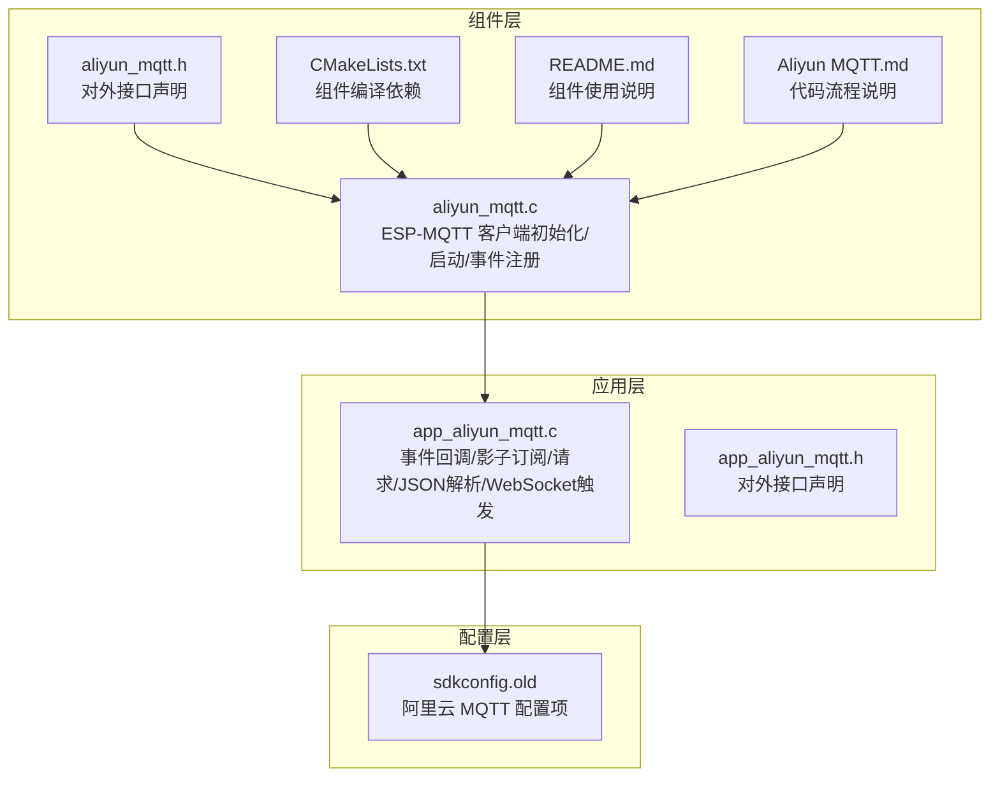
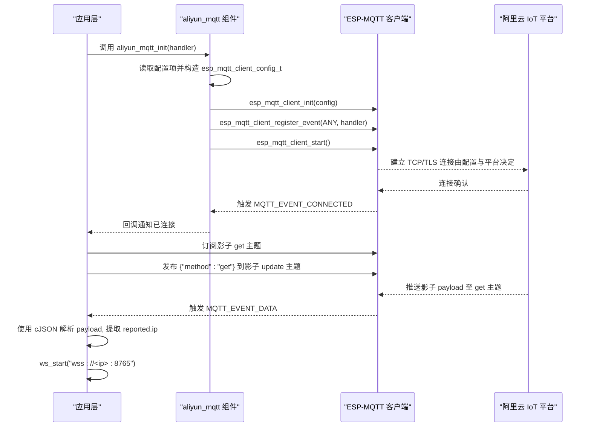
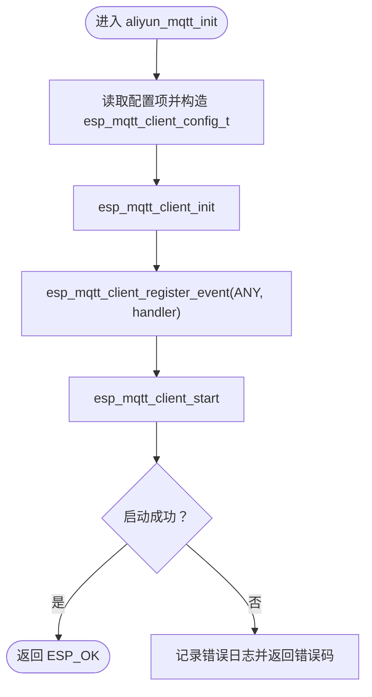
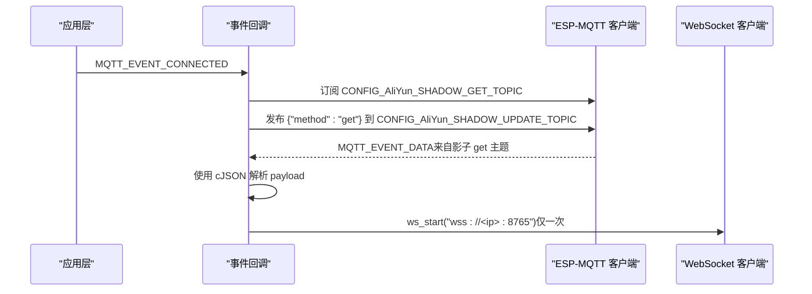
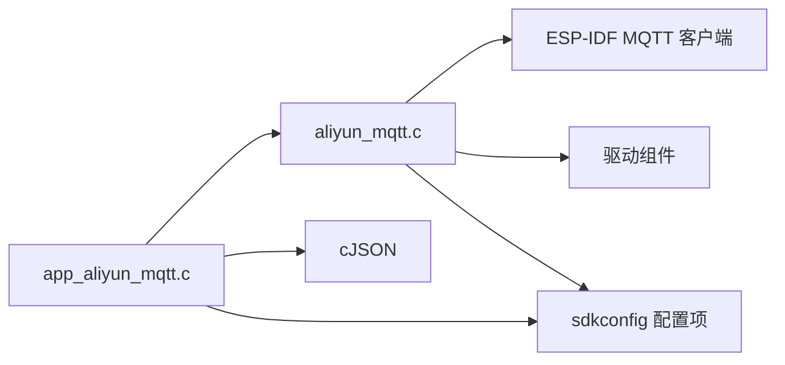

# MQTT 云端通信

<cite>
**本文引用的文件**
- [aliyun_mqtt.h](file://components/aliyun_mqtt/include/aliyun_mqtt.h)
- [aliyun_mqtt.c](file://components/aliyun_mqtt/src/aliyun_mqtt.c)
- [README.md](file://components/aliyun_mqtt/README.md)
- [Aliyun MQTT.md](file://components/aliyun_mqtt/doc/Aliyun MQTT.md)
- [CMakeLists.txt](file://components/aliyun_mqtt/CMakeLists.txt)
- [app_aliyun_mqtt.c](file://main/app/aliyun/app_aliyun_mqtt.c)
- [app_aliyun_mqtt.h](file://main/app/aliyun/app_aliyun_mqtt.h)
- [sdkconfig.old](file://sdkconfig.old)
</cite>

## 目录
1. [简介](#简介)
2. [项目结构](#项目结构)
3. [核心组件](#核心组件)
4. [架构总览](#架构总览)
5. [详细组件分析](#详细组件分析)
6. [依赖关系分析](#依赖关系分析)
7. [性能考虑](#性能考虑)
8. [故障排查指南](#故障排查指南)
9. [结论](#结论)
10. [附录](#附录)

## 简介
本技术文档围绕基于 ESP-IDF 的阿里云物联网平台 MQTT 云端通信系统展开，重点覆盖以下方面：
- 阿里云 IoT 平台集成方案：设备认证、连接建立、TLS 安全传输（基于配置项与平台默认端口）、QoS 等级与重连策略现状与建议。
- 设备影子（Device Shadow）机制：状态同步、离线缓存与命令下发处理流程。
- 云端指令解析、响应格式与错误处理机制。
- MQTT QoS 级别配置、重连策略与网络异常处理实践。
- 阿里云平台配置、SDK 集成与调试工具使用指南。

该系统以组件化方式组织，核心位于 components/aliyun_mqtt，应用层在 main/app/aliyun 中进行事件处理与设备影子交互。

## 项目结构
该项目采用 ESP-IDF 组件化架构，MQTT 云端通信相关模块分布如下：
- 组件层（components/aliyun_mqtt）：封装 ESP-MQTT 客户端初始化、连接与事件注册，提供对外接口。
- 应用层（main/app/aliyun）：实现 MQTT 事件回调、设备影子订阅与请求、JSON 数据解析、以及基于影子返回的 WebSocket 连接触发。
- 配置层（sdkconfig.old）：包含阿里云 MQTT 主机地址、用户名、客户端 ID、密码及各类主题（属性上报、用户上下行、设备影子）等关键配置项。



**图表来源**
- [aliyun_mqtt.h:1-28](file://components/aliyun_mqtt/include/aliyun_mqtt.h#L1-L28)
- [aliyun_mqtt.c:1-82](file://components/aliyun_mqtt/src/aliyun_mqtt.c#L1-L82)
- [CMakeLists.txt:1-9](file://components/aliyun_mqtt/CMakeLists.txt#L1-L9)
- [README.md:1-39](file://components/aliyun_mqtt/README.md#L1-L39)
- [Aliyun MQTT.md:1-16](file://components/aliyun_mqtt/doc/Aliyun MQTT.md#L1-L16)
- [app_aliyun_mqtt.c:1-193](file://main/app/aliyun/app_aliyun_mqtt.c#L1-L193)
- [sdkconfig.old:2180-2193](file://sdkconfig.old#L2180-L2193)

**章节来源**
- [aliyun_mqtt.h:1-28](file://components/aliyun_mqtt/include/aliyun_mqtt.h#L1-L28)
- [aliyun_mqtt.c:1-82](file://components/aliyun_mqtt/src/aliyun_mqtt.c#L1-L82)
- [CMakeLists.txt:1-9](file://components/aliyun_mqtt/CMakeLists.txt#L1-L9)
- [README.md:1-39](file://components/aliyun_mqtt/README.md#L1-L39)
- [Aliyun MQTT.md:1-16](file://components/aliyun_mqtt/doc/Aliyun MQTT.md#L1-L16)
- [app_aliyun_mqtt.c:1-193](file://main/app/aliyun/app_aliyun_mqtt.c#L1-L193)
- [sdkconfig.old:2180-2193](file://sdkconfig.old#L2180-L2193)

## 核心组件
- 阿里云 MQTT 组件（aliyun_mqtt）
  - 对外接口：初始化与反初始化，负责 MQTT 客户端的创建、事件注册与启动。
  - 内部实现：从配置项读取主机地址、用户名、客户端 ID、密码；初始化 ESP-MQTT 客户端并启动连接。
- 应用层 MQTT 处理器（app_aliyun_mqtt）
  - 事件回调：处理连接、断开、订阅、发布、数据、错误等事件。
  - 设备影子：首次连接后订阅影子 get 主题，主动发布 get 方法请求影子；收到影子数据后解析 JSON，提取 IP 并触发 WebSocket 连接。
  - JSON 解析：使用 cJSON 解析影子 payload，定位 reported.ip 字段。
  - 错误处理：对影子 JSON 解析失败、发布失败等情况记录日志并告警。

**章节来源**
- [aliyun_mqtt.h:1-28](file://components/aliyun_mqtt/include/aliyun_mqtt.h#L1-L28)
- [aliyun_mqtt.c:1-82](file://components/aliyun_mqtt/src/aliyun_mqtt.c#L1-L82)
- [app_aliyun_mqtt.c:44-63](file://main/app/aliyun/app_aliyun_mqtt.c#L44-L63)
- [app_aliyun_mqtt.c:65-181](file://main/app/aliyun/app_aliyun_mqtt.c#L65-L181)

## 架构总览
系统整体运行流程如下：
- 应用层在 WiFi 已连接后调用 aliyun_mqtt_init，内部通过 aliyun_mqtt_start 初始化并启动 ESP-MQTT 客户端。
- MQTT 事件回调根据事件类型执行相应动作：连接成功后订阅设备影子 get 主题并请求影子；收到影子数据后解析 JSON 并触发 WebSocket 连接；其他事件按需记录日志或处理。



**图表来源**
- [aliyun_mqtt.c:25-68](file://components/aliyun_mqtt/src/aliyun_mqtt.c#L25-L68)
- [app_aliyun_mqtt.c:65-181](file://main/app/aliyun/app_aliyun_mqtt.c#L65-L181)
- [sdkconfig.old:2180-2193](file://sdkconfig.old#L2180-L2193)

## 详细组件分析

### 组件 A：阿里云 MQTT 组件（aliyun_mqtt）
- 功能职责
  - 初始化：读取配置项，创建并启动 ESP-MQTT 客户端，注册事件回调。
  - 反初始化：销毁客户端并释放资源。
- 关键点
  - 配置项来源于 sdkconfig（主机地址、用户名、客户端 ID、密码）。
  - 事件注册使用 ESP_EVENT_ANY_ID，便于统一处理各类事件。
  - 启动失败与事件注册失败均记录错误日志并返回错误码。



**图表来源**
- [aliyun_mqtt.c:25-68](file://components/aliyun_mqtt/src/aliyun_mqtt.c#L25-L68)

**章节来源**
- [aliyun_mqtt.h:1-28](file://components/aliyun_mqtt/include/aliyun_mqtt.h#L1-L28)
- [aliyun_mqtt.c:1-82](file://components/aliyun_mqtt/src/aliyun_mqtt.c#L1-L82)
- [CMakeLists.txt:1-9](file://components/aliyun_mqtt/CMakeLists.txt#L1-L9)
- [README.md:1-39](file://components/aliyun_mqtt/README.md#L1-L39)
- [Aliyun MQTT.md:1-16](file://components/aliyun_mqtt/doc/Aliyun MQTT.md#L1-L16)

### 组件 B：应用层 MQTT 处理器（app_aliyun_mqtt）
- 功能职责
  - 事件回调：处理连接、断开、订阅、发布、数据、错误等事件。
  - 设备影子：首次连接后仅订阅一次影子 get 主题；随后主动发布 get 方法请求影子。
  - JSON 解析：解析影子 payload，提取 reported.ip 并触发 WebSocket 连接。
  - 错误处理：对影子 JSON 解析失败、发布失败等情况记录日志并告警。
- 关键点
  - 影子订阅与请求在连接成功事件中执行，避免重复订阅。
  - 使用静态标志位防止 WebSocket 重复启动。
  - 事件分发通过 app_mqtt_event_handler 将底层事件转交至回调函数。



**图表来源**
- [app_aliyun_mqtt.c:65-181](file://main/app/aliyun/app_aliyun_mqtt.c#L65-L181)
- [sdkconfig.old:2180-2193](file://sdkconfig.old#L2180-L2193)

**章节来源**
- [app_aliyun_mqtt.c:44-63](file://main/app/aliyun/app_aliyun_mqtt.c#L44-L63)
- [app_aliyun_mqtt.c:65-181](file://main/app/aliyun/app_aliyun_mqtt.c#L65-L181)
- [app_aliyun_mqtt.h:3-5](file://main/app/aliyun/app_aliyun_mqtt.h#L3-L5)

### 组件 C：设备影子（Device Shadow）机制
- 状态同步
  - 应用层在连接成功后订阅影子 get 主题，并主动发布 get 方法请求影子。
  - 收到平台推送的影子 payload 后，解析 reported 字段，用于状态同步。
- 离线缓存
  - 当前实现未见本地离线缓存逻辑；若需离线缓存，可在应用层增加本地队列与持久化存储。
- 命令处理
  - 影子 payload 中的 desired 字段通常用于云端下发控制命令；当前代码解析 reported.ip，未涉及 desired 字段处理。
- 响应格式
  - 影子更新主题发布 {"method":"get"}；平台返回的 payload 结构包含 payload/state/reported 等字段。

```mermaid
flowchart TD
Conn["MQTT 连接成功"] --> Sub["订阅影子 get 主题"]
Sub --> Req["发布 {\"method\":\"get\"} 到影子 update 主题"]
Req --> Wait["等待平台推送影子 payload"]
Wait --> Parse["解析 payload/payload.state.reported.ip"]
Parse --> WS["ws_start(wss://ip:8765)"]
```

**图表来源**
- [app_aliyun_mqtt.c:77-85](file://main/app/aliyun/app_aliyun_mqtt.c#L77-L85)
- [app_aliyun_mqtt.c:53-62](file://main/app/aliyun/app_aliyun_mqtt.c#L53-L62)
- [app_aliyun_mqtt.c:106-162](file://main/app/aliyun/app_aliyun_mqtt.c#L106-L162)

**章节来源**
- [app_aliyun_mqtt.c:44-63](file://main/app/aliyun/app_aliyun_mqtt.c#L44-L63)
- [app_aliyun_mqtt.c:65-181](file://main/app/aliyun/app_aliyun_mqtt.c#L65-L181)

### 组件 D：云端指令解析、响应格式与错误处理
- 指令解析
  - 使用 cJSON 解析影子 payload，定位 payload/state/reported/ip 字段。
- 响应格式
  - 影子 get 请求：{"method":"get"}。
  - 影子响应：包含 payload/state/reported 等字段的 JSON。
- 错误处理
  - JSON 解析失败：记录错误日志。
  - 发布失败：记录错误日志并返回。
  - 事件处理：对各类事件进行日志输出，便于调试。

**章节来源**
- [app_aliyun_mqtt.c:114-161](file://main/app/aliyun/app_aliyun_mqtt.c#L114-L161)
- [app_aliyun_mqtt.c:59-62](file://main/app/aliyun/app_aliyun_mqtt.c#L59-L62)
- [app_aliyun_mqtt.c:171-173](file://main/app/aliyun/app_aliyun_mqtt.c#L171-L173)

### 组件 E：MQTT QoS 级别配置、重连策略与网络异常处理
- QoS 级别
  - 影子订阅使用 QoS 1（事件回调中显式指定）。
  - 影子请求发布使用 QoS 1（发布函数参数中指定）。
- 重连策略
  - 当前代码未实现自动重连逻辑；建议在 MQTT_EVENT_DISCONNECTED 事件中触发重连，结合指数退避与最大重试次数。
- 网络异常处理
  - 事件回调中记录断开、错误事件；建议补充断线检测与自动恢复机制。

**章节来源**
- [app_aliyun_mqtt.c:80-85](file://main/app/aliyun/app_aliyun_mqtt.c#L80-L85)
- [app_aliyun_mqtt.c:54-58](file://main/app/aliyun/app_aliyun_mqtt.c#L54-L58)
- [app_aliyun_mqtt.c:87-89](file://main/app/aliyun/app_aliyun_mqtt.c#L87-L89)
- [app_aliyun_mqtt.c:171-173](file://main/app/aliyun/app_aliyun_mqtt.c#L171-L173)

## 依赖关系分析
- 组件依赖
  - aliyun_mqtt 组件依赖 ESP-IDF 的 MQTT 客户端与驱动组件。
  - 应用层依赖 aliyun_mqtt 组件与 cJSON。
- 配置依赖
  - 所有阿里云 MQTT 相关配置项集中于 sdkconfig（主机地址、用户名、客户端 ID、密码、主题等）。



**图表来源**
- [CMakeLists.txt:1-9](file://components/aliyun_mqtt/CMakeLists.txt#L1-L9)
- [aliyun_mqtt.c:10-11](file://components/aliyun_mqtt/src/aliyun_mqtt.c#L10-L11)
- [app_aliyun_mqtt.c:25-27](file://main/app/aliyun/app_aliyun_mqtt.c#L25-L27)
- [sdkconfig.old:2180-2193](file://sdkconfig.old#L2180-L2193)

**章节来源**
- [CMakeLists.txt:1-9](file://components/aliyun_mqtt/CMakeLists.txt#L1-L9)
- [sdkconfig.old:2180-2193](file://sdkconfig.old#L2180-L2193)

## 性能考虑
- 内存与日志
  - 建议在资源受限场景下降低日志级别，避免频繁打印影响实时性。
- 事件处理
  - 将耗时操作移出事件回调，必要时放入任务队列异步处理。
- QoS 与吞吐
  - 在保证可靠性的前提下，合理选择 QoS 与消息大小，避免阻塞事件循环。
- 重连与退避
  - 实施指数退避与最大重试次数，避免频繁重连导致带宽与 CPU 占用上升。

## 故障排查指南
- 连接失败
  - 检查配置项（主机地址、用户名、客户端 ID、密码）是否正确。
  - 确认 WiFi 已连接且网络可达。
- 订阅/发布失败
  - 查看事件回调日志，确认订阅/发布的 msg_id 是否有效。
- 影子数据解析失败
  - 检查 payload 结构是否符合预期；确认 reported.ip 字段存在且为字符串。
- WebSocket 连接问题
  - 确认从影子解析出的 IP 正确；检查目标端口与协议（wss）是否可用。

**章节来源**
- [aliyun_mqtt.c:52-67](file://components/aliyun_mqtt/src/aliyun_mqtt.c#L52-L67)
- [app_aliyun_mqtt.c:59-62](file://main/app/aliyun/app_aliyun_mqtt.c#L59-L62)
- [app_aliyun_mqtt.c:158-161](file://main/app/aliyun/app_aliyun_mqtt.c#L158-L161)

## 结论
本系统基于 ESP-IDF 的 MQTT 客户端实现了与阿里云物联网平台的连接与交互，具备设备影子订阅与请求能力，并能在收到影子数据后触发 WebSocket 连接。为进一步提升可靠性与可维护性，建议补充自动重连、指数退避、desired 命令处理与本地离线缓存等机制。

## 附录

### 阿里云平台配置与 SDK 集成
- 配置项说明（来自 sdkconfig）
  - 主机地址、端口、客户端 ID、用户名、密码、属性上报/回复、用户上下行、设备影子主题等。
- SDK 集成步骤
  - 将组件目录复制到项目 components 目录。
  - 在 main 目录调用 app_aliyun_mqtt_init，并在 WiFi 连接成功后再初始化 MQTT。
  - 自定义事件回调函数以处理连接、订阅、发布、数据与错误事件。

**章节来源**
- [sdkconfig.old:2180-2193](file://sdkconfig.old#L2180-L2193)
- [README.md:7-31](file://components/aliyun_mqtt/README.md#L7-L31)