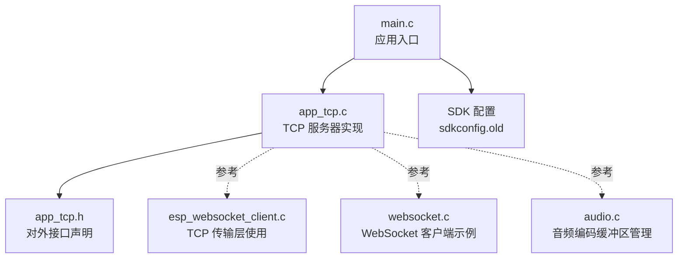
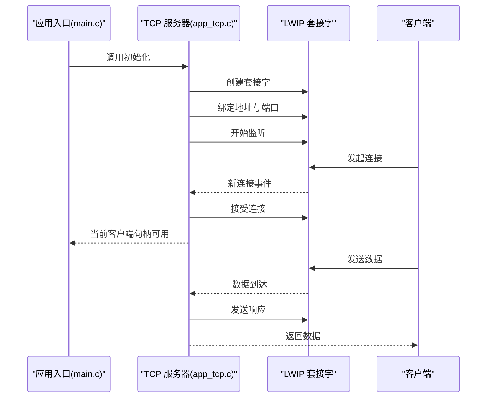
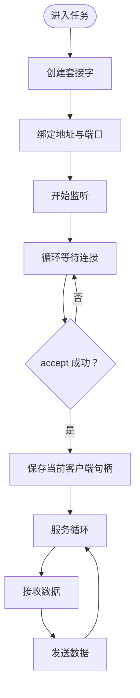
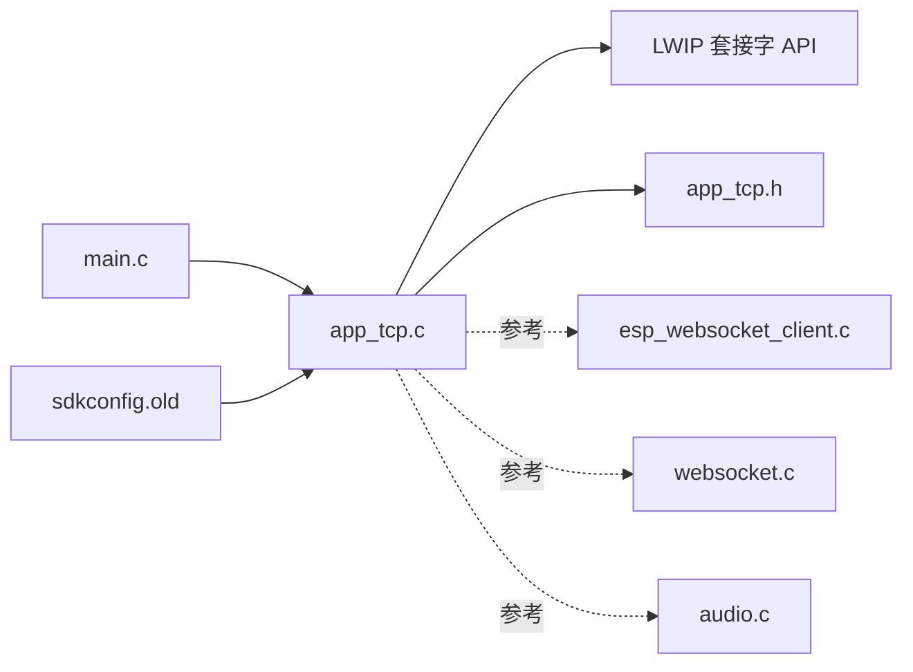

# TCP 本地服务

<cite>
**本文引用的文件**
- [app_tcp.c](file://main/app/tcp/app_tcp.c)
- [app_tcp.h](file://main/app/tcp/app_tcp.h)
- [main.c](file://main/main.c)
- [sdkconfig.old](file://sdkconfig.old)
- [esp_websocket_client.c](file://components/esp_websocket_client/esp_websocket_client.c)
- [websocket.c](file://main/app/websocket/websocket.c)
- [audio.c](file://main/app/audio/audio.c)
</cite>

## 目录
1. [引言](#引言)
2. [项目结构](#项目结构)
3. [核心组件](#核心组件)
4. [架构总览](#架构总览)
5. [详细组件分析](#详细组件分析)
6. [依赖关系分析](#依赖关系分析)
7. [性能考虑](#性能考虑)
8. [故障排查指南](#故障排查指南)
9. [结论](#结论)
10. [附录](#附录)

## 引言
本文件面向 TCP 本地网络服务的技术文档，聚焦于基于 ESP-IDF 的 TCP 服务器实现与运行机制。内容覆盖套接字创建、监听与连接接受流程；数据接收与发送路径、缓冲区管理与数据包处理；客户端连接管理、并发处理与资源清理策略；网络字节序转换、协议格式建议与错误处理机制；以及性能调优、连接超时与安全防护建议。读者可据此快速理解系统架构、定位问题并进行优化。

## 项目结构
本项目采用 ESP-IDF 组件化组织方式，TCP 本地服务位于 main/app/tcp 子目录中，配合主程序入口 main.c 启动网络栈与任务调度。同时，项目内还包含 WebSocket 客户端示例（components/esp_websocket_client 与 main/app/websocket），可作为 TCP 服务的数据上送或远程转发参考。

**图示来源**
- [main.c](file://main/main.c)
- [app_tcp.c](file://main/app/tcp/app_tcp.c)
- [app_tcp.h](file://main/app/tcp/app_tcp.h)
- [sdkconfig.old](file://sdkconfig.old)
- [esp_websocket_client.c](file://components/esp_websocket_client/esp_websocket_client.c)
- [websocket.c](file://main/app/websocket/websocket.c)
- [audio.c](file://main/app/audio/audio.c)

**章节来源**
- [main.c](file://main/main.c)
- [app_tcp.c](file://main/app/tcp/app_tcp.c)
- [app_tcp.h](file://main/app/tcp/app_tcp.h)
- [sdkconfig.old](file://sdkconfig.old)

## 核心组件
- TCP 服务器任务与套接字生命周期：负责创建、绑定、监听与接受连接，维护当前客户端套接字句柄。
- 对外接口：初始化函数、发送函数、按键任务注册接口。
- 运行时配置：基于 SDK 配置项控制 LWIP/TCP 行为（最大连接数、MSS、窗口大小、重传等）。
- 参考实现：WebSocket 客户端与音频缓冲区管理展示了 TCP 传输层的典型使用模式与缓冲区策略。

**章节来源**
- [app_tcp.c](file://main/app/tcp/app_tcp.c)
- [app_tcp.h](file://main/app/tcp/app_tcp.h)
- [sdkconfig.old](file://sdkconfig.old)
- [esp_websocket_client.c](file://components/esp_websocket_client/esp_websocket_client.c)
- [websocket.c](file://main/app/websocket/websocket.c)
- [audio.c](file://main/app/audio/audio.c)

## 架构总览
TCP 本地服务以单线程任务为核心，使用 lwIP 提供的 BSD 套接字 API 实现监听与连接接受。服务器在启动时创建套接字、绑定本地地址与端口、进入监听状态；每次有新连接到达时，接受连接并更新当前客户端句柄，随后进行数据收发。该设计简单可靠，适合本地服务场景。

**图示来源**
- [app_tcp.c](file://main/app/tcp/app_tcp.c)
- [main.c](file://main/main.c)

## 详细组件分析

### TCP 服务器实现（app_tcp.c）
- 套接字创建与选项
  - 使用 IPv4 套接字与 TCP 协议族创建套接字。
  - 设置 SO_REUSEADDR 以便快速重启与复用地址。
- 地址绑定与监听
  - 绑定 INADDR_ANY 与固定端口，支持任意本地 IP。
  - 监听队列长度由常量控制，决定等待建立连接的上限。
- 连接接受与当前客户端管理
  - 循环调用 accept 获取新连接，记录客户端套接字。
  - 通过全局变量保存当前客户端句柄，避免多任务竞争（单任务模型）。
- 发送接口
  - 对外提供发送函数，封装底层 send 调用，返回发送结果。
- 初始化与任务创建
  - 初始化 SPIFFS 并创建 TCP 服务器任务，任务栈大小与优先级按需配置。

**图示来源**
- [app_tcp.c](file://main/app/tcp/app_tcp.c)

**章节来源**
- [app_tcp.c](file://main/app/tcp/app_tcp.c)
- [app_tcp.h](file://main/app/tcp/app_tcp.h)

### 对外接口与任务注册（app_tcp.h）
- 初始化函数：完成 SPIFFS 初始化与服务器任务创建。
- 发送函数：向当前客户端发送数据，返回发送结果。
- 按键任务注册：用于将按键事件投递至 TCP 服务器任务，便于触发数据推送。

**章节来源**
- [app_tcp.h](file://main/app/tcp/app_tcp.h)

### 应用入口与网络栈初始化（main.c）
- 网络栈初始化：调用 ESP-IDF 提供的网络初始化接口，确保 LWIP 正常工作。
- 任务调度：创建并启动 TCP 服务器任务，保证网络服务在系统启动后立即可用。

**章节来源**
- [main.c](file://main/main.c)

### SDK 配置与 TCP 行为（sdkconfig.old）
- LWIP 总开关与线程优先级：启用 LWIP，设置 tcpiP 任务优先级。
- 最大套接字与连接数：限制最大 TCP PCB 数与监听队列数，影响并发能力。
- MSS 与窗口大小：影响单包最大段与默认发送/接收窗口，决定吞吐与内存占用。
- 重传与定时器：设定最大重传次数、SYN 重传次数、RTO 初始值等，影响连接稳定性与恢复速度。
- 接收邮箱与监听队列：控制 TCP 接收队列与接受队列容量，避免高并发下的丢包。

**章节来源**
- [sdkconfig.old](file://sdkconfig.old)

### 参考实现：WebSocket 客户端与 TCP 传输（esp_websocket_client.c, websocket.c）
- TCP 传输层使用：WebSocket 客户端内部使用 TCP 传输层，展示 keep-alive、接口名设置等配置。
- WebSocket 客户端示例：演示连接建立、事件分发、缓冲区管理与重连策略，可借鉴其缓冲区与事件处理思想。

**章节来源**
- [esp_websocket_client.c](file://components/esp_websocket_client/esp_websocket_client.c)
- [websocket.c](file://main/app/websocket/websocket.c)

### 参考实现：音频编码缓冲区管理（audio.c）
- 缓冲区加锁与边界检查：通过互斥量保护共享缓冲区，防止越界读写。
- 写入位置与剩余空间计算：根据写入位置与缓冲区大小判断剩余空间，避免溢出。
- 数据搬运与写指针推进：成功写入后推进写指针，供后续消费使用。

**章节来源**
- [audio.c](file://main/app/audio/audio.c)

## 依赖关系分析
- app_tcp.c 依赖 LWIP 套接字 API 与 ESP-IDF 网络栈初始化。
- app_tcp.h 提供对外接口，被应用入口与按键任务等模块调用。
- sdkconfig.old 控制 LWIP/TCP 行为，直接影响服务器的并发、吞吐与稳定性。
- 参考实现（esp_websocket_client.c、websocket.c、audio.c）提供了缓冲区管理与事件处理思路，可迁移至 TCP 服务。

**图示来源**
- [app_tcp.c](file://main/app/tcp/app_tcp.c)
- [app_tcp.h](file://main/app/tcp/app_tcp.h)
- [main.c](file://main/main.c)
- [sdkconfig.old](file://sdkconfig.old)
- [esp_websocket_client.c](file://components/esp_websocket_client/esp_websocket_client.c)
- [websocket.c](file://main/app/websocket/websocket.c)
- [audio.c](file://main/app/audio/audio.c)

**章节来源**
- [app_tcp.c](file://main/app/tcp/app_tcp.c)
- [app_tcp.h](file://main/app/tcp/app_tcp.h)
- [main.c](file://main/main.c)
- [sdkconfig.old](file://sdkconfig.old)
- [esp_websocket_client.c](file://components/esp_websocket_client/esp_websocket_client.c)
- [websocket.c](file://main/app/websocket/websocket.c)
- [audio.c](file://main/app/audio/audio.c)

## 性能考虑
- 端口与地址绑定
  - 使用 INADDR_ANY 绑定所有本地接口，便于本地调试与多网卡环境。
  - 固定端口便于客户端识别与连接。
- 监听队列与并发
  - 监听队列长度限制了未完成三次握手的连接积压，应结合预期并发调整。
  - SDK 中最大活动 TCP 与监听 TCP 数限制了整体并发能力，必要时可评估是否需要提升。
- MSS 与窗口大小
  - 较大的 MSS 可减少分片，提高吞吐；但需考虑内存与 MTU 限制。
  - 默认发送/接收窗口影响带宽延迟乘积，可根据链路特性适当调整。
- 重传与 RTO
  - 合理的重传次数与 RTO 初始值有助于在不稳定网络下保持连接稳定。
- 接收邮箱与监听队列
  - 控制接收队列与接受队列容量，避免高并发导致的阻塞与丢包。
- 缓冲区管理
  - 参考音频缓冲区管理策略，使用互斥量保护共享缓冲区，严格检查剩余空间，避免溢出与越界。
- 任务栈与优先级
  - 服务器任务栈大小与优先级应满足数据收发与事件处理需求，避免阻塞。

[本节为通用指导，不直接分析具体文件]

## 故障排查指南
- 套接字创建失败
  - 检查 LWIP 是否启用、最大套接字数量是否超限。
  - 确认网络栈初始化是否成功。
- 绑定失败
  - 端口冲突或权限不足可能导致绑定失败；更换端口或检查系统权限。
- 监听失败
  - 监听队列过小或系统资源不足会导致监听失败；增大队列或释放资源。
- 接受连接异常
  - accept 返回负值通常表示错误，需检查监听状态与系统资源。
- 发送失败
  - 发送缓冲区满、对端关闭或网络中断都会导致发送失败；检查发送结果与对端状态。
- 并发与资源清理
  - 在断开连接后及时关闭套接字，释放资源；避免句柄泄漏。
- 错误日志
  - 关注应用日志中的错误信息，结合 SDK 配置项定位问题。

**章节来源**
- [app_tcp.c](file://main/app/tcp/app_tcp.c)
- [sdkconfig.old](file://sdkconfig.old)

## 结论
本 TCP 本地服务采用轻量级单任务模型，基于 LWIP 套接字 API 实现监听与连接接受，具备清晰的生命周期与简单的并发模型。通过合理配置 SDK 中的 TCP 行为参数、规范缓冲区管理与错误处理，可在本地服务场景下获得稳定可靠的性能表现。参考 WebSocket 客户端与音频缓冲区管理的实现，可进一步完善数据收发与资源管理策略。

[本节为总结性内容，不直接分析具体文件]

## 附录

### 协议格式与网络字节序建议
- 网络字节序
  - 端口号与长度字段使用网络字节序（大端），确保跨平台兼容。
- 报文结构建议
  - 建议采用“长度前缀 + 负载”的简单帧格式，长度字段使用固定宽度整型，便于解析与边界判断。
- 数据包分割与重组
  - 发送侧：按 MSS 或配置阈值进行分片，避免超大报文。
  - 接收侧：累积完整帧后再交由业务处理，注意粘包与拆包处理。
- 心跳与保活
  - 可结合 TCP Keep-Alive 或应用层心跳维持长连接活性，避免中间设备回收连接。

[本节为通用指导，不直接分析具体文件]