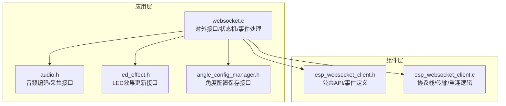
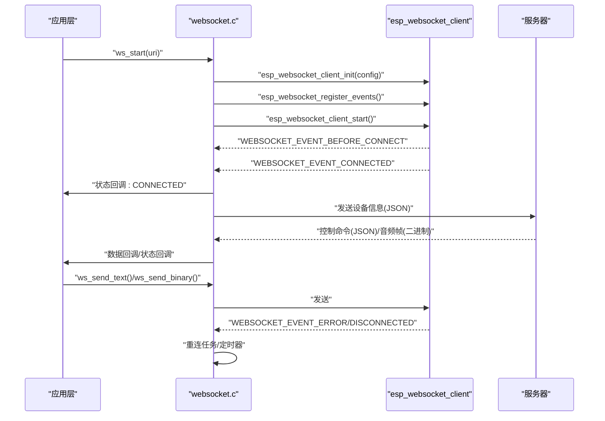
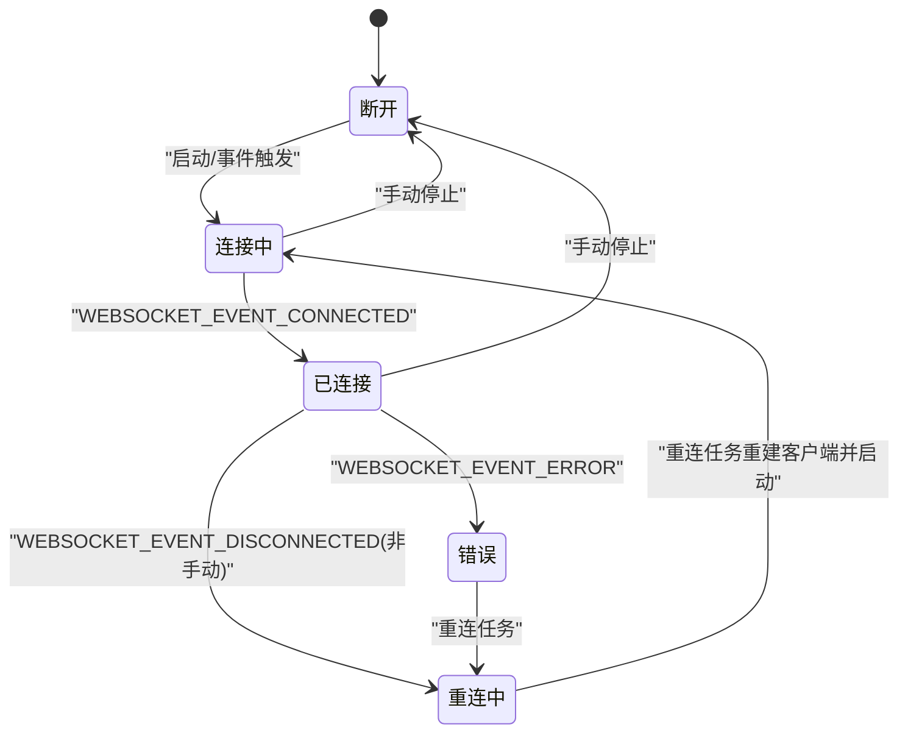
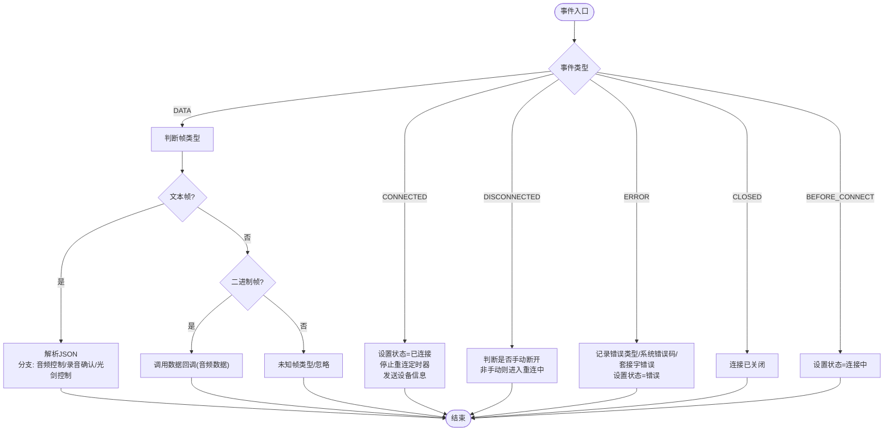
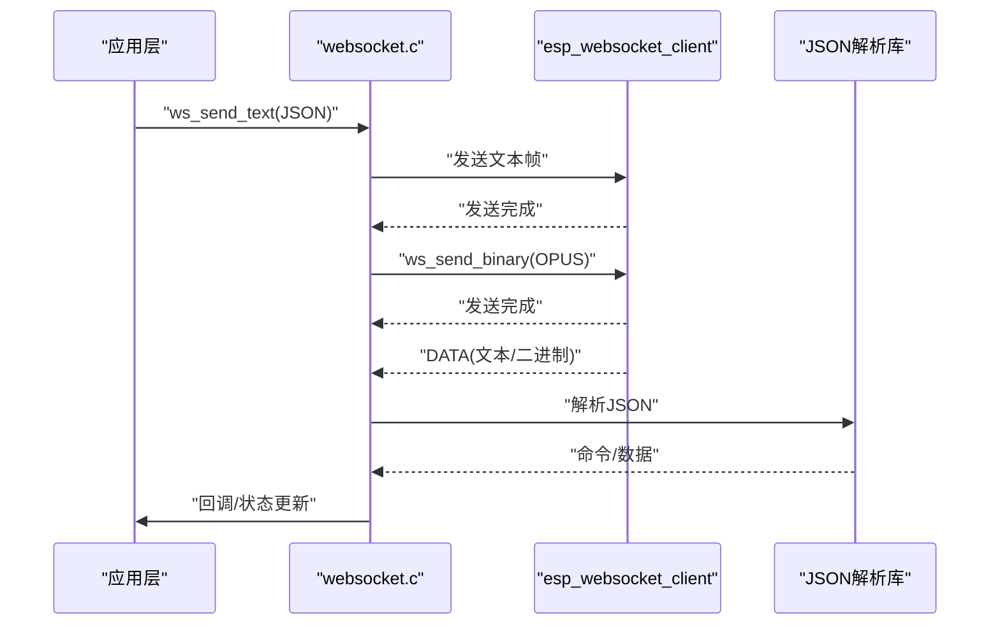
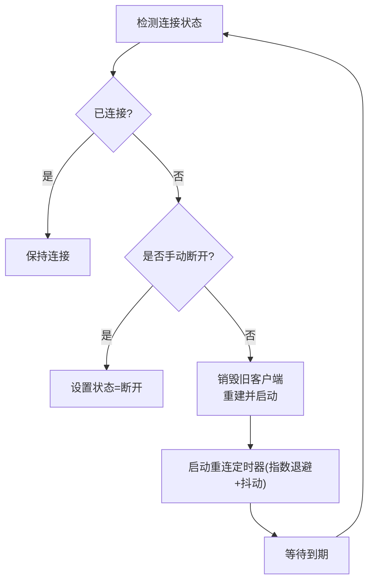
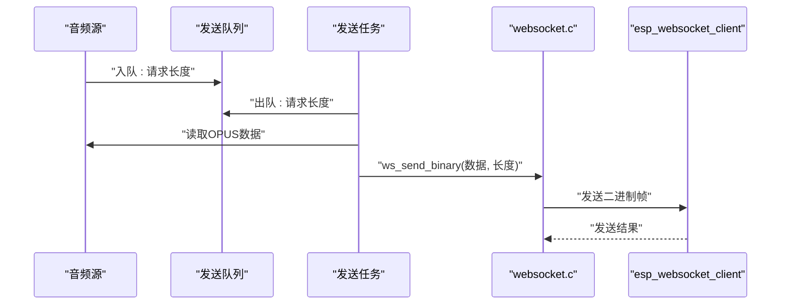
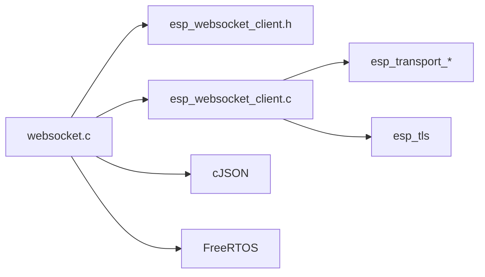

# WebSocket 实时通信

<cite>
**本文引用的文件**
- [websocket.c](file://main/app/websocket/websocket.c)
- [websocket.h](file://main/app/websocket/websocket.h)
- [esp_websocket_client.h](file://components/esp_websocket_client/esp_websocket_client.h)
- [esp_websocket_client.c](file://components/esp_websocket_client/esp_websocket_client.c)
- [audio.h](file://main/app/audio/audio.h)
- [led_effect.h](file://main/app/led_strip/led_effect.h)
- [angle_config_manager.h](file://main/app/angle/angle_config_manager.h)
</cite>

## 目录
1. [简介](#简介)
2. [项目结构](#项目结构)
3. [核心组件](#核心组件)
4. [架构总览](#架构总览)
5. [详细组件分析](#详细组件分析)
6. [依赖关系分析](#依赖关系分析)
7. [性能考虑](#性能考虑)
8. [故障排查指南](#故障排查指南)
9. [结论](#结论)
10. [附录](#附录)

## 简介
本技术文档围绕 ESP-IDF 工程中的 WebSocket 实时通信子系统展开，重点覆盖以下方面：
- WebSocket 客户端实现与连接生命周期管理
- 握手协议与帧格式处理要点
- 消息序列化与反序列化机制（音频数据、控制指令、状态同步）
- 断线检测、自动重连与连接状态管理策略
- 事件处理、错误恢复与性能优化
- 连接池管理、并发处理与安全配置建议

该实现基于 ESP-IDF 的官方 WebSocket 客户端组件，结合本地应用层封装，形成稳定可靠的实时通信通道。

## 项目结构
WebSocket 子系统位于 main/app/websocket 目录，核心对外接口与状态管理在此实现；底层 WebSocket 协议栈由 components/esp_websocket_client 提供。

**图表来源**
- [websocket.c:1-702](file://main/app/websocket/websocket.c#L1-L702)
- [websocket.h:1-108](file://main/app/websocket/websocket.h#L1-L108)
- [esp_websocket_client.h:1-482](file://components/esp_websocket_client/esp_websocket_client.h#L1-L482)
- [esp_websocket_client.c:1-800](file://components/esp_websocket_client/esp_websocket_client.c#L1-L800)

**章节来源**
- [websocket.c:1-702](file://main/app/websocket/websocket.c#L1-L702)
- [websocket.h:1-108](file://main/app/websocket/websocket.h#L1-L108)
- [esp_websocket_client.h:1-482](file://components/esp_websocket_client/esp_websocket_client.h#L1-L482)
- [esp_websocket_client.c:1-800](file://components/esp_websocket_client/esp_websocket_client.c#L1-L800)

## 核心组件
- WebSocket 客户端上下文与状态机
  - 维护连接句柄、配置参数、重连计数与退避策略、互斥量与初始化标记
  - 状态枚举：断开、连接中、已连接、重连中、错误
- 事件处理器
  - 处理连接建立、断开、数据接收、错误、关闭等事件
  - 解析服务端下发的控制指令（JSON），驱动音频与LED行为
- 发送路径
  - 文本消息：设备信息上报、通用控制
  - 二进制消息：OPUS 音频帧、JPEG 图像帧
  - 发送队列与专用发送任务保障实时性与稳定性
- 重连机制
  - 周期性检测连接状态，指数退避 + 随机抖动，避免雪崩
  - 手动断开与异常断开区分，确保状态一致性

**章节来源**
- [websocket.c:37-108](file://main/app/websocket/websocket.c#L37-L108)
- [websocket.h:37-108](file://main/app/websocket/websocket.h#L37-L108)

## 架构总览
WebSocket 客户端在应用层通过统一接口启动/停止，内部使用 ESP-IDF 官方客户端库完成握手、保活、收发与重连。应用层负责业务消息编解码与状态机管理。

**图表来源**
- [websocket.c:137-278](file://main/app/websocket/websocket.c#L137-L278)
- [websocket.c:292-320](file://main/app/websocket/websocket.c#L292-L320)
- [esp_websocket_client.h:31-42](file://components/esp_websocket_client/esp_websocket_client.h#L31-L42)
- [esp_websocket_client.c:198-253](file://components/esp_websocket_client/esp_websocket_client.c#L198-L253)

## 详细组件分析

### 1) WebSocket 客户端上下文与状态机
- 上下文字段
  - 客户端句柄、配置、当前状态
  - 数据/状态回调指针
  - 重连任务句柄、定时器、重连次数与当前退避时间
  - 互斥量与初始化标记
- 状态迁移
  - 断开 → 连接中 → 已连接 → 重连中（异常断开）/断开（手动断开）
  - 错误事件触发状态变更并记录日志
- 并发与线程模型
  - 事件回调运行于独立任务
  - 重连任务周期检查连接并重建客户端
  - 发送任务从队列读取 OPUS 片段并发送

**图表来源**
- [websocket.c:94-108](file://main/app/websocket/websocket.c#L94-L108)
- [websocket.c:144-180](file://main/app/websocket/websocket.c#L144-L180)
- [websocket.c:292-320](file://main/app/websocket/websocket.c#L292-L320)
- [websocket.h:37-44](file://main/app/websocket/websocket.h#L37-L44)

**章节来源**
- [websocket.c:51-108](file://main/app/websocket/websocket.c#L51-L108)
- [websocket.c:94-108](file://main/app/websocket/websocket.c#L94-L108)
- [websocket.c:144-180](file://main/app/websocket/websocket.c#L144-L180)
- [websocket.c:292-320](file://main/app/websocket/websocket.c#L292-L320)
- [websocket.h:37-44](file://main/app/websocket/websocket.h#L37-L44)

### 2) 事件处理与消息解析
- 事件类型
  - 连接建立、断开、数据、错误、关闭、连接前
- 数据处理
  - 文本帧：解析 JSON 控制命令，支持“音频开始/结束”、“recording_*”确认、“光剑控制”等
  - 二进制帧：音频 OPUS 数据，交由上层处理
- 回调分发
  - 未注册数据回调时记录警告
  - 状态变化通过回调通知上层

**图表来源**
- [websocket.c:137-278](file://main/app/websocket/websocket.c#L137-L278)
- [websocket.c:182-244](file://main/app/websocket/websocket.c#L182-L244)
- [websocket.c:247-267](file://main/app/websocket/websocket.c#L247-L267)

**章节来源**
- [websocket.c:137-278](file://main/app/websocket/websocket.c#L137-L278)
- [websocket.c:182-244](file://main/app/websocket/websocket.c#L182-L244)
- [websocket.c:247-267](file://main/app/websocket/websocket.c#L247-L267)

### 3) 消息序列化与反序列化机制
- 序列化
  - 设备信息：构造 JSON 字符串并发送文本帧
  - 光剑控制：上层生成 JSON，经客户端发送
- 反序列化
  - 使用 JSON 解析库解析服务端下发的控制命令
  - 根据“type”字段区分字符串类型与数值类型，分别处理
  - 数值类型作为“光剑控制”命令，驱动 LED 更新或按键触发场景下的配置保存
- 音频数据
  - 二进制帧承载 OPUS 编码后的音频片段
  - 发送路径采用队列 + 专用任务，避免阻塞事件循环

**图表来源**
- [websocket.c:111-134](file://main/app/websocket/websocket.c#L111-L134)
- [websocket.c:182-244](file://main/app/websocket/websocket.c#L182-L244)
- [websocket.c:580-630](file://main/app/websocket/websocket.c#L580-L630)
- [websocket.c:632-657](file://main/app/websocket/websocket.c#L632-L657)

**章节来源**
- [websocket.c:111-134](file://main/app/websocket/websocket.c#L111-L134)
- [websocket.c:182-244](file://main/app/websocket/websocket.c#L182-L244)
- [websocket.c:580-630](file://main/app/websocket/websocket.c#L580-L630)
- [websocket.c:632-657](file://main/app/websocket/websocket.c#L632-L657)

### 4) 断线检测、自动重连与连接状态管理
- 断线检测
  - 事件回调监听 DISCONNECTED 与 ERROR 事件
  - 区分手动断开与异常断开，避免误触发重连
- 重连策略
  - 重连任务周期检查连接状态
  - 定时器采用指数退避（乘以系数并取上限），叠加随机抖动，防止同时重连
  - 成功连接后重置退避时间与统计计数
- 状态管理
  - 通过互斥量保护状态切换，避免竞态
  - 状态变化通过回调通知上层

**图表来源**
- [websocket.c:292-320](file://main/app/websocket/websocket.c#L292-L320)
- [websocket.c:322-348](file://main/app/websocket/websocket.c#L322-L348)
- [websocket.c:161-180](file://main/app/websocket/websocket.c#L161-L180)

**章节来源**
- [websocket.c:292-320](file://main/app/websocket/websocket.c#L292-L320)
- [websocket.c:322-348](file://main/app/websocket/websocket.c#L322-L348)
- [websocket.c:161-180](file://main/app/websocket/websocket.c#L161-L180)

### 5) 发送路径与并发处理
- 发送接口
  - 文本帧：ws_send_text
  - 二进制帧：ws_send_binary
  - JPEG 帧：ws_send_jpeg_binary
- 发送任务
  - 专用任务从发送队列读取 OPUS 片段长度，从音频模块读取数据并发送
  - 发送前校验连接状态与长度上限，失败时记录错误并跳过
- 并发与资源
  - 互斥量保护上下文访问
  - 事件回调与发送任务分离，降低阻塞风险

**图表来源**
- [websocket.c:458-502](file://main/app/websocket/websocket.c#L458-L502)
- [websocket.c:478-489](file://main/app/websocket/websocket.c#L478-L489)
- [websocket.c:606-630](file://main/app/websocket/websocket.c#L606-L630)

**章节来源**
- [websocket.c:458-502](file://main/app/websocket/websocket.c#L458-L502)
- [websocket.c:606-630](file://main/app/websocket/websocket.c#L606-L630)

### 6) 安全配置与证书校验
- 证书配置
  - 默认内置自签名服务器证书，用于 TLS 校验
  - 支持跳过 CN 校验（开发调试场景）
- 传输与认证
  - 默认使用 WSS（SSL/TLS）传输
  - 支持附加头部、用户代理、子协议等扩展

**章节来源**
- [websocket.h:14-35](file://main/app/websocket/websocket.h#L14-L35)
- [websocket.c:359-370](file://main/app/websocket/websocket.c#L359-L370)
- [esp_websocket_client.h:104-139](file://components/esp_websocket_client/esp_websocket_client.h#L104-L139)

### 7) 与音频、LED、角度配置的集成
- 音频控制
  - 服务端下发“audio_start/audio_end”控制命令，驱动本地音频事件
- LED 控制
  - 服务端下发“光剑控制”命令，直接更新 LED 效果
  - 若由按键触发录音返回的控制命令，则保存至角度配置管理器
- 角度配置
  - 保存 JSON 字符串以便后续使用

**章节来源**
- [websocket.c:203-237](file://main/app/websocket/websocket.c#L203-L237)
- [audio.h:1-50](file://main/app/audio/audio.h#L1-L50)
- [led_effect.h:1-50](file://main/app/led_strip/led_effect.h#L1-L50)
- [angle_config_manager.h:1-50](file://main/app/angle/angle_config_manager.h#L1-L50)

## 依赖关系分析
- 应用层依赖
  - ESP-IDF 事件系统与 WebSocket 客户端库
  - JSON 解析库（cJSON）
  - FreeRTOS 同步原语（互斥量、定时器、任务）
- 组件层依赖
  - 传输层（TCP/SSL）、WebSocket 协议栈
  - 保活与超时控制
  - 事件派发与错误码映射

**图表来源**
- [websocket.c:1-20](file://main/app/websocket/websocket.c#L1-L20)
- [esp_websocket_client.h:1-22](file://components/esp_websocket_client/esp_websocket_client.h#L1-L22)
- [esp_websocket_client.c:1-30](file://components/esp_websocket_client/esp_websocket_client.c#L1-L30)

**章节来源**
- [websocket.c:1-20](file://main/app/websocket/websocket.c#L1-L20)
- [esp_websocket_client.h:1-22](file://components/esp_websocket_client/esp_websocket_client.h#L1-L22)
- [esp_websocket_client.c:1-30](file://components/esp_websocket_client/esp_websocket_client.c#L1-L30)

## 性能考虑
- 缓冲区与发送策略
  - 可配置发送/接收缓冲区大小，避免频繁分配
  - 发送任务采用队列驱动，降低事件回调压力
- 重连退避
  - 指数退避 + 抖动，减少网络拥塞与服务器压力
- 资源释放
  - 正确销毁客户端、删除定时器与互斥量，避免泄漏
- 日志与监控
  - 关键事件与错误记录日志，便于定位问题

[本节为通用指导，无需特定文件来源]

## 故障排查指南
- 常见错误类型
  - TCP 传输错误、握手失败、PONG 超时、服务器关闭
- 排查步骤
  - 检查证书配置与 CN 校验设置
  - 查看事件回调中的错误码与套接字错误
  - 确认网络超时与保活参数设置
  - 验证发送队列与发送任务是否正常运行
- 建议
  - 在开发阶段允许跳过证书 CN 校验，生产环境务必启用严格校验
  - 合理设置 ping/pong 超时，避免误判断线

**章节来源**
- [esp_websocket_client.h:47-68](file://components/esp_websocket_client/esp_websocket_client.h#L47-L68)
- [websocket.c:247-267](file://main/app/websocket/websocket.c#L247-L267)

## 结论
该 WebSocket 实时通信实现以官方客户端库为基础，结合应用层的状态机、事件处理与发送任务，提供了稳健的连接管理、消息编解码与自动重连能力。通过合理的缓冲区配置、退避策略与资源管理，能够在资源受限的嵌入式环境中实现低延迟、高可靠性的实时通信。

[本节为总结，无需特定文件来源]

## 附录

### A. 关键接口与配置项速览
- 启停与状态
  - 启动：ws_start(uri)
  - 停止：ws_stop()
  - 连接状态：ws_is_connected()
- 发送接口
  - 文本：ws_send_text(data, len)
  - 二进制：ws_send_binary(data, len)
  - JPEG：ws_send_jpeg_binary(jpg_data, jpg_len)
- 回调注册
  - 数据回调：ws_register_data_handler(handler)
  - 状态回调：ws_register_state_handler(handler)
- 配置参数（默认值）
  - 心跳间隔：默认 0（禁用）
  - 缓冲区大小：8KB
  - 网络超时：20 秒
  - 最大重连次数：15
  - 初始重连延迟：2 秒
  - 最大重连延迟：30 秒
  - 跳过证书校验：true
  - 传输：WSS（SSL）

**章节来源**
- [websocket.h:52-108](file://main/app/websocket/websocket.h#L52-L108)
- [websocket.c:23-49](file://main/app/websocket/websocket.c#L23-L49)
- [websocket.c:505-555](file://main/app/websocket/websocket.c#L505-L555)