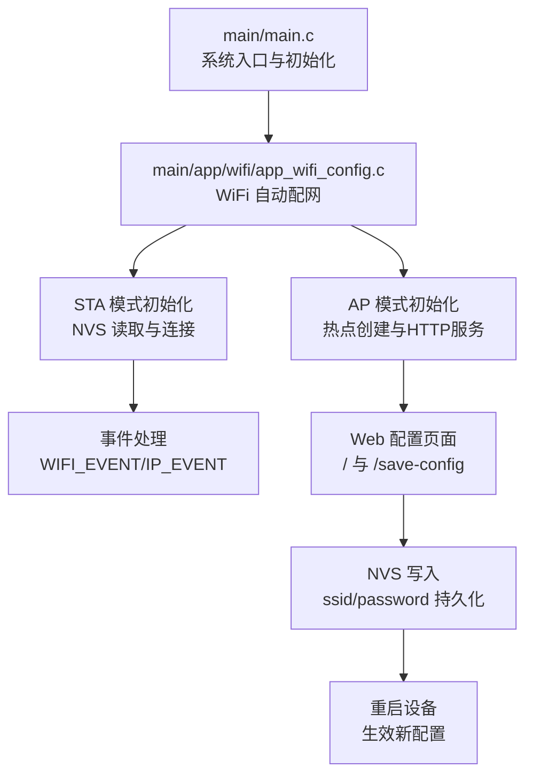
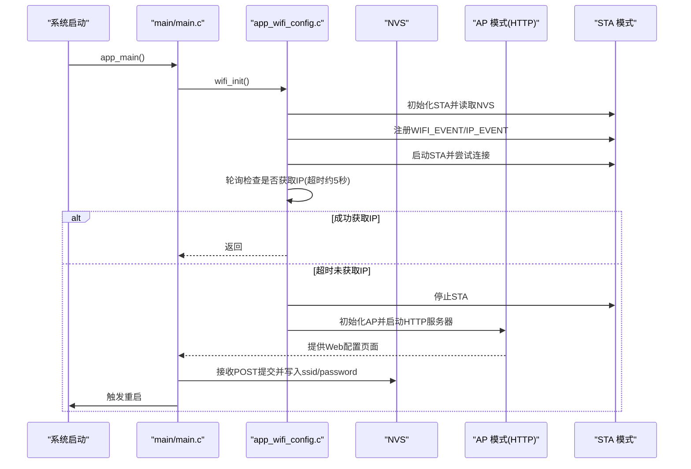
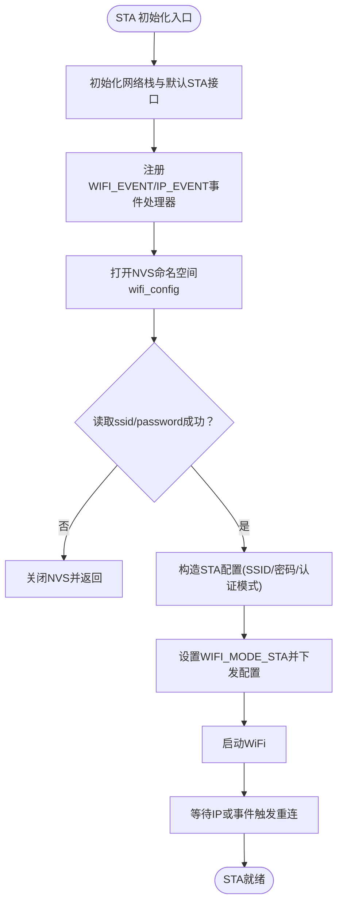
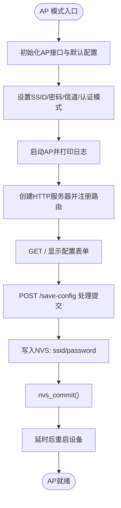
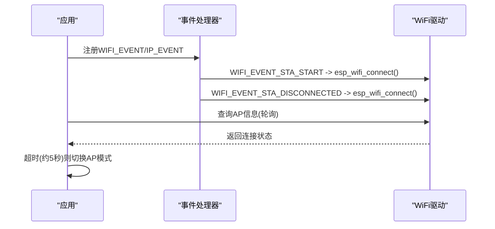
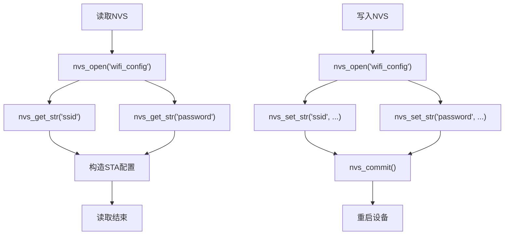
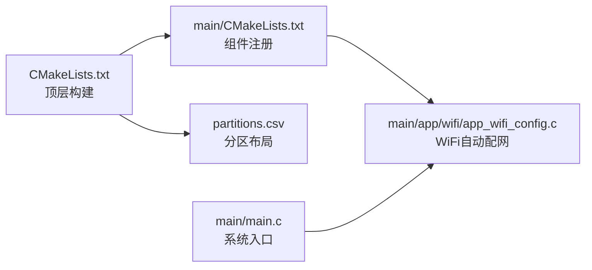

# WiFi 自动配网

<cite>
**本文引用的文件列表**
- [main.c](file://main/main.c)
- [app_wifi_config.h](file://main/app/wifi/app_wifi_config.h)
- [app_wifi_config.c](file://main/app/wifi/app_wifi_config.c)
- [websocket.c](file://main/app/websocket/websocket.c)
- [CMakeLists.txt](file://CMakeLists.txt)
- [main/CMakeLists.txt](file://main/CMakeLists.txt)
- [partitions.csv](file://partitions.csv)
</cite>

## 目录
1. [简介](#简介)
2. [项目结构](#项目结构)
3. [核心组件](#核心组件)
4. [架构总览](#架构总览)
5. [详细组件分析](#详细组件分析)
6. [依赖关系分析](#依赖关系分析)
7. [性能考量](#性能考量)
8. [故障排查指南](#故障排查指南)
9. [结论](#结论)
10. [附录](#附录)

## 简介
本技术文档围绕 ESP-IDF 工程中的 WiFi 自动配网功能展开，系统性阐述以下内容：
- STA/AP 双模式自动切换机制：启动时优先尝试 STA 连接，若失败则进入 AP 模式并提供 Web 配置界面。
- 自动配网流程：STA 模式下读取 NVS 中的 SSID/密码，注册事件监听，连接超时判定与失败处理。
- AP 模式下的热点创建、Web 配置页面实现与用户输入处理、配置写入与重启。
- STA 模式的连接过程、认证机制与连接状态监控。
- NVS 配置存储、安全密码处理与配置持久化。
- 网络故障诊断、连接超时处理与用户体验优化建议。

## 项目结构
该工程采用 ESP-IDF 的组件化组织方式，WiFi 自动配网位于 main/app/wifi 子模块；主入口在 main/main.c 中调用初始化流程。关键文件如下：
- main/main.c：系统入口，初始化 NVS、网络栈、事件循环，随后调用 wifi_init()。
- main/app/wifi/app_wifi_config.{h,c}：WiFi 自动配网的核心实现，包含 STA/AP 切换、Web 配置、NVS 读写。
- main/app/websocket/websocket.c：WebSocket 功能，可用于连接状态上报与设备信息发送（与 WiFi 状态联动）。
- CMakeLists.txt 与 main/CMakeLists.txt：构建配置，声明组件目录与 SPIFFS 分区打包。
- partitions.csv：分区表，包含 nvs、factory、storage 等分区，为 NVS 与 SPIFFS 提供空间。

图表来源
- [main.c:33-60](file://main/main.c#L33-L60)
- [app_wifi_config.c:265-302](file://main/app/wifi/app_wifi_config.c#L265-L302)

章节来源
- [main.c:33-60](file://main/main.c#L33-L60)
- [CMakeLists.txt:1-10](file://CMakeLists.txt#L1-L10)
- [main/CMakeLists.txt:1-4](file://main/CMakeLists.txt#L1-L4)
- [partitions.csv:1-6](file://partitions.csv#L1-L6)

## 核心组件
- WiFi 自动配网模块（STA/AP 切换、Web 配置、NVS 持久化）
- 事件驱动的连接状态管理（WIFI_EVENT/IP_EVENT）
- HTTP 服务器（基于 ESP-IDF httpd，提供配置页面与提交接口）
- WebSocket（用于设备信息上报与状态通知）

章节来源
- [app_wifi_config.h:1-6](file://main/app/wifi/app_wifi_config.h#L1-L6)
- [app_wifi_config.c:57-69](file://main/app/wifi/app_wifi_config.c#L57-L69)
- [websocket.c:102-146](file://main/app/websocket/websocket.c#L102-L146)

## 架构总览
WiFi 自动配网的整体流程如下：
- 系统启动后，先尝试以 STA 模式连接已保存的 WiFi 凭据。
- 若在限定时间内未获取到 IP，则停止 STA 并切换到 AP 模式，启动本地 HTTP 服务器，提供 Web 配置页面。
- 用户在页面填写 SSID/密码并提交，后端将凭据写入 NVS 并重启设备，使新配置生效。
- 设备重启后再次尝试 STA 连接，若成功则进入正常运行态；若仍失败则继续停留在 AP 模式。

图表来源
- [main.c:33-60](file://main/main.c#L33-L60)
- [app_wifi_config.c:265-302](file://main/app/wifi/app_wifi_config.c#L265-L302)

## 详细组件分析

### 组件一：STA 模式初始化与连接
- 初始化网络栈与默认接口，注册 WIFI_EVENT 与 IP_EVENT 事件处理器。
- 打开 NVS 命名空间“wifi_config”，读取“ssid”和“password”。
- 根据是否存在密码决定认证模式（WPA2 或 OPEN）。
- 设置 STA 配置并启动，随后由事件驱动自动重连。

图表来源
- [app_wifi_config.c:103-166](file://main/app/wifi/app_wifi_config.c#L103-L166)

章节来源
- [app_wifi_config.c:103-166](file://main/app/wifi/app_wifi_config.c#L103-L166)

### 组件二：AP 模式与 Web 配置
- 初始化 AP 模式，设置 SSID、密码、信道与最大连接数。
- 启动 HTTP 服务器，提供根路径“/”显示配置表单与“/save-config”处理提交。
- 提交后将 ssid/password 写入 NVS 并 commit，随后延时重启。

图表来源
- [app_wifi_config.c:71-100](file://main/app/wifi/app_wifi_config.c#L71-L100)
- [app_wifi_config.c:230-262](file://main/app/wifi/app_wifi_config.c#L230-L262)
- [app_wifi_config.c:175-219](file://main/app/wifi/app_wifi_config.c#L175-L219)

章节来源
- [app_wifi_config.c:71-100](file://main/app/wifi/app_wifi_config.c#L71-L100)
- [app_wifi_config.c:168-173](file://main/app/wifi/app_wifi_config.c#L168-L173)
- [app_wifi_config.c:175-219](file://main/app/wifi/app_wifi_config.c#L175-L219)
- [app_wifi_config.c:230-262](file://main/app/wifi/app_wifi_config.c#L230-L262)

### 组件三：STA 连接状态监控与失败重试
- 事件处理器对 WIFI_EVENT_STA_START 与 WIFI_EVENT_STA_DISCONNECTED 进行统一处理，触发 esp_wifi_connect() 实现自动重连。
- 主流程在 STA 启动后轮询检查是否获取到 AP 信息，作为“是否连接成功”的简易判定（约 5 秒超时）。

图表来源
- [app_wifi_config.c:57-69](file://main/app/wifi/app_wifi_config.c#L57-L69)
- [app_wifi_config.c:276-291](file://main/app/wifi/app_wifi_config.c#L276-L291)

章节来源
- [app_wifi_config.c:57-69](file://main/app/wifi/app_wifi_config.c#L57-L69)
- [app_wifi_config.c:276-291](file://main/app/wifi/app_wifi_config.c#L276-L291)

### 组件四：NVS 配置存储与持久化
- 读取：打开命名空间“wifi_config”，读取键“ssid”和“password”，若不存在则不进行连接。
- 写入：接收 Web 表单提交，写入“ssid”和“password”，调用 nvs_commit() 确保落盘。
- 重启：写入完成后延时并触发系统重启，使新配置立即生效。

图表来源
- [app_wifi_config.c:124-135](file://main/app/wifi/app_wifi_config.c#L124-L135)
- [app_wifi_config.c:202-208](file://main/app/wifi/app_wifi_config.c#L202-L208)
- [app_wifi_config.c:213-215](file://main/app/wifi/app_wifi_config.c#L213-L215)

章节来源
- [app_wifi_config.c:124-135](file://main/app/wifi/app_wifi_config.c#L124-L135)
- [app_wifi_config.c:202-208](file://main/app/wifi/app_wifi_config.c#L202-L208)
- [app_wifi_config.c:213-215](file://main/app/wifi/app_wifi_config.c#L213-L215)

### 组件五：WebSocket 与设备信息上报（与 WiFi 状态联动）
- WebSocket 事件处理器记录连接状态变化，设备信息包含 MAC 地址与时间戳，便于远程诊断与设备识别。
- 该组件与 WiFi 自动配网无直接耦合，但可与配网后的 STA 成功状态配合使用。

章节来源
- [websocket.c:102-146](file://main/app/websocket/websocket.c#L102-L146)
- [websocket.c:110-134](file://main/app/websocket/websocket.c#L110-L134)

## 依赖关系分析
- 构建与组件目录：顶层 CMakeLists 指定 EXTRA_COMPONENT_DIRS，main/CMakeLists 将 main/app 下的子模块纳入编译。
- 分区布局：partitions.csv 包含 nvs、factory、storage 等分区，为 NVS 与 SPIFFS 提供物理空间。
- 运行时依赖：main/main.c 在 app_main() 中初始化 NVS、网络栈与事件循环，再调用 wifi_init()。

图表来源
- [CMakeLists.txt:1-10](file://CMakeLists.txt#L1-L10)
- [main/CMakeLists.txt:1-4](file://main/CMakeLists.txt#L1-L4)
- [partitions.csv:1-6](file://partitions.csv#L1-L6)
- [main.c:33-60](file://main/main.c#L33-L60)

章节来源
- [CMakeLists.txt:1-10](file://CMakeLists.txt#L1-L10)
- [main/CMakeLists.txt:1-4](file://main/CMakeLists.txt#L1-L4)
- [partitions.csv:1-6](file://partitions.csv#L1-L6)
- [main.c:33-60](file://main/main.c#L33-L60)

## 性能考量
- 启动时延：STA 模式下约 5 秒的连接超时判定，避免长时间阻塞。
- 事件驱动重连：通过 WIFI_EVENT/IP_EVENT 注册统一处理，减少轮询开销。
- HTTP 服务器：基于 ESP-IDF httpd，轻量易用，适合配网场景。
- NVS 写入：使用 nvs_commit() 确保持久化，避免断电丢失。
- 重启策略：写入 NVS 后延时重启，保证配置生效，避免状态不一致。

## 故障排查指南
- 无法进入 STA 连接
  - 检查 NVS 是否存在“wifi_config”命名空间与“ssid/password”键值。
  - 确认 NVS 初始化与分区表正确加载。
  - 查看事件处理器是否注册成功，以及 WIFI_EVENT/IP_EVENT 是否触发。
- 连接超时
  - 确认路由器可用且信号良好。
  - 检查认证模式与密码是否匹配。
  - 调整超时阈值或增加重试次数。
- AP 模式无法访问
  - 确认 AP 初始化成功并打印 SSID/密码日志。
  - 检查 HTTP 服务器是否启动并注册了“/”与“/save-config”路由。
  - 浏览器访问是否被拦截或缓存问题。
- 配置未生效
  - 确认 nvs_commit() 是否调用成功。
  - 检查重启逻辑是否执行。
  - 重启后确认 NVS 读取流程是否正常。

章节来源
- [app_wifi_config.c:124-135](file://main/app/wifi/app_wifi_config.c#L124-L135)
- [app_wifi_config.c:202-208](file://main/app/wifi/app_wifi_config.c#L202-L208)
- [app_wifi_config.c:213-215](file://main/app/wifi/app_wifi_config.c#L213-L215)
- [app_wifi_config.c:276-291](file://main/app/wifi/app_wifi_config.c#L276-L291)
- [app_wifi_config.c:71-100](file://main/app/wifi/app_wifi_config.c#L71-L100)
- [app_wifi_config.c:230-262](file://main/app/wifi/app_wifi_config.c#L230-L262)

## 结论
该 WiFi 自动配网方案通过 STA/AP 双模式切换与 Web 配置相结合，实现了低门槛的首次联网体验。其核心优势在于：
- 以事件驱动的方式简化连接状态管理；
- 使用 NVS 进行配置持久化，结合重启确保新配置生效；
- AP 模式下提供直观的 Web 配置界面，降低用户操作复杂度。

建议在实际部署中进一步增强：
- 更完善的连接状态查询与错误码解析；
- 配置提交后的校验与反馈；
- 超时与重试策略的动态调整；
- 安全性加固（如 HTTPS、强口令策略）。

## 附录
- 关键流程路径
  - 启动入口与初始化：[main.c:33-60](file://main/main.c#L33-L60)
  - 自动配网主流程：[app_wifi_config.c:265-302](file://main/app/wifi/app_wifi_config.c#L265-L302)
  - STA 初始化与事件注册：[app_wifi_config.c:103-166](file://main/app/wifi/app_wifi_config.c#L103-L166)
  - AP 模式与 HTTP 服务：[app_wifi_config.c:71-100](file://main/app/wifi/app_wifi_config.c#L71-L100), [app_wifi_config.c:230-262](file://main/app/wifi/app_wifi_config.c#L230-L262)
  - Web 配置提交与 NVS 写入：[app_wifi_config.c:175-219](file://main/app/wifi/app_wifi_config.c#L175-L219), [app_wifi_config.c:202-208](file://main/app/wifi/app_wifi_config.c#L202-L208)
  - WebSocket 设备信息上报：[websocket.c:110-134](file://main/app/websocket/websocket.c#L110-L134)