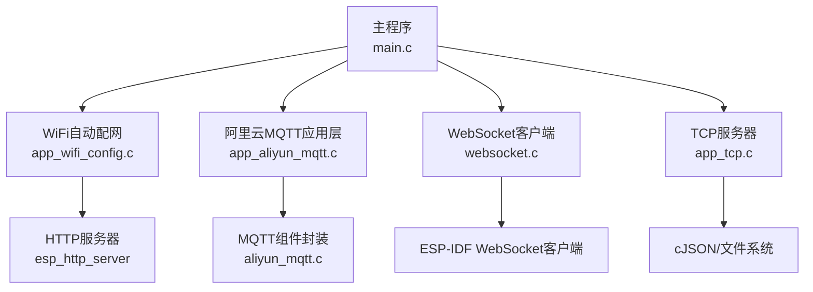
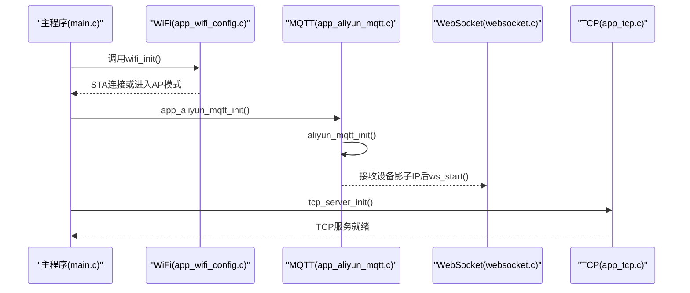
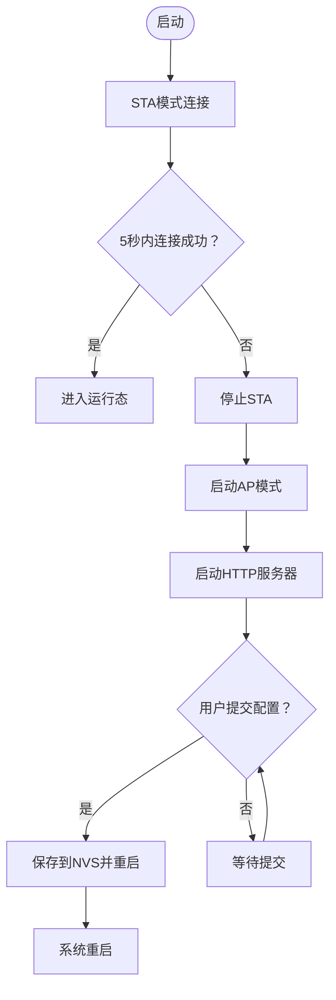
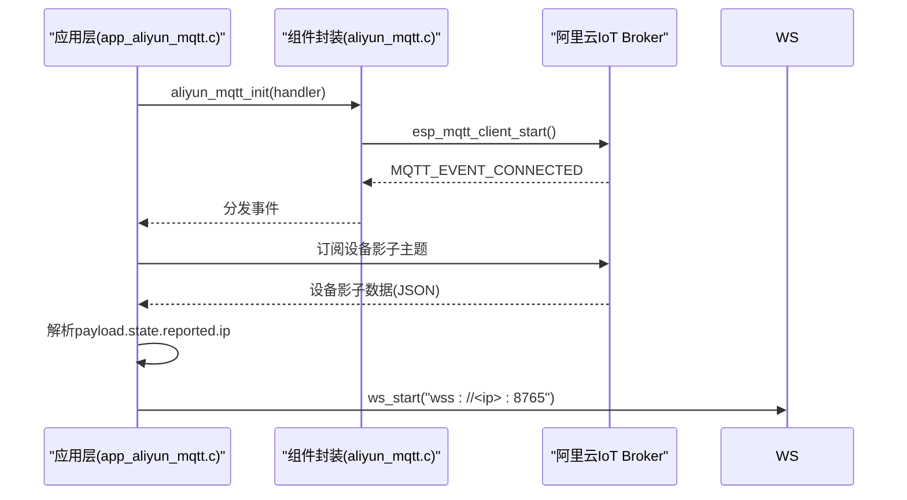
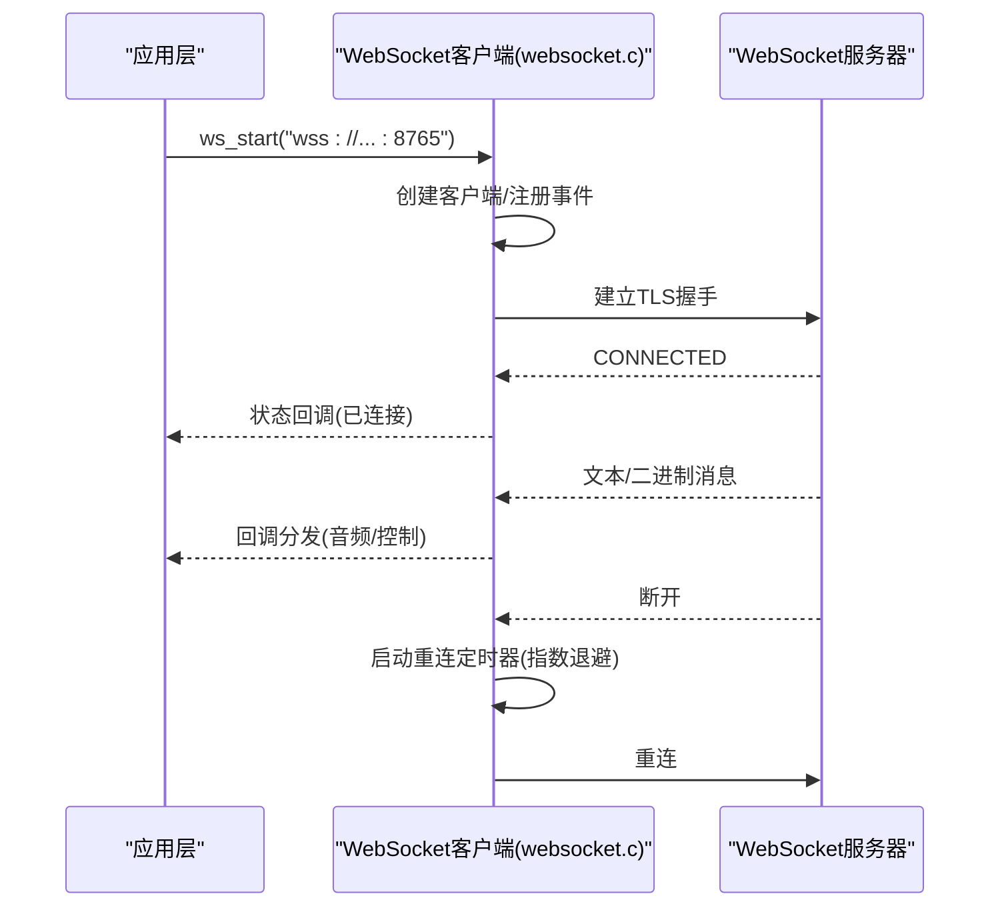
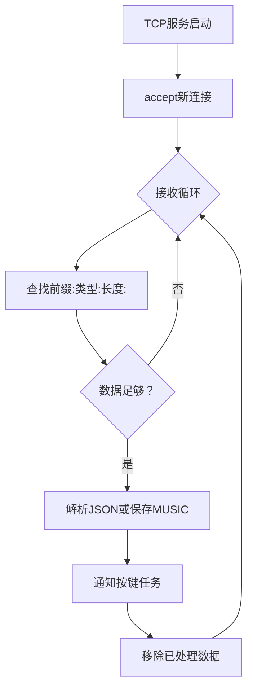
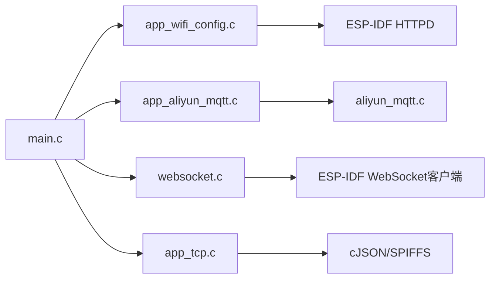

# 网络通信系统

<cite>
**本文档引用的文件**
- [main.c](file://main/main.c)
- [app_wifi_config.h](file://main/app/wifi/app_wifi_config.h)
- [app_wifi_config.c](file://main/app/wifi/app_wifi_config.c)
- [aliyun_mqtt.h](file://components/aliyun_mqtt/include/aliyun_mqtt.h)
- [aliyun_mqtt.c](file://components/aliyun_mqtt/src/aliyun_mqtt.c)
- [app_aliyun_mqtt.h](file://main/app/aliyun/app_aliyun_mqtt.h)
- [app_aliyun_mqtt.c](file://main/app/aliyun/app_aliyun_mqtt.c)
- [websocket.h](file://main/app/websocket/websocket.h)
- [websocket.c](file://main/app/websocket/websocket.c)
- [app_tcp.h](file://main/app/tcp/app_tcp.h)
- [app_tcp.c](file://main/app/tcp/app_tcp.c)
- [sdkconfig.defaults](file://sdkconfig.defaults)
</cite>

## 目录
1. [引言](#引言)
2. [项目结构](#项目结构)
3. [核心组件](#核心组件)
4. [架构总览](#架构总览)
5. [详细组件分析](#详细组件分析)
6. [依赖关系分析](#依赖关系分析)
7. [性能考虑](#性能考虑)
8. [故障排查指南](#故障排查指南)
9. [结论](#结论)
10. [附录](#附录)

## 引言
本文件面向网络通信系统的技术文档，围绕以下目标展开：WiFi自动配网机制（网络扫描、认证与连接状态管理）、阿里云IoT平台的MQTT对接与设备影子管理、WebSocket实时通信（连接建立、消息处理与断线重连）、以及TCP本地网络服务实现。同时提供网络安全配置建议、性能优化策略与常见问题诊断方法，帮助开发者快速理解与维护系统。

## 项目结构
系统采用模块化组织，核心网络功能分布在以下模块：
- WiFi自动配网：STA/AP双模式切换、Web配网页面、NVS存储
- MQTT云端通信：ESP-MQTT客户端封装、阿里云IoT对接、设备影子订阅与请求
- WebSocket实时通信：自签名证书、事件驱动、断线指数退避重连
- TCP本地服务：基于socket的简单协议，支持JSON与音频数据传输
- 主入口：统一初始化各子系统

图表来源
- [main.c:33-60](file://main/main.c#L33-L60)
- [app_wifi_config.c:265-302](file://main/app/wifi/app_wifi_config.c#L265-L302)
- [app_aliyun_mqtt.c:189-193](file://main/app/aliyun/app_aliyun_mqtt.c#L189-L193)
- [websocket.c:505-555](file://main/app/websocket/websocket.c#L505-L555)
- [app_tcp.c:354-359](file://main/app/tcp/app_tcp.c#L354-L359)

章节来源
- [main.c:33-60](file://main/main.c#L33-L60)
- [sdkconfig.defaults:100-108](file://sdkconfig.defaults#L100-L108)

## 核心组件
- WiFi自动配网：STA优先连接，失败则进入AP模式并提供Web表单保存SSID/密码，重启后以STA模式连接
- MQTT云端：通过ESP-MQTT客户端连接阿里云IoT，订阅设备影子主题，解析云端下发的IP并动态建立WebSocket
- WebSocket：事件驱动连接、二进制音频帧发送、JSON控制命令解析、指数退避重连
- TCP本地：监听端口，按“前缀:长度:数据”协议解析，支持JSON配置与音乐音频持久化

章节来源
- [app_wifi_config.c:265-302](file://main/app/wifi/app_wifi_config.c#L265-L302)
- [aliyun_mqtt.c:70-82](file://components/aliyun_mqtt/src/aliyun_mqtt.c#L70-L82)
- [app_aliyun_mqtt.c:44-63](file://main/app/aliyun/app_aliyun_mqtt.c#L44-L63)
- [websocket.c:137-278](file://main/app/websocket/websocket.c#L137-L278)
- [app_tcp.c:289-352](file://main/app/tcp/app_tcp.c#L289-L352)

## 架构总览
系统启动顺序：初始化硬件与事件循环 → 板级初始化 → 各子系统初始化 → WiFi配网 → MQTT连接 → TCP服务启动 → 运行期监控。

图表来源
- [main.c:45-50](file://main/main.c#L45-L50)
- [app_wifi_config.c:265-302](file://main/app/wifi/app_wifi_config.c#L265-L302)
- [app_aliyun_mqtt.c:189-193](file://main/app/aliyun/app_aliyun_mqtt.c#L189-L193)
- [websocket.c:505-555](file://main/app/websocket/websocket.c#L505-L555)
- [app_tcp.c:354-359](file://main/app/tcp/app_tcp.c#L354-L359)

## 详细组件分析

### WiFi自动配网
- 模式选择：优先STA连接，若5秒内未连接成功则停止STA并启动AP模式
- Web配网：内置HTTP服务器，提供HTML表单提交SSID/密码，写入NVS并重启
- 事件处理：注册WIFI_EVENT与IP_EVENT，自动重连与状态日志
- AP配置：固定SSID/密码、信道与最大连接数

图表来源
- [app_wifi_config.c:276-302](file://main/app/wifi/app_wifi_config.c#L276-L302)
- [app_wifi_config.c:168-219](file://main/app/wifi/app_wifi_config.c#L168-L219)
- [app_wifi_config.c:57-69](file://main/app/wifi/app_wifi_config.c#L57-L69)

章节来源
- [app_wifi_config.h:3](file://main/app/wifi/app_wifi_config.h#L3)
- [app_wifi_config.c:265-302](file://main/app/wifi/app_wifi_config.c#L265-L302)
- [app_wifi_config.c:102-166](file://main/app/wifi/app_wifi_config.c#L102-L166)

### MQTT云端通信与设备影子
- 组件封装：aliyun_mqtt.c负责ESP-MQTT客户端初始化、事件注册与启动
- 应用层：app_aliyun_mqtt.c注册事件回调，首次连接即订阅设备影子主题并请求GET
- 影子解析：从payload.state.reported.ip提取云端分配的WebSocket服务器IP，动态建立wss连接
- 仅订阅一次：通过布尔标志避免重复订阅

图表来源
- [aliyun_mqtt.c:70-82](file://components/aliyun_mqtt/src/aliyun_mqtt.c#L70-L82)
- [app_aliyun_mqtt.c:65-181](file://main/app/aliyun/app_aliyun_mqtt.c#L65-L181)
- [websocket.c:505-555](file://main/app/websocket/websocket.c#L505-L555)

章节来源
- [aliyun_mqtt.h:16](file://components/aliyun_mqtt/include/aliyun_mqtt.h#L16)
- [aliyun_mqtt.c:25-68](file://components/aliyun_mqtt/src/aliyun_mqtt.c#L25-L68)
- [app_aliyun_mqtt.c:44-63](file://main/app/aliyun/app_aliyun_mqtt.c#L44-L63)
- [app_aliyun_mqtt.c:102-162](file://main/app/aliyun/app_aliyun_mqtt.c#L102-L162)

### WebSocket实时通信
- 连接建立：ws_start传入wss URI，内部创建客户端并注册事件回调
- 状态机：断开/连接中/已连接/重连中/错误五态，支持状态回调
- 消息处理：文本命令解析（含音频流控制与光剑控制），二进制音频帧发送
- 断线重连：指数退避+抖动，手动断开与异常断开区分处理
- 证书校验：内置自签名证书，支持跳过CN校验

图表来源
- [websocket.c:505-555](file://main/app/websocket/websocket.c#L505-L555)
- [websocket.c:137-278](file://main/app/websocket/websocket.c#L137-L278)
- [websocket.c:281-320](file://main/app/websocket/websocket.c#L281-L320)

章节来源
- [websocket.h:57-108](file://main/app/websocket/websocket.h#L57-L108)
- [websocket.c:94-108](file://main/app/websocket/websocket.c#L94-L108)
- [websocket.c:182-244](file://main/app/websocket/websocket.c#L182-L244)
- [websocket.c:322-348](file://main/app/websocket/websocket.c#L322-L348)

### TCP本地网络服务
- 协议格式：前缀“类型:长度:数据”，类型支持“JSON”和“MUSIC”
- 服务端：单任务accept循环，边收边解包，支持多条消息拼接
- JSON处理：解析并更新LED配置，持久化设置文件
- 音频处理：按当前音乐名保存MP3音频文件
- SPIFFS：设置文件与音频文件落盘，容量与挂载状态检查

图表来源
- [app_tcp.c:289-352](file://main/app/tcp/app_tcp.c#L289-L352)
- [app_tcp.c:177-195](file://main/app/tcp/app_tcp.c#L177-L195)
- [app_tcp.c:197-222](file://main/app/tcp/app_tcp.c#L197-L222)
- [app_tcp.c:224-244](file://main/app/tcp/app_tcp.c#L224-L244)

章节来源
- [app_tcp.h:4-7](file://main/app/tcp/app_tcp.h#L4-L7)
- [app_tcp.c:289-352](file://main/app/tcp/app_tcp.c#L289-L352)

## 依赖关系分析
- 组件耦合
  - app_aliyun_mqtt.c依赖aliyun_mqtt.h/c与websocket.h，形成“云端→边缘”的链路
  - websocket.c独立于MQTT，但受MQTT提供的IP驱动
  - app_tcp.c与websocket无直接耦合，但二者均面向本地/远程控制场景
- 外部依赖
  - ESP-IDF：WiFi、HTTPD、MQTT、WebSocket、cJSON、SPIFFS
  - 配置项：通过sdkconfig.defaults启用相关特性（如HTTPD、LWIP队列、SPIRAM）

图表来源
- [main.c:33-60](file://main/main.c#L33-L60)
- [sdkconfig.defaults:28-37](file://sdkconfig.defaults#L28-L37)

章节来源
- [sdkconfig.defaults:100-108](file://sdkconfig.defaults#L100-L108)
- [sdkconfig.defaults:440-462](file://sdkconfig.defaults#L440-L462)

## 性能考虑
- 内存与缓存
  - SDK配置启用SPIRAM与PSRAM相关选项，有助于音频与网络缓冲
  - WebSocket默认缓冲区与网络超时可调，建议结合带宽与延迟评估
- 任务与优先级
  - WebSocket发送任务绑定到特定核，避免与高负载任务争抢
  - TCP服务采用单任务循环，减少上下文切换
- 网络栈
  - LWIP队列与TCP窗口参数已优化，建议根据实际网络环境微调
- 事件与日志
  - 事件循环与日志等级已在默认配置中设定，便于生产调试平衡

章节来源
- [sdkconfig.defaults:82-87](file://sdkconfig.defaults#L82-L87)
- [sdkconfig.defaults:484-496](file://sdkconfig.defaults#L484-L496)
- [websocket.c:550-554](file://main/app/websocket/websocket.c#L550-L554)
- [app_tcp.c:354-359](file://main/app/tcp/app_tcp.c#L354-L359)

## 故障排查指南
- WiFi无法连接
  - 检查NVS中SSID/密码是否正确写入与读取
  - 观察STA连接事件回调与重连次数
  - 若进入AP模式，确认Web表单提交与重启流程
- MQTT连接失败
  - 确认阿里云IoT配置项（主机、用户名、ClientID、密码）正确
  - 检查事件回调是否注册成功
  - 关注设备影子订阅与GET请求是否发出
- WebSocket频繁断线
  - 查看错误事件中的TLS/Socket错误码
  - 调整重连延迟参数与最大重连次数
  - 确认服务器证书与wss地址
- TCP协议解析异常
  - 检查前缀格式“类型:长度:”是否规范
  - 确认数据长度与实际长度一致，避免粘包
  - SPIFFS挂载与文件写入权限

章节来源
- [app_wifi_config.c:124-135](file://main/app/wifi/app_wifi_config.c#L124-L135)
- [aliyun_mqtt.c:52-67](file://components/aliyun_mqtt/src/aliyun_mqtt.c#L52-L67)
- [app_aliyun_mqtt.c:65-95](file://main/app/aliyun/app_aliyun_mqtt.c#L65-L95)
- [websocket.c:247-263](file://main/app/websocket/websocket.c#L247-L263)
- [app_tcp.c:177-195](file://main/app/tcp/app_tcp.c#L177-L195)

## 结论
本系统通过WiFi自动配网、MQTT设备影子与WebSocket实时通道，实现了从本地到云端再到远端的全链路通信；配合TCP本地服务，满足本地控制与数据落盘需求。通过模块化设计与事件驱动架构，具备良好的可扩展性与可维护性。建议在部署前完成网络与安全配置验证，并结合实际场景优化缓冲与重连策略。

## 附录
- 配置项参考
  - HTTPD与LWIP队列：影响Web配网与TCP并发能力
  - SPIRAM与CPU频率：提升音频与网络处理性能
  - WiFi缓冲与TLS：影响MQTT与WebSocket稳定性

章节来源
- [sdkconfig.defaults:28-37](file://sdkconfig.defaults#L28-L37)
- [sdkconfig.defaults:82-87](file://sdkconfig.defaults#L82-L87)
- [sdkconfig.defaults:484-496](file://sdkconfig.defaults#L484-L496)