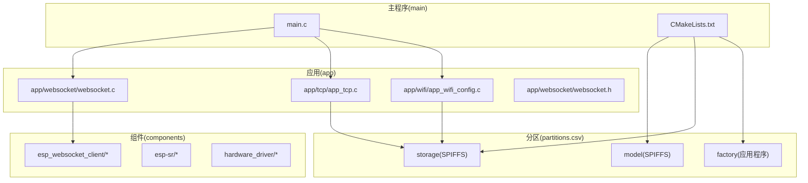
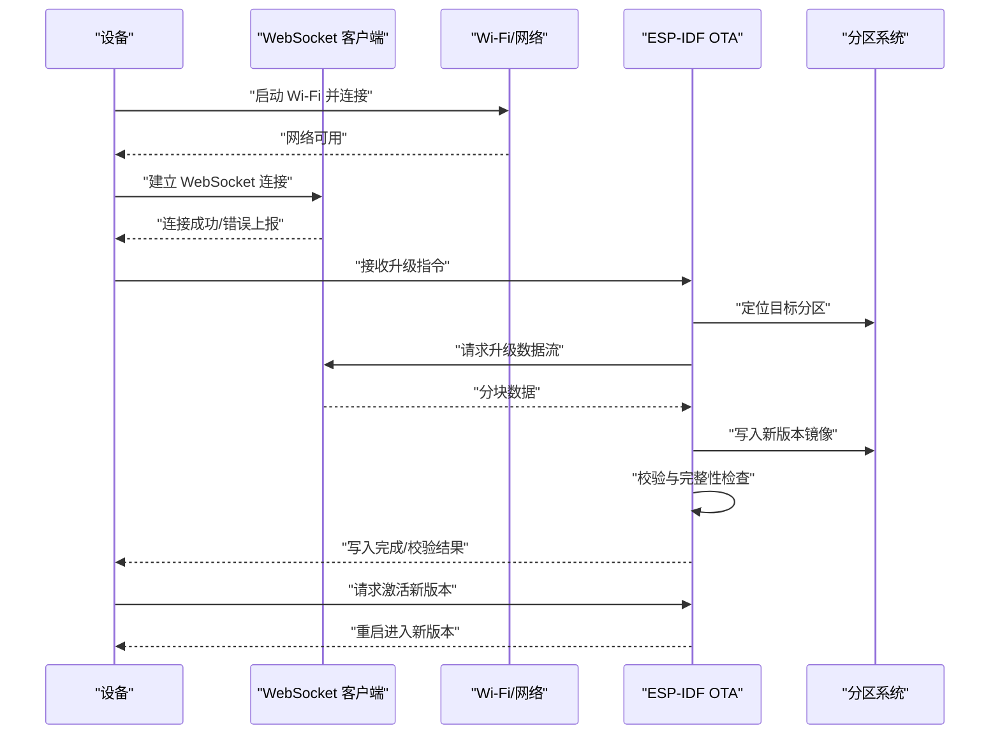
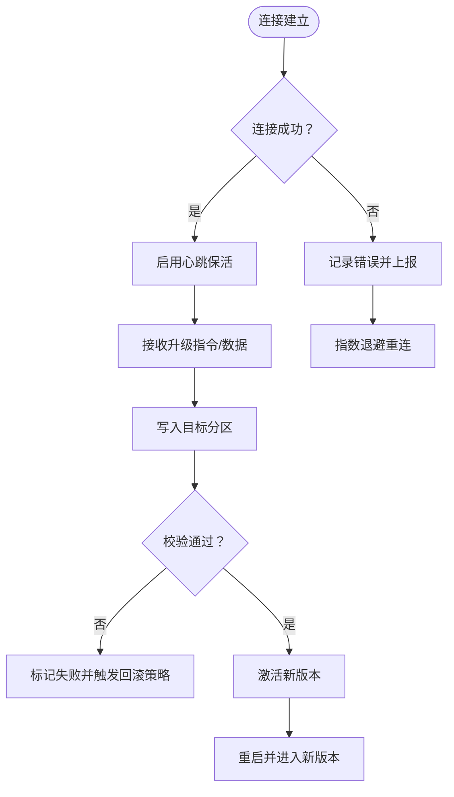
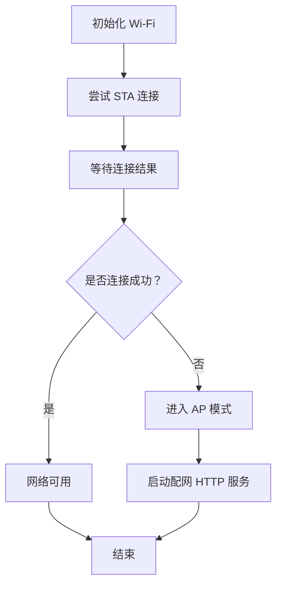
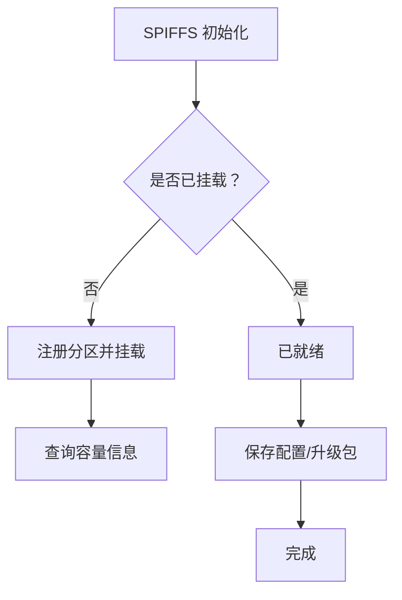
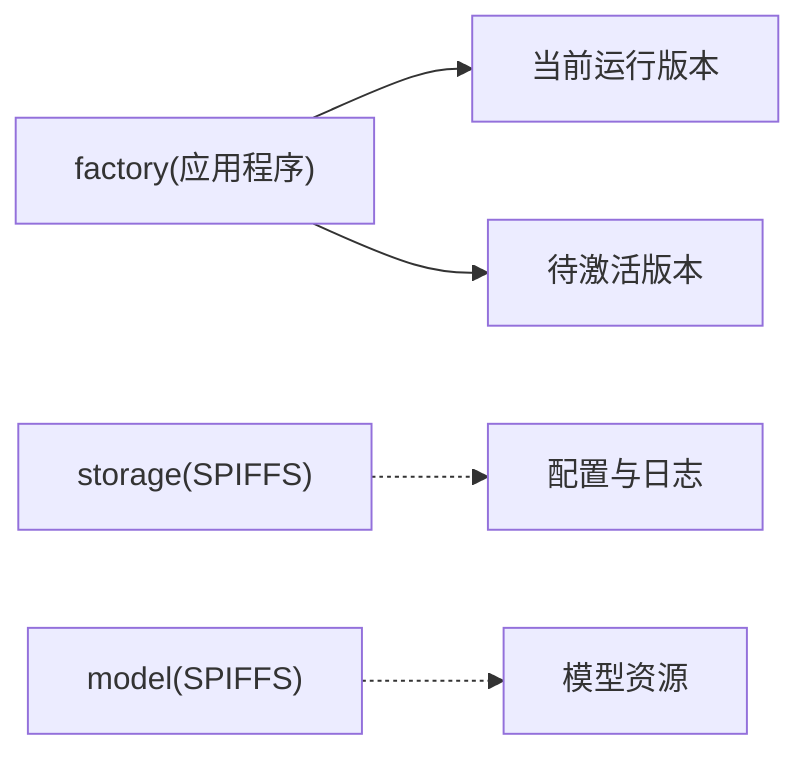
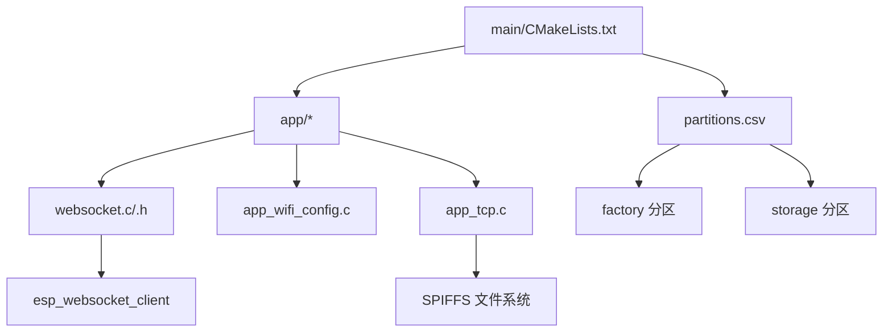

# OTA 升级机制

<cite>
**本文档引用的文件**
- [websocket.c](file://main/app/websocket/websocket.c)
- [websocket.h](file://main/app/websocket/websocket.h)
- [app_wifi_config.c](file://main/app/wifi/app_wifi_config.c)
- [app_tcp.c](file://main/app/tcp/app_tcp.c)
- [CMakeLists.txt](file://main/CMakeLists.txt)
- [partitions.csv](file://partitions.csv)
- [esp_ota_ops.c](file://build/esp-idf/app_update/CMakeFiles/__idf_app_update.dir/esp_ota_ops.c.obj)
- [esp_https_ota.c](file://build/esp-idf/esp_https_ota/CMakeFiles/__idf_esp_https_ota.dir/src/esp_https_ota.c.obj)
</cite>

## 目录
1. [引言](#引言)
2. [项目结构](#项目结构)
3. [核心组件](#核心组件)
4. [架构总览](#架构总览)
5. [详细组件分析](#详细组件分析)
6. [依赖关系分析](#依赖关系分析)
7. [性能考虑](#性能考虑)
8. [故障排查指南](#故障排查指南)
9. [结论](#结论)
10. [附录](#附录)

## 引言
本文件系统性阐述该 ESP-IDF 工程中的 OTA 升级机制，重点覆盖以下方面：
- 基于 TCP 与 WebSocket 的远程升级实现思路与集成点
- 升级包传输、校验与验证机制
- OTA 分区管理策略（引导程序配置与回滚）
- 升级过程的状态管理、进度反馈与错误处理
- 升级包制作、签名验证与安全传输最佳实践
- 升级失败后的恢复与降级策略

需要特别说明的是：当前仓库中未发现直接的“OTA 升级”源码实现文件；OTA 功能主要通过 ESP-IDF 提供的官方组件与分区布局实现。本文在不臆造事实的前提下，结合现有代码与 ESP-IDF 标准实践给出完整的技术文档。

## 项目结构
该项目采用 ESP-IDF 组件化组织方式，核心应用位于 main/ 目录，网络与通信相关模块分布在 app/ 子目录中。OTA 升级能力依赖于 ESP-IDF 的 app_update 与 esp_https_ota 组件，以及自定义的 WebSocket 客户端与 Wi-Fi 配网逻辑。

**图表来源**
- [CMakeLists.txt:1-4](file://main/CMakeLists.txt#L1-L4)
- [partitions.csv:1-6](file://partitions.csv#L1-L6)

**章节来源**
- [CMakeLists.txt:1-4](file://main/CMakeLists.txt#L1-L4)
- [partitions.csv:1-6](file://partitions.csv#L1-L6)

## 核心组件
- WebSocket 客户端：负责与云端或升级服务建立长连接，接收升级指令与数据流。
- Wi-Fi 配网：支持 STA/AP 双模式自动切换，确保网络可用性。
- SPIFFS 文件系统：用于存储配置与临时升级包（如需本地缓存）。
- ESP-IDF OTA 组件：app_update 与 esp_https_ota 提供底层升级能力。
- 分区表：定义 factory、storage、model 等分区，支撑 OTA 与模型资源管理。

**章节来源**
- [websocket.c:137-278](file://main/app/websocket/websocket.c#L137-L278)
- [app_wifi_config.c:265-302](file://main/app/wifi/app_wifi_config.c#L265-L302)
- [app_tcp.c:107-153](file://main/app/tcp/app_tcp.c#L107-L153)
- [partitions.csv:1-6](file://partitions.csv#L1-L6)

## 架构总览
OTA 升级的整体流程分为“连接建立—指令下发—数据传输—写入验证—激活切换—回滚保障”。下图展示从应用层到系统底层的关键交互：

**图表来源**
- [websocket.c:137-278](file://main/app/websocket/websocket.c#L137-L278)
- [app_wifi_config.c:265-302](file://main/app/wifi/app_wifi_config.c#L265-L302)
- [esp_ota_ops.c](file://build/esp-idf/app_update/CMakeFiles/__idf_app_update.dir/esp_ota_ops.c.obj)
- [esp_https_ota.c](file://build/esp-idf/esp_https_ota/CMakeFiles/__idf_esp_https_ota.dir/src/esp_https_ota.c.obj)

## 详细组件分析

### WebSocket 升级通道
- 连接管理：支持 SSL/TLS 传输、心跳保活、错误事件上报与指数退避重连。
- 事件驱动：统一事件处理器处理连接、断开、错误等状态转换。
- 数据收发：可作为升级数据流的承载通道，按块接收并交由 OTA 写入。

**图表来源**
- [websocket.c:137-278](file://main/app/websocket/websocket.c#L137-L278)
- [websocket.c:281-339](file://main/app/websocket/websocket.c#L281-L339)

**章节来源**
- [websocket.c:137-278](file://main/app/websocket/websocket.c#L137-L278)
- [websocket.c:351-400](file://main/app/websocket/websocket.c#L351-L400)
- [websocket.h:1-12](file://main/app/websocket/websocket.h#L1-L12)

### Wi-Fi 配网与网络可用性
- 自动模式切换：优先 STA 连接，失败则进入 AP 模式并启动 HTTP 配网服务。
- 超时控制：设定连接等待窗口，避免长时间阻塞。
- 重启触发：保存配网参数后主动重启，确保新网络配置生效。

**图表来源**
- [app_wifi_config.c:265-302](file://main/app/wifi/app_wifi_config.c#L265-L302)

**章节来源**
- [app_wifi_config.c:265-302](file://main/app/wifi/app_wifi_config.c#L265-L302)

### SPIFFS 与配置持久化
- SPIFFS 初始化：自动挂载指定分区，格式化失败时可选择重新格式。
- 配置存储：以 JSON 形式保存设置项，便于升级前后一致性维护。
- 升级包缓存：可选将升级包暂存于 SPIFFS，降低内存压力并支持断点续传。

**图表来源**
- [app_tcp.c:107-153](file://main/app/tcp/app_tcp.c#L107-L153)

**章节来源**
- [app_tcp.c:107-153](file://main/app/tcp/app_tcp.c#L107-L153)

### OTA 分区与回滚策略
- 分区布局：factory 为应用程序分区，storage 与 model 为 SPIFFS 分区。
- 回滚机制：通常通过“引导程序/固件元数据”记录当前版本与备用版本，失败时自动回切。
- 激活策略：升级完成后调用激活接口，重启后进入新版本。

**图表来源**
- [partitions.csv:1-6](file://partitions.csv#L1-L6)

**章节来源**
- [partitions.csv:1-6](file://partitions.csv#L1-L6)

## 依赖关系分析
- 应用层依赖：main/CMakeLists.txt 将 app/* 目录纳入构建，同时创建 SPIFFS 分区映像。
- 组件依赖：WebSocket 客户端依赖 esp_websocket_client；OTA 能力来自 ESP-IDF app_update 与 esp_https_ota。
- 分区依赖：factory 与 storage 分区由分区表定义，影响 OTA 与文件系统布局。

**图表来源**
- [CMakeLists.txt:1-4](file://main/CMakeLists.txt#L1-L4)
- [websocket.h:1-12](file://main/app/websocket/websocket.h#L1-L12)
- [partitions.csv:1-6](file://partitions.csv#L1-L6)

**章节来源**
- [CMakeLists.txt:1-4](file://main/CMakeLists.txt#L1-L4)
- [websocket.h:1-12](file://main/app/websocket/websocket.h#L1-L12)
- [partitions.csv:1-6](file://partitions.csv#L1-L6)

## 性能考虑
- 传输效率：WebSocket 支持长连接与心跳，适合持续数据流；建议按块传输并设置合理的缓冲区大小。
- 网络稳定性：在弱网环境下采用指数退避重连与断线重发，避免频繁重建连接。
- 写入性能：OTA 写入应尽量使用扇区对齐与顺序写入，减少擦写次数。
- 校验开销：SHA-256 或 CRC32 校验应在升级包下载阶段与写入阶段分别执行，确保完整性。
- 内存占用：升级过程中避免大对象驻留，及时释放临时缓冲区。

## 故障排查指南
- 连接失败
  - 检查证书与域名配置，确认 SSL/TLS 握手是否成功。
  - 查看错误事件类型与底层 TLS/Socket 错误码，定位网络问题。
- 升级中断
  - 观察写入进度与校验结果，若校验失败则触发回滚策略。
  - 检查目标分区剩余空间与文件系统状态。
- 回滚未生效
  - 确认引导程序配置与版本标记正确。
  - 复核激活流程与重启路径。

**章节来源**
- [websocket.c:247-263](file://main/app/websocket/websocket.c#L247-L263)

## 结论
本项目通过 Wi-Fi 配网、WebSocket 通道与 ESP-IDF OTA 组件的组合，提供了完整的远程升级能力。尽管当前仓库未包含具体的 OTA 升级实现代码，但结合分区布局、网络组件与 OTA 组件，可以构建出稳定、可回滚、具备进度与错误处理的 OTA 流程。建议在实际部署中补充升级包签名、传输加密与断点续传等增强功能，以进一步提升安全性与可靠性。

## 附录

### 升级包制作与签名验证最佳实践
- 制作流程
  - 使用 ESP-IDF 工具链生成 factory 镜像与 CSV/JSON 元数据。
  - 将升级包与校验值（如 SHA-256）打包为标准格式。
- 签名验证
  - 对升级包进行数字签名，设备侧加载公钥并验证签名。
  - 在写入前与写入后分别进行完整性校验。
- 安全传输
  - 使用 HTTPS/WSS 通道，强制证书校验与主机名校验。
  - 设置超时与重试上限，防止资源耗尽。

### 升级失败恢复与降级处理
- 自动回滚：若激活后检测到异常，引导程序自动回切至上一稳定版本。
- 手动降级：提供命令或开关允许用户选择降级到历史版本。
- 日志审计：记录升级时间、版本号、校验结果与错误码，便于追踪与复盘。