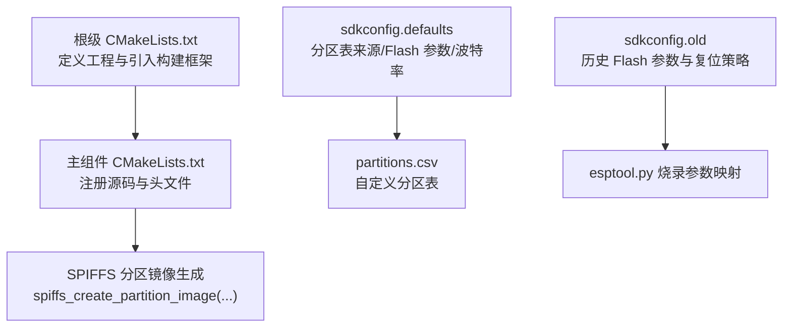
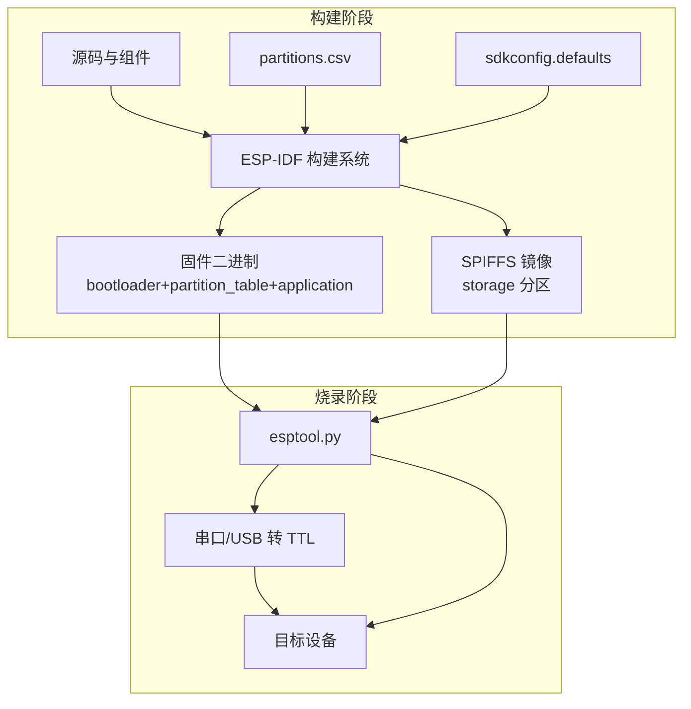
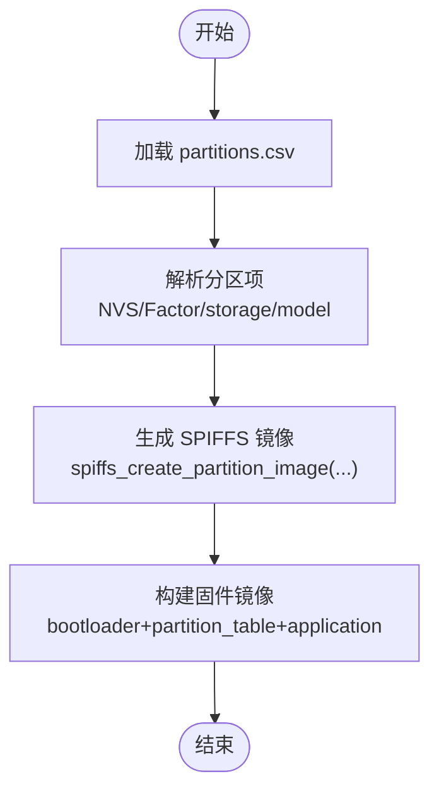
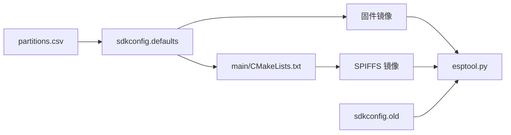

# 固件部署

<cite>
**本文引用的文件**
- [CMakeLists.txt](file://CMakeLists.txt)
- [main/CMakeLists.txt](file://main/CMakeLists.txt)
- [sdkconfig.defaults](file://sdkconfig.defaults)
- [sdkconfig.old](file://sdkconfig.old)
- [partitions.csv](file://partitions.csv)
</cite>

## 目录
1. [简介](#简介)
2. [项目结构](#项目结构)
3. [核心组件](#核心组件)
4. [架构总览](#架构总览)
5. [详细组件分析](#详细组件分析)
6. [依赖关系分析](#依赖关系分析)
7. [性能考虑](#性能考虑)
8. [故障排除指南](#故障排除指南)
9. [结论](#结论)
10. [附录](#附录)

## 简介
本指南面向使用 ESP-IDF 进行固件部署的工程师与测试人员，系统讲解从编译到烧录的完整流程，重点覆盖以下内容：
- 使用 ESP-IDF 构建系统与 esptool.py 常用命令及参数
- Flash 分区表的配置与管理（应用程序分区、SPIFFS 数据分区）
- 多设备批量烧录与自动化脚本建议
- 烧录失败的常见问题与排查方法

## 项目结构
本项目采用标准 ESP-IDF 工程布局，关键与“烧录”相关的文件如下：
- 根级构建入口：用于引入 ESP-IDF 提供的构建框架并定义工程名
- 主组件构建脚本：注册源码目录、头文件路径，并声明 SPIFFS 分区镜像生成
- 配置文件：包含分区表来源、Flash 参数、串口监视器波特率等
- 分区表：定义 NVS、Factory 应用、SPIFFS 存储与模型数据分区

图表来源
- [CMakeLists.txt:1-10](file://CMakeLists.txt#L1-L10)
- [main/CMakeLists.txt:1-4](file://main/CMakeLists.txt#L1-L4)
- [sdkconfig.defaults:5-139](file://sdkconfig.defaults#L5-L139)
- [sdkconfig.old:489-524](file://sdkconfig.old#L489-L524)
- [partitions.csv:1-6](file://partitions.csv#L1-L6)

章节来源
- [CMakeLists.txt:1-10](file://CMakeLists.txt#L1-L10)
- [main/CMakeLists.txt:1-4](file://main/CMakeLists.txt#L1-L4)
- [sdkconfig.defaults:5-139](file://sdkconfig.defaults#L5-L139)
- [sdkconfig.old:489-524](file://sdkconfig.old#L489-L524)
- [partitions.csv:1-6](file://partitions.csv#L1-L6)

## 核心组件
- 构建系统与工程入口
  - 根级 CMakeLists 引入 ESP-IDF 构建框架，定义工程名为 lightsaber
  - 通过 EXTRA_COMPONENT_DIRS 可扩展组件目录，便于集成第三方组件
- 主组件构建与 SPIFFS 镜像
  - 主组件注册多子模块源码目录与头文件目录
  - 通过 spiffs_create_partition_image(...) 在构建阶段生成 storage 分区镜像
- 分区表与 Flash 参数
  - sdkconfig.defaults 指定使用自定义分区表，文件名即 partitions.csv
  - partitions.csv 定义 NVS、Factory 应用、SPIFFS 存储与模型数据分区
  - sdkconfig.old 记录了历史 Flash 模式、频率、大小与复位策略，可作为参考或迁移依据

章节来源
- [CMakeLists.txt:1-10](file://CMakeLists.txt#L1-L10)
- [main/CMakeLists.txt:1-4](file://main/CMakeLists.txt#L1-L4)
- [sdkconfig.defaults:136-139](file://sdkconfig.defaults#L136-L139)
- [partitions.csv:1-6](file://partitions.csv#L1-L6)
- [sdkconfig.old:489-524](file://sdkconfig.old#L489-L524)

## 架构总览
下图展示从代码编译到固件烧录的关键环节与文件映射关系。

图表来源
- [CMakeLists.txt:1-10](file://CMakeLists.txt#L1-L10)
- [main/CMakeLists.txt:1-4](file://main/CMakeLists.txt#L1-L4)
- [sdkconfig.defaults:136-139](file://sdkconfig.defaults#L136-L139)
- [partitions.csv:1-6](file://partitions.csv#L1-L6)

## 详细组件分析

### 组件一：分区表与 SPIFFS 镜像
- 分区表定义
  - NVS 与 Factory 分区位于固定偏移处，分别用于存储配置与应用程序
  - SPIFFS 分区 storage 与 model 用于存放文件系统与模型资源
- SPIFFS 镜像生成
  - 在主组件构建脚本中调用 spiffs_create_partition_image(...)，将本地 spiffs 目录打包为 storage 分区镜像
  - 该镜像在烧录时与应用固件一同写入对应分区

图表来源
- [partitions.csv:1-6](file://partitions.csv#L1-L6)
- [main/CMakeLists.txt:1-4](file://main/CMakeLists.txt#L1-L4)

章节来源
- [partitions.csv:1-6](file://partitions.csv#L1-L6)
- [main/CMakeLists.txt:1-4](file://main/CMakeLists.txt#L1-L4)

### 组件二：Flash 参数与复位策略
- Flash 模式与频率
  - sdkconfig.defaults 指定 Flash 模式与频率，影响烧录速度与兼容性
  - sdkconfig.old 记录历史模式与频率，可用于对比与回退
- 复位策略
  - sdkconfig.old 中记录了烧录前后的复位行为，确保设备进入正确状态

章节来源
- [sdkconfig.defaults:74-78](file://sdkconfig.defaults#L74-L78)
- [sdkconfig.old:489-524](file://sdkconfig.old#L489-L524)

### 组件三：构建系统与工程入口
- 根级 CMakeLists
  - 引入 ESP-IDF 构建框架，定义工程名
  - 可通过 EXTRA_COMPONENT_DIRS 扩展组件目录
- 主组件 CMakeLists
  - 注册多模块源码与头文件目录
  - 生成 SPIFFS 分区镜像

章节来源
- [CMakeLists.txt:1-10](file://CMakeLists.txt#L1-L10)
- [main/CMakeLists.txt:1-4](file://main/CMakeLists.txt#L1-L4)

## 依赖关系分析
- 构建期依赖
  - partitions.csv 与 sdkconfig.defaults 决定分区布局与 Flash 参数
  - main/CMakeLists.txt 依赖 spiffs 目录生成 SPIFFS 镜像
- 烧录期依赖
  - esptool.py 读取 Flash 模式、频率与大小配置，结合分区表进行写入
  - 复位策略由 sdkconfig.old 提供参考

图表来源
- [sdkconfig.defaults:136-139](file://sdkconfig.defaults#L136-L139)
- [main/CMakeLists.txt:1-4](file://main/CMakeLists.txt#L1-L4)
- [partitions.csv:1-6](file://partitions.csv#L1-L6)
- [sdkconfig.old:489-524](file://sdkconfig.old#L489-L524)

章节来源
- [sdkconfig.defaults:136-139](file://sdkconfig.defaults#L136-L139)
- [main/CMakeLists.txt:1-4](file://main/CMakeLists.txt#L1-L4)
- [partitions.csv:1-6](file://partitions.csv#L1-L6)
- [sdkconfig.old:489-524](file://sdkconfig.old#L489-L524)

## 性能考虑
- Flash 模式与频率
  - 更高的 Flash 频率可提升烧录速度，但需确保硬件与驱动支持
- 分区布局
  - 合理分配 Factory 与 SPIFFS 分区大小，避免空间不足导致烧录失败
- 构建优化
  - 使用 Release 构建以获得更小体积与更高运行效率（在本仓库未见显式配置，按默认行为）

## 故障排除指南
- 烧录失败：设备无法进入下载模式
  - 检查复位策略与引脚连接，参考 sdkconfig.old 中的 before/after 行为
- 烧录失败：Flash 模式不匹配
  - 对比 sdkconfig.defaults 与 sdkconfig.old 的 Flash 模式与频率设置
- 烧录失败：分区表不一致
  - 确认 partitions.csv 与 sdkconfig.defaults 中的分区表路径一致
- 烧录失败：SPIFFS 写入异常
  - 检查 spiffs 目录是否存在且内容合理，确认镜像生成成功

章节来源
- [sdkconfig.old:489-524](file://sdkconfig.old#L489-L524)
- [sdkconfig.defaults:74-78](file://sdkconfig.defaults#L74-L78)
- [sdkconfig.defaults:136-139](file://sdkconfig.defaults#L136-L139)
- [partitions.csv:1-6](file://partitions.csv#L1-L6)

## 结论
本指南基于现有配置文件梳理了从编译到烧录的关键路径与注意事项。建议在实际部署中：
- 明确 Flash 模式与频率，确保与硬件匹配
- 严格维护分区表与 SPIFFS 镜像生成流程
- 建立多设备批量烧录与自动化脚本，提高效率与一致性

## 附录

### A. 从编译到烧录的完整步骤
- 准备工作
  - 确认已安装 ESP-IDF 并配置环境变量
  - 准备好 USB 转 TTL 串口线与目标设备
- 编译固件
  - 在工程根目录执行构建命令，生成 bootloader、partition_table 与 application
  - 同时生成 SPIFFS 镜像（storage 分区）
- 烧录固件
  - 使用 esptool.py 将上述镜像写入 Flash，遵循 Flash 模式、频率与大小配置
  - 若需要，先擦除目标分区再写入
- 验证结果
  - 通过串口监视器观察日志输出，确认应用正常启动

章节来源
- [CMakeLists.txt:1-10](file://CMakeLists.txt#L1-L10)
- [main/CMakeLists.txt:1-4](file://main/CMakeLists.txt#L1-L4)
- [sdkconfig.defaults:74-78](file://sdkconfig.defaults#L74-L78)
- [sdkconfig.defaults:136-139](file://sdkconfig.defaults#L136-L139)
- [partitions.csv:1-6](file://partitions.csv#L1-L6)

### B. esptool.py 常用命令与参数（基于仓库配置）
- 基本烧录命令
  - 写入 bootloader、partition_table 与 application
  - 擦除指定分区或全片擦除
- 关键参数
  - Flash 模式与频率：与 sdkconfig.defaults 中的配置保持一致
  - Flash 大小：与 sdkconfig.defaults 中的大小配置保持一致
  - 复位策略：与 sdkconfig.old 中的 before/after 行为保持一致
- 自动化建议
  - 将常用命令封装为脚本，统一参数与流程
  - 批量烧录时按设备列表循环执行，记录日志与结果

章节来源
- [sdkconfig.defaults:74-78](file://sdkconfig.defaults#L74-L78)
- [sdkconfig.defaults:136-139](file://sdkconfig.defaults#L136-L139)
- [sdkconfig.old:489-524](file://sdkconfig.old#L489-L524)

### C. 分区表配置要点
- NVS 分区
  - 用于存储配置与密钥等数据
- Factory 分区
  - 存放出厂固件镜像，容量应满足应用需求
- SPIFFS 分区（storage 与 model）
  - storage 用于用户文件系统
  - model 用于存放模型资源文件

章节来源
- [partitions.csv:1-6](file://partitions.csv#L1-L6)