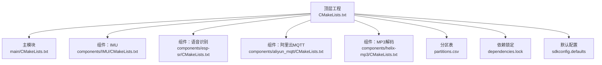
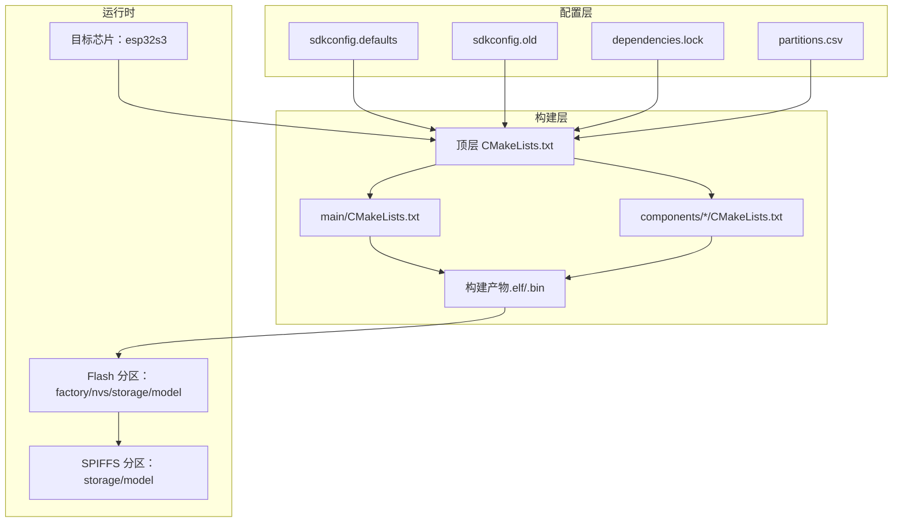
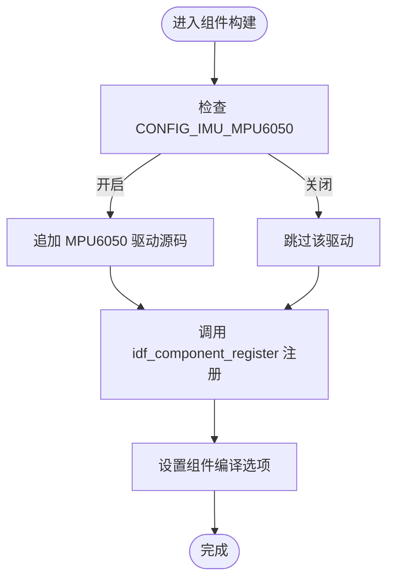
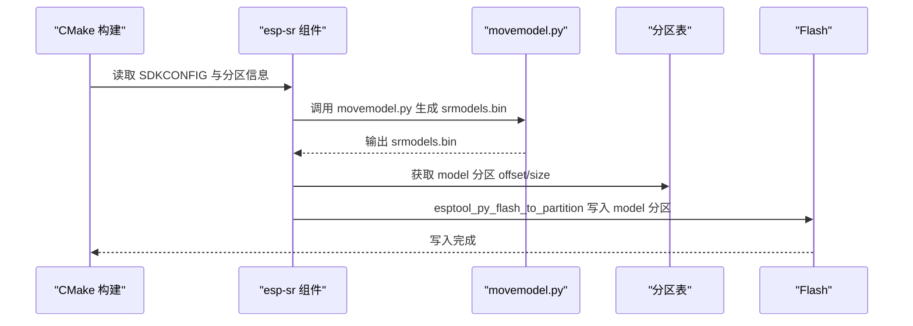
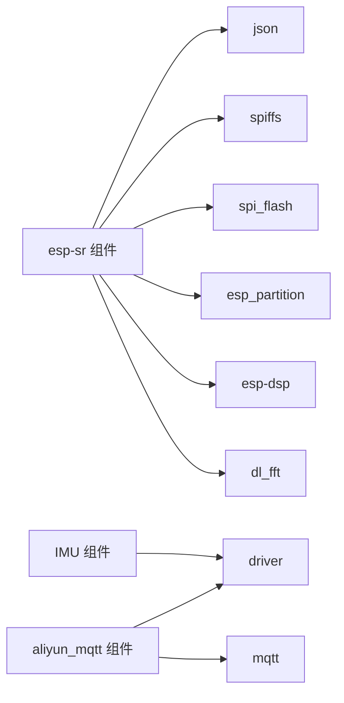

# 构建系统配置

<cite>
**本文引用的文件**   
- [CMakeLists.txt](file://CMakeLists.txt)
- [sdkconfig.defaults](file://sdkconfig.defaults)
- [sdkconfig.old](file://sdkconfig.old)
- [dependencies.lock](file://dependencies.lock)
- [partitions.csv](file://partitions.csv)
- [main/CMakeLists.txt](file://main/CMakeLists.txt)
- [components/IMU/CMakeLists.txt](file://components/IMU/CMakeLists.txt)
- [components/esp-sr/CMakeLists.txt](file://components/esp-sr/CMakeLists.txt)
- [components/aliyun_mqtt/CMakeLists.txt](file://components/aliyun_mqtt/CMakeLists.txt)
- [components/helix-mp3/CMakeLists.txt](file://components/helix-mp3/CMakeLists.txt)
</cite>

## 目录
1. [简介](#简介)
2. [项目结构](#项目结构)
3. [核心组件](#核心组件)
4. [架构总览](#架构总览)
5. [详细组件分析](#详细组件分析)
6. [依赖关系分析](#依赖关系分析)
7. [性能与优化](#性能与优化)
8. [故障排查指南](#故障排查指南)
9. [结论](#结论)
10. [附录](#附录)

## 简介
本文件面向构建系统配置，围绕 ESP-IDF 项目的 CMake 构建体系与 sdkconfig.defaults 配置展开，系统性说明以下内容：
- 编译器设置、链接器参数与目标平台配置
- sdkconfig.defaults 中的关键配置项：内存分配、功能开关、性能优化
- 组件级依赖管理、模型打包与 SPIFFS 分区集成
- 不同构建模式（Debug/Release）的差异与适用场景
- 常见构建问题的诊断与解决思路

## 项目结构
该项目采用 ESP-IDF 的标准工程布局，顶层通过 CMakeLists.txt 引入 ESP-IDF 的构建框架，并在 components/ 与 main/ 下组织应用与组件代码。构建产物由主工程与多个子组件共同生成，最终写入分区表指定的区域。

**图示来源**
- [CMakeLists.txt:1-10](file://CMakeLists.txt#L1-L10)
- [main/CMakeLists.txt:1-4](file://main/CMakeLists.txt#L1-L4)
- [components/IMU/CMakeLists.txt:1-28](file://components/IMU/CMakeLists.txt#L1-L28)
- [components/esp-sr/CMakeLists.txt:1-102](file://components/esp-sr/CMakeLists.txt#L1-L102)
- [components/aliyun_mqtt/CMakeLists.txt:1-9](file://components/aliyun_mqtt/CMakeLists.txt#L1-L9)
- [components/helix-mp3/CMakeLists.txt:1-31](file://components/helix-mp3/CMakeLists.txt#L1-L31)
- [partitions.csv:1-6](file://partitions.csv#L1-L6)
- [dependencies.lock:1-33](file://dependencies.lock#L1-L33)
- [sdkconfig.defaults:1-527](file://sdkconfig.defaults#L1-L527)

**章节来源**
- [CMakeLists.txt:1-10](file://CMakeLists.txt#L1-L10)
- [main/CMakeLists.txt:1-4](file://main/CMakeLists.txt#L1-L4)
- [partitions.csv:1-6](file://partitions.csv#L1-L6)

## 核心组件
- 顶层工程配置
  - 使用 ESP-IDF 的 project.cmake 框架，设置额外组件目录与通用编译选项，指定工程名为 lightsaber。
  - 参考路径：[CMakeLists.txt:1-10](file://CMakeLists.txt#L1-L10)

- 主模块 main
  - 通过 idf_component_register 聚合多目录源码与头文件路径，并注册 SPIFFS 分区映像生成任务。
  - 参考路径：[main/CMakeLists.txt:1-4](file://main/CMakeLists.txt#L1-L4)

- 组件 IMU
  - 根据 sdkconfig.defaults 中的 CONFIG_IMU_MPU6050 开关动态选择驱动源码；声明基础依赖 driver 并抑制特定格式化告警。
  - 参考路径：[components/IMU/CMakeLists.txt:1-28](file://components/IMU/CMakeLists.txt#L1-L28)，[sdkconfig.defaults:526-527](file://sdkconfig.defaults#L526-L527)

- 组件 语音识别（esp-sr）
  - 针对多芯片族（esp32s3/esp32p4/esp32/esp32c3/c5/c6/s2）设置包含目录与源码集合；链接预编译库（如 dl_lib、multinet、vadnet、nsnet 等），并使用 esp-dsp 与 dl_fft 组件库；根据分区表生成 srmodels.bin 并写入 model 分区。
  - 参考路径：[components/esp-sr/CMakeLists.txt:1-102](file://components/esp-sr/CMakeLists.txt#L1-L102)

- 组件 阿里云MQTT
  - 以 driver 与 mqtt 作为公共依赖，提供阿里云 MQTT 封装接口。
  - 参考路径：[components/aliyun_mqtt/CMakeLists.txt:1-9](file://components/aliyun_mqtt/CMakeLists.txt#L1-L9)

- 组件 MP3 解码（helix-mp3）
  - 定义公开依赖 helix_mp3，并收集内部源码与头文件路径；当前未直接注册为可编译组件。
  - 参考路径：[components/helix-mp3/CMakeLists.txt:1-31](file://components/helix-mp3/CMakeLists.txt#L1-L31)

**章节来源**
- [CMakeLists.txt:1-10](file://CMakeLists.txt#L1-L10)
- [main/CMakeLists.txt:1-4](file://main/CMakeLists.txt#L1-L4)
- [components/IMU/CMakeLists.txt:1-28](file://components/IMU/CMakeLists.txt#L1-L28)
- [components/esp-sr/CMakeLists.txt:1-102](file://components/esp-sr/CMakeLists.txt#L1-L102)
- [components/aliyun_mqtt/CMakeLists.txt:1-9](file://components/aliyun_mqtt/CMakeLists.txt#L1-L9)
- [components/helix-mp3/CMakeLists.txt:1-31](file://components/helix-mp3/CMakeLists.txt#L1-L31)

## 架构总览
下图展示从配置到产物的构建链路：sdkconfig.defaults 决定编译宏与功能开关；CMakeLists.txt 与各组件 CMakeLists.txt 组织源码与依赖；最终生成固件镜像并写入分区表指定区域。

**图示来源**
- [sdkconfig.defaults:1-527](file://sdkconfig.defaults#L1-L527)
- [sdkconfig.old:1-800](file://sdkconfig.old#L1-L800)
- [dependencies.lock:1-33](file://dependencies.lock#L1-L33)
- [partitions.csv:1-6](file://partitions.csv#L1-L6)
- [CMakeLists.txt:1-10](file://CMakeLists.txt#L1-L10)
- [main/CMakeLists.txt:1-4](file://main/CMakeLists.txt#L1-L4)
- [components/esp-sr/CMakeLists.txt:77-101](file://components/esp-sr/CMakeLists.txt#L77-L101)

## 详细组件分析

### 组件 IMU：基于 CONFIG_IMU_MPU6050 的条件编译
- 功能要点
  - 依据 sdkconfig.defaults 中的 IMU 配置项，动态拼接驱动源码列表。
  - 通过 idf_component_register 暴露核心头文件与驱动头文件路径，声明对 driver 的依赖。
  - 对组件私有目标启用编译选项以抑制特定告警。
- 关键路径
  - 条件选择与注册：[components/IMU/CMakeLists.txt:5-26](file://components/IMU/CMakeLists.txt#L5-L26)
  - 配置项来源：[sdkconfig.defaults:526-527](file://sdkconfig.defaults#L526-L527)

**图示来源**
- [components/IMU/CMakeLists.txt:5-26](file://components/IMU/CMakeLists.txt#L5-L26)
- [sdkconfig.defaults:526-527](file://sdkconfig.defaults#L526-L527)

**章节来源**
- [components/IMU/CMakeLists.txt:1-28](file://components/IMU/CMakeLists.txt#L1-L28)
- [sdkconfig.defaults:526-527](file://sdkconfig.defaults#L526-L527)

### 组件 语音识别（esp-sr）：模型打包与库链接
- 功能要点
  - 针对多芯片族设置包含目录与源码集合，链接预编译库（如 dl_lib、multinet、vadnet、nsnet、fst、flite_g2p、esp_tts_chinese 等）。
  - 通过 esp-dsp 与 dl_fft 组件库进行加速与FFT计算。
  - 使用自定义命令生成 srmodels.bin 并写入 model 分区。
- 关键路径
  - 库链接与条件判断：[components/esp-sr/CMakeLists.txt:15-73](file://components/esp-sr/CMakeLists.txt#L15-L73)
  - 模型打包与分区写入：[components/esp-sr/CMakeLists.txt:77-101](file://components/esp-sr/CMakeLists.txt#L77-L101)

**图示来源**
- [components/esp-sr/CMakeLists.txt:77-101](file://components/esp-sr/CMakeLists.txt#L77-L101)
- [partitions.csv:1-6](file://partitions.csv#L1-L6)

**章节来源**
- [components/esp-sr/CMakeLists.txt:1-102](file://components/esp-sr/CMakeLists.txt#L1-L102)

### 组件 阿里云MQTT：依赖与接口封装
- 功能要点
  - 以 driver 与 mqtt 作为公共依赖，提供阿里云 MQTT 封装接口，便于上层业务模块复用。
- 关键路径
  - 依赖声明与注册：[components/aliyun_mqtt/CMakeLists.txt:1-9](file://components/aliyun_mqtt/CMakeLists.txt#L1-L9)

**章节来源**
- [components/aliyun_mqtt/CMakeLists.txt:1-9](file://components/aliyun_mqtt/CMakeLists.txt#L1-L9)

### 组件 MP3 解码（helix-mp3）：公开依赖与源码收集
- 功能要点
  - 定义公开依赖 helix_mp3，并收集内部源码与头文件路径；当前未直接注册为可编译组件。
- 关键路径
  - 公开依赖与源码收集：[components/helix-mp3/CMakeLists.txt:1-31](file://components/helix-mp3/CMakeLists.txt#L1-L31)

**章节来源**
- [components/helix-mp3/CMakeLists.txt:1-31](file://components/helix-mp3/CMakeLists.txt#L1-L31)

## 依赖关系分析
- 组件间依赖
  - IMU 依赖 driver
  - esp-sr 依赖 json、spiffs、spi_flash、esp_partition（IDF 版本大于 4）、esp-dsp、dl_fft 等
  - ali_mqtt 依赖 driver、mqtt
- 外部依赖
  - 通过 dependencies.lock 锁定组件版本与来源，确保可复现构建
- 分区与存储
  - partitions.csv 定义 nvs/factory/storage/model 等分区；main/CMakeLists.txt 生成 storage 分区映像

**图示来源**
- [components/IMU/CMakeLists.txt:25](file://components/IMU/CMakeLists.txt#L25)
- [components/esp-sr/CMakeLists.txt:15-27](file://components/esp-sr/CMakeLists.txt#L15-L27)
- [components/aliyun_mqtt/CMakeLists.txt:6-8](file://components/aliyun_mqtt/CMakeLists.txt#L6-L8)
- [dependencies.lock:1-33](file://dependencies.lock#L1-L33)

**章节来源**
- [components/IMU/CMakeLists.txt:25](file://components/IMU/CMakeLists.txt#L25)
- [components/esp-sr/CMakeLists.txt:15-27](file://components/esp-sr/CMakeLists.txt#L15-L27)
- [components/aliyun_mqtt/CMakeLists.txt:6-8](file://components/aliyun_mqtt/CMakeLists.txt#L6-L8)
- [dependencies.lock:1-33](file://dependencies.lock#L1-L33)

## 性能与优化
- 编译器与优化
  - 默认启用性能优先的优化级别与断言控制，适合 Release 场景；可通过 sdkconfig.defaults 调整断言与优化等级。
  - 参考路径：[sdkconfig.defaults:81](file://sdkconfig.defaults#L81)，[sdkconfig.defaults:172-175](file://sdkconfig.defaults#L172-L175)
- 内存与缓存
  - 启用 SPIRAM 支持与 fetch/instruction/rodata 优化，提升运行时性能；同时配置 PSRAM IO/时钟等参数。
  - 参考路径：[sdkconfig.defaults:82-87](file://sdkconfig.defaults#L82-L87)，[sdkconfig.defaults:390-396](file://sdkconfig.defaults#L390-L396)
- 网络与任务栈
  - TCP/IP 接收队列、缓冲区大小与线程亲和性等参数影响网络吞吐与稳定性。
  - 参考路径：[sdkconfig.defaults:497-501](file://sdkconfig.defaults#L497-L501)，[sdkconfig.defaults:100](file://sdkconfig.defaults#L100)
- 语音识别与音频处理
  - 通过链接 esp-dsp 与 dl_fft 加速 FFT 与信号处理；模型按需打包至 model 分区。
  - 参考路径：[components/esp-sr/CMakeLists.txt:45-51](file://components/esp-sr/CMakeLists.txt#L45-L51)，[components/esp-sr/CMakeLists.txt:77-101](file://components/esp-sr/CMakeLists.txt#L77-L101)

**章节来源**
- [sdkconfig.defaults:81](file://sdkconfig.defaults#L81)
- [sdkconfig.defaults:172-175](file://sdkconfig.defaults#L172-L175)
- [sdkconfig.defaults:82-87](file://sdkconfig.defaults#L82-L87)
- [sdkconfig.defaults:390-396](file://sdkconfig.defaults#L390-L396)
- [sdkconfig.defaults:497-501](file://sdkconfig.defaults#L497-L501)
- [sdkconfig.defaults:100](file://sdkconfig.defaults#L100)
- [components/esp-sr/CMakeLists.txt:45-51](file://components/esp-sr/CMakeLists.txt#L45-L51)
- [components/esp-sr/CMakeLists.txt:77-101](file://components/esp-sr/CMakeLists.txt#L77-L101)

## 故障排查指南
- 无法找到 model 分区导致模型写入失败
  - 现象：构建日志提示找不到 model 分区或写入失败
  - 排查：确认 partitions.csv 是否包含 model 分区；确认 CONFIG_PARTITION_TABLE_CUSTOM 已启用
  - 参考路径：[components/esp-sr/CMakeLists.txt:78-100](file://components/esp-sr/CMakeLists.txt#L78-L100)，[partitions.csv:1-6](file://partitions.csv#L1-L6)
- 未满足依赖导致链接错误
  - 现象：链接阶段缺少符号或库
  - 排查：核对 dependencies.lock 与组件 REQUIRES 列表；确认 esp-dsp、dl_fft、json、spiffs、spi_flash、esp_partition 等是否正确引入
  - 参考路径：[dependencies.lock:1-33](file://dependencies.lock#L1-L33)，[components/esp-sr/CMakeLists.txt:15-27](file://components/esp-sr/CMakeLists.txt#L15-L27)
- IMU 驱动未编译
  - 现象：编译无对应驱动源码
  - 排查：确认 sdkconfig.defaults 中 CONFIG_IMU_MPU6050 是否启用
  - 参考路径：[components/IMU/CMakeLists.txt:6](file://components/IMU/CMakeLists.txt#L6)，[sdkconfig.defaults:526-527](file://sdkconfig.defaults#L526-L527)
- SPIFFS 分区映像未生成
  - 现象：storage 分区为空或不可用
  - 排查：确认 main/CMakeLists.txt 中已调用 spiffs_create_partition_image
  - 参考路径：[main/CMakeLists.txt:4](file://main/CMakeLists.txt#L4)

**章节来源**
- [components/esp-sr/CMakeLists.txt:78-100](file://components/esp-sr/CMakeLists.txt#L78-L100)
- [partitions.csv:1-6](file://partitions.csv#L1-L6)
- [dependencies.lock:1-33](file://dependencies.lock#L1-L33)
- [components/esp-sr/CMakeLists.txt:15-27](file://components/esp-sr/CMakeLists.txt#L15-L27)
- [components/IMU/CMakeLists.txt:6](file://components/IMU/CMakeLists.txt#L6)
- [sdkconfig.defaults:526-527](file://sdkconfig.defaults#L526-L527)
- [main/CMakeLists.txt:4](file://main/CMakeLists.txt#L4)

## 结论
本项目通过 sdkconfig.defaults 明确目标平台与功能开关，借助 CMakeLists.txt 实现组件级条件编译与依赖链接，并结合分区表与 SPIFFS 机制实现数据与模型的持久化部署。针对性能与稳定性，建议在 Release 模式下保持默认优化与断言策略，在 Debug 模式下适度放宽断言与日志级别以提升调试效率。对于依赖缺失、分区配置不当等问题，应优先核对 dependencies.lock、partitions.csv 与各组件的 REQUIRES 设置。

## 附录
- 构建模式差异与建议
  - Debug：启用更多断言与调试输出，便于定位问题；适合开发与联调阶段
  - Release：启用性能优化与断言控制，减少体积与功耗；适合发布与长期运行
  - 参考路径：[sdkconfig.defaults:81](file://sdkconfig.defaults#L81)，[sdkconfig.defaults:172-175](file://sdkconfig.defaults#L172-L175)
- 目标平台与工具链
  - 目标芯片：esp32s3；闪存频率与模式：QIO 120MHz；CPU 频率：240MHz
  - 参考路径：[sdkconfig.defaults:74-88](file://sdkconfig.defaults#L74-L88)，[sdkconfig.defaults:495-506](file://sdkconfig.defaults#L495-L506)

**章节来源**
- [sdkconfig.defaults:81](file://sdkconfig.defaults#L81)
- [sdkconfig.defaults:172-175](file://sdkconfig.defaults#L172-L175)
- [sdkconfig.defaults:74-88](file://sdkconfig.defaults#L74-L88)
- [sdkconfig.defaults:495-506](file://sdkconfig.defaults#L495-L506)