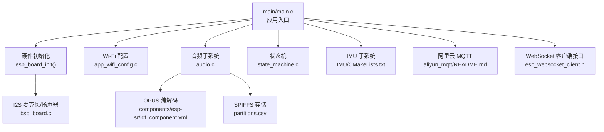
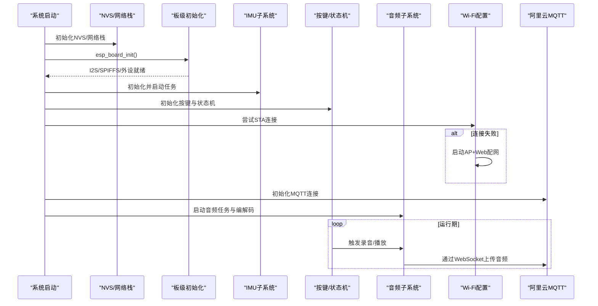
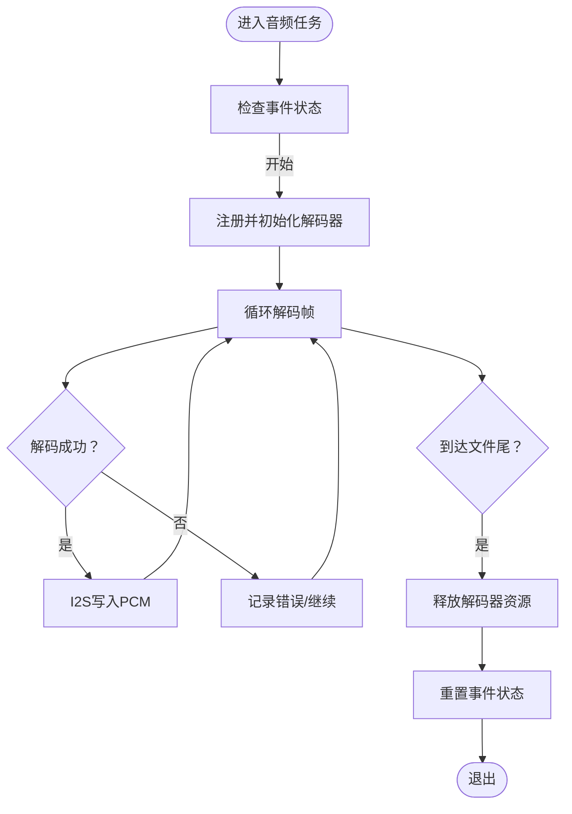
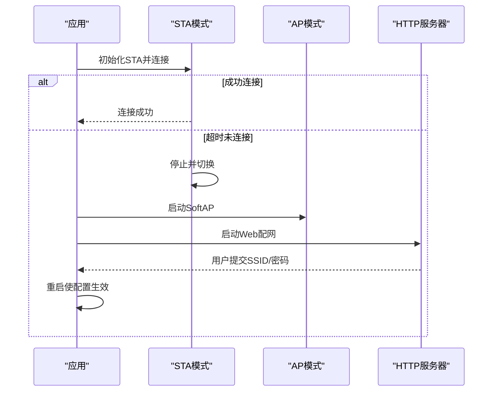
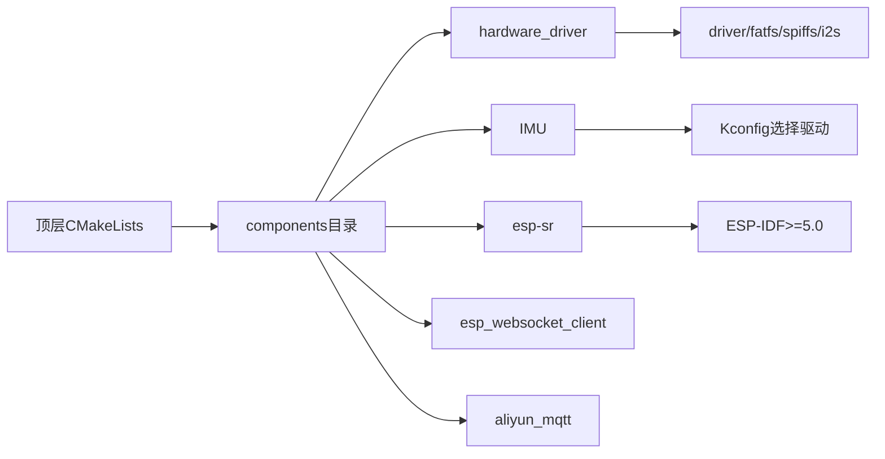

# 生产环境部署

<cite>
**本文档引用的文件**
- [CMakeLists.txt](file://CMakeLists.txt)
- [sdkconfig.defaults](file://sdkconfig.defaults)
- [main.c](file://main/main.c)
- [bsp_board.c](file://components/hardware_driver/boards/esp32-s3/bsp_board.c)
- [CMakeLists.txt](file://components/hardware_driver/CMakeLists.txt)
- [CMakeLists.txt](file://components/IMU/CMakeLists.txt)
- [imu_selector.h](file://components/IMU/imu_selector.h)
- [partitions.csv](file://partitions.csv)
- [audio.c](file://main/app/audio/audio.c)
- [app_wifi_config.c](file://main/app/wifi/app_wifi_config.c)
- [state_machine.c](file://main/app/state_machine/state_machine.c)
- [esp_websocket_client.h](file://components/esp_websocket_client/esp_websocket_client.h)
- [idf_component.yml](file://components/esp-sr/idf_component.yml)
- [README.md](file://components/aliyun_mqtt/README.md)
</cite>

## 目录
1. [简介](#简介)
2. [项目结构](#项目结构)
3. [核心组件](#核心组件)
4. [架构总览](#架构总览)
5. [详细组件分析](#详细组件分析)
6. [依赖关系分析](#依赖关系分析)
7. [性能考虑](#性能考虑)
8. [故障排查指南](#故障排查指南)
9. [结论](#结论)
10. [附录](#附录)

## 简介
本指南面向生产环境部署，围绕硬件配置、软件优化、质量保证流程、量产测试、环境适应性测试、产品认证与合规、批次管理与序列号跟踪、售后服务支持等方面，结合仓库现有代码结构与配置，给出可落地的实施方案。目标是帮助团队在保证稳定性与可维护性的前提下，高效、高质量地完成产品化交付。

## 项目结构
项目采用 ESP-IDF 工程组织方式，顶层通过 CMakeLists 管理构建；主要业务位于 main 目录，硬件抽象层与驱动位于 components 目录。关键特性包括：
- 音频子系统：基于 I2S 的录音、播放、OPUS 编解码与 WebSocket 传输
- Wi-Fi 配置：STA/AP 自动切换、Web 配网、NVS 存储
- 状态机：按键触发录音事件流
- IMU：Madgwick AHRS 与传感器驱动选择
- 云端通信：阿里云 MQTT 组件
- 硬件板级支持：ESP32-S3 平台的 I2S、SPIFFS、按键、LED 等

图表来源
- [main.c:33-59](file://main/main.c#L33-L59)
- [bsp_board.c:169-175](file://components/hardware_driver/boards/esp32-s3/bsp_board.c#L169-L175)
- [app_wifi_config.c:265-302](file://main/app/wifi/app_wifi_config.c#L265-L302)
- [audio.c:699-800](file://main/app/audio/audio.c#L699-L800)
- [CMakeLists.txt:1-28](file://components/IMU/CMakeLists.txt#L1-L28)
- [CMakeLists.txt:1-18](file://components/hardware_driver/CMakeLists.txt#L1-L18)
- [partitions.csv:1-6](file://partitions.csv#L1-L6)
- [esp_websocket_client.h:1-482](file://components/esp_websocket_client/esp_websocket_client.h#L1-L482)
- [idf_component.yml:1-13](file://components/esp-sr/idf_component.yml#L1-L13)
- [README.md:1-39](file://components/aliyun_mqtt/README.md#L1-L39)

章节来源
- [CMakeLists.txt:1-10](file://CMakeLists.txt#L1-L10)
- [main.c:33-59](file://main/main.c#L33-L59)

## 核心组件
- 硬件驱动与板级支持：负责 I2S、SPIFFS、GPIO 等底层初始化与抽象，确保音频与外设能力可用
- 音频子系统：封装录音、播放、OPUS 编解码、WebSocket 传输与环形缓冲区管理
- Wi-Fi 配置：STA/AP 自动切换、Web 配网页面、NVS 存储
- 状态机：按键事件驱动录音生命周期管理
- IMU 子系统：根据 Kconfig 选择驱动，提供姿态解算
- 云端通信：阿里云 MQTT 组件，提供连接、事件回调与数据通道
- 分区表：定义 NVS、Factory、SPIFFS、模型分区布局

章节来源
- [bsp_board.c:169-175](file://components/hardware_driver/boards/esp32-s3/bsp_board.c#L169-L175)
- [audio.c:699-800](file://main/app/audio/audio.c#L699-L800)
- [app_wifi_config.c:265-302](file://main/app/wifi/app_wifi_config.c#L265-L302)
- [state_machine.c:24-35](file://main/app/state_machine/state_machine.c#L24-L35)
- [CMakeLists.txt:1-28](file://components/IMU/CMakeLists.txt#L1-L28)
- [README.md:1-39](file://components/aliyun_mqtt/README.md#L1-L39)
- [partitions.csv:1-6](file://partitions.csv#L1-L6)

## 架构总览
系统启动顺序与关键模块交互如下：

图表来源
- [main.c:33-59](file://main/main.c#L33-L59)
- [bsp_board.c:169-175](file://components/hardware_driver/boards/esp32-s3/bsp_board.c#L169-L175)
- [app_wifi_config.c:265-302](file://main/app/wifi/app_wifi_config.c#L265-L302)
- [state_machine.c:83-115](file://main/app/state_machine/state_machine.c#L83-L115)
- [audio.c:699-800](file://main/app/audio/audio.c#L699-L800)
- [README.md:21-29](file://components/aliyun_mqtt/README.md#L21-L29)

## 详细组件分析

### 硬件与板级支持（ESP32-S3）
- I2S 麦克风与扬声器通道初始化，配置采样率、位宽、字时钟与 GPIO 引脚
- SPIFFS 挂载与容量查询，支持格式化选项
- 作为音频子系统的基础设施，保障录音与播放链路

章节来源
- [bsp_board.c:22-104](file://components/hardware_driver/boards/esp32-s3/bsp_board.c#L22-L104)
- [bsp_board.c:130-160](file://components/hardware_driver/boards/esp32-s3/bsp_board.c#L130-L160)
- [CMakeLists.txt:1-18](file://components/hardware_driver/CMakeLists.txt#L1-L18)

### 音频子系统（录音/播放/编解码/传输）
- OPUS 编码与解码：封装编码器/解码器注册、初始化与帧处理
- I2S 读写：录音 PCM 数据写入缓冲区，播放时从缓冲区读取
- WebSocket 传输：通过帧头协议封装 OPUS 数据，支持分片与序列号
- 环形缓冲区与互斥量：保证多任务并发安全
- SPIFFS 音乐播放：支持 MP3/Opus 文件播放

图表来源
- [audio.c:621-697](file://main/app/audio/audio.c#L621-L697)

章节来源
- [audio.c:699-800](file://main/app/audio/audio.c#L699-L800)
- [audio.c:399-550](file://main/app/audio/audio.c#L399-L550)
- [audio.c:112-205](file://main/app/audio/audio.c#L112-L205)
- [audio.c:211-308](file://main/app/audio/audio.c#L211-L308)

### Wi-Fi 配置与自动切换
- STA 模式优先：读取 NVS 中保存的 SSID/密码，尝试连接
- 超时未连则进入 AP 模式：启动 SoftAP 与 HTTP 服务，提供 Web 配网页面
- 保存配置后重启生效

图表来源
- [app_wifi_config.c:265-302](file://main/app/wifi/app_wifi_config.c#L265-L302)

章节来源
- [app_wifi_config.c:265-302](file://main/app/wifi/app_wifi_config.c#L265-L302)

### 状态机与按键事件
- 事件队列驱动状态流转：IDLE → RECORDING → IDLE
- 录音开始/结束消息通过 WebSocket 上报
- 支持按键按下开始录音、松开结束录音

章节来源
- [state_machine.c:24-35](file://main/app/state_machine/state_machine.c#L24-L35)
- [state_machine.c:83-115](file://main/app/state_machine/state_machine.c#L83-L115)

### IMU 子系统
- 根据 Kconfig 选择驱动（如 MPU6050 或 ICM20948）
- 提供驱动实例获取接口，便于上层统一调用

章节来源
- [CMakeLists.txt:1-28](file://components/IMU/CMakeLists.txt#L1-L28)
- [imu_selector.h:1-14](file://components/IMU/imu_selector.h#L1-L14)

### 云端通信（阿里云 MQTT）
- 组件说明：提供与阿里云物联网平台连接、事件回调与数据通道
- 建议在应用层实现重连策略与鉴权信息保护

章节来源
- [README.md:1-39](file://components/aliyun_mqtt/README.md#L1-L39)

### 分区表与存储
- NVS/Factory/SPIFFS/Model 分区布局清晰，满足配置、固件、文件系统与模型存储需求

章节来源
- [partitions.csv:1-6](file://partitions.csv#L1-L6)

## 依赖关系分析
- 构建系统：顶层 CMakeLists 指定 EXTRA_COMPONENT_DIRS，引入示例组件与 components 目录
- 组件依赖：硬件驱动依赖 driver/fatfs/spiffs/i2s；IMU 根据 Kconfig 动态选择驱动源；esp-sr 作为语音识别算法组件
- 配置开关：sdkconfig.defaults 控制目标芯片、SPIRAM、WIFI、TCP/IP、LVGL 等关键选项

图表来源
- [CMakeLists.txt:5-6](file://CMakeLists.txt#L5-L6)
- [CMakeLists.txt:10-15](file://components/hardware_driver/CMakeLists.txt#L10-L15)
- [CMakeLists.txt:19-26](file://components/IMU/CMakeLists.txt#L19-L26)
- [idf_component.yml:4-7](file://components/esp-sr/idf_component.yml#L4-L7)

章节来源
- [CMakeLists.txt:1-10](file://CMakeLists.txt#L1-L10)
- [sdkconfig.defaults:74-133](file://sdkconfig.defaults#L74-L133)

## 性能考虑
- CPU 频率与缓存：默认 240MHz，启用内部缓存与 IRAM 优化，有利于实时音频处理
- 内存与 PSRAM：启用 SPIRAM 并在音频路径使用 EXT_RAM/BSS_ATTR，降低主 RAM 压力
- Wi-Fi 优化：启用 AMPDU/BA 窗口、WPA3/WPA3-SAE，提升吞吐与安全性
- 任务与队列：音频编解码、WebSocket、状态机均采用独立任务与队列，避免阻塞
- 日志与调试：保留必要的日志级别，避免发布版本开启冗余日志

章节来源
- [sdkconfig.defaults:88-90](file://sdkconfig.defaults#L88-L90)
- [sdkconfig.defaults:81-87](file://sdkconfig.defaults#L81-L87)
- [sdkconfig.defaults:446-461](file://sdkconfig.defaults#L446-L461)
- [audio.c:34-36](file://main/app/audio/audio.c#L34-L36)
- [audio.c:46-49](file://main/app/audio/audio.c#L46-L49)

## 故障排查指南
- Wi-Fi 无法连接
  - 检查 NVS 是否正确写入 SSID/密码
  - 确认 AP 模式是否被触发（超时后自动进入）
  - 查看事件回调与重连策略
- 音频无声或卡顿
  - 检查 I2S 初始化与 DMA 参数
  - 确认环形缓冲区写入/读取互斥量使用
  - 关注解码器初始化与错误码
- WebSocket 断连
  - 检查 ping/pong 超时与重连间隔
  - 核对证书与握手状态码
- OTA/分区问题
  - 确认 Factory 分区大小与校验
  - SPIFFS 挂载与格式化策略

章节来源
- [app_wifi_config.c:124-136](file://main/app/wifi/app_wifi_config.c#L124-L136)
- [app_wifi_config.c:293-301](file://main/app/wifi/app_wifi_config.c#L293-L301)
- [bsp_board.c:22-104](file://components/hardware_driver/boards/esp32-s3/bsp_board.c#L22-L104)
- [audio.c:316-354](file://main/app/audio/audio.c#L316-L354)
- [esp_websocket_client.h:47-68](file://components/esp_websocket_client/esp_websocket_client.h#L47-L68)
- [partitions.csv:4-6](file://partitions.csv#L4-L6)

## 结论
本项目在硬件抽象、音频处理、网络配置与云端通信方面具备良好的模块化与可扩展性。结合本文档的生产化建议，可在保证性能与可靠性的前提下，快速完成从开发到量产的过渡。后续建议补充自动化测试与环境适应性验证流程，以进一步提升交付质量。

## 附录

### 生产环境部署实施清单
- 硬件配置
  - 明确目标芯片与外设（I2S、SPIFFS、按键、LED）
  - 确认电源、EMC 与热设计满足产品规格
- 软件优化
  - 固件镜像：启用 SPIRAM、优化编译选项、裁剪调试符号
  - 运行时：合理分配任务栈、启用看门狗、设置合理的日志级别
- 质量保证流程
  - 单元测试：针对音频编解码、状态机、Wi-Fi 切换等关键路径
  - 集成测试：端到端录音/播放/传输链路验证
  - 回归测试：每次升级后执行关键路径回归
- 量产测试流程
  - 功能测试：录音/播放、按键事件、Wi-Fi 连接、MQTT 通信
  - 性能测试：音频延迟、吞吐、CPU/内存占用、Wi-Fi RSSI
  - 可靠性验证：长时间运行、断电/掉电恢复、异常注入
- 环境适应性测试
  - 温度：-10°C 至 +50°C 循环与存储
  - 湿度：RH 20%-90% 无凝露
  - 振动：10-2000Hz，10G，X/Y/Z 三轴各 1 小时
  - 机械冲击：峰值加速度 50G，脉冲持续 6ms
- 产品认证与合规
  - 无线认证：FCC/CE/CCC（依据销售区域）
  - 安全认证：CB/IEC/UL（依据销售区域）
  - 能效与环保：RoHS、REACH、能源之星（如适用）
- 生产批次管理与序列号跟踪
  - 分区规划：在 Factory/NVS 中预留序列号与批次字段
  - 生产线：条码/二维码打印与扫描校验
  - 质检：首件、巡检、出货复核
- 售后服务支持
  - 日志采集：远程诊断与本地日志导出
  - 在线升级：OTA 分区与回滚策略
  - 远程诊断：WebSocket/MQTT 通道与事件上报