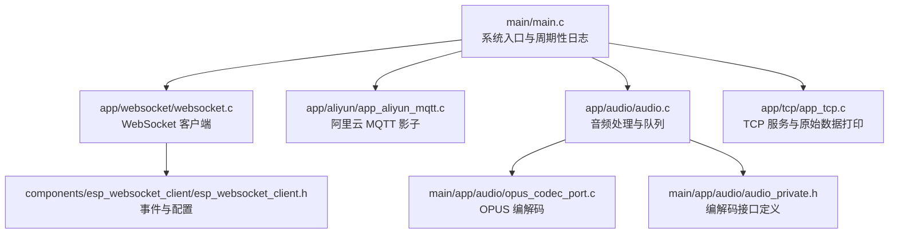
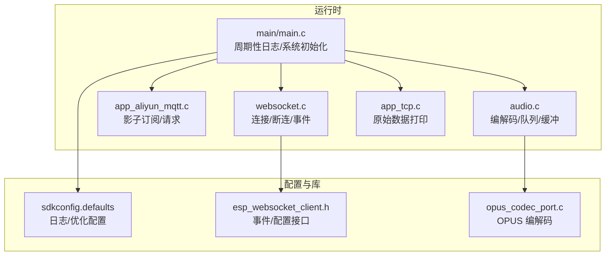
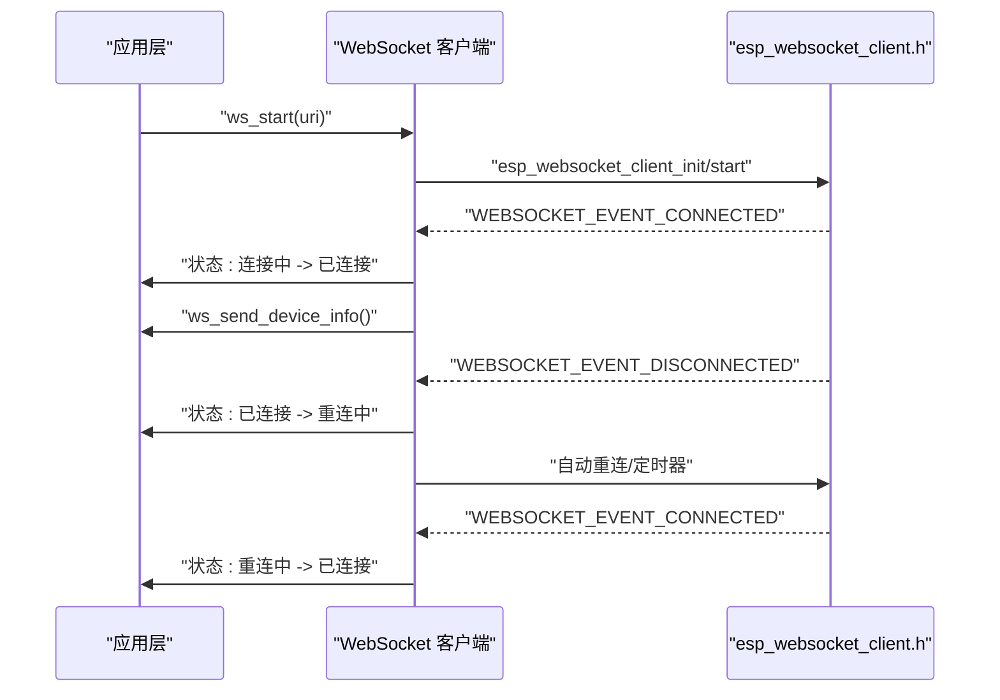
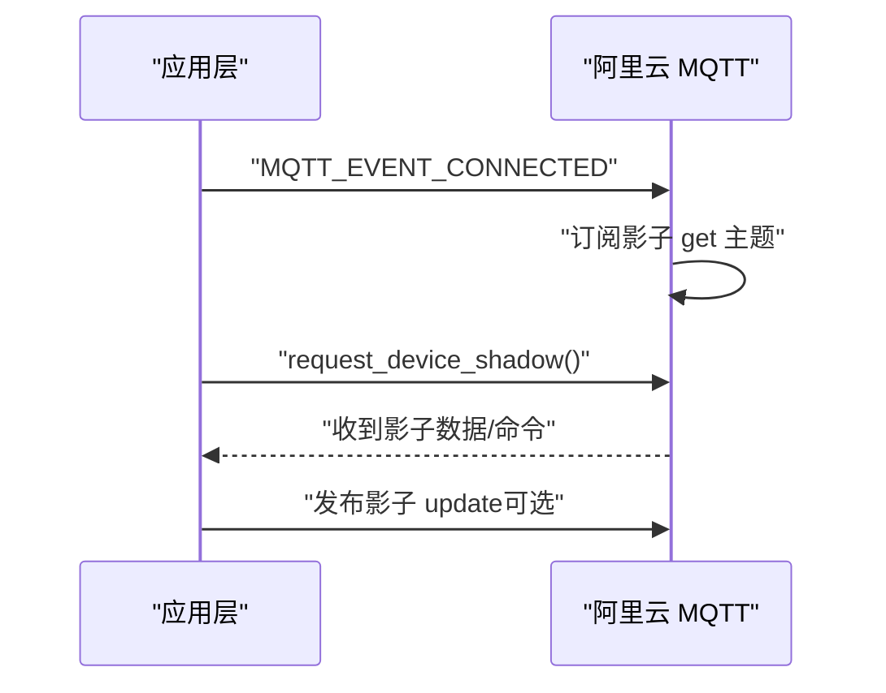
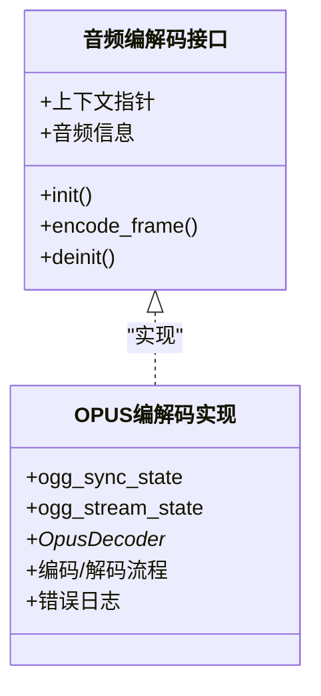
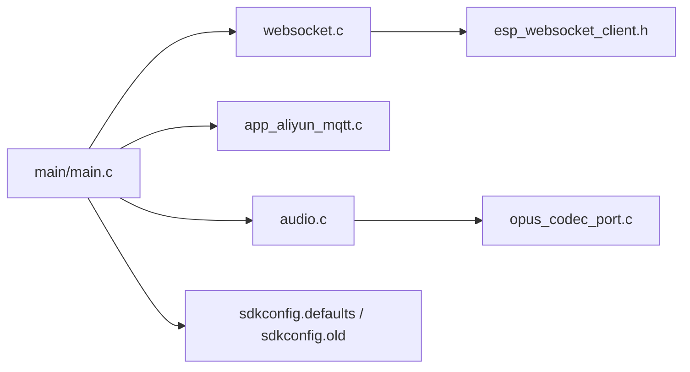
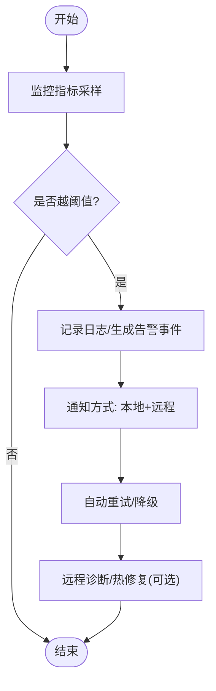

# 运维监控

<cite>
**本文引用的文件**   
- [main.c](file://main/main.c)
- [audio.c](file://main/app/audio/audio.c)
- [opus_codec_port.c](file://main/app/audio/opus_codec_port.c)
- [audio.h](file://main/app/audio/audio.h)
- [audio_private.h](file://main/app/audio/audio_private.h)
- [websocket.c](file://main/app/websocket/websocket.c)
- [websocket.h](file://main/app/websocket/websocket.h)
- [esp_websocket_client.h](file://components/esp_websocket_client/esp_websocket_client.h)
- [app_aliyun_mqtt.c](file://main/app/aliyun/app_aliyun_mqtt.c)
- [app_aliyun_mqtt.h](file://main/app/aliyun/app_aliyun_mqtt.h)
- [app_tcp.c](file://main/app/tcp/app_tcp.c)
- [sdkconfig.defaults](file://sdkconfig.defaults)
- [sdkconfig.old](file://sdkconfig.old)
</cite>

## 目录
1. [简介](#简介)
2. [项目结构](#项目结构)
3. [核心组件](#核心组件)
4. [架构总览](#架构总览)
5. [详细组件分析](#详细组件分析)
6. [依赖关系分析](#依赖关系分析)
7. [性能与资源监控](#性能与资源监控)
8. [日志系统与分析](#日志系统与分析)
9. [告警机制与响应流程](#告警机制与响应流程)
10. [故障诊断与性能分析](#故障诊断与性能分析)
11. [远程监控与维护](#远程监控与维护)
12. [结论](#结论)

## 简介
本文件面向“运维监控”主题，基于仓库现有代码与配置，系统化梳理系统运行状态的监控指标采集与上报路径，覆盖 CPU 使用率、内存占用、网络连接状态与音频处理性能；明确日志体系的配置与分类策略；给出告警阈值设定建议与响应流程；提供故障诊断与性能分析方法，并说明远程监控与维护（远程诊断与热修复）的实现思路与落地点。

## 项目结构
项目采用 ESP-IDF 工程组织，核心入口在 main/main.c，应用层模块分布在 main/app 下，第三方协议与库位于 components。与运维监控直接相关的关键模块包括：
- 主程序入口与系统初始化：main/main.c
- WebSocket 客户端与连接状态监控：main/app/websocket、components/esp_websocket_client
- 阿里云 MQTT 影子模型与远程控制：main/app/aliyun
- 音频编解码与处理链路：main/app/audio
- TCP 服务与原始数据打印：main/app/tcp
- 日志与默认配置：sdkconfig.defaults、sdkconfig.old

**图表来源**
- [main.c:33-59](file://main/main.c#L33-L59)
- [websocket.c:136-146](file://main/app/websocket/websocket.c#L136-L146)
- [app_aliyun_mqtt.c:65-86](file://main/app/aliyun/app_aliyun_mqtt.c#L65-L86)
- [audio.c:35-79](file://main/app/audio/audio.c#L35-L79)
- [esp_websocket_client.h:26-42](file://components/esp_websocket_client/esp_websocket_client.h#L26-L42)
- [opus_codec_port.c:1-379](file://main/app/audio/opus_codec_port.c#L1-L379)
- [audio_private.h:76-121](file://main/app/audio/audio_private.h#L76-L121)
- [app_tcp.c:88-105](file://main/app/tcp/app_tcp.c#L88-L105)

**章节来源**
- [main.c:33-59](file://main/main.c#L33-L59)
- [websocket.c:136-146](file://main/app/websocket/websocket.c#L136-L146)
- [app_aliyun_mqtt.c:65-86](file://main/app/aliyun/app_aliyun_mqtt.c#L65-L86)
- [audio.c:35-79](file://main/app/audio/audio.c#L35-L79)
- [esp_websocket_client.h:26-42](file://components/esp_websocket_client/esp_websocket_client.h#L26-L42)
- [opus_codec_port.c:1-379](file://main/app/audio/opus_codec_port.c#L1-L379)
- [audio_private.h:76-121](file://main/app/audio/audio_private.h#L76-L121)
- [app_tcp.c:88-105](file://main/app/tcp/app_tcp.c#L88-L105)

## 核心组件
- 系统入口与周期性日志：在主循环中定期打印内部/PSRAM 空闲堆大小，用于粗粒度内存监控。
- WebSocket 客户端：封装连接、断连、重连、事件派发与发送接口，提供连接状态与错误事件。
- 阿里云 MQTT 影子：通过订阅/发布影子主题进行设备状态同步与远程指令下发。
- 音频处理链路：OPUS 编解码、环形缓冲区、编码/解码任务与队列，支撑音频性能观测点。
- TCP 服务：提供原始数据打印与交互，便于现场排障。
- 日志配置：默认日志级别、颜色、时间戳来源等，影响日志体量与可观测性。

**章节来源**
- [main.c:56-58](file://main/main.c#L56-L58)
- [websocket.h:37-108](file://main/app/websocket/websocket.h#L37-L108)
- [app_aliyun_mqtt.h:3-5](file://main/app/aliyun/app_aliyun_mqtt.h#L3-L5)
- [audio.h:8-22](file://main/app/audio/audio.h#L8-L22)
- [audio_private.h:76-121](file://main/app/audio/audio_private.h#L76-L121)
- [app_tcp.c:88-105](file://main/app/tcp/app_tcp.c#L88-L105)
- [sdkconfig.defaults:150-184](file://sdkconfig.defaults#L150-L184)
- [sdkconfig.old:1540-1557](file://sdkconfig.old#L1540-L1557)

## 架构总览
系统通过主入口统一初始化各子系统，运行期通过周期性日志与事件驱动的网络组件实现运行态监控与远程联动。

**图表来源**
- [main.c:33-59](file://main/main.c#L33-L59)
- [websocket.c:136-146](file://main/app/websocket/websocket.c#L136-L146)
- [app_aliyun_mqtt.c:65-86](file://main/app/aliyun/app_aliyun_mqtt.c#L65-L86)
- [audio.c:35-79](file://main/app/audio/audio.c#L35-L79)
- [opus_codec_port.c:1-379](file://main/app/audio/opus_codec_port.c#L1-L379)
- [sdkconfig.defaults:150-184](file://sdkconfig.defaults#L150-L184)
- [esp_websocket_client.h:26-42](file://components/esp_websocket_client/esp_websocket_client.h#L26-L42)

## 详细组件分析

### WebSocket 连接监控与状态机
- 事件类型：连接、断开、数据、错误、关闭等，支持错误类型细分（握手、PONG 超时、TCP 传输等）。
- 状态枚举：断开、连接中、已连接、重连中、错误。
- 关键行为：连接成功后发送设备信息；断开触发重连状态切换；提供发送文本/二进制接口与连接状态检查。

**图表来源**
- [websocket.c:136-146](file://main/app/websocket/websocket.c#L136-L146)
- [websocket.c:161-179](file://main/app/websocket/websocket.c#L161-L179)
- [websocket.c:580-630](file://main/app/websocket/websocket.c#L580-L630)
- [websocket.h:37-108](file://main/app/websocket/websocket.h#L37-L108)
- [esp_websocket_client.h:26-42](file://components/esp_websocket_client/esp_websocket_client.h#L26-L42)

**章节来源**
- [websocket.c:136-146](file://main/app/websocket/websocket.c#L136-L146)
- [websocket.c:161-179](file://main/app/websocket/websocket.c#L161-L179)
- [websocket.c:580-630](file://main/app/websocket/websocket.c#L580-L630)
- [websocket.h:37-108](file://main/app/websocket/websocket.h#L37-L108)
- [esp_websocket_client.h:26-42](file://components/esp_websocket_client/esp_websocket_client.h#L26-L42)

### 阿里云 MQTT 影子与远程控制
- 连接事件：订阅影子 get 主题，发送 get 请求以拉取设备影子。
- 事件处理：根据事件 ID 分发处理，记录连接/断开/错误等日志。
- 远程联动：通过影子主题实现设备状态同步与远程指令下发。

**图表来源**
- [app_aliyun_mqtt.c:65-86](file://main/app/aliyun/app_aliyun_mqtt.c#L65-L86)
- [app_aliyun_mqtt.c:50-63](file://main/app/aliyun/app_aliyun_mqtt.c#L50-L63)
- [app_aliyun_mqtt.h:3-5](file://main/app/aliyun/app_aliyun_mqtt.h#L3-L5)

**章节来源**
- [app_aliyun_mqtt.c:65-86](file://main/app/aliyun/app_aliyun_mqtt.c#L65-L86)
- [app_aliyun_mqtt.c:50-63](file://main/app/aliyun/app_aliyun_mqtt.c#L50-L63)
- [app_aliyun_mqtt.h:3-5](file://main/app/aliyun/app_aliyun_mqtt.h#L3-L5)

### 音频处理性能观测点
- 编解码接口：定义了编码器/解码器抽象结构与结果枚举，便于在关键路径打点统计。
- OPUS 编解码：包含初始化、编码、输出缓冲区校验、错误日志等，可作为性能与稳定性观测入口。
- 音频缓冲与队列：环形缓冲区写指针、互斥量保护、读取与移位逻辑，可用于观察吞吐与阻塞情况。

**图表来源**
- [audio_private.h:76-121](file://main/app/audio/audio_private.h#L76-L121)
- [opus_codec_port.c:1-379](file://main/app/audio/opus_codec_port.c#L1-L379)

**章节来源**
- [audio_private.h:76-121](file://main/app/audio/audio_private.h#L76-L121)
- [opus_codec_port.c:1-379](file://main/app/audio/opus_codec_port.c#L1-L379)
- [audio.c:35-79](file://main/app/audio/audio.c#L35-L79)

### TCP 服务与原始数据打印
- 提供原始数据十六进制与字符串视图打印，便于快速定位网络/协议问题。
- 支持注册数据处理回调与状态变更回调，便于扩展监控与告警。

**章节来源**
- [app_tcp.c:88-105](file://main/app/tcp/app_tcp.c#L88-L105)
- [websocket.h:86-108](file://main/app/websocket/websocket.h#L86-L108)

## 依赖关系分析
- 主入口依赖各子系统初始化与事件循环；周期性日志依赖堆容量查询接口。
- WebSocket 客户端依赖 esp_websocket_client 库的事件与配置接口。
- 音频模块依赖 OPUS 与 OGG 组件，接口抽象清晰，便于替换与扩展。
- 日志配置由 sdkconfig 控制，默认 INFO 级别，颜色开启，RTOS 时间戳。

**图表来源**
- [main.c:33-59](file://main/main.c#L33-L59)
- [websocket.c:136-146](file://main/app/websocket/websocket.c#L136-L146)
- [app_aliyun_mqtt.c:65-86](file://main/app/aliyun/app_aliyun_mqtt.c#L65-L86)
- [audio.c:35-79](file://main/app/audio/audio.c#L35-L79)
- [opus_codec_port.c:1-379](file://main/app/audio/opus_codec_port.c#L1-L379)
- [sdkconfig.defaults:150-184](file://sdkconfig.defaults#L150-L184)
- [sdkconfig.old:1540-1557](file://sdkconfig.old#L1540-L1557)

**章节来源**
- [main.c:33-59](file://main/main.c#L33-L59)
- [websocket.c:136-146](file://main/app/websocket/websocket.c#L136-L146)
- [app_aliyun_mqtt.c:65-86](file://main/app/aliyun/app_aliyun_mqtt.c#L65-L86)
- [audio.c:35-79](file://main/app/audio/audio.c#L35-L79)
- [opus_codec_port.c:1-379](file://main/app/audio/opus_codec_port.c#L1-L379)
- [sdkconfig.defaults:150-184](file://sdkconfig.defaults#L150-L184)
- [sdkconfig.old:1540-1557](file://sdkconfig.old#L1540-L1557)

## 性能与资源监控
- 内存监控
  - 粗粒度：主循环周期性打印内部/PSRAM 空闲堆大小，用于观察长期趋势与异常下降。
  - 细粒度：OPUS 编解码上下文分配与 OGG 状态初始化处有错误日志，可结合内存峰值时段定位问题。
- CPU 使用率
  - 仓库未直接暴露 CPU 使用率统计接口；可通过任务栈高水位、队列等待时间、事件处理耗时等间接推断。
- 网络连接状态
  - WebSocket 事件包含连接、断开、错误、关闭等，错误类型细分为握手、PONG 超时、TCP 传输等，便于区分网络质量与服务端问题。
- 音频处理性能
  - OPUS 编码/解码返回值与错误日志可作为性能与稳定性观测点；环形缓冲区读写与互斥量保护可辅助分析吞吐瓶颈。

**章节来源**
- [main.c:56-58](file://main/main.c#L56-L58)
- [opus_codec_port.c:26-42](file://main/app/audio/opus_codec_port.c#L26-L42)
- [esp_websocket_client.h:47-68](file://components/esp_websocket_client/esp_websocket_client.h#L47-L68)

## 日志系统与分析
- 默认配置
  - 日志默认级别为 INFO，最大级别为 INFO，颜色开启，时间戳来源为 RTOS。
  - 启用较多蓝牙/协议栈 TRACE 级别，但默认不输出，可通过修改配置提升特定模块可观测性。
- 日志分类建议
  - 调试日志：开发阶段临时启用更高级别，定位问题后恢复默认级别。
  - 运行日志：INFO 级别，记录关键事件（连接、断开、设备信息、周期性内存）。
  - 错误日志：ERROR/WARN 级别，记录编解码失败、网络错误、内存不足等。
- 日志分析方法
  - 通过时间戳与事件类型快速定位异常窗口；
  - 结合 WebSocket 错误类型与阿里云 MQTT 事件，判断是网络侧还是服务端问题；
  - 对比周期性内存日志，识别内存泄漏或峰值异常。

**章节来源**
- [sdkconfig.defaults:150-184](file://sdkconfig.defaults#L150-L184)
- [sdkconfig.old:1540-1557](file://sdkconfig.old#L1540-L1557)
- [websocket.c:144-146](file://main/app/websocket/websocket.c#L144-L146)
- [app_aliyun_mqtt.c:69-86](file://main/app/aliyun/app_aliyun_mqtt.c#L69-L86)
- [opus_codec_port.c:351-360](file://main/app/audio/opus_codec_port.c#L351-L360)

## 告警机制与响应流程
- 阈值设定建议
  - 内存：PSRAM/内部堆空闲小于阈值（例如 10KB/50KB）触发告警；连续 N 次下降触发升级告警。
  - 网络：WebSocket 连续断开次数超过阈值（例如 3 次/分钟）、PONG 超时占比超过阈值（例如 50%）触发告警。
  - 音频：OPUS 编码失败次数超过阈值（例如 10 次/小时）、输出缓冲区不足（ENCODER_TOO_BIG）触发告警。
- 通知方式
  - 本地：LED/蜂鸣器（需扩展）；
  - 远程：通过阿里云 MQTT 影子上报状态与告警事件，或通过 WebSocket 推送告警消息。
- 响应流程
  - 触发告警 → 记录事件与上下文（日志级别提升）→ 自动重试（网络/音频）→ 上报远程平台 → 必要时降级（降低采样率/比特率）→ 手动介入（远程诊断/热修复）。

[此图为概念性流程，无需图表来源]

## 故障诊断与性能分析
- 快速定位
  - 使用 TCP 服务打印原始数据，核对网络链路与协议格式；
  - 结合 WebSocket 事件日志与错误类型，区分握手失败、PONG 超时、TCP 传输错误等。
- 性能分析
  - 在音频关键路径（编码/解码）增加耗时统计与计数器，结合环形缓冲区读写速率评估吞吐；
  - 对比内存日志与编解码上下文生命周期，排查异常增长。
- 证据留存
  - 将日志、事件时间戳、内存快照打包上传至远程平台，便于回溯。

**章节来源**
- [app_tcp.c:88-105](file://main/app/tcp/app_tcp.c#L88-L105)
- [websocket.c:144-146](file://main/app/websocket/websocket.c#L144-L146)
- [esp_websocket_client.h:47-68](file://components/esp_websocket_client/esp_websocket_client.h#L47-L68)

## 远程监控与维护
- 远程监控
  - 通过阿里云 MQTT 影子订阅/请求实现设备状态同步与远程指令下发；
  - 通过 WebSocket 推送设备信息、运行日志与告警事件。
- 远程诊断
  - 在应用层扩展事件回调，将诊断数据（如音频统计、网络统计）通过 WebSocket 或 MQTT 上报；
  - 结合日志级别动态调整，满足远程诊断期间的高可观测性需求。
- 热修复能力
  - 通过 MQTT/WS 接收远程指令，触发应用层模块的动态配置更新（如采样率、比特率、日志级别）；
  - 对于固件层面的修复，建议通过 OTA 流程（需额外实现）完成，本仓库未包含 OTA 组件。

**章节来源**
- [app_aliyun_mqtt.c:50-63](file://main/app/aliyun/app_aliyun_mqtt.c#L50-L63)
- [websocket.c:110-134](file://main/app/websocket/websocket.c#L110-L134)
- [websocket.h:86-108](file://main/app/websocket/websocket.h#L86-L108)

## 结论
本项目已具备基础的运行态监控与远程联动能力：主循环周期性内存日志、WebSocket 事件驱动的连接状态监控、阿里云 MQTT 影子与远程指令、音频编解码的可观测点。建议在此基础上补充细化的阈值告警、远程诊断与热修复通道，完善性能与稳定性保障体系。