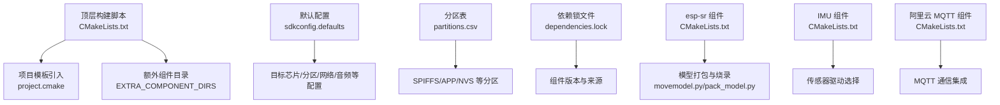
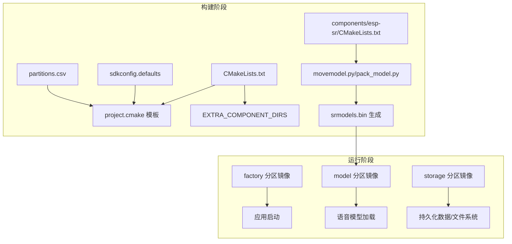
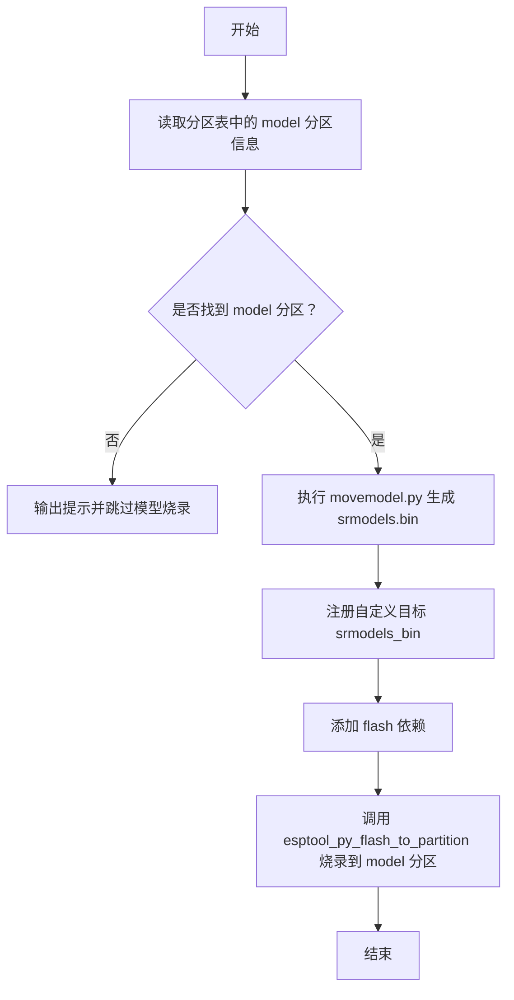
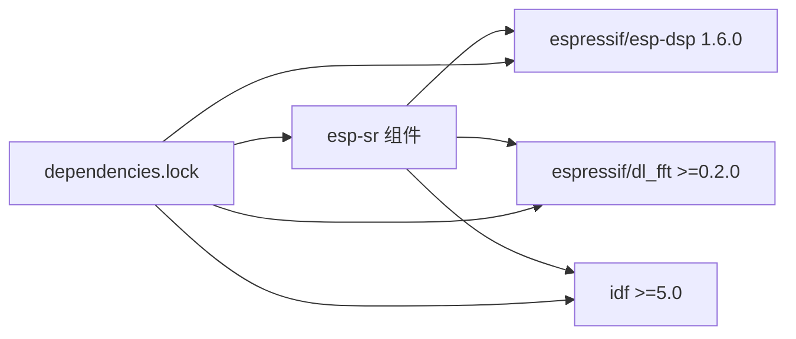
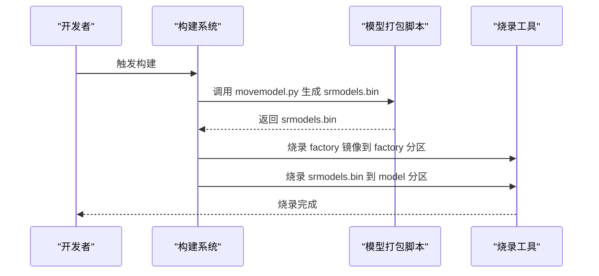

# 部署与维护

<cite>
**本文档引用的文件**
- [CMakeLists.txt](file://CMakeLists.txt)
- [sdkconfig.defaults](file://sdkconfig.defaults)
- [partitions.csv](file://partitions.csv)
- [dependencies.lock](file://dependencies.lock)
- [components/esp-sr/idf_component.yml](file://components/esp-sr/idf_component.yml)
- [components/esp-sr/CMakeLists.txt](file://components/esp-sr/CMakeLists.txt)
- [components/IMU/CMakeLists.txt](file://components/IMU/CMakeLists.txt)
- [components/aliyun_mqtt/CMakeLists.txt](file://components/aliyun_mqtt/CMakeLists.txt)
- [components/esp-sr/model/movemodel.py](file://components/esp-sr/model/movemodel.py)
- [components/esp-sr/model/pack_model.py](file://components/esp-sr/model/pack_model.py)
</cite>

## 目录
1. [简介](#简介)
2. [项目结构](#项目结构)
3. [核心组件](#核心组件)
4. [架构总览](#架构总览)
5. [详细组件分析](#详细组件分析)
6. [依赖关系分析](#依赖关系分析)
7. [性能考虑](#性能考虑)
8. [故障排查指南](#故障排查指南)
9. [结论](#结论)
10. [附录](#附录)

## 简介
本指南面向项目部署与维护，围绕构建系统配置与优化（编译选项、链接器配置、二进制生成）、固件烧录流程、OTA 升级机制与版本管理策略、生产环境部署与监控、以及维护流程（依赖更新、安全补丁、兼容性测试）进行系统化说明。文档同时提供运维监控指标、故障预警与应急响应建议，帮助团队在不同阶段高效推进交付与运维。

## 项目结构
项目采用 ESP-IDF 构建体系，顶层通过 CMakeLists 指定额外组件目录与通用编译选项，并引入项目模板；sdkconfig.defaults 提供目标芯片、分区表、网络与外设等默认配置；partitions.csv 定义 SPIFFS 分区布局；dependencies.lock 管理组件依赖版本与来源；各子组件（如 IMU、阿里云 MQTT、语音识别 esp-sr）通过独立的 CMakeLists 和组件清单进行集成。

图表来源
- [CMakeLists.txt:1-10](file://CMakeLists.txt#L1-L10)
- [sdkconfig.defaults:1-527](file://sdkconfig.defaults#L1-L527)
- [partitions.csv:1-6](file://partitions.csv#L1-L6)
- [dependencies.lock:1-33](file://dependencies.lock#L1-L33)
- [components/esp-sr/CMakeLists.txt:1-102](file://components/esp-sr/CMakeLists.txt#L1-L102)
- [components/IMU/CMakeLists.txt:1-28](file://components/IMU/CMakeLists.txt#L1-L28)
- [components/aliyun_mqtt/CMakeLists.txt:1-9](file://components/aliyun_mqtt/CMakeLists.txt#L1-L9)

章节来源
- [CMakeLists.txt:1-10](file://CMakeLists.txt#L1-L10)
- [sdkconfig.defaults:1-527](file://sdkconfig.defaults#L1-L527)
- [partitions.csv:1-6](file://partitions.csv#L1-L6)
- [dependencies.lock:1-33](file://dependencies.lock#L1-L33)

## 核心组件
- 构建系统与编译选项
  - 顶层 CMakeLists 引入 ESP-IDF 模板与通用组件目录，设置若干编译告警抑制选项，确保跨平台与第三方组件兼容性。
  - 关键配置项：目标芯片、闪存模式/频率/大小、SPIRAM、CPU 频率、网络栈参数、日志级别、看门狗、线程与任务堆栈等均在 sdkconfig.defaults 中集中定义。
- 分区与存储
  - partitions.csv 定义 NVS、factory、storage、model 等分区，其中 model 分区用于存放语音识别模型文件，构建时由 esp-sr 组件自动打包并烧录到指定分区。
- 组件与依赖
  - components/esp-sr 作为语音识别核心，包含模型路径、调试、SDK 配置处理、预置库链接与模型打包脚本；其组件清单声明了对 ESP-IDF、esp-dsp、dl_fft 的依赖。
  - components/IMU 提供姿态解算与传感器驱动选择逻辑，按 Kconfig 条件编译不同驱动源码。
  - components/aliyun_mqtt 封装 MQTT 通信，依赖 driver 与 mqtt 组件。

章节来源
- [CMakeLists.txt:1-10](file://CMakeLists.txt#L1-L10)
- [sdkconfig.defaults:1-527](file://sdkconfig.defaults#L1-L527)
- [partitions.csv:1-6](file://partitions.csv#L1-L6)
- [components/esp-sr/idf_component.yml:1-13](file://components/esp-sr/idf_component.yml#L1-L13)
- [components/esp-sr/CMakeLists.txt:1-102](file://components/esp-sr/CMakeLists.txt#L1-L102)
- [components/IMU/CMakeLists.txt:1-28](file://components/IMU/CMakeLists.txt#L1-L28)
- [components/aliyun_mqtt/CMakeLists.txt:1-9](file://components/aliyun_mqtt/CMakeLists.txt#L1-L9)

## 架构总览
下图展示从构建到运行的关键路径：顶层构建脚本加载默认配置与组件，esp-sr 在构建期生成模型镜像并将其注册到分区烧录流程，最终形成可烧录的固件映像。

图表来源
- [CMakeLists.txt:1-10](file://CMakeLists.txt#L1-L10)
- [sdkconfig.defaults:1-527](file://sdkconfig.defaults#L1-L527)
- [partitions.csv:1-6](file://partitions.csv#L1-L6)
- [components/esp-sr/CMakeLists.txt:77-102](file://components/esp-sr/CMakeLists.txt#L77-L102)
- [components/esp-sr/model/movemodel.py](file://components/esp-sr/model/movemodel.py)
- [components/esp-sr/model/pack_model.py](file://components/esp-sr/model/pack_model.py)

## 详细组件分析

### 语音识别组件（esp-sr）
- 功能定位
  - 提供语音识别与 TTS 相关算法与模型库，支持多目标芯片族；通过预置库链接与模型打包脚本实现快速集成。
- 构建与链接
  - 条件包含头文件目录与源文件，按目标芯片选择对应库文件；使用 add_prebuilt_library 注册多个预编译库，并以链接组方式统一链接。
  - 依赖 espressif/esp-dsp 与 espressif/dl_fft 组件库，通过 idf_component_get_property 获取组件库路径后参与链接。
- 模型打包与烧录
  - 读取分区表中 model 分区的偏移与大小，调用 movemodel.py 生成 srmodels.bin；通过自定义目标与 esptool_py_flash_to_partition 将模型烧录至 model 分区。
- 复杂度与性能
  - 链接阶段涉及多个静态库合并，需关注链接顺序与重复符号问题；模型打包脚本在构建期执行，建议缓存 SDK 配置以减少不必要的重跑。

图表来源
- [components/esp-sr/CMakeLists.txt:77-102](file://components/esp-sr/CMakeLists.txt#L77-L102)
- [components/esp-sr/model/movemodel.py](file://components/esp-sr/model/movemodel.py)

章节来源
- [components/esp-sr/CMakeLists.txt:1-102](file://components/esp-sr/CMakeLists.txt#L1-L102)
- [components/esp-sr/idf_component.yml:1-13](file://components/esp-sr/idf_component.yml#L1-L13)

### IMU 组件
- 功能定位
  - 提供姿态解算与传感器驱动选择，依据 Kconfig 选项编译不同驱动源码，保持最小可用集合。
- 编译特性
  - 使用条件判断选择驱动源码列表，统一注册组件并设置编译选项以规避格式化相关告警。

章节来源
- [components/IMU/CMakeLists.txt:1-28](file://components/IMU/CMakeLists.txt#L1-L28)

### 阿里云 MQTT 组件
- 功能定位
  - 封装 MQTT 通信能力，依赖 driver 与 mqtt 组件，便于上层业务快速接入云端。
- 集成要点
  - 通过 idf_component_register 明确源文件、头文件目录与依赖，确保链接阶段可见。

章节来源
- [components/aliyun_mqtt/CMakeLists.txt:1-9](file://components/aliyun_mqtt/CMakeLists.txt#L1-L9)

## 依赖关系分析
- 组件依赖
  - esp-sr 对 ESP-IDF、esp-dsp、dl_fft 的版本要求明确，保证在不同 IDF 版本下的稳定性。
- 锁定版本
  - dependencies.lock 固化了组件版本与来源，避免因上游变更导致的构建不一致。
- 目标平台
  - 目标芯片为 esp32s3，组件清单与构建脚本均针对该平台进行适配。

图表来源
- [components/esp-sr/idf_component.yml:1-13](file://components/esp-sr/idf_component.yml#L1-L13)
- [dependencies.lock:1-33](file://dependencies.lock#L1-L33)

章节来源
- [components/esp-sr/idf_component.yml:1-13](file://components/esp-sr/idf_component.yml#L1-L13)
- [dependencies.lock:1-33](file://dependencies.lock#L1-L33)

## 性能考虑
- CPU 频率与缓存
  - 默认 CPU 频率为 240MHz，启用 64KB 数据缓存与 64B 缓存行，有助于提升 DSP/语音处理性能。
- 内存与 SPIRAM
  - 启用 SPIRAM 并配置 fetch/rodata 等优化，结合 PSRAM IO/速度参数，降低主频对吞吐的影响。
- 网络与任务
  - TCP/IP 接收队列、窗口与 MSS 参数已调优；任务栈大小与优先级合理分配，避免阻塞与抖动。
- 编译优化
  - 顶层 CMakeLists 设置若干编译告警抑制，有助于在第三方组件较多时减少噪音；实际发布建议开启更严格的告警与断言级别。

章节来源
- [sdkconfig.defaults:74-90](file://sdkconfig.defaults#L74-L90)
- [sdkconfig.defaults:81-87](file://sdkconfig.defaults#L81-L87)
- [sdkconfig.defaults:484-501](file://sdkconfig.defaults#L484-L501)
- [CMakeLists.txt:5-9](file://CMakeLists.txt#L5-L9)

## 故障排查指南
- 构建失败（找不到模型分区）
  - 现象：构建日志提示未找到 model 分区或无法生成 srmodels.bin。
  - 排查：确认 partitions.csv 中存在名为 model 的分区且大小有效；检查 esp-sr 组件的模型打包脚本是否可执行。
  - 参考路径：[components/esp-sr/CMakeLists.txt:77-102](file://components/esp-sr/CMakeLists.txt#L77-L102)
- 语音模型加载异常
  - 现象：设备启动后无法识别唤醒词或关键词。
  - 排查：确认 model 分区已正确烧录；检查模型打包脚本生成的 srmodels.bin 是否与当前 SDK 配置匹配；核对语音模型版本与组件库版本兼容性。
  - 参考路径：[components/esp-sr/model/movemodel.py](file://components/esp-sr/model/movemodel.py)、[components/esp-sr/model/pack_model.py](file://components/esp-sr/model/pack_model.py)
- 传感器驱动未生效
  - 现象：IMU 数据异常或编译报错。
  - 排查：确认 Kconfig 中仅启用一种 IMU 驱动；检查头文件包含路径与源文件列表是否完整。
  - 参考路径：[components/IMU/CMakeLists.txt:1-28](file://components/IMU/CMakeLists.txt#L1-L28)
- MQTT 连接失败
  - 现象：设备无法连接云端或订阅主题失败。
  - 排查：确认网络配置、证书与鉴权参数；检查依赖 driver 与 mqtt 组件是否正确链接。
  - 参考路径：[components/aliyun_mqtt/CMakeLists.txt:1-9](file://components/aliyun_mqtt/CMakeLists.txt#L1-L9)

章节来源
- [components/esp-sr/CMakeLists.txt:77-102](file://components/esp-sr/CMakeLists.txt#L77-L102)
- [components/esp-sr/model/movemodel.py](file://components/esp-sr/model/movemodel.py)
- [components/esp-sr/model/pack_model.py](file://components/esp-sr/model/pack_model.py)
- [components/IMU/CMakeLists.txt:1-28](file://components/IMU/CMakeLists.txt#L1-L28)
- [components/aliyun_mqtt/CMakeLists.txt:1-9](file://components/aliyun_mqtt/CMakeLists.txt#L1-L9)

## 结论
本项目在构建系统、分区布局与组件集成方面具备清晰的工程化实践：通过 sdkconfig.defaults 与 partitions.csv 统一配置，利用 esp-sr 的模型打包与烧录流程保障语音功能落地，辅以 IMU 与 MQTT 组件满足典型外设与通信需求。建议在生产环境中进一步完善 OTA 升级与版本管理策略、系统监控与告警机制，并建立标准化的依赖更新与兼容性测试流程，以持续提升交付质量与运维效率。

## 附录

### 构建系统配置与优化
- 编译选项
  - 顶层 CMakeLists 设置若干编译告警抑制，适用于第三方组件较多场景；建议在发布分支开启更严格告警与断言。
  - 参考路径：[CMakeLists.txt:5-9](file://CMakeLists.txt#L5-L9)
- 链接器配置
  - esp-sr 使用链接组方式统一链接多个预置库，确保符号解析顺序与完整性；建议在新增库时评估链接顺序与冲突风险。
  - 参考路径：[components/esp-sr/CMakeLists.txt:70-72](file://components/esp-sr/CMakeLists.txt#L70-L72)
- 二进制文件生成
  - 顶层通过 project.cmake 生成可烧录镜像；模型镜像由 esp-sr 在构建期生成并通过 esptool_py_flash_to_partition 烧录至 model 分区。
  - 参考路径：[CMakeLists.txt:9](file://CMakeLists.txt#L9)、[components/esp-sr/CMakeLists.txt:87-96](file://components/esp-sr/CMakeLists.txt#L87-L96)

章节来源
- [CMakeLists.txt:5-9](file://CMakeLists.txt#L5-L9)
- [components/esp-sr/CMakeLists.txt:70-72](file://components/esp-sr/CMakeLists.txt#L70-L72)
- [components/esp-sr/CMakeLists.txt:87-96](file://components/esp-sr/CMakeLists.txt#L87-L96)

### 固件烧录流程
- 步骤概览
  - 生成 factory 分区镜像与 model 分区镜像（由模型打包脚本生成）。
  - 使用 esptool_py_flash_to_partition 将镜像分别烧录至 factory 与 model 分区。
- 流程图

图表来源
- [components/esp-sr/CMakeLists.txt:87-96](file://components/esp-sr/CMakeLists.txt#L87-L96)
- [components/esp-sr/model/movemodel.py](file://components/esp-sr/model/movemodel.py)

章节来源
- [components/esp-sr/CMakeLists.txt:87-96](file://components/esp-sr/CMakeLists.txt#L87-L96)

### OTA 升级机制与版本管理
- 升级策略
  - 建议采用双分区 APP（app/factory）+ 单一分区模型（model）的布局，升级时写入备用分区，校验成功后再切换引导。
- 版本管理
  - 通过 dependencies.lock 固化组件版本，配合 Git 标签与构建产物签名，确保可追溯性与一致性。
- 安全加固
  - 建议启用闪存加密、签名验证与安全启动（如适用），并在升级通道中增加哈希校验与完整性保护。

[本节为概念性指导，无需列出具体文件来源]

### 生产环境部署与监控
- 部署要求
  - 目标芯片：esp32s3；闪存模式/频率/大小：QIO 120MHz 16MB；SPIRAM：启用并配置 fetch/rodata。
  - 网络：WPA3 支持、TLS 客户端、HTTP 客户端 HTTPS 开启；DHCP 服务器与队列长度按需调整。
- 环境配置
  - 通过 sdkconfig.defaults 统一配置，结合 partitions.csv 管理分区；组件依赖通过 dependencies.lock 管控。
- 系统监控
  - 指标建议：CPU 使用率、内存占用、网络连接状态、OTA 成功率、模型加载耗时、任务队列深度、看门狗触发次数。
  - 告警机制：阈值报警（如内存不足、连接中断、OTA 超时）、周期性健康检查、异常日志采集与上报。

章节来源
- [sdkconfig.defaults:74-90](file://sdkconfig.defaults#L74-L90)
- [sdkconfig.defaults:18-37](file://sdkconfig.defaults#L18-L37)
- [sdkconfig.defaults:449-470](file://sdkconfig.defaults#L449-L470)
- [partitions.csv:1-6](file://partitions.csv#L1-L6)
- [dependencies.lock:1-33](file://dependencies.lock#L1-L33)

### 维护流程
- 依赖更新
  - 定期同步组件仓库，更新 dependencies.lock；在受控环境中验证兼容性与回归测试。
- 安全补丁
  - 关注 ESP-IDF 与第三方组件的安全公告，及时回滚或升级；对网络栈、TLS、MQTT 等关键模块优先修复。
- 兼容性测试
  - 多目标芯片与不同 IDF 版本交叉验证；重点覆盖语音模型加载、网络连通性、任务调度与内存压力场景。

[本节为通用流程建议，无需列出具体文件来源]