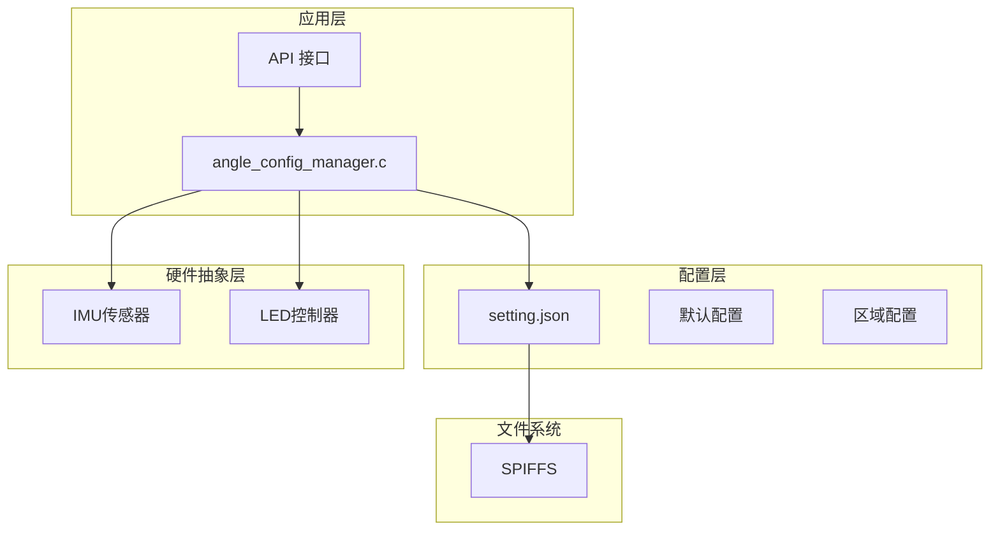
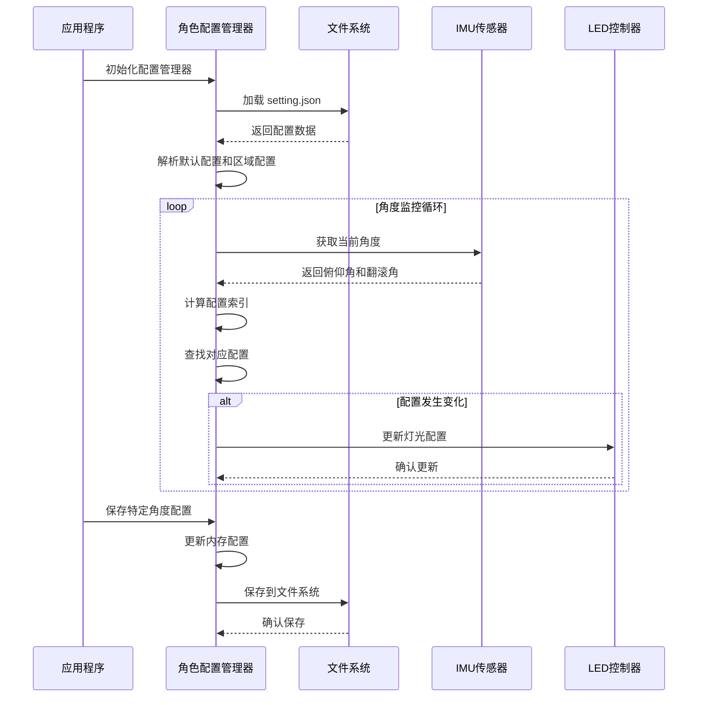
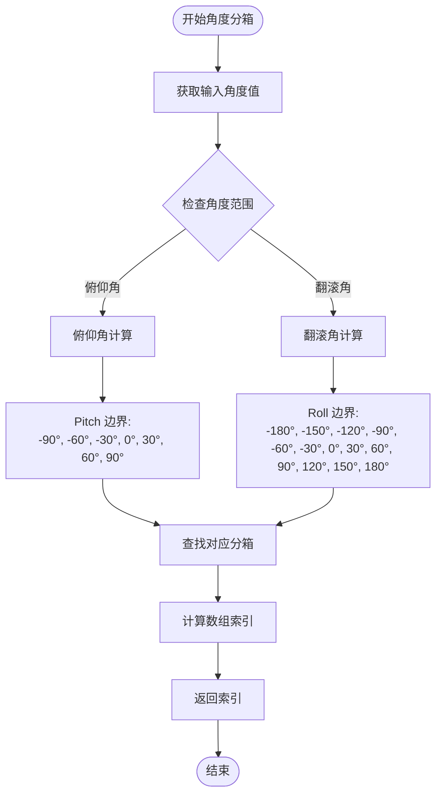
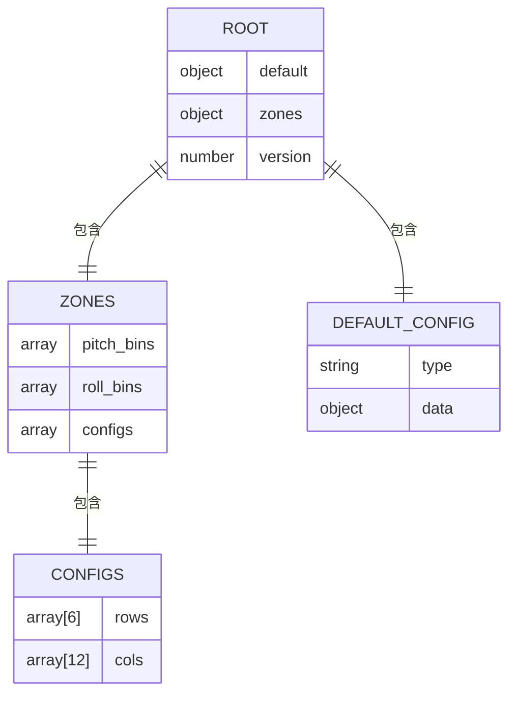
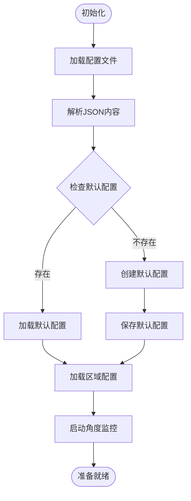
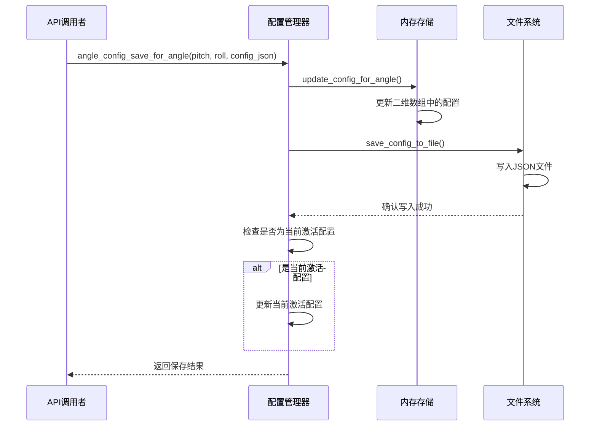
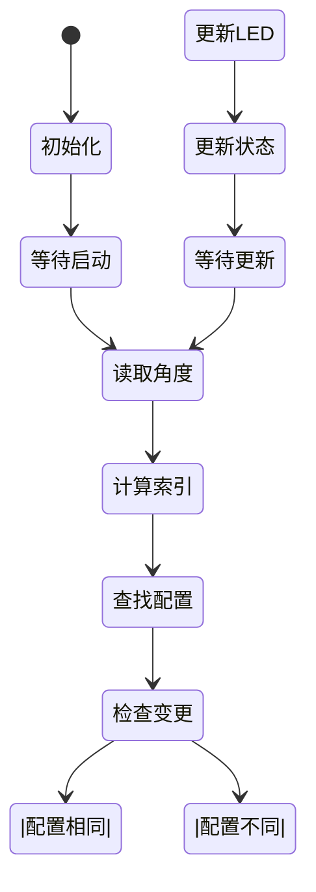
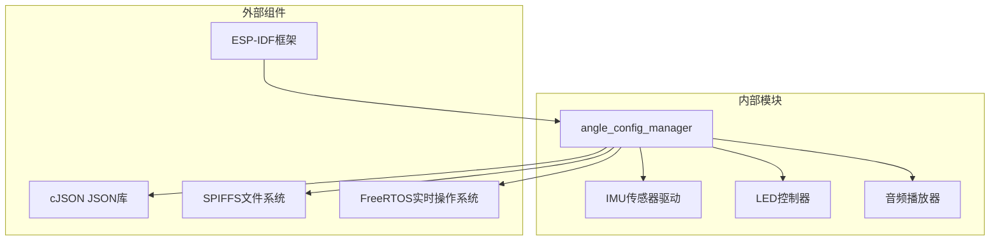
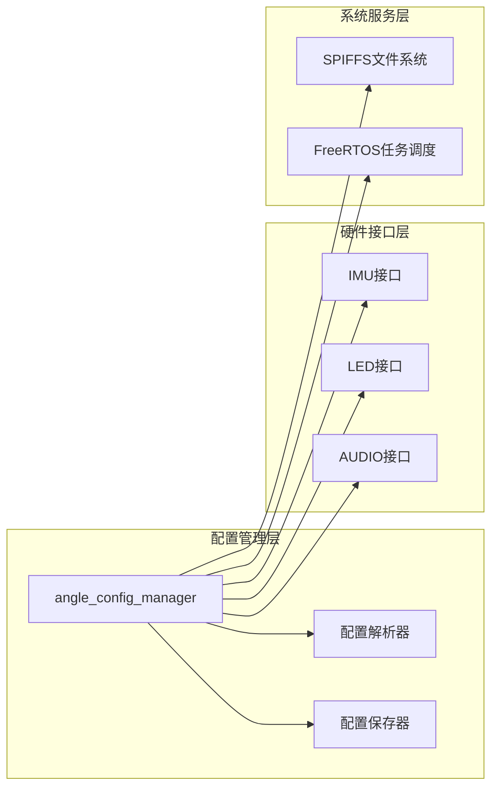

# JSON 配置系统

<cite>
**本文档引用的文件**
- [angle_config_manager.h](file://main/app/angle/angle_config_manager.h)
- [angle_config_manager.c](file://main/app/angle/angle_config_manager.c)
- [setting.json](file://spiffs/setting.json)
</cite>

## 目录
1. [简介](#简介)
2. [项目结构](#项目结构)
3. [核心组件](#核心组件)
4. [架构概览](#架构概览)
5. [详细组件分析](#详细组件分析)
6. [依赖关系分析](#依赖关系分析)
7. [性能考虑](#性能考虑)
8. [故障排除指南](#故障排除指南)
9. [结论](#结论)

## 简介

JSON 配置系统是一个基于 ESP32 的智能灯光控制系统，通过 JSON 文件管理不同角度区间的灯光配置。该系统实现了基于俯仰角（Pitch）和翻滚角（Roll）的角度分箱算法，将三维空间划分为 72 个配置区域（6×12），每个区域可以独立配置不同的灯光效果。

系统采用 SPIFFS 文件系统存储配置数据，支持配置的动态加载、保存、更新和热重载功能。通过 FreeRTOS 任务监控角度变化，实现实时的配置切换和灯光效果更新。

## 项目结构

```
main/app/angle/
├── angle_config_manager.h    # 头文件，声明配置管理接口
└── angle_config_manager.c    # 实现文件，包含完整的配置管理系统

spiffs/
└── setting.json              # 配置文件，存储所有灯光配置
```



**图表来源**
- [angle_config_manager.c:1-204](file://main/app/angle/angle_config_manager.c#L1-L204)
- [angle_config_manager.h:1-19](file://main/app/angle/angle_config_manager.h#L1-L19)

**章节来源**
- [angle_config_manager.h:1-19](file://main/app/angle/angle_config_manager.h#L1-L19)
- [angle_config_manager.c:1-204](file://main/app/angle/angle_config_manager.c#L1-L204)

## 核心组件

### 角度分箱系统

系统使用二维角度分箱将 3D 空间划分为规则网格：

**俯仰角（Pitch）分箱：**
- 分箱边界：[-90°, -60°, -30°, 0°, 30°, 60°, 90°]
- 分箱数量：6 个
- 覆盖范围：-90° 到 90°

**翻滚角（Roll）分箱：**
- 分箱边界：[-180°, -150°, -120°, -90°, -60°, -30°, 0°, 30°, 60°, 90°, 120°, 150°, 180°]
- 分箱数量：12 个
- 覆盖范围：-180° 到 180°

**总配置数量：** 6 × 12 = 72 个配置区域

### 配置存储结构

系统采用静态二维数组存储配置：

```mermaid
graph LR
subgraph "配置存储矩阵"
A11[A11<br/>(-90°,-180°)] --> A12[A12<br/>(-90°,-150°)]
A12 --> A13[A13<br/>(-90°,-120°)]
A13 --> A14[A14<br/>(-90°,-90°)]
A21[A21<br/>(-60°,-180°)] --> A22[A22<br/>(-60°,-150°)]
A22 --> A23[A23<br/>(-60°,-120°)]
A23 --> A24[A24<br/>(-60°,-90°)]
A31[A31<br/>(-30°,-180°)] --> A32[A32<br/>(-30°,-150°)]
A32 --> A33[A33<br/>(-30°,-120°)]
A33 --> A34[A34<br/>(-30°,-90°)]
end
subgraph "配置类型"
DEFAULT[默认配置]
ACTIVE[当前激活配置]
end
```

**图表来源**
- [angle_config_manager.c:21-25](file://main/app/angle/angle_config_manager.c#L21-L25)

**章节来源**
- [angle_config_manager.c:15-25](file://main/app/angle/angle_config_manager.c#L15-L25)

## 架构概览



**图表来源**
- [angle_config_manager.c:177-193](file://main/app/angle/angle_config_manager.c#L177-L193)
- [angle_config_manager.c:195-204](file://main/app/angle/angle_config_manager.c#L195-L204)

## 详细组件分析

### 角度分箱算法

#### 分箱边界定义



**图表来源**
- [angle_config_manager.c:28-42](file://main/app/angle/angle_config_manager.c#L28-L42)

#### 索引计算逻辑

系统使用线性搜索算法确定角度对应的分箱索引：

```c
static int get_pitch_index(float pitch) {
    for (int i = 0; i < PITCH_BIN_COUNT; i++) {
        if (pitch >= PITCH_BINS[i] && pitch <= PITCH_BINS[i+1])
            return i;
    }
    return (pitch < PITCH_BINS[0]) ? 0 : (PITCH_BIN_COUNT - 1);
}
```

**章节来源**
- [angle_config_manager.c:28-42](file://main/app/angle/angle_config_manager.c#L28-L42)

### 配置文件格式规范

#### JSON 结构定义



**图表来源**
- [angle_config_manager.c:95-144](file://main/app/angle/angle_config_manager.c#L95-L144)

#### 默认配置段（default）

默认配置段包含系统的基础灯光设置，当特定角度区域没有配置时使用：

- **字段结构：** `{"type": 数字, "data": 对象}`
- **用途：** 提供全局默认的灯光效果参数
- **优先级：** 最低，仅在区域配置不存在时生效

#### 区域配置段（zones.configs）

区域配置段采用二维数组结构，对应 6×12 的角度分箱网格：

```mermaid
graph TB
subgraph "区域配置矩阵"
subgraph "第1行 (-90°到-60°)"
R1C1[R1C1<br/>(-90°,-180°)]
R1C2[R1C2<br/>(-90°,-150°)]
R1C3[R1C3<br/>(-90°,-120°)]
R1C4[R1C4<br/>(-90°,-90°)]
R1C5[R1C5<br/>(-90°,-60°)]
R1C6[R1C6<br/>(-90°,-30°)]
R1C7[R1C7<br/>(-90°,0°)]
R1C8[R1C8<br/>(-90°,30°)]
R1C9[R1C9<br/>(-90°,60°)]
R1C10[R1C10<br/>(-90°,90°)]
R1C11[R1C11<br/>(-90°,120°)]
R1C12[R1C12<br/>(-90°,150°)]
end
subgraph "第2行 (-60°到-30°)"
R2C1[R2C1<br/>(-60°,-180°)]
R2C2[R2C2<br/>(-60°,-150°)]
R2C3[R2C3<br/>(-60°,-120°)]
R2C4[R2C4<br/>(-60°,-90°)]
R2C5[R2C5<br/>(-60°,-60°)]
R2C6[R2C6<br/>(-60°,-30°)]
R2C7[R2C7<br/>(-60°,0°)]
R2C8[R2C8<br/>(-60°,30°)]
R2C9[R2C9<br/>(-60°,60°)]
R2C10[R2C10<br/>(-60°,90°)]
R2C11[R2C11<br/>(-60°,120°)]
R2C12[R2C12<br/>(-60°,150°)]
end
subgraph "第3行 (-30°到0°)"
R3C1[R3C1<br/>(-30°,-180°)]
R3C2[R3C2<br/>(-30°,-150°)]
R3C3[R3C3<br/>(-30°,-120°)]
R3C4[R3C4<br/>(-30°,-90°)]
R3C5[R3C5<br/>(-30°,-60°)]
R3C6[R3C6<br/>(-30°,-30°)]
R3C7[R3C7<br/>(-30°,0°)]
R3C8[R3C8<br/>(-30°,30°)]
R3C9[R3C9<br/>(-30°,60°)]
R3C10[R3C10<br/>(-30°,90°)]
R3C11[R3C11<br/>(-30°,120°)]
R3C12[R3C12<br/>(-30°,150°)]
end
end
```

**图表来源**
- [angle_config_manager.c:114-128](file://main/app/angle/angle_config_manager.c#L114-L128)

**章节来源**
- [angle_config_manager.c:95-144](file://main/app/angle/angle_config_manager.c#L95-L144)

### 配置管理功能

#### 配置加载机制

系统启动时自动执行以下流程：



**图表来源**
- [angle_config_manager.c:44-93](file://main/app/angle/angle_config_manager.c#L44-L93)
- [angle_config_manager.c:195-204](file://main/app/angle/angle_config_manager.c#L195-L204)

#### 配置保存机制



**图表来源**
- [angle_config_manager.c:162-175](file://main/app/angle/angle_config_manager.c#L162-L175)
- [angle_config_manager.c:95-144](file://main/app/angle/angle_config_manager.c#L95-L144)

**章节来源**
- [angle_config_manager.c:44-93](file://main/app/angle/angle_config_manager.c#L44-L93)
- [angle_config_manager.c:95-144](file://main/app/angle/angle_config_manager.c#L95-L144)
- [angle_config_manager.c:162-175](file://main/app/angle/angle_config_manager.c#L162-L175)

### 角度监控与热重载

系统通过 FreeRTOS 任务实现持续的角度监控：



**图表来源**
- [angle_config_manager.c:177-193](file://main/app/angle/angle_config_manager.c#L177-L193)

**章节来源**
- [angle_config_manager.c:177-193](file://main/app/angle/angle_config_manager.c#L177-L193)

## 依赖关系分析

### 外部库依赖



**图表来源**
- [angle_config_manager.c:1-12](file://main/app/angle/angle_config_manager.c#L1-L12)

### 内部模块交互

系统各模块之间的交互关系：



**图表来源**
- [angle_config_manager.c:177-204](file://main/app/angle/angle_config_manager.c#L177-L204)

**章节来源**
- [angle_config_manager.c:1-12](file://main/app/angle/angle_config_manager.c#L1-L12)
- [angle_config_manager.c:177-204](file://main/app/angle/angle_config_manager.c#L177-L204)

## 性能考虑

### 时间复杂度分析

- **角度分箱查找：** O(n) 线性搜索，其中 n 为分箱边界数量（通常很小，约常数时间）
- **配置更新：** O(1) 常数时间操作
- **配置保存：** O(m×n) 线性时间，其中 m 和 n 分别为俯仰角和翻滚角的分箱数量
- **内存使用：** O(m×n) 二维数组存储，固定大小

### 内存优化策略

1. **静态内存分配：** 使用静态数组避免动态内存分配开销
2. **字符串缓存：** 缓存当前激活的配置以避免重复解析
3. **增量更新：** 仅在配置发生变化时触发更新操作

### 实时性能保证

- **监控频率：** 100ms 间隔的轮询，平衡响应速度和系统负载
- **任务优先级：** 配置管理任务具有中等优先级，确保实时性同时不影响其他关键任务
- **非阻塞操作：** 所有文件操作都是异步进行的

## 故障排除指南

### 常见问题及解决方案

#### 配置文件加载失败

**症状：** 系统无法从 SPIFFS 加载配置文件

**可能原因：**
- SPIFFS 文件系统未正确挂载
- setting.json 文件损坏或格式不正确
- 文件权限问题

**解决步骤：**
1. 检查 SPIFFS 是否已正确格式化和挂载
2. 验证 setting.json 文件的 JSON 格式有效性
3. 重新烧录配置文件到 SPIFFS

#### 角度读取异常

**症状：** IMU 传感器读取角度值异常

**可能原因：**
- IMU 设备连接问题
- 校准数据丢失
- 传感器硬件故障

**解决步骤：**
1. 检查 IMU 设备的 I2C/SPI 连接
2. 重新执行 IMU 校准程序
3. 验证 IMU 驱动程序的正确性

#### 配置更新不生效

**症状：** 更新配置后灯光效果没有变化

**可能原因：**
- 当前角度不在目标配置区域
- 配置保存但未触发热重载
- LED 控制器通信故障

**解决步骤：**
1. 确认当前角度确实位于目标配置区域
2. 手动触发配置重载或等待自然重载
3. 检查 LED 控制器的通信状态

**章节来源**
- [angle_config_manager.c:44-93](file://main/app/angle/angle_config_manager.c#L44-L93)
- [angle_config_manager.c:177-193](file://main/app/angle/angle_config_manager.c#L177-L193)

## 结论

JSON 配置系统为 ESP32 平台提供了灵活而高效的灯光控制解决方案。通过精心设计的角度分箱算法和配置管理机制，系统能够实现精确的区域化灯光控制。

**主要优势：**
- **高精度控制：** 72 个独立配置区域提供精细的角度控制
- **实时响应：** 100ms 响应周期确保流畅的用户体验
- **易于扩展：** JSON 格式便于修改和扩展配置选项
- **稳定可靠：** 完善的错误处理和故障恢复机制

**应用场景：**
- 无人机机载灯光系统
- 机器人姿态指示灯
- 无人机编队表演
- 科研实验设备照明

该系统为类似的空间角度控制应用提供了良好的参考实现，其模块化的架构设计和清晰的接口定义使其易于集成到更大的系统中。