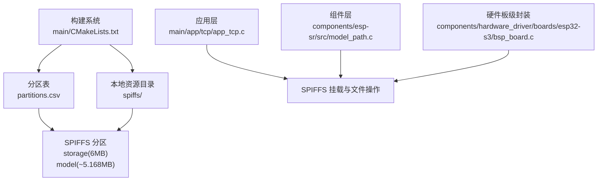
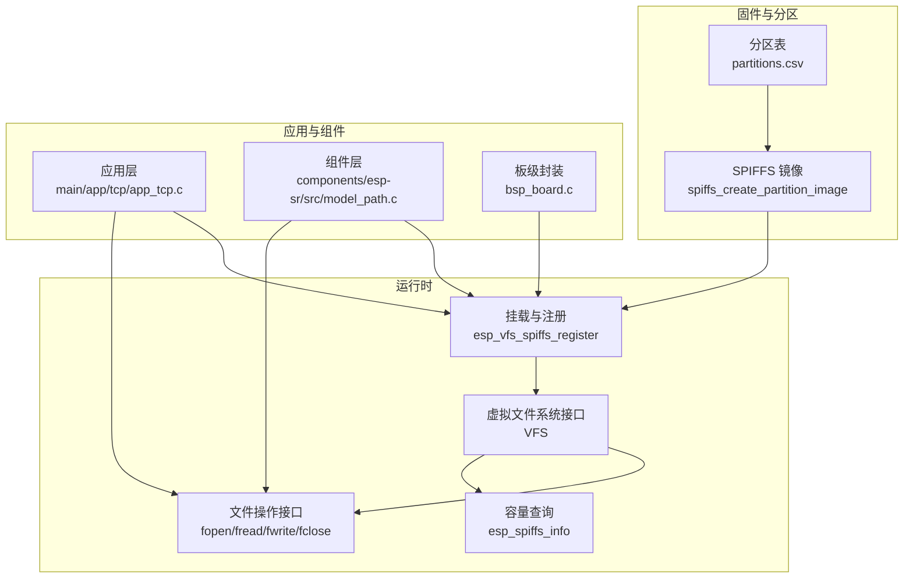
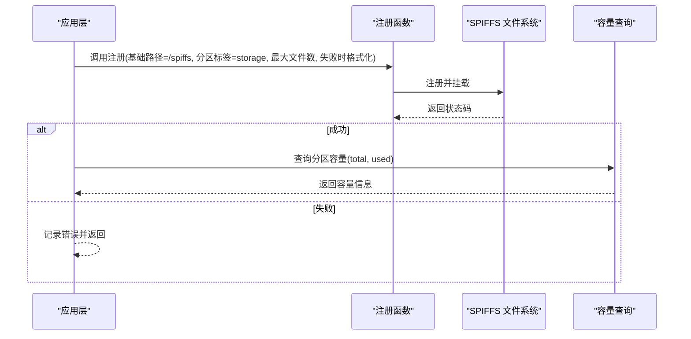
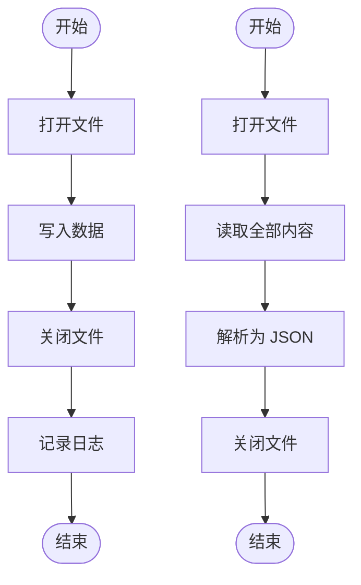
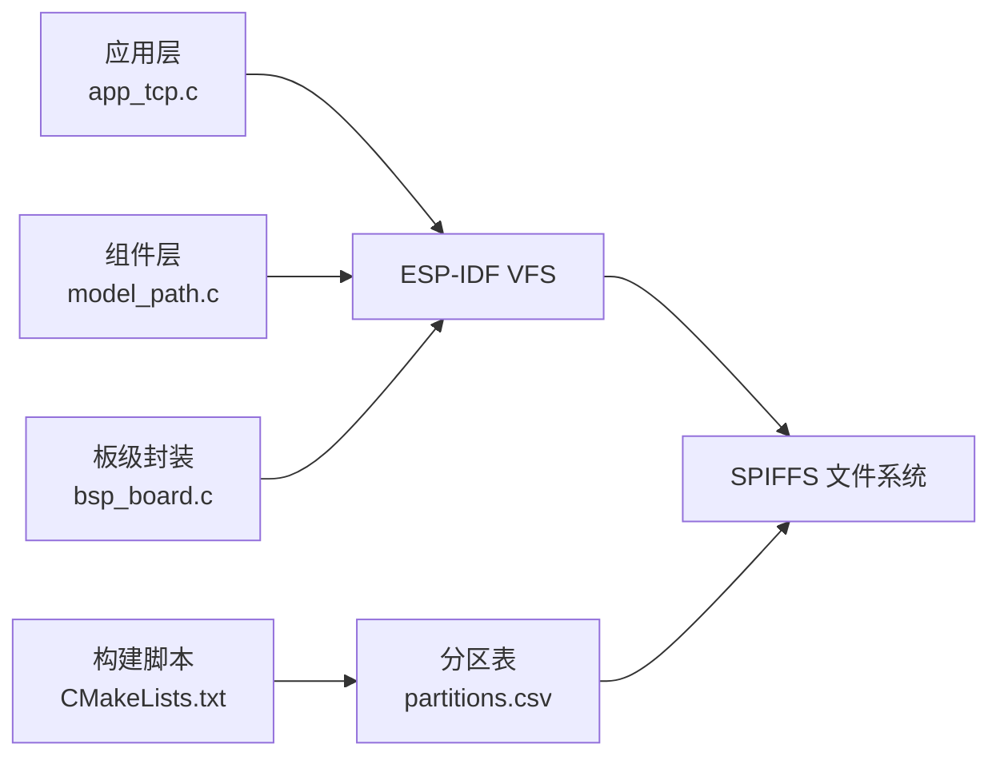

# SPIFFS 文件系统

<cite>
**本文引用的文件**
- [main/CMakeLists.txt](file://main/CMakeLists.txt)
- [partitions.csv](file://partitions.csv)
- [main/app/tcp/app_tcp.c](file://main/app/tcp/app_tcp.c)
- [components/esp-sr/src/model_path.c](file://components/esp-sr/src/model_path.c)
- [components/esp-sr/src/include/model_path.h](file://components/esp-sr/src/include/model_path.h)
- [components/hardware_driver/boards/esp32-s3/bsp_board.c](file://components/hardware_driver/boards/esp32-s3/bsp_board.c)
- [sdkconfig.old](file://sdkconfig.old)
</cite>

## 目录
1. [简介](#简介)
2. [项目结构](#项目结构)
3. [核心组件](#核心组件)
4. [架构总览](#架构总览)
5. [详细组件分析](#详细组件分析)
6. [依赖关系分析](#依赖关系分析)
7. [性能考量](#性能考量)
8. [故障排查指南](#故障排查指南)
9. [结论](#结论)
10. [附录](#附录)

## 简介
本文件系统技术文档围绕 ESP-IDF 中的 SPIFFS 文件系统展开，结合仓库中的实际实现，系统性阐述以下主题：
- 分区表设置与挂载参数
- 存储空间管理与容量信息查询
- 文件读写操作流程（打开、读取、写入、关闭）
- 配置文件的存储路径、文件权限与访问控制
- 错误处理、异常恢复与数据完整性保护
- 容量规划、碎片整理与性能优化建议
- 文件操作最佳实践与常见问题解决方案

## 项目结构
本项目通过分区表定义了多个 SPIFFS 分区，并在构建阶段将本地 spiffs 目录打包为 flash 分区镜像。关键位置如下：
- 分区表：定义了名为 storage 和 model 的 SPIFFS 分区及其大小
- 构建脚本：将本地 spiffs 目录作为 storage 分区的内容进行打包
- 应用层：在 TCP 服务模块中对 SPIFFS 进行挂载与文件读写
- 组件层：语音识别模型加载组件同样使用 SPIFFS 进行模型文件读取

**图示来源**
- [main/CMakeLists.txt:1-4](file://main/CMakeLists.txt#L1-L4)
- [partitions.csv:1-6](file://partitions.csv#L1-L6)

**章节来源**
- [main/CMakeLists.txt:1-4](file://main/CMakeLists.txt#L1-L4)
- [partitions.csv:1-6](file://partitions.csv#L1-L6)

## 核心组件
- 分区表与镜像生成
  - 分区表定义了 storage 与 model 两个 SPIFFS 分区，分别用于存放运行配置、音频素材与模型文件等。
  - 构建脚本调用 spiffs_create_partition_image 将本地 spiffs 目录打包进 storage 分区。
- 文件系统挂载与查询
  - 应用层在启动 TCP 服务前调用 spiffs_init 对 SPIFFS 进行挂载，设置挂载点、分区标签、最大文件数以及挂载失败时的格式化策略。
  - 使用 esp_spiffs_info 查询分区总容量与已用空间，便于监控与容量规划。
- 文件读写流程
  - 应用层通过标准 C 文件接口（fopen/fread/fwrite/fclose）完成配置文件的读取与写入。
  - 组件层通过目录遍历与文件读取实现模型清单的扫描与解析。

**章节来源**
- [main/CMakeLists.txt:1-4](file://main/CMakeLists.txt#L1-L4)
- [partitions.csv:1-6](file://partitions.csv#L1-L6)
- [main/app/tcp/app_tcp.c:107-153](file://main/app/tcp/app_tcp.c#L107-L153)
- [main/app/tcp/app_tcp.c:135-153](file://main/app/tcp/app_tcp.c#L135-L153)
- [components/esp-sr/src/model_path.c:112-180](file://components/esp-sr/src/model_path.c#L112-L180)

## 架构总览
下图展示了从分区表到挂载、再到文件操作的整体架构：

**图示来源**
- [partitions.csv:1-6](file://partitions.csv#L1-L6)
- [main/CMakeLists.txt:1-4](file://main/CMakeLists.txt#L1-L4)
- [main/app/tcp/app_tcp.c:107-153](file://main/app/tcp/app_tcp.c#L107-L153)
- [components/esp-sr/src/model_path.c:182-216](file://components/esp-sr/src/model_path.c#L182-L216)
- [components/hardware_driver/boards/esp32-s3/bsp_board.c:130-160](file://components/hardware_driver/boards/esp32-s3/bsp_board.c#L130-L160)

## 详细组件分析

### 分区表与镜像生成
- 分区表定义
  - storage：类型 data，子类型 spiffs，大小 6MB，作为主要的可写存储分区。
  - model：类型 data，子类型 spiffs，大小约 5168KB，用于存放模型文件。
- 镜像生成
  - 构建脚本通过 spiffs_create_partition_image 将本地 spiffs 目录打包为 flash 分区镜像，随固件烧录到对应分区。

**章节来源**
- [partitions.csv:1-6](file://partitions.csv#L1-L6)
- [main/CMakeLists.txt:1-4](file://main/CMakeLists.txt#L1-L4)

### 文件系统挂载与参数
- 挂载参数
  - 基础路径：/spiffs
  - 分区标签：storage
  - 最大文件数：应用层为 5；板级封装为 20；组件层为 5
  - 挂载失败时格式化：应用层与组件层启用，板级封装根据配置项决定
- 重复挂载检测
  - 应用层通过尝试打开 /spiffs/test 判断是否已挂载，避免重复注册
- 容量查询
  - 使用 esp_spiffs_info 获取 total 与 used，单位为字节，日志中以 KB 显示

**图示来源**
- [main/app/tcp/app_tcp.c:107-133](file://main/app/tcp/app_tcp.c#L107-L133)
- [components/hardware_driver/boards/esp32-s3/bsp_board.c:130-160](file://components/hardware_driver/boards/esp32-s3/bsp_board.c#L130-L160)
- [components/esp-sr/src/model_path.c:182-216](file://components/esp-sr/src/model_path.c#L182-L216)

**章节来源**
- [main/app/tcp/app_tcp.c:107-133](file://main/app/tcp/app_tcp.c#L107-L133)
- [components/hardware_driver/boards/esp32-s3/bsp_board.c:130-160](file://components/hardware_driver/boards/esp32-s3/bsp_board.c#L130-L160)
- [components/esp-sr/src/model_path.c:182-216](file://components/esp-sr/src/model_path.c#L182-L216)

### 文件读写流程
- 打开与写入
  - 应用层将配置 JSON 写入 /spiffs/setting.json，采用“打开写入关闭”的标准流程
  - 写入前检查句柄有效性，写入后释放内存并记录日志
- 读取与解析
  - 读取配置文件时先获取文件长度，再一次性读取到缓冲区，最后解析为 JSON 结构
- 音频文件保存
  - 将接收到的二进制音频数据按名称写入 /spiffs/<name>.mp3

**图示来源**
- [main/app/tcp/app_tcp.c:135-153](file://main/app/tcp/app_tcp.c#L135-L153)
- [main/app/tcp/app_tcp.c:45-93](file://main/app/tcp/app_tcp.c#L45-L93)

**章节来源**
- [main/app/tcp/app_tcp.c:135-153](file://main/app/tcp/app_tcp.c#L135-L153)
- [main/app/tcp/app_tcp.c:45-93](file://main/app/tcp/app_tcp.c#L45-L93)

### 配置文件存储路径、权限与访问控制
- 存储路径
  - 配置文件路径常量为 /spiffs/setting.json
- 权限与访问控制
  - 仓库未显式设置文件权限或访问控制策略，因此默认遵循 ESP-IDF 的 VFS 默认行为
- 建议
  - 若需更强的安全性，可在上层逻辑中增加校验与最小权限原则（例如仅在需要时打开文件）

**章节来源**
- [main/app/tcp/app_tcp.c:30-35](file://main/app/tcp/app_tcp.c#L30-L35)

### 错误处理、异常恢复与数据完整性
- 错误处理
  - 挂载失败时记录错误码并返回；容量查询失败时记录错误
  - 文件打开失败、写入不完整、JSON 解析失败均进行相应的错误分支处理
- 异常恢复
  - 挂载失败时可选择格式化分区（由配置决定），以恢复可用状态
- 数据完整性
  - 写入后检查写入字节数与请求一致，避免半写导致的数据损坏
  - JSON 写入前进行序列化，失败则回滚并释放资源

**章节来源**
- [main/app/tcp/app_tcp.c:107-133](file://main/app/tcp/app_tcp.c#L107-L133)
- [main/app/tcp/app_tcp.c:135-153](file://main/app/tcp/app_tcp.c#L135-L153)

### 容量规划、碎片整理与性能优化
- 容量规划
  - 使用 esp_spiffs_info 获取 total/used，结合业务需求预留空间
- 碎片整理
  - SPIFFS 在组件层通过注册时启用格式化能力，可在必要时清理碎片
- 性能优化
  - 合理设置 max_files，避免过多并发文件句柄
  - 优先使用顺序写入，减少随机写放大
  - 控制单次写入大小，避免频繁小块写入

**章节来源**
- [components/esp-sr/src/model_path.c:182-216](file://components/esp-sr/src/model_path.c#L182-L216)
- [components/hardware_driver/boards/esp32-s3/bsp_board.c:130-160](file://components/hardware_driver/boards/esp32-s3/bsp_board.c#L130-L160)

## 依赖关系分析
- 组件耦合
  - 应用层与组件层均依赖 ESP-IDF 的 SPIFFS VFS 接口
  - 板级封装提供统一的挂载/卸载入口，便于上层复用
- 外部依赖
  - 构建阶段依赖分区表与本地资源目录
  - 运行时依赖 ESP-IDF 的 VFS 与 SPIFFS 实现

**图示来源**
- [main/app/tcp/app_tcp.c:107-153](file://main/app/tcp/app_tcp.c#L107-L153)
- [components/esp-sr/src/model_path.c:182-216](file://components/esp-sr/src/model_path.c#L182-L216)
- [components/hardware_driver/boards/esp32-s3/bsp_board.c:130-160](file://components/hardware_driver/boards/esp32-s3/bsp_board.c#L130-L160)
- [main/CMakeLists.txt:1-4](file://main/CMakeLists.txt#L1-L4)
- [partitions.csv:1-6](file://partitions.csv#L1-L6)

**章节来源**
- [main/app/tcp/app_tcp.c:107-153](file://main/app/tcp/app_tcp.c#L107-L153)
- [components/esp-sr/src/model_path.c:182-216](file://components/esp-sr/src/model_path.c#L182-L216)
- [components/hardware_driver/boards/esp32-s3/bsp_board.c:130-160](file://components/hardware_driver/boards/esp32-s3/bsp_board.c#L130-L160)
- [main/CMakeLists.txt:1-4](file://main/CMakeLists.txt#L1-L4)
- [partitions.csv:1-6](file://partitions.csv#L1-L6)

## 性能考量
- 页面与缓存
  - SDK 配置启用了页面检查、缓存与写缓存，有助于提升读写稳定性与吞吐
- GC 行为
  - 配置了最大 GC 运行次数，避免长时间阻塞
- 建议
  - 在高写入场景下，适当增大 max_files 并关注 GC 触发频率
  - 对于频繁更新的小文件，考虑合并写入或使用临时文件再重命名的方式降低碎片

**章节来源**
- [sdkconfig.old:2038-2059](file://sdkconfig.old#L2038-L2059)

## 故障排查指南
- 无法挂载
  - 检查分区标签与分区表是否一致
  - 若启用“挂载失败时格式化”，确认是否成功执行格式化
- 文件打开失败
  - 确认挂载点存在且路径正确
  - 检查文件是否存在或被占用
- 写入不完整
  - 校验写入字节数与请求一致
  - 避免在写入过程中断电或重启
- JSON 解析失败
  - 检查文件内容是否为合法 JSON
  - 确认文件编码与字符集

**章节来源**
- [main/app/tcp/app_tcp.c:107-153](file://main/app/tcp/app_tcp.c#L107-L153)
- [main/app/tcp/app_tcp.c:135-153](file://main/app/tcp/app_tcp.c#L135-L153)

## 结论
本项目基于 ESP-IDF 的 SPIFFS 提供了稳定可靠的本地存储能力，通过分区表与构建脚本将本地资源固化到 flash 分区，并在运行时通过 VFS 接口完成挂载与文件操作。应用层与组件层分别在不同场景下使用 SPIFFS：前者用于配置与音频素材的持久化，后者用于模型文件的读取与管理。结合合理的容量规划、碎片整理与性能优化策略，SPIFFS 可满足大多数嵌入式应用场景的需求。

## 附录
- 关键配置项参考
  - 最大分区数：3
  - 缓存与写缓存：启用
  - 页面检查：启用
  - 最大 GC 运行次数：10
  - 页面大小：256 字节
  - 对象名长度：32 字节
  - 使用魔数与时间戳：启用

**章节来源**
- [sdkconfig.old:2038-2059](file://sdkconfig.old#L2038-L2059)