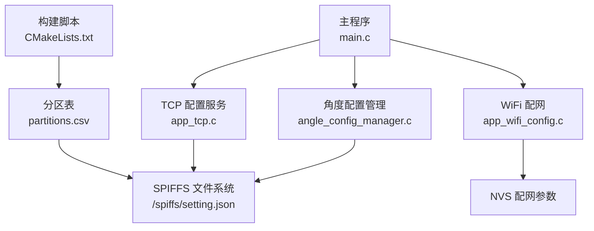
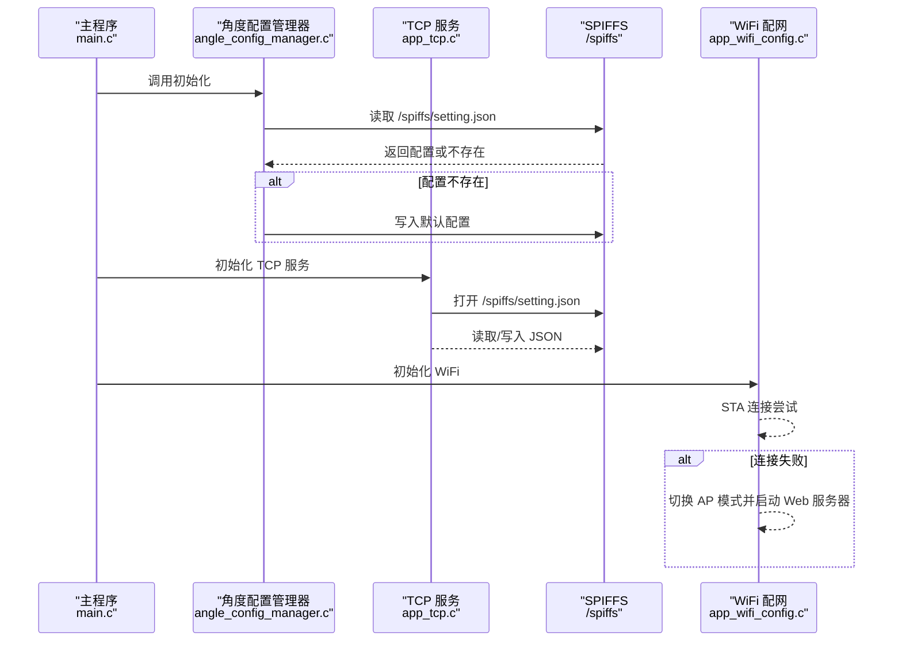
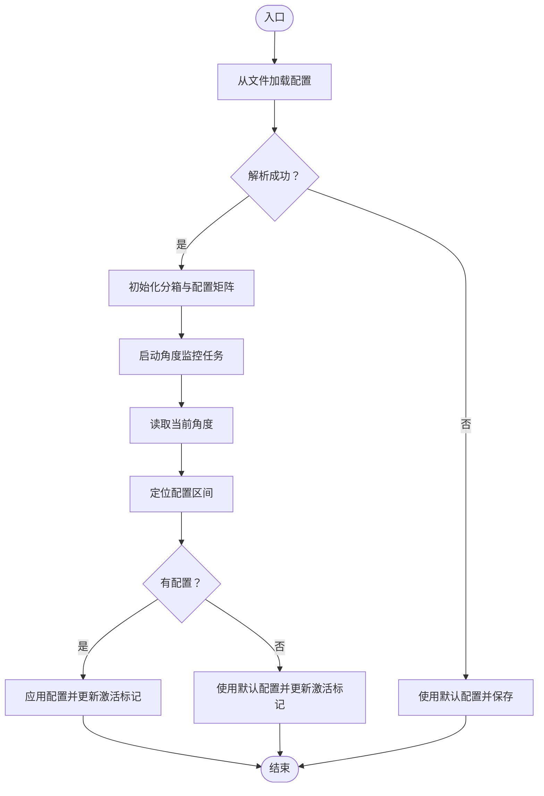
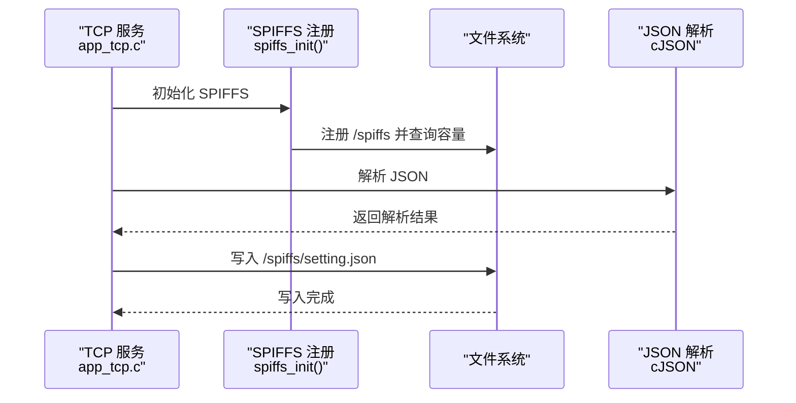
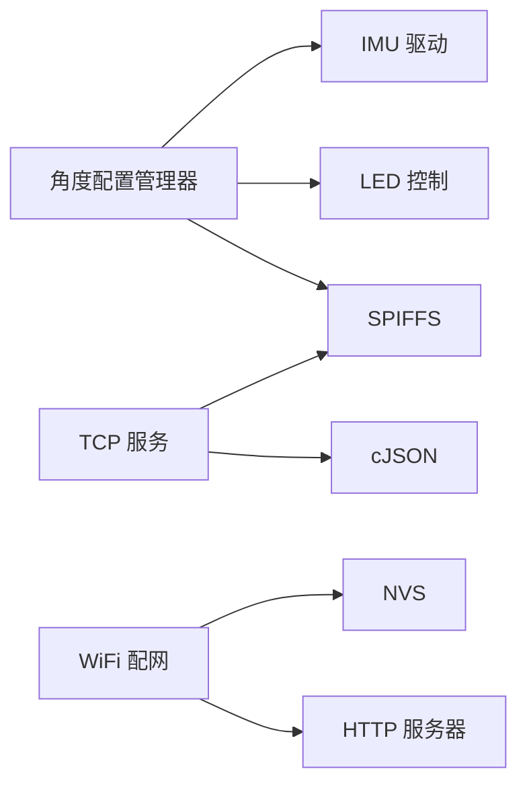

# 配置管理系统

<cite>
**本文档引用的文件**
- [main.c](file://main/main.c)
- [angle_config_manager.h](file://main/app/angle/angle_config_manager.h)
- [angle_config_manager.c](file://main/app/angle/angle_config_manager.c)
- [app_tcp.c](file://main/app/tcp/app_tcp.c)
- [app_wifi_config.h](file://main/app/wifi/app_wifi_config.h)
- [app_wifi_config.c](file://main/app/wifi/app_wifi_config.c)
- [CMakeLists.txt](file://main/CMakeLists.txt)
- [partitions.csv](file://partitions.csv)
- [sdkconfig.defaults](file://sdkconfig.defaults)
</cite>

## 目录
1. [引言](#引言)
2. [项目结构](#项目结构)
3. [核心组件](#核心组件)
4. [架构总览](#架构总览)
5. [详细组件分析](#详细组件分析)
6. [依赖关系分析](#依赖关系分析)
7. [性能考虑](#性能考虑)
8. [故障排查指南](#故障排查指南)
9. [结论](#结论)
10. [附录](#附录)

## 引言
本文件面向配置管理系统，系统通过 JSON 文件对设备行为进行分类配置，并结合 SPIFFS 文件系统持久化存储。系统支持：
- JSON 配置文件格式规范与字段定义
- 动态配置更新（热加载、变更通知、回滚机制）
- SPIFFS 文件系统使用（挂载、读写、空间管理）
- 配置项分类管理（按角度区间）、默认值设置与用户自定义配置
- 配置迁移策略、版本兼容性与配置备份恢复方法

## 项目结构
项目采用 ESP-IDF 组件化组织，配置相关功能主要分布在以下模块：
- 角度配置管理：负责将灯光配置按俯仰/横滚角度分箱存储与热切换
- TCP 配置服务：提供二进制协议封装的 JSON/MUSIC 数据接收与持久化
- WiFi 配网：提供 Web 配网页面与 NVS 存储
- SPIFFS 分区：通过分区表与构建脚本生成可写文件系统分区

图表来源
- [main.c:33-60](file://main/main.c#L33-L60)
- [angle_config_manager.c:195-204](file://main/app/angle/angle_config_manager.c#L195-L204)
- [app_tcp.c:354-359](file://main/app/tcp/app_tcp.c#L354-L359)
- [app_wifi_config.c:265-302](file://main/app/wifi/app_wifi_config.c#L265-L302)
- [partitions.csv:1-6](file://partitions.csv#L1-L6)
- [CMakeLists.txt:1-4](file://main/CMakeLists.txt#L1-L4)

章节来源
- [main.c:33-60](file://main/main.c#L33-L60)
- [CMakeLists.txt:1-4](file://main/CMakeLists.txt#L1-L4)
- [partitions.csv:1-6](file://partitions.csv#L1-L6)

## 核心组件
- 角度配置管理器：提供初始化、按角度保存配置、热加载与切换逻辑
- TCP 配置服务：解析前缀协议，接收 JSON/MUSIC 数据，持久化到 SPIFFS
- WiFi 配网：STA/AP 自动切换，Web 表单提交，NVS 存储
- SPIFFS 分区：通过分区表与构建脚本生成，支持格式化与容量查询

章节来源
- [angle_config_manager.h:6-19](file://main/app/angle/angle_config_manager.h#L6-L19)
- [angle_config_manager.c:44-93](file://main/app/angle/angle_config_manager.c#L44-L93)
- [app_tcp.c:107-133](file://main/app/tcp/app_tcp.c#L107-L133)
- [app_wifi_config.c:265-302](file://main/app/wifi/app_wifi_config.c#L265-L302)

## 架构总览
系统通过主程序统一初始化各子系统，其中：
- 角度配置管理器在启动时从 SPIFFS 加载 JSON 配置，若不存在则生成默认配置并保存
- TCP 服务监听端口，接收带前缀的数据帧，解析 JSON 并持久化，同时驱动 LED 配置更新
- WiFi 配网在 STA 连接失败后自动切换至 AP 模式并提供 Web 页面供用户输入 SSID/密码，保存至 NVS 并重启

图表来源
- [main.c:33-60](file://main/main.c#L33-L60)
- [angle_config_manager.c:195-204](file://main/app/angle/angle_config_manager.c#L195-L204)
- [app_tcp.c:354-359](file://main/app/tcp/app_tcp.c#L354-L359)
- [app_wifi_config.c:265-302](file://main/app/wifi/app_wifi_config.c#L265-L302)

## 详细组件分析

### JSON 配置文件格式规范与字段定义
- 文件位置：/spiffs/setting.json
- 根对象字段
  - version: 整数，当前配置版本号（用于迁移与兼容性）
  - default: 对象或 null，全局默认配置
  - zones: 对象，包含角度分箱与配置矩阵
    - pitch_bins: 数组，俯仰角分箱边界
    - roll_bins: 数组，横滚角分箱边界
    - configs: 二维数组，按 pitch_bins × roll_bins 的配置矩阵；null 表示未配置
- 单个配置项结构
  - type: 整数，配置类型标识
  - data: 对象，具体配置数据（如颜色、动画参数等）

验证机制
- 解析失败：返回错误，避免覆盖有效配置
- 默认值回退：当某区间无配置时，回退到 default
- 版本控制：通过 version 字段区分不同版本，便于后续迁移

章节来源
- [angle_config_manager.c:96-144](file://main/app/angle/angle_config_manager.c#L96-L144)
- [angle_config_manager.c:59-92](file://main/app/angle/angle_config_manager.c#L59-L92)

### 动态配置更新与热加载
- 角度监控任务：周期读取 IMU 角度，计算所在区间，比较当前激活配置与目标配置，触发 LED 更新
- 实时保存：调用保存接口后立即写盘，确保断电不丢失
- 变更通知：LED 配置更新后记录当前激活配置，避免重复切换
- 回滚机制：若写盘失败，保留原配置不变；解析失败时也保持原状

图表来源
- [angle_config_manager.c:195-204](file://main/app/angle/angle_config_manager.c#L195-L204)
- [angle_config_manager.c:177-193](file://main/app/angle/angle_config_manager.c#L177-L193)
- [angle_config_manager.c:146-153](file://main/app/angle/angle_config_manager.c#L146-L153)

章节来源
- [angle_config_manager.c:177-193](file://main/app/angle/angle_config_manager.c#L177-L193)
- [angle_config_manager.c:162-175](file://main/app/angle/angle_config_manager.c#L162-L175)

### SPIFFS 文件系统使用
- 挂载与检测：首次访问前检查 /spiffs/test 是否存在，避免重复注册；失败时可格式化
- 信息查询：获取总容量与已用空间，便于监控
- 读写操作：提供通用 JSON 读写与音频文件写入接口
- 分区与构建：通过分区表定义 storage 分区大小，构建脚本生成文件系统镜像

图表来源
- [app_tcp.c:107-133](file://main/app/tcp/app_tcp.c#L107-L133)
- [app_tcp.c:135-153](file://main/app/tcp/app_tcp.c#L135-L153)

章节来源
- [app_tcp.c:107-133](file://main/app/tcp/app_tcp.c#L107-L133)
- [app_tcp.c:135-153](file://main/app/tcp/app_tcp.c#L135-L153)
- [partitions.csv:1-6](file://partitions.csv#L1-L6)
- [CMakeLists.txt:1-4](file://main/CMakeLists.txt#L1-L4)

### 配置项分类管理、默认值与用户自定义
- 分类管理：按俯仰/横滚角度分箱，形成二维矩阵；每个区间独立配置
- 默认值：当区间为空时回退到 default 字段
- 用户自定义：通过 Web 配网页面或 TCP 接口上传 JSON，覆盖对应区间或全局默认值

章节来源
- [angle_config_manager.c:16-42](file://main/app/angle/angle_config_manager.c#L16-L42)
- [angle_config_manager.c:63-89](file://main/app/angle/angle_config_manager.c#L63-L89)
- [app_wifi_config.c:169-219](file://main/app/wifi/app_wifi_config.c#L169-L219)

### 配置迁移策略与版本兼容
- 版本字段：version 用于标识配置版本
- 迁移策略：读取旧版本配置时，根据版本号执行映射与转换，再写回新格式
- 兼容性：新增字段默认 null 或使用安全默认值，避免解析失败

章节来源
- [angle_config_manager.c:97](file://main/app/angle/angle_config_manager.c#L97)

### 配置备份与恢复
- 备份：定期导出 /spiffs/setting.json 至外部存储
- 恢复：将备份文件写回 /spiffs/setting.json，重启后自动加载
- 注意：恢复前建议停止写入，避免并发写导致损坏

章节来源
- [angle_config_manager.c:95-144](file://main/app/angle/angle_config_manager.c#L95-L144)

## 依赖关系分析
- 组件耦合
  - 角度配置管理器依赖 IMU 提供角度，依赖 LED 更新配置
  - TCP 服务依赖 SPIFFS 与 cJSON 进行持久化与解析
  - WiFi 配网依赖 NVS 存储与 HTTP 服务器
- 外部依赖
  - ESP-IDF 文件系统与网络栈
  - cJSON JSON 解析库
  - FreeRTOS 任务与信号量

图表来源
- [angle_config_manager.c:195-204](file://main/app/angle/angle_config_manager.c#L195-L204)
- [app_tcp.c:354-359](file://main/app/tcp/app_tcp.c#L354-L359)
- [app_wifi_config.c:265-302](file://main/app/wifi/app_wifi_config.c#L265-L302)

## 性能考虑
- 角度监控频率：建议根据 IMU 更新速率调整轮询间隔，避免频繁切换
- JSON 解析：批量写入时合并多次保存，减少磁盘写入次数
- SPIFFS 写入：启用缓存与写回策略，避免碎片化；定期检查剩余空间
- 内存管理：字符串复制与 JSON 打印需及时释放，防止内存泄漏

## 故障排查指南
- 配置文件无法打开
  - 检查 SPIFFS 是否正确挂载与格式化
  - 确认 /spiffs/setting.json 权限与路径
- JSON 解析失败
  - 校验 JSON 格式与字段完整性
  - 检查 version 与 zones 结构一致性
- 角度切换无效
  - 确认 IMU 角度读取正常
  - 检查当前区间是否存在配置或默认值
- WiFi 配网失败
  - 检查 NVS 是否成功写入 SSID/密码
  - 确认 AP 模式与 Web 页面可用

章节来源
- [app_tcp.c:138-153](file://main/app/tcp/app_tcp.c#L138-L153)
- [angle_config_manager.c:44-93](file://main/app/angle/angle_config_manager.c#L44-L93)
- [app_wifi_config.c:203-208](file://main/app/wifi/app_wifi_config.c#L203-L208)

## 结论
本配置管理系统通过 JSON 文件与 SPIFFS 持久化实现了灵活的配置管理与动态更新能力。系统具备：
- 明确的 JSON 格式规范与版本控制
- 基于角度分箱的配置分类与热切换
- 安全的写盘与回退机制
- 便捷的 SPIFFS 使用与空间管理
- 可扩展的迁移与备份恢复策略

## 附录

### JSON 配置文件字段说明
- version: 整数，配置版本号
- default: 对象或 null，全局默认配置
- zones.pitch_bins: 一维数组，俯仰角分箱边界
- zones.roll_bins: 一维数组，横滚角分箱边界
- zones.configs: 二维数组，按分箱索引存储配置；null 表示未配置

章节来源
- [angle_config_manager.c:96-144](file://main/app/angle/angle_config_manager.c#L96-L144)