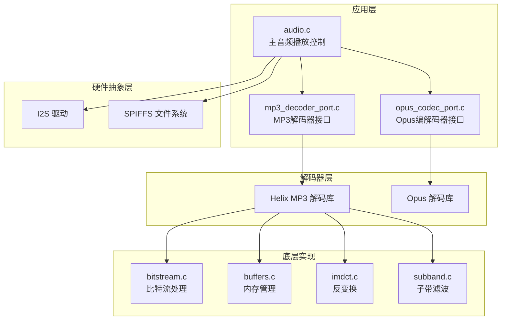
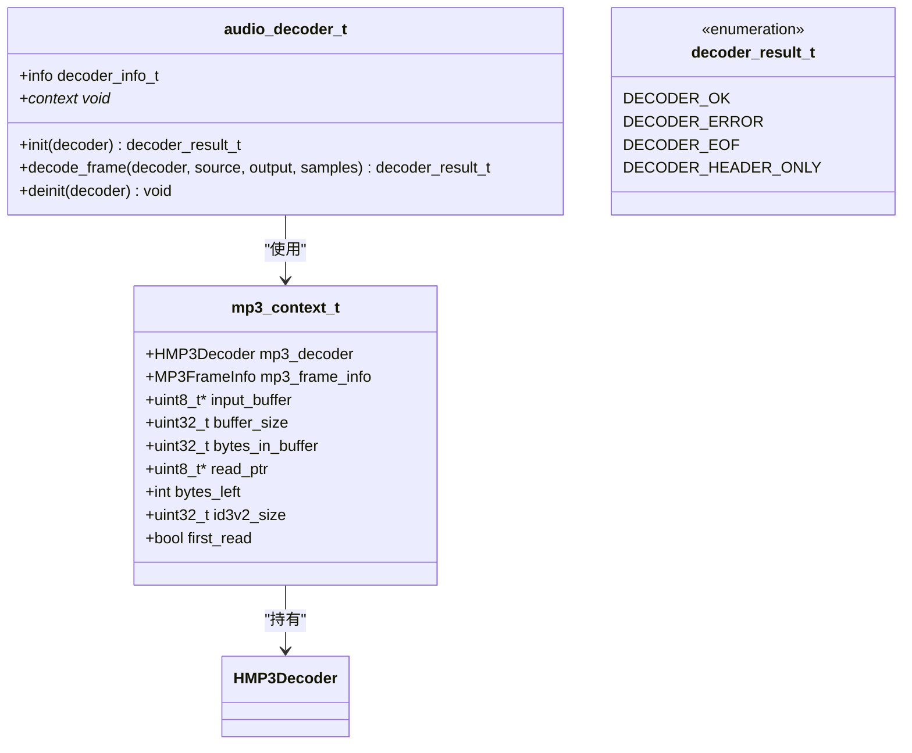
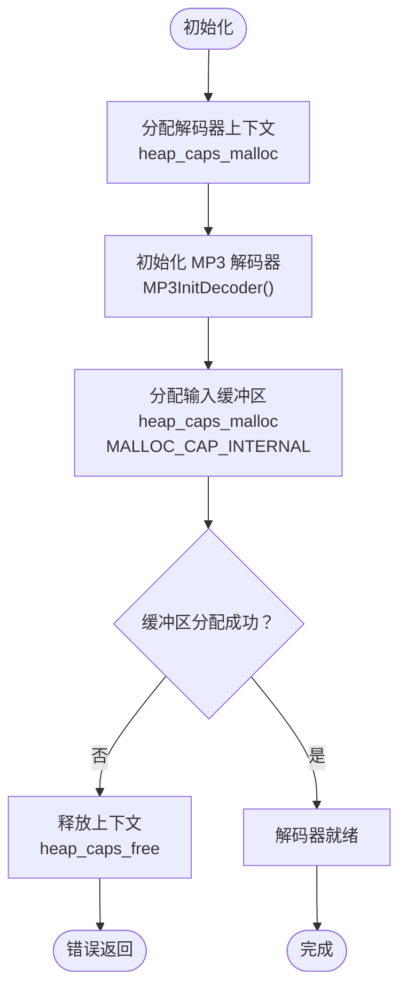
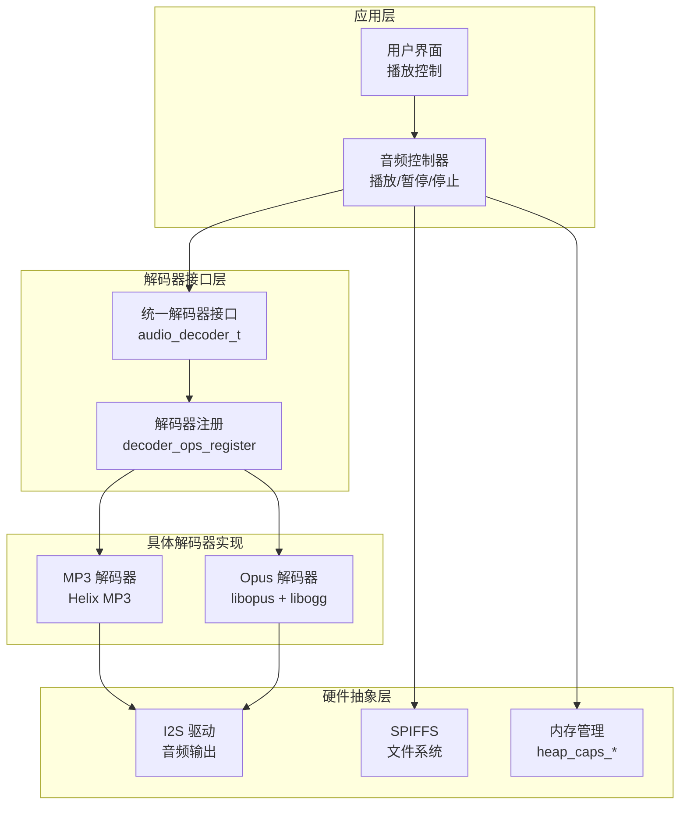
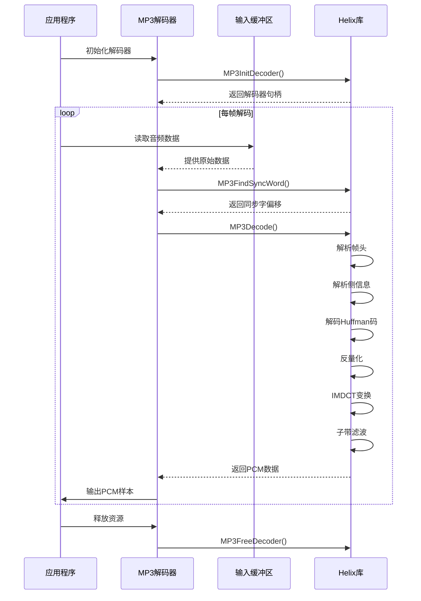
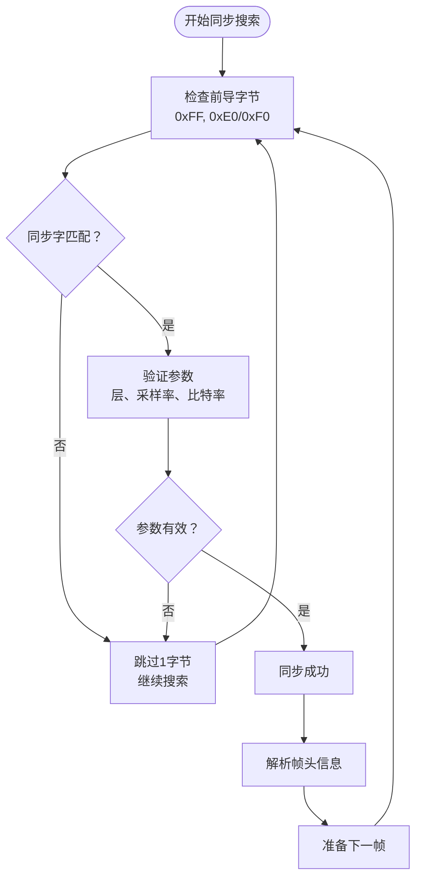
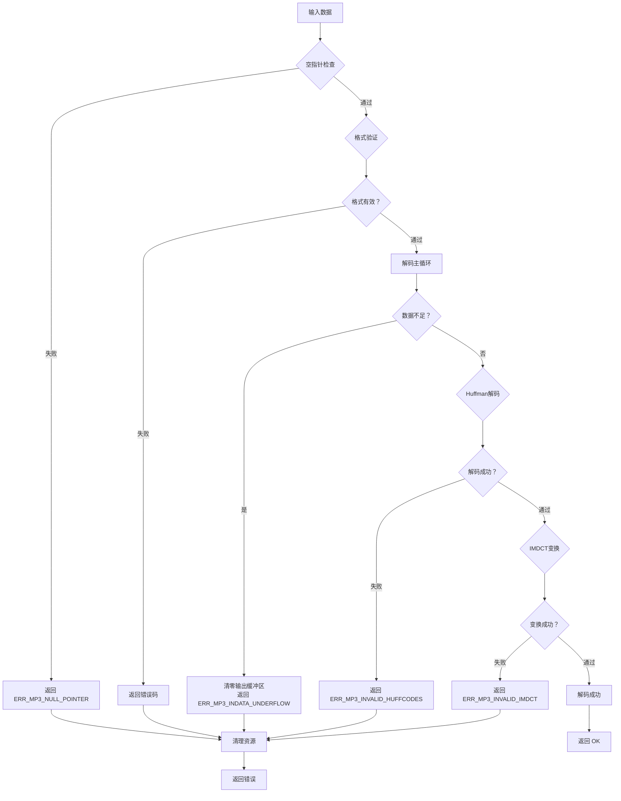
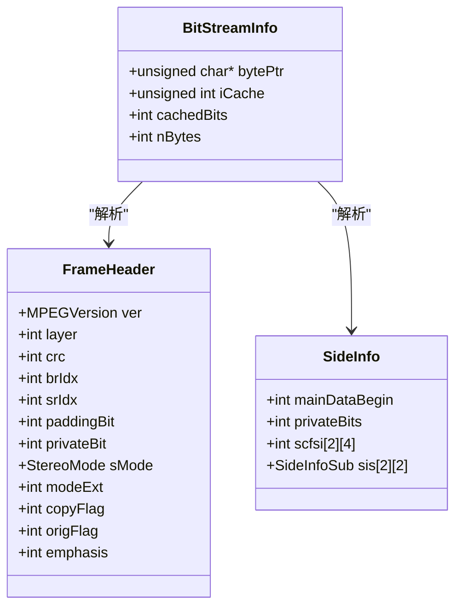
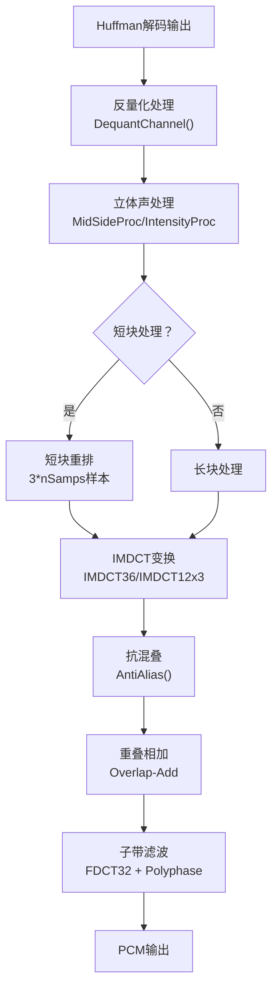
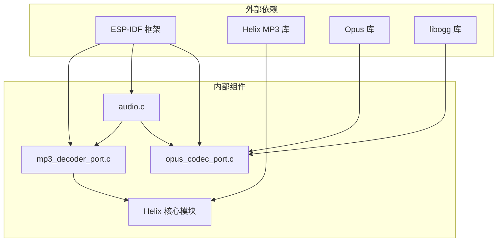

# MP3 音频解码

<cite>
**本文档引用的文件**
- [mp3_decoder_port.c](file://main/app/audio/mp3_decoder_port.c)
- [audio.c](file://main/app/audio/audio.c)
- [opus_codec_port.c](file://main/app/audio/opus_codec_port.c)
- [CMakeLists.txt](file://components/helix-mp3/CMakeLists.txt)
- [mp3dec.h](file://components/helix-mp3/fixpnt/pub/mp3dec.h)
- [mp3common.h](file://components/helix-mp3/fixpnt/pub/mp3common.h)
- [bitstream.c](file://components/helix-mp3/fixpnt/real/bitstream.c)
- [buffers.c](file://components/helix-mp3/fixpnt/real/buffers.c)
- [mp3dec.c](file://components/helix-mp3/fixpnt/mp3dec.c)
- [huffman.c](file://components/helix-mp3/fixpnt/real/huffman.c)
- [imdct.c](file://components/helix-mp3/fixpnt/real/imdct.c)
- [subband.c](file://components/helix-mp3/fixpnt/real/subband.c)
- [dequant.c](file://components/helix-mp3/fixpnt/real/dequant.c)
- [dqchan.c](file://components/helix-mp3/fixpnt/real/dqchan.c)
- [stproc.c](file://components/helix-mp3/fixpnt/real/stproc.c)
</cite>

## 目录
1. [简介](#简介)
2. [项目结构](#项目结构)
3. [核心组件](#核心组件)
4. [架构概览](#架构概览)
5. [详细组件分析](#详细组件分析)
6. [依赖关系分析](#依赖关系分析)
7. [性能考虑](#性能考虑)
8. [故障排除指南](#故障排除指南)
9. [结论](#结论)
10. [附录](#附录)

## 简介

本技术文档详细介绍了基于 Helix MP3 解码库的 MP3 音频解码系统在 ESP-IDF 项目中的实现。该系统提供了完整的 MP3 解码功能，包括帧同步、错误处理、内存管理和与硬件平台的集成。

系统采用模块化设计，主要包含以下核心功能：
- Helix MP3 解码库的完整集成
- MP3 文件格式支持和 ID3v2 头部处理
- 帧同步机制和错误恢复策略
- 与 Opus 编解码的对比分析
- 采样率转换和音频质量控制
- 性能优化和内存管理

## 项目结构

项目采用分层架构设计，主要分为以下几个层次：

**图表来源**
- [audio.c:1-925](file://main/app/audio/audio.c#L1-L925)
- [mp3_decoder_port.c:1-216](file://main/app/audio/mp3_decoder_port.c#L1-L216)
- [opus_codec_port.c:1-410](file://main/app/audio/opus_codec_port.c#L1-L410)

**章节来源**
- [audio.c:1-925](file://main/app/audio/audio.c#L1-L925)
- [CMakeLists.txt:1-31](file://components/helix-mp3/CMakeLists.txt#L1-L31)

## 核心组件

### MP3 解码器接口

应用层通过统一的解码器接口与不同的音频格式解码器交互：

**图表来源**
- [mp3_decoder_port.c:16-26](file://main/app/audio/mp3_decoder_port.c#L16-L26)
- [mp3_decoder_port.c:44-76](file://main/app/audio/mp3_decoder_port.c#L44-L76)

### 内存管理系统

系统实现了高效的内存管理策略，特别针对 ESP32 的内存特性进行了优化：

**图表来源**
- [mp3_decoder_port.c:44-76](file://main/app/audio/mp3_decoder_port.c#L44-L76)

**章节来源**
- [mp3_decoder_port.c:1-216](file://main/app/audio/mp3_decoder_port.c#L1-L216)
- [buffers.c:112-184](file://components/helix-mp3/fixpnt/real/buffers.c#L112-L184)

## 架构概览

系统采用分层架构，从上到下分别为应用层、解码器接口层、具体解码器实现层和底层硬件抽象层：

**图表来源**
- [audio.c:72-92](file://main/app/audio/audio.c#L72-L92)
- [mp3_decoder_port.c:206-214](file://main/app/audio/mp3_decoder_port.c#L206-L214)

## 详细组件分析

### MP3 解码流程

MP3 解码过程遵循标准的 MPEG-1 Layer III 解码流程：

**图表来源**
- [mp3dec.c:280-417](file://components/helix-mp3/fixpnt/mp3dec.c#L280-L417)
- [mp3_decoder_port.c:78-189](file://main/app/audio/mp3_decoder_port.c#L78-L189)

### 帧同步机制

MP3 帧同步是解码过程的关键步骤，系统实现了鲁棒的同步检测算法：

**图表来源**
- [mp3dec.c:104-115](file://components/helix-mp3/fixpnt/mp3dec.c#L104-L115)
- [bitstream.c:218-283](file://components/helix-mp3/fixpnt/real/bitstream.c#L218-L283)

**章节来源**
- [mp3dec.c:104-167](file://components/helix-mp3/fixpnt/mp3dec.c#L104-L167)
- [bitstream.c:218-283](file://components/helix-mp3/fixpnt/real/bitstream.c#L218-L283)

### 错误处理策略

系统实现了多层次的错误处理机制：

**图表来源**
- [mp3dec.c:280-417](file://components/helix-mp3/fixpnt/mp3dec.c#L280-L417)
- [mp3dec.h:96-112](file://components/helix-mp3/fixpnt/pub/mp3dec.h#L96-L112)

**章节来源**
- [mp3dec.c:236-257](file://components/helix-mp3/fixpnt/mp3dec.c#L236-L257)
- [mp3dec.h:96-131](file://components/helix-mp3/fixpnt/pub/mp3dec.h#L96-L131)

### Helix MP3 解码器核心实现

#### 比特流处理模块

比特流处理模块负责从原始字节流中提取编码参数：

**图表来源**
- [bitstream.c:60-67](file://components/helix-mp3/fixpnt/real/bitstream.c#L60-L67)
- [bitstream.c:218-283](file://components/helix-mp3/fixpnt/real/bitstream.c#L218-L283)

#### 反量化和变换模块

反量化模块将频域系数转换为时域信号：

**图表来源**
- [dequant.c:73-158](file://components/helix-mp3/fixpnt/real/dequant.c#L73-L158)
- [imdct.c:717-779](file://components/helix-mp3/fixpnt/real/imdct.c#L717-L779)
- [subband.c:60-95](file://components/helix-mp3/fixpnt/real/subband.c#L60-L95)

**章节来源**
- [dequant.c:73-158](file://components/helix-mp3/fixpnt/real/dequant.c#L73-L158)
- [imdct.c:717-779](file://components/helix-mp3/fixpnt/real/imdct.c#L717-L779)
- [subband.c:60-95](file://components/helix-mp3/fixpnt/real/subband.c#L60-L95)

## 依赖关系分析

### 组件间依赖关系

**图表来源**
- [audio.c:1-14](file://main/app/audio/audio.c#L1-L14)
- [mp3_decoder_port.c:1-8](file://main/app/audio/mp3_decoder_port.c#L1-L8)
- [opus_codec_port.c:1-7](file://main/app/audio/opus_codec_port.c#L1-L7)

### 内存布局和优化

系统采用了专门的内存管理策略来适应 ESP32 的内存限制：

| 内存类型 | 分配函数 | 使用场景 | 大小 |
|---------|---------|---------|------|
| MALLOC_CAP_INTERNAL | heap_caps_malloc | 解码器上下文、输入缓冲区 | 动态分配 |
| MALLOC_CAP_SPIRAM | heap_caps_malloc | 编码器上下文、OPUS缓冲区 | 动态分配 |
| 静态缓冲区 | 预分配 | Helix 内部数据结构 | 固定大小 |

**章节来源**
- [mp3_decoder_port.c:48-67](file://main/app/audio/mp3_decoder_port.c#L48-L67)
- [buffers.c:54-67](file://components/helix-mp3/fixpnt/real/buffers.c#L54-L67)

## 性能考虑

### 内存优化策略

1. **静态内存分配**：Helix MP3 解码器支持静态缓冲区模式，减少动态内存分配开销
2. **内部RAM优先**：强制使用 ESP32 的内部 RAM 进行解码操作
3. **缓冲区复用**：输入缓冲区在帧之间复用，避免频繁分配释放

### 处理器优化

1. **定点运算**：使用定点数代替浮点运算，提高处理速度
2. **SIMD 指令**：利用 ARM DSP 指令集优化乘法运算
3. **流水线处理**：解码过程采用流水线架构，提高吞吐量

### 内存使用分析

| 组件 | 内存占用 | 优化策略 |
|------|----------|----------|
| MP3 解码器上下文 | ~2KB | 静态分配 |
| 输入缓冲区 | CONFIG_MP3_FILE_BUFF_SIZE | 可配置大小 |
| PCM 输出缓冲区 | 1152×2×2字节 | 固定大小 |
| Helix 内部缓冲区 | ~2032字节 | 静态分配 |

## 故障排除指南

### 常见解码错误及解决方案

| 错误类型 | 错误码 | 可能原因 | 解决方案 |
|---------|--------|---------|----------|
| 同步失败 | ERR_MP3_FREE_BITRATE_SYNC | 无法找到同步字 | 检查输入数据完整性 |
| 数据不足 | ERR_MP3_INDATA_UNDERFLOW | 缓冲区数据不足 | 增大缓冲区大小 |
| 帧头无效 | ERR_MP3_INVALID_FRAMEHEADER | 非法MP3数据 | 验证文件格式 |
| Huffman解码错误 | ERR_MP3_INVALID_HUFFCODES | 比特流损坏 | 重新传输数据 |
| IMDCT变换失败 | ERR_MP3_INVALID_IMDCT | 变换参数错误 | 检查解码器状态 |

### 调试技巧

1. **日志记录**：启用详细的调试日志输出
2. **内存监控**：监控内存使用情况，防止内存泄漏
3. **性能分析**：使用性能分析工具识别瓶颈
4. **单元测试**：编写单元测试验证各个组件功能

**章节来源**
- [mp3dec.h:96-112](file://components/helix-mp3/fixpnt/pub/mp3dec.h#L96-L112)
- [mp3_decoder_port.c:168-172](file://main/app/audio/mp3_decoder_port.c#L168-L172)

## 结论

本 MP3 音频解码系统成功集成了 Helix MP3 解码库，提供了完整的 MP3 解码功能。系统具有以下特点：

1. **模块化设计**：采用分层架构，便于维护和扩展
2. **内存优化**：针对 ESP32 平台进行了专门的内存优化
3. **错误处理**：实现了完善的错误检测和恢复机制
4. **性能优化**：通过多种技术手段提高了解码性能

与 Opus 编解码相比，MP3 解码更适合于：
- 已有大量 MP3 内容的场景
- 对兼容性要求较高的应用
- 需要固定比特率输出的应用

而 Opus 编解码更适合于：
- 需要高质量音频的应用
- 实时通信场景
- 可变比特率需求的应用

## 附录

### 配置选项

| 选项 | 默认值 | 描述 |
|------|--------|------|
| CONFIG_MP3_FILE_BUFF_SIZE | 4096 | MP3文件缓冲区大小 |
| CONFIG_OPUS_AUDIO_DECODER_SAMPLE_RATE | 16000 | Opus解码采样率 |
| CONFIG_OPUS_AUDIO_CHANNELS | 1 | Opus解码声道数 |
| CONFIG_OPUS_FILE_BUFF_SIZE | 1024 | Opus文件缓冲区大小 |

### 支持的音频格式

| 格式 | 层 | 采样率范围 | 比特率 | 用途 |
|------|----|-----------|--------|------|
| MP3 | Layer III | 32-48 kHz | 32-320 kbps | 通用音频播放 |
| Opus | 无层概念 | 8-48 kHz | 6-510 kbps | 实时通信 |

### 性能基准

| 操作 | 时间复杂度 | 空间复杂度 |
|------|-----------|-----------|
| MP3帧解码 | O(N) | O(1) |
| 帧同步 | O(B) | O(1) |
| 内存分配 | O(1) | O(1) |
| 错误处理 | O(1) | O(1) |