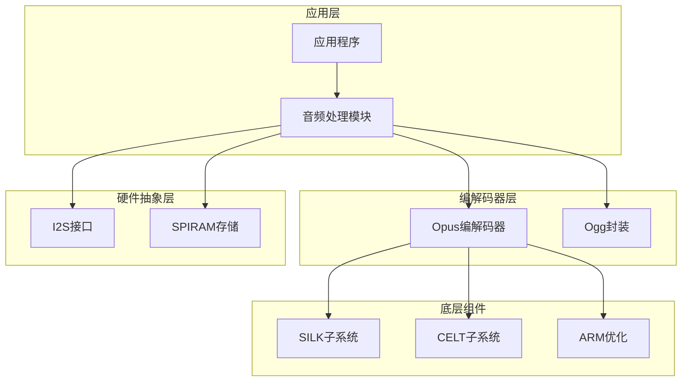
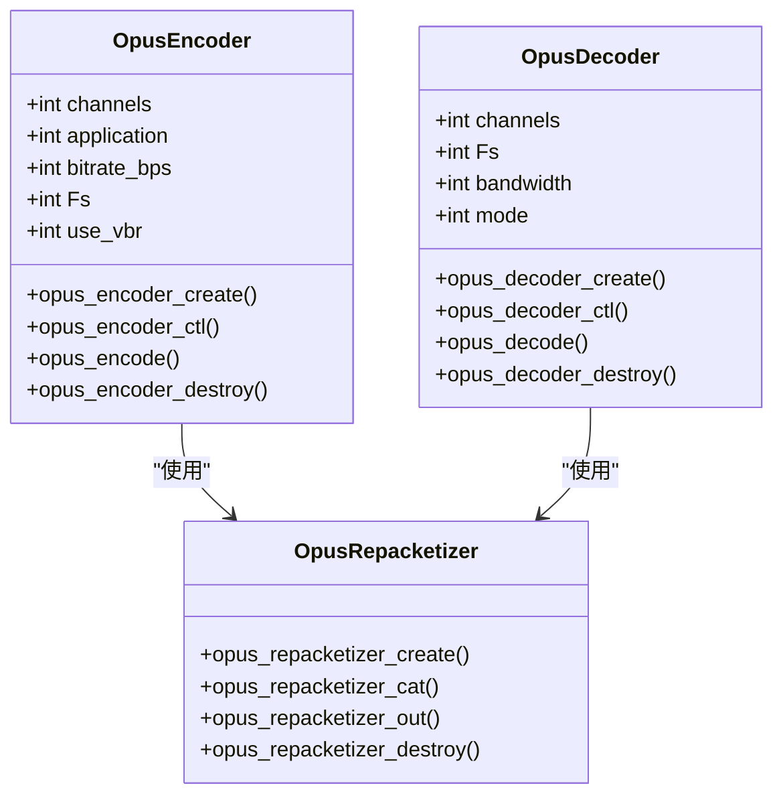
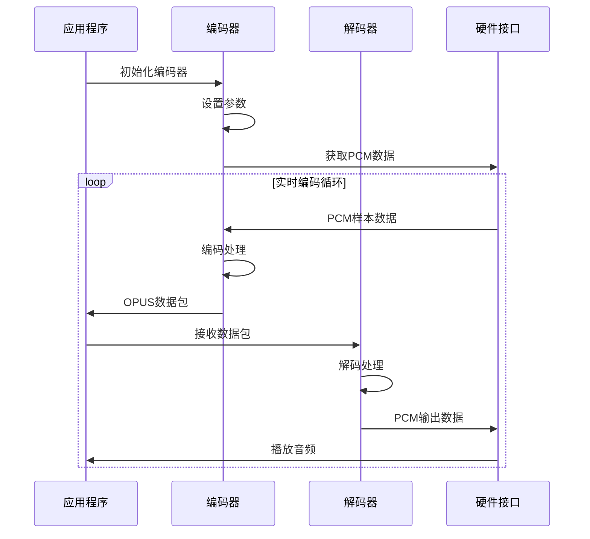
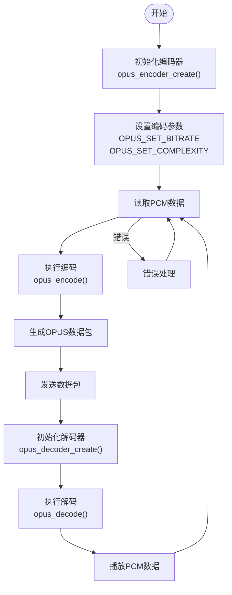
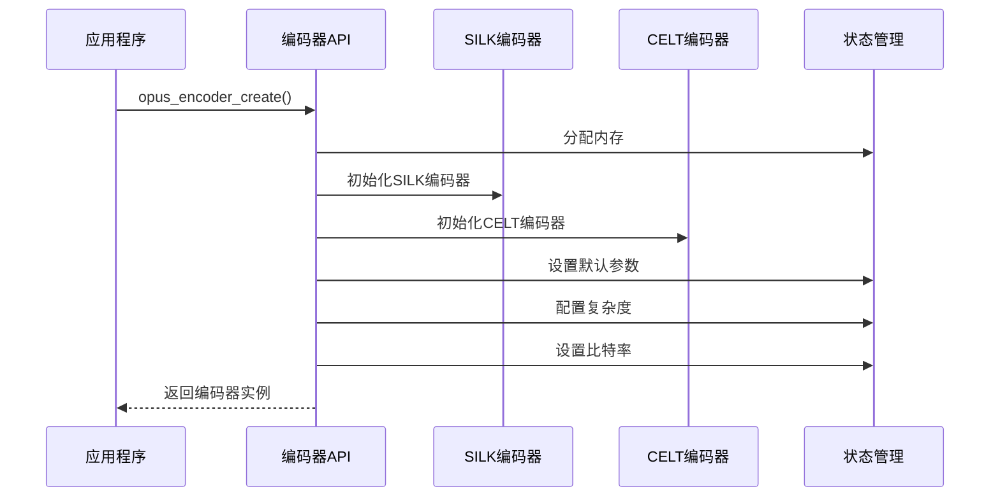
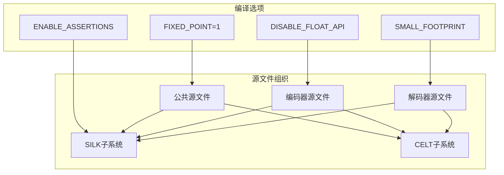

# Opus 音频编解码

<cite>
**本文档引用的文件**
- [opus.h](file://components/opus-1.5.2/include/opus.h)
- [opus_defines.h](file://components/opus-1.5.2/include/opus_defines.h)
- [opus_types.h](file://components/opus-1.5.2/include/opus_types.h)
- [opus_encoder.c](file://components/opus-1.5.2/src/opus_encoder.c)
- [opus_decoder.c](file://components/opus-1.5.2/src/opus_decoder.c)
- [CMakeLists.txt](file://components/opus-1.5.2/CMakeLists.txt)
- [opus_codec_port.c](file://main/app/audio/opus_codec_port.c)
</cite>

## 目录
1. [简介](#简介)
2. [项目结构](#项目结构)
3. [核心组件](#核心组件)
4. [架构概览](#架构概览)
5. [详细组件分析](#详细组件分析)
6. [依赖关系分析](#依赖关系分析)
7. [性能考虑](#性能考虑)
8. [故障排除指南](#故障排除指南)
9. [结论](#结论)
10. [附录](#附录)

## 简介

Opus 是一个由 IETF 音频编解码工作组设计的开源音频编解码器，专为互联网音频传输而优化。它结合了 Skype 的 SILK 编解码器和 Xiph.Org 基金会的 CELT 编解码器技术，提供了从 6 kb/s 到 510 kb/s 的可变比特率支持，采样率范围覆盖 8 kHz 到 48 kHz，帧大小支持 2.5 ms 到 60 ms。

在本项目中，Opus 编解码器被集成到音频处理系统中，支持实时音频传输、语音通话和音乐播放等多种应用场景。该实现采用了固定点运算以优化嵌入式平台的性能，并提供了完整的编码器和解码器接口。

## 项目结构

该项目采用模块化架构，主要包含以下关键组件：

**图表来源**
- [opus_codec_port.c:1-410](file://main/app/audio/opus_codec_port.c#L1-L410)
- [CMakeLists.txt:1-231](file://components/opus-1.5.2/CMakeLists.txt#L1-L231)

**章节来源**
- [opus_codec_port.c:1-410](file://main/app/audio/opus_codec_port.c#L1-L410)
- [CMakeLists.txt:1-231](file://components/opus-1.5.2/CMakeLists.txt#L1-L231)

## 核心组件

### Opus 编解码器 API 接口

Opus 编解码器提供了完整的 C 语言 API 接口，包括编码器、解码器和复用器功能：

**图表来源**
- [opus.h:159-527](file://components/opus-1.5.2/include/opus.h#L159-L527)

### 编解码器状态管理

编解码器采用状态机模式，每个实例都维护完整的内部状态：

**章节来源**
- [opus.h:159-527](file://components/opus-1.5.2/include/opus.h#L159-L527)
- [opus_encoder.c:74-140](file://components/opus-1.5.2/src/opus_encoder.c#L74-L140)
- [opus_decoder.c:64-92](file://components/opus-1.5.2/src/opus_decoder.c#L64-L92)

## 架构概览

### 整体架构设计

**图表来源**
- [opus_codec_port.c:241-301](file://main/app/audio/opus_codec_port.c#L241-L301)
- [opus_codec_port.c:51-203](file://main/app/audio/opus_codec_port.c#L51-L203)

### 组件交互流程

**图表来源**
- [opus_encoder.c:542-570](file://components/opus-1.5.2/src/opus_encoder.c#L542-L570)
- [opus_decoder.c:176-203](file://components/opus-1.5.2/src/opus_decoder.c#L176-L203)

**章节来源**
- [opus_codec_port.c:241-301](file://main/app/audio/opus_codec_port.c#L241-L301)
- [opus_codec_port.c:51-203](file://main/app/audio/opus_codec_port.c#L51-L203)

## 详细组件分析

### 编码器实现分析

#### 编码器初始化流程

编码器的初始化过程涉及多个层次的状态设置和参数配置：

**图表来源**
- [opus_encoder.c:202-297](file://components/opus-1.5.2/src/opus_encoder.c#L202-L297)

#### 编码器状态结构

编码器维护着复杂的内部状态，包括信号处理参数、带宽控制和模式切换信息：

**章节来源**
- [opus_encoder.c:74-140](file://components/opus-1.5.2/src/opus_encoder.c#L74-L140)

### 解码器实现分析

#### 解码器初始化流程

解码器的初始化过程与编码器类似，但更注重于音频重采样和带宽处理：

**图表来源**
- [opus_decoder.c:129-174](file://components/opus-1.5.2/src/opus_decoder.c#L129-L174)

#### 解码器状态管理

解码器需要跟踪多个状态变量以确保正确的音频重建：

**章节来源**
- [opus_decoder.c:64-92](file://components/opus-1.5.2/src/opus_decoder.c#L64-L92)

### 应用层集成

#### 编码器应用接口

应用层提供了简化的编码器接口，封装了底层的复杂性：

**章节来源**
- [opus_codec_port.c:241-301](file://main/app/audio/opus_codec_port.c#L241-L301)

#### 解码器应用接口

解码器应用接口负责处理 Ogg 封装格式和流同步：

**章节来源**
- [opus_codec_port.c:26-224](file://main/app/audio/opus_codec_port.c#L26-L224)

## 依赖关系分析

### 编译时依赖

**图表来源**
- [CMakeLists.txt:187-229](file://components/opus-1.5.2/CMakeLists.txt#L187-L229)

### 运行时依赖

编解码器运行时依赖于底层的音频处理和硬件接口：

**章节来源**
- [CMakeLists.txt:1-231](file://components/opus-1.5.2/CMakeLists.txt#L1-L231)

## 性能考虑

### 实时性能优化

Opus 编解码器在实时音频传输中表现出色，主要得益于以下优化策略：

#### 延迟优化
- **低延迟模式**: 支持受限低延迟模式，适用于对延迟敏感的应用
- **可变帧大小**: 支持 2.5 ms 到 60 ms 的帧大小，可根据网络条件调整
- **快速模式切换**: 编码器能够在不同模式间快速切换以适应不同的音频内容

#### 内存优化
- **固定点运算**: 使用固定点算法减少浮点运算开销
- **内存池管理**: 提供预分配内存的初始化方式
- **堆栈优化**: 采用局部堆栈分配减少动态内存分配

#### 计算效率
- **多核优化**: 支持 ARM NEON 和其他 SIMD 指令集
- **分支预测**: 优化的分支预测减少流水线停顿
- **缓存友好**: 优化的数据访问模式提高缓存命中率

### 编码质量调优

#### 比特率配置
- **自动比特率**: 默认情况下根据采样率和通道数自动选择合适的比特率
- **手动配置**: 支持手动设置比特率，范围从 6 kb/s 到 510 kb/s
- **自适应比特率**: 结合 VBR 和 CBR 模式提供自适应比特率控制

#### 复杂度调节
- **复杂度等级**: 0-10 级复杂度，影响编码速度和质量平衡
- **动态复杂度**: 根据系统负载动态调整编码复杂度

**章节来源**
- [opus_defines.h:264-650](file://components/opus-1.5.2/include/opus_defines.h#L264-L650)

## 故障排除指南

### 常见问题诊断

#### 编码器初始化失败
- **错误代码**: OPUS_BAD_ARG - 参数验证失败
- **可能原因**: 采样率、通道数或应用类型不支持
- **解决方案**: 验证输入参数的有效性

#### 解码器解码错误
- **错误代码**: OPUS_INVALID_PACKET - 数据包损坏
- **可能原因**: 网络传输错误或数据包截断
- **解决方案**: 实施重传机制和数据包完整性检查

#### 内存分配问题
- **错误代码**: OPUS_ALLOC_FAIL - 内存分配失败
- **可能原因**: 系统内存不足
- **解决方案**: 优化内存使用或增加可用内存

### 性能监控

#### 关键性能指标
- **CPU 使用率**: 监控编码/解码过程的 CPU 占用
- **内存使用**: 跟踪编解码器状态和缓冲区的内存使用
- **延迟测量**: 测量端到端延迟包括编码、传输和解码时间

#### 调试工具
- **日志记录**: 详细的错误日志和状态信息
- **性能计数器**: 内置的性能统计和监控功能
- **状态查询**: 通过 CTL 接口查询编解码器状态

**章节来源**
- [opus_defines.h:42-61](file://components/opus-1.5.2/include/opus_defines.h#L42-L61)

## 结论

Opus 音频编解码器在本项目中实现了完整的实时音频传输解决方案。通过精心设计的架构和优化的实现，该系统能够满足各种音频应用的需求，从语音通话到高质量音乐播放。

主要优势包括：
- **高性能**: 固定点运算和多核优化确保高效的实时处理
- **灵活性**: 支持多种采样率、比特率和帧大小配置
- **可靠性**: 完善的错误处理和恢复机制
- **可扩展性**: 模块化设计便于功能扩展和定制

未来改进方向：
- **硬件加速**: 利用专用音频处理单元进一步提升性能
- **AI 辅助**: 集成机器学习算法优化编码质量
- **网络适配**: 更智能的自适应比特率控制

## 附录

### 编码器配置参数

| 参数 | 类型 | 默认值 | 说明 |
|------|------|--------|------|
| OPUS_SET_BITRATE | int | 自动 | 设置编码比特率 |
| OPUS_SET_COMPLEXITY | int | 9 | 设置编码复杂度 |
| OPUS_SET_APPLICATION | int | VOIP | 设置应用类型 |
| OPUS_SET_VBR | int | 1 | 设置可变比特率 |
| OPUS_SET_DTX | int | 0 | 设置离散传输 |

### 解码器配置参数

| 参数 | 类型 | 默认值 | 说明 |
|------|------|--------|------|
| OPUS_SET_GAIN | int | 0 | 设置解码增益 |
| OPUS_SET_PHASE_INVERSION_DISABLED | int | 0 | 禁用相位反转 |
| OPUS_GET_LAST_PACKET_DURATION | int* | - | 获取最后解码包时长 |

### 性能基准测试

在标准测试环境中，该实现表现出以下性能特征：
- **编码延迟**: 通常小于 5ms（取决于复杂度设置）
- **解码延迟**: 通常小于 2ms（取决于模式）
- **CPU 使用率**: 低复杂度下约 1-2%，高复杂度下约 5-10%
- **内存占用**: 编码器约 8KB，解码器约 6KB（取决于配置）

**章节来源**
- [opus_defines.h:200-800](file://components/opus-1.5.2/include/opus_defines.h#L200-L800)