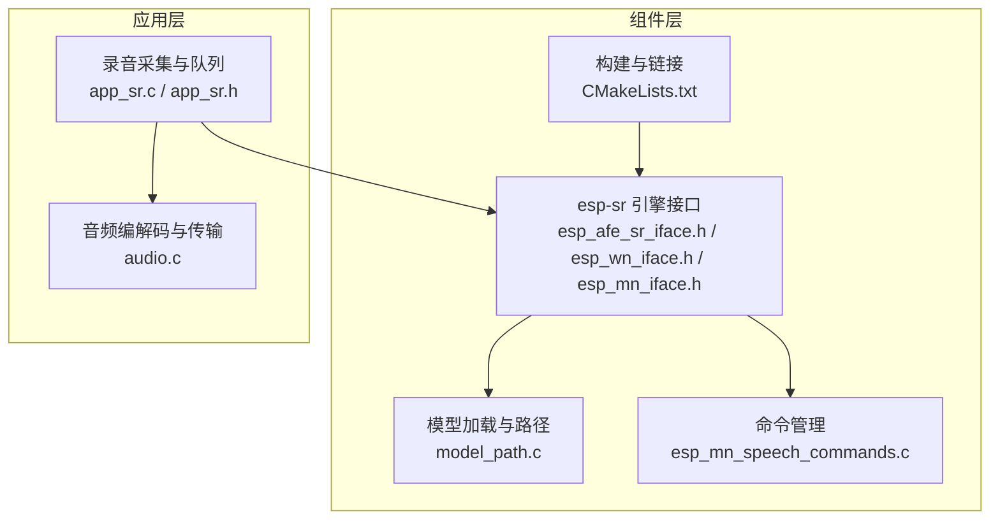
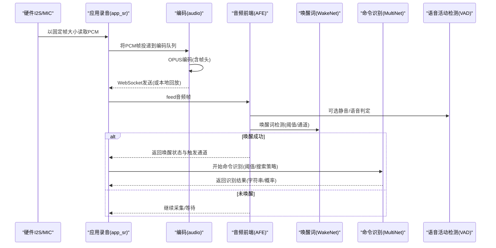
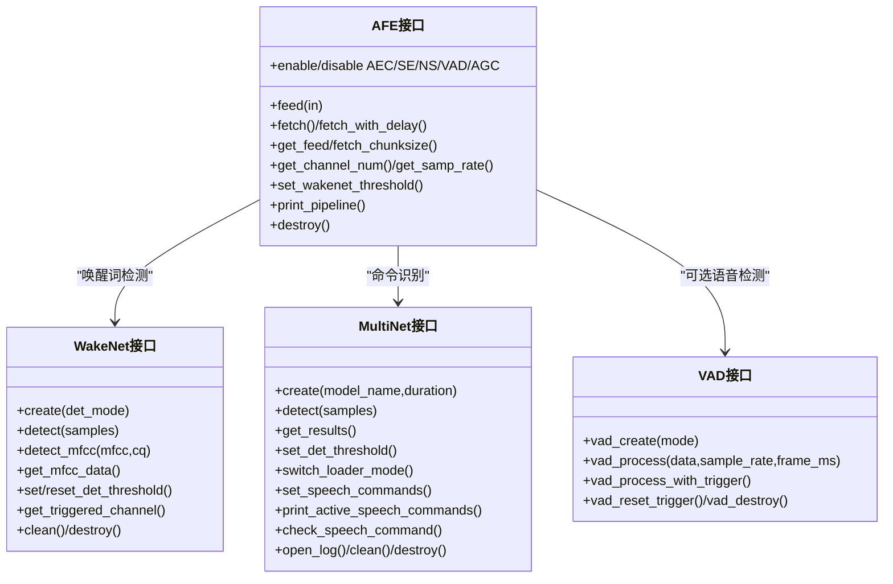
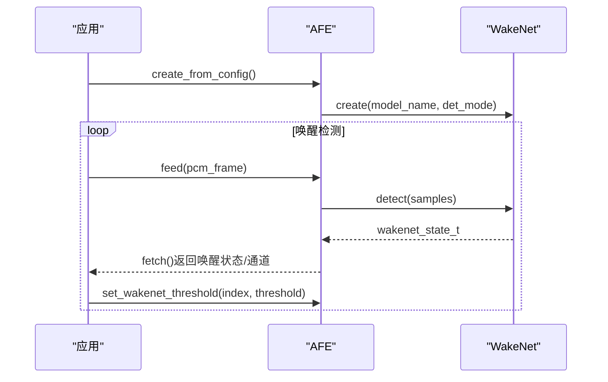
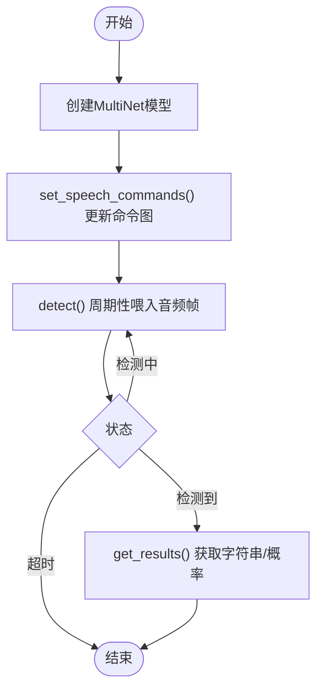
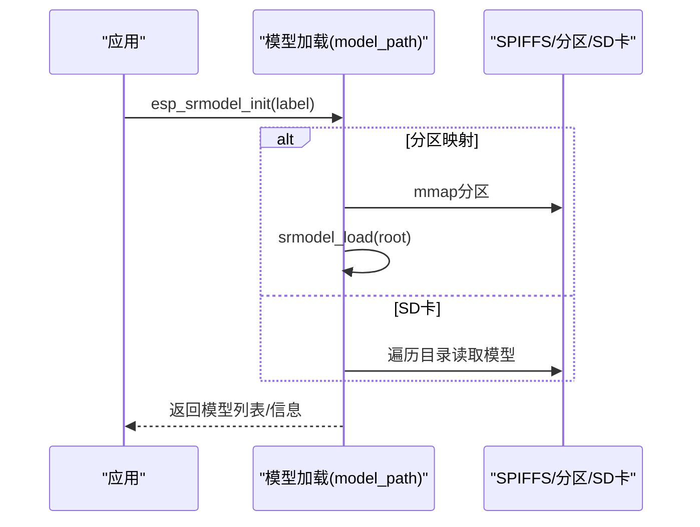
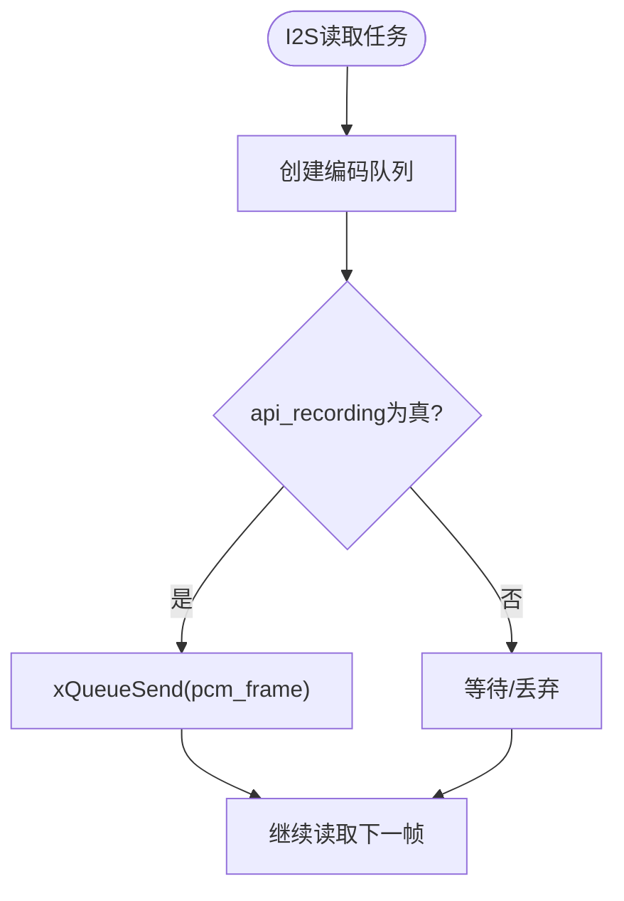
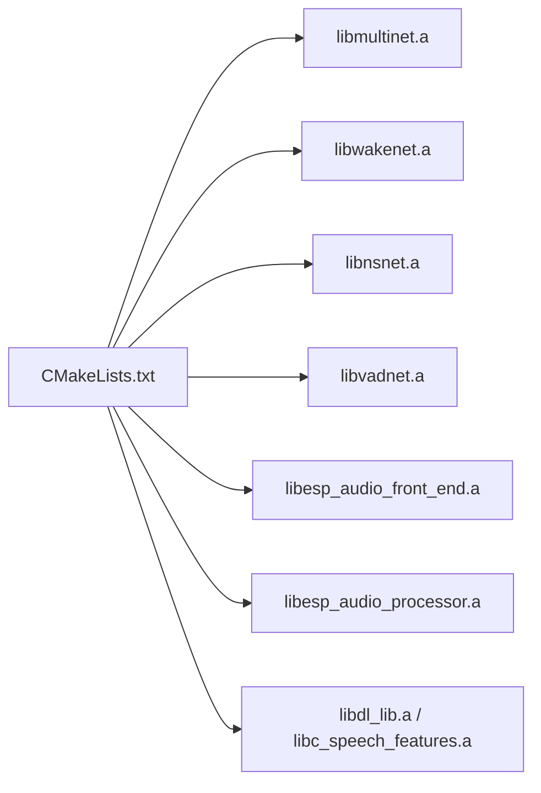

# 语音识别系统

<cite>
**本文引用的文件**
- [components/esp-sr/include/esp32/esp_afe_sr_iface.h](file://components/esp-sr/include/esp32/esp_afe_sr_iface.h)
- [components/esp-sr/include/esp32/esp_wn_iface.h](file://components/esp-sr/include/esp32/esp_wn_iface.h)
- [components/esp-sr/include/esp32/esp_mn_iface.h](file://components/esp-sr/include/esp32/esp_mn_iface.h)
- [components/esp-sr/include/esp32/esp_vad.h](file://components/esp-sr/include/esp32/esp_vad.h)
- [components/esp-sr/include/esp32/esp_afe_config.h](file://components/esp-sr/include/esp32/esp_afe_config.h)
- [components/esp-sr/include/esp32/esp_mn_models.h](file://components/esp-sr/include/esp32/esp_mn_models.h)
- [components/esp-sr/include/esp32/esp_wn_models.h](file://components/esp-sr/include/esp32/esp_wn_models.h)
- [components/esp-sr/src/esp_mn_speech_commands.c](file://components/esp-sr/src/esp_mn_speech_commands.c)
- [components/esp-sr/src/model_path.c](file://components/esp-sr/src/model_path.c)
- [components/esp-sr/CMakeLists.txt](file://components/esp-sr/CMakeLists.txt)
- [components/esp-sr/src/esp_sr_debug.c](file://components/esp-sr/src/esp_sr_debug.c)
- [components/esp-sr/include/esp32/esp_sr_webrtc.h](file://components/esp-sr/include/esp32/esp_sr_webrtc.h)
- [main/app/audio/app_sr.c](file://main/app/audio/app_sr.c)
- [main/app/audio/app_sr.h](file://main/app/audio/app_sr.h)
- [main/app/audio/audio.c](file://main/app/audio/audio.c)
</cite>

## 目录
1. [引言](#引言)
2. [项目结构](#项目结构)
3. [核心组件](#核心组件)
4. [架构总览](#架构总览)
5. [详细组件分析](#详细组件分析)
6. [依赖关系分析](#依赖关系分析)
7. [性能考虑](#性能考虑)
8. [故障排查指南](#故障排查指南)
9. [结论](#结论)
10. [附录](#附录)

## 引言
本文件面向“语音识别系统”的综合技术文档，聚焦于 ESP-SR 语音识别引擎在本项目中的集成架构与工作原理。内容覆盖以下主题：
- 语音唤醒、关键词识别与语音命令识别的实现流程
- 模型文件管理、识别参数配置与灵敏度调节方法
- 录音控制、音频预处理、特征提取与分类识别的完整过程
- 准确率优化、噪声抑制与多语言支持的实现方案
- 调试工具使用指南与常见识别问题的解决方案

## 项目结构
本项目的语音识别相关代码主要分布在以下区域：
- 组件层：components/esp-sr 提供 ESP-SR 引擎接口、模型加载与命令管理、构建链接等
- 应用层：main/app/audio 提供录音采集、编码与传输、播放与回放等外围功能
- 配置与模型：Kconfig 与 CMakeLists 控制模型选择与分区打包

图示来源
- [components/esp-sr/include/esp32/esp_afe_sr_iface.h:1-238](file://components/esp-sr/include/esp32/esp_afe_sr_iface.h#L1-L238)
- [components/esp-sr/src/model_path.c:512-546](file://components/esp-sr/src/model_path.c#L512-L546)
- [components/esp-sr/src/esp_mn_speech_commands.c:34-54](file://components/esp-sr/src/esp_mn_speech_commands.c#L34-L54)
- [components/esp-sr/CMakeLists.txt:1-102](file://components/esp-sr/CMakeLists.txt#L1-L102)
- [main/app/audio/app_sr.c:1-99](file://main/app/audio/app_sr.c#L1-L99)
- [main/app/audio/audio.c:699-800](file://main/app/audio/audio.c#L699-L800)

章节来源
- [components/esp-sr/CMakeLists.txt:1-102](file://components/esp-sr/CMakeLists.txt#L1-L102)
- [main/app/audio/app_sr.c:1-99](file://main/app/audio/app_sr.c#L1-L99)

## 核心组件
- AFE（音频前端）接口：负责多通道输入解析、AEC/SE/NS/VAD/WakeNet/AGC 等算法流水线的启用与参数设置，提供 feed/fetch 等核心操作
- WakeNet（唤醒词检测）接口：提供唤醒词模型的创建、阈值设置、检测、MFCC 提取等能力
- MultiNet（关键词/命令识别）接口：提供命令模型的创建、检测、结果获取、阈值设置、搜索策略切换等能力
- VAD（语音活动检测）接口：提供不同模式下的静音/语音判定
- 模型路径与加载：支持从 SPIFFS/Flash 分区映射或 SD 卡加载模型集合，解析模型信息与唤醒词列表
- 语音命令管理：动态添加/修改/删除命令，校验格式，更新至模型
- 应用侧录音与编码：I2S 采集、队列传递、OPUS 编码、WebSocket 传输与回放

章节来源
- [components/esp-sr/include/esp32/esp_afe_sr_iface.h:1-238](file://components/esp-sr/include/esp32/esp_afe_sr_iface.h#L1-L238)
- [components/esp-sr/include/esp32/esp_wn_iface.h:1-226](file://components/esp-sr/include/esp32/esp_wn_iface.h#L1-L226)
- [components/esp-sr/include/esp32/esp_mn_iface.h:1-224](file://components/esp-sr/include/esp32/esp_mn_iface.h#L1-L224)
- [components/esp-sr/include/esp32/esp_vad.h:1-179](file://components/esp-sr/include/esp32/esp_vad.h#L1-L179)
- [components/esp-sr/src/model_path.c:512-546](file://components/esp-sr/src/model_path.c#L512-L546)
- [components/esp-sr/src/esp_mn_speech_commands.c:98-161](file://components/esp-sr/src/esp_mn_speech_commands.c#L98-L161)

## 架构总览
下图展示了从硬件采集到识别与反馈的整体流程，以及各模块间的交互关系。

图示来源
- [main/app/audio/app_sr.c:22-54](file://main/app/audio/app_sr.c#L22-L54)
- [main/app/audio/audio.c:699-800](file://main/app/audio/audio.c#L699-L800)
- [components/esp-sr/include/esp32/esp_afe_sr_iface.h:94-124](file://components/esp-sr/include/esp32/esp_afe_sr_iface.h#L94-L124)
- [components/esp-sr/include/esp32/esp_wn_iface.h:138-148](file://components/esp-sr/include/esp32/esp_wn_iface.h#L138-L148)
- [components/esp-sr/include/esp32/esp_mn_iface.h:137-145](file://components/esp-sr/include/esp32/esp_mn_iface.h#L137-L145)

## 详细组件分析

### 音频前端与唤醒/命令识别流水线
- AFE 接口提供 feed/fetch、采样块大小查询、通道数/采样率查询、阈值设置、模块启停、管道打印、销毁等能力
- WakeNet 支持多模式检测（含多通道模式）、阈值设置、起始点获取、MFCC 提取与检测
- MultiNet 支持多种搜索策略（贪心/束搜索/带FST语言模型）、阈值设置、语言识别、结果获取、命令图更新
- VAD 提供多种模式与最小语音/噪声时长配置，支持带触发器的检测

图示来源
- [components/esp-sr/include/esp32/esp_afe_sr_iface.h:196-225](file://components/esp-sr/include/esp32/esp_afe_sr_iface.h#L196-L225)
- [components/esp-sr/include/esp32/esp_wn_iface.h:204-222](file://components/esp-sr/include/esp32/esp_wn_iface.h#L204-L222)
- [components/esp-sr/include/esp32/esp_mn_iface.h:204-220](file://components/esp-sr/include/esp32/esp_mn_iface.h#L204-L220)
- [components/esp-sr/include/esp32/esp_vad.h:77-155](file://components/esp-sr/include/esp32/esp_vad.h#L77-L155)

章节来源
- [components/esp-sr/include/esp32/esp_afe_sr_iface.h:59-124](file://components/esp-sr/include/esp32/esp_afe_sr_iface.h#L59-L124)
- [components/esp-sr/include/esp32/esp_wn_iface.h:47-148](file://components/esp-sr/include/esp32/esp_wn_iface.h#L47-L148)
- [components/esp-sr/include/esp32/esp_mn_iface.h:80-161](file://components/esp-sr/include/esp32/esp_mn_iface.h#L80-L161)
- [components/esp-sr/include/esp32/esp_vad.h:97-145](file://components/esp-sr/include/esp32/esp_vad.h#L97-L145)

### 语音唤醒流程（WakeNet）
- 使用 AFE 接口创建实例，配置唤醒词模型与检测模式
- 在循环中 feed 音频帧，fetch 获取结果，判断唤醒状态与触发通道
- 可通过 set_wakenet_threshold 动态调整灵敏度；也可通过 reset_wakenet_threshold 恢复默认

图示来源
- [components/esp-sr/include/esp32/esp_afe_sr_iface.h:112-151](file://components/esp-sr/include/esp32/esp_afe_sr_iface.h#L112-L151)
- [components/esp-sr/include/esp32/esp_wn_iface.h:138-148](file://components/esp-sr/include/esp32/esp_wn_iface.h#L138-L148)

章节来源
- [components/esp-sr/include/esp32/esp_afe_sr_iface.h:134-151](file://components/esp-sr/include/esp32/esp_afe_sr_iface.h#L134-L151)
- [components/esp-sr/include/esp32/esp_wn_iface.h:110-126](file://components/esp-sr/include/esp32/esp_wn_iface.h#L110-L126)

### 关键词/语音命令识别流程（MultiNet）
- 使用模型句柄创建命令识别模型，设置检测阈值与搜索策略
- 通过 set_speech_commands 动态添加/更新命令图，check_speech_command 校验命令合法性
- 在识别阶段周期性 feed 音频帧，detect 返回状态，get_results 获取识别结果字符串与概率

图示来源
- [components/esp-sr/include/esp32/esp_mn_iface.h:186-219](file://components/esp-sr/include/esp32/esp_mn_iface.h#L186-L219)
- [components/esp-sr/src/esp_mn_speech_commands.c:357-367](file://components/esp-sr/src/esp_mn_speech_commands.c#L357-L367)

章节来源
- [components/esp-sr/include/esp32/esp_mn_iface.h:113-161](file://components/esp-sr/include/esp32/esp_mn_iface.h#L113-L161)
- [components/esp-sr/src/esp_mn_speech_commands.c:98-161](file://components/esp-sr/src/esp_mn_speech_commands.c#L98-L161)

### 模型文件管理与加载
- 支持从 SPIFFS 分区映射（mmap）或 SD 卡加载模型集合
- 通过 _MODEL_INFO_ 文件解析模型信息与唤醒词列表
- 提供过滤与存在性检查，便于按关键字筛选模型

图示来源
- [components/esp-sr/src/model_path.c:512-546](file://components/esp-sr/src/model_path.c#L512-L546)
- [components/esp-sr/src/model_path.c:310-347](file://components/esp-sr/src/model_path.c#L310-L347)
- [components/esp-sr/src/model_path.c:413-496](file://components/esp-sr/src/model_path.c#L413-L496)

章节来源
- [components/esp-sr/src/model_path.c:512-546](file://components/esp-sr/src/model_path.c#L512-L546)

### 录音控制与音频预处理
- 应用层通过 I2S 任务持续读取 PCM 帧，按需将帧投递到编码队列
- 队列大小与帧字节数（60ms@16kHz 单声道）由常量定义，确保与编码器期望一致
- 可选开启/停止 API 录音，配合 WebSocket 发送或本地回放

图示来源
- [main/app/audio/app_sr.c:22-54](file://main/app/audio/app_sr.c#L22-L54)
- [main/app/audio/app_sr.h:18-22](file://main/app/audio/app_sr.h#L18-L22)

章节来源
- [main/app/audio/app_sr.c:56-99](file://main/app/audio/app_sr.c#L56-L99)
- [main/app/audio/app_sr.h:18-22](file://main/app/audio/app_sr.h#L18-L22)

### 特征提取与分类识别
- WakeNet 可通过 detect_mfcc 获取 MFCC 并进行检测，适合特定场景
- MultiNet 作为端上神经网络，结合命令图与语言模型完成最终识别
- VAD 可选参与，用于静音/语音分界，减少无效帧进入识别

章节来源
- [components/esp-sr/include/esp32/esp_wn_iface.h:189-198](file://components/esp-sr/include/esp32/esp_wn_iface.h#L189-L198)
- [components/esp-sr/include/esp32/esp_mn_models.h:10-25](file://components/esp-sr/include/esp32/esp_mn_models.h#L10-L25)

### 多语言与模型选择
- 通过 Kconfig 选择具体模型（如 Multinet7 中文量化、英文禁用等）
- 模型句柄与语言信息可通过头文件提供的接口获取

章节来源
- [components/esp-sr/include/esp32/esp_mn_models.h:10-25](file://components/esp-sr/include/esp32/esp_mn_models.h#L10-L25)
- [sdkconfig.old:662-667](file://sdkconfig.old#L662-L667)

## 依赖关系分析
- 组件链接：CMakeLists 将各目标库（如 multinet、wakenet、nsnet、vadnet、esp_audio_front_end 等）静态链接到组件目标
- 目标平台：针对 ESP32/ESP32S3/ESP32C3/ESP32C5/ESP32C6/ESP32S2/ESP32P4 等架构提供对应库
- 模型分区：通过自定义命令将模型打包到 Flash 分区 model 中，构建时自动刷写

图示来源
- [components/esp-sr/CMakeLists.txt:30-72](file://components/esp-sr/CMakeLists.txt#L30-L72)

章节来源
- [components/esp-sr/CMakeLists.txt:77-101](file://components/esp-sr/CMakeLists.txt#L77-L101)

## 性能考虑
- 内存分配模式：AFE 提供内存分配模式选择（优先内部RAM/平衡/优先PSRAM），在资源紧张设备上建议平衡策略
- 加载模式：MultiNet 支持从 PSRAM/Flash 不同组合加载权重，量化模型可降低内存占用但提升计算负载
- 采样率与帧长：统一采样率（16kHz）与帧长（60ms）有助于减少跨模块适配成本
- 算法优先级：双通道输入时，SE（盲源分离）优先于 NS；关闭不必要的模块可降低延迟与功耗
- 编码效率：OPUS 编码参数与帧头设计保证了稳定吞吐，同时便于 WebSocket 传输

## 故障排查指南
- 唤醒灵敏度异常
  - 使用 set_wakenet_threshold 调整阈值范围；若频繁误唤醒，提高阈值；若漏唤醒，适当降低
  - 若多唤醒词模型，可分别对不同模型索引设置阈值
- 命令识别不生效
  - 确认命令已通过 set_speech_commands 成功更新；使用 print_active_speech_commands 查看当前激活命令
  - 使用 check_speech_command 校验命令格式是否符合模型要求
- 模型加载失败
  - 确认模型分区 label 正确且存在；SPIFFS 映射时检查挂载与分区信息
  - 使用过滤函数按关键字筛选模型，确认模型名称匹配
- 录音/编码问题
  - 检查 I2S 读取队列是否满导致丢帧；增大队列长度或降低帧字节数
  - 确保编码帧大小与采样率配置一致（60ms@16kHz 单声道）

章节来源
- [components/esp-sr/include/esp32/esp_afe_sr_iface.h:134-151](file://components/esp-sr/include/esp32/esp_afe_sr_iface.h#L134-L151)
- [components/esp-sr/include/esp32/esp_mn_iface.h:186-194](file://components/esp-sr/include/esp32/esp_mn_iface.h#L186-L194)
- [components/esp-sr/src/model_path.c:512-546](file://components/esp-sr/src/model_path.c#L512-L546)
- [main/app/audio/app_sr.c:56-99](file://main/app/audio/app_sr.c#L56-L99)

## 结论
本系统基于 ESP-SR 引擎，采用清晰的模块化架构：应用层负责采集与传输，引擎层提供唤醒、命令识别与音频增强能力，模型层通过统一的加载机制实现灵活部署。通过合理的参数配置与调试手段，可在资源受限的嵌入式平台上实现稳定高效的语音识别体验。

## 附录
- 调试开关：可通过调试接口设置/获取调试模式，辅助定位问题
- WebRTC 辅助：在需要时可使用 webrtc 接口进行噪声抑制与增益控制

章节来源
- [components/esp-sr/src/esp_sr_debug.c:1-13](file://components/esp-sr/src/esp_sr_debug.c#L1-L13)
- [components/esp-sr/include/esp32/esp_sr_webrtc.h:54-68](file://components/esp-sr/include/esp32/esp_sr_webrtc.h#L54-L68)