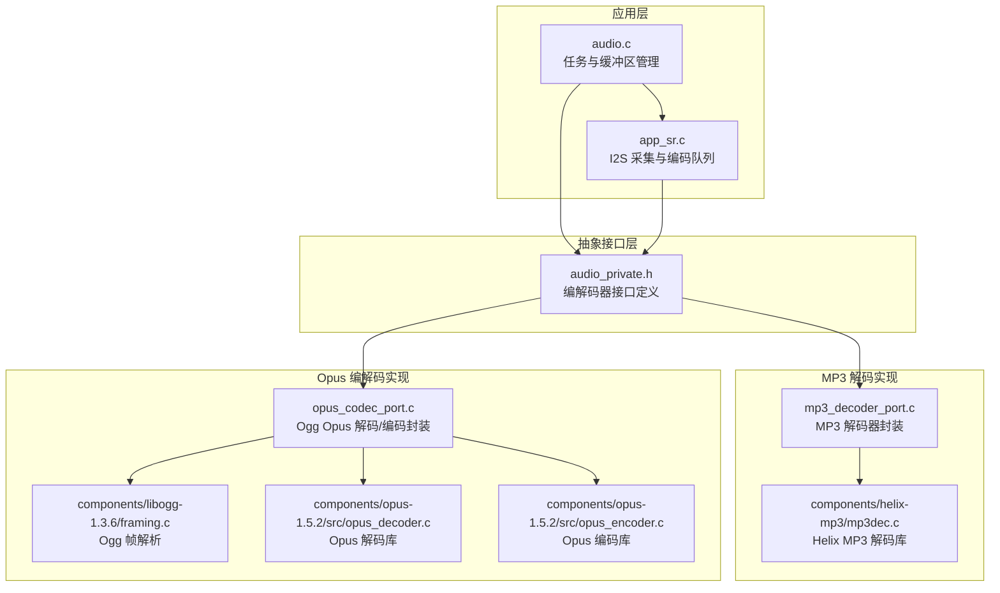
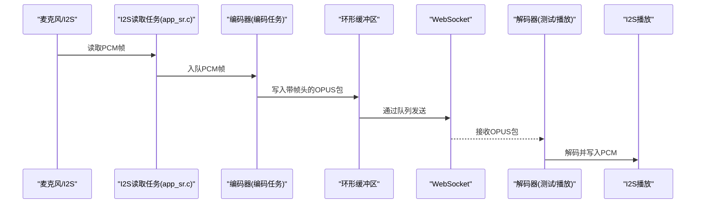
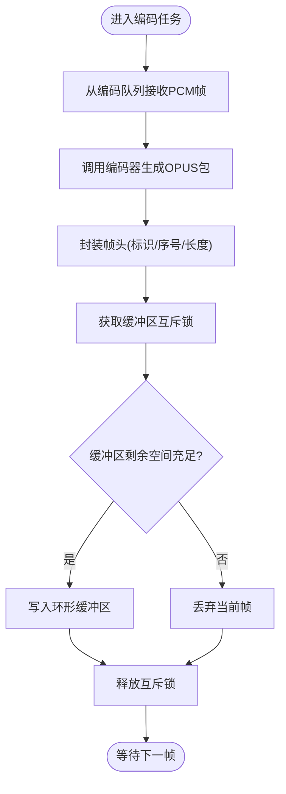
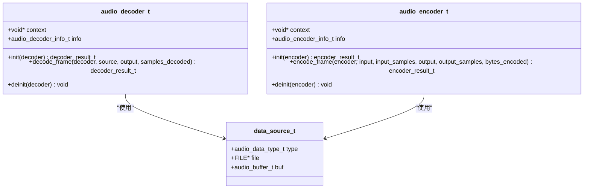
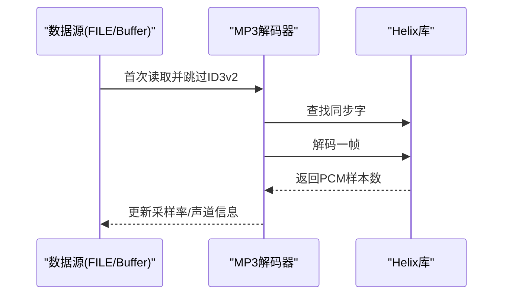
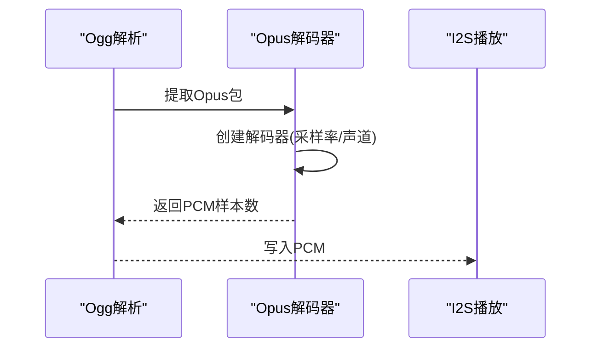
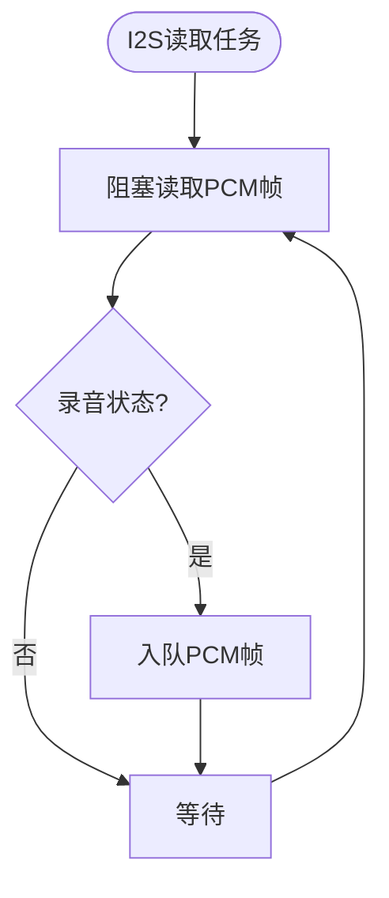
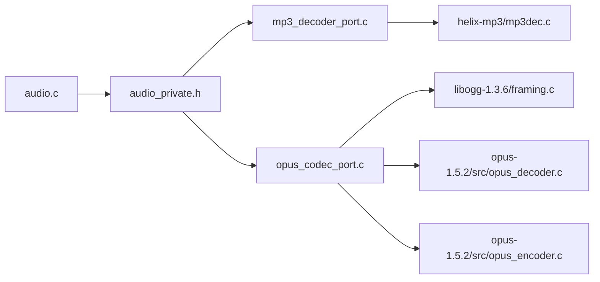

# 音频处理架构

<cite>
**本文引用的文件**
- [main/app/audio/audio.c](file://main/app/audio/audio.c)
- [main/app/audio/audio.h](file://main/app/audio/audio.h)
- [main/app/audio/audio_private.h](file://main/app/audio/audio_private.h)
- [main/app/audio/app_sr.c](file://main/app/audio/app_sr.c)
- [main/app/audio/app_sr.h](file://main/app/audio/app_sr.h)
- [main/app/audio/mp3_decoder_port.c](file://main/app/audio/mp3_decoder_port.c)
- [main/app/audio/opus_codec_port.c](file://main/app/audio/opus_codec_port.c)
- [components/helix-mp3/mp3dec.c](file://components/helix-mp3/mp3dec.c)
- [components/libogg-1.3.6/framing.c](file://components/libogg-1.3.6/framing.c)
- [components/opus-1.5.2/src/opus_decoder.c](file://components/opus-1.5.2/src/opus_decoder.c)
- [components/opus-1.5.2/src/opus_encoder.c](file://components/opus-1.5.2/src/opus_encoder.c)
</cite>

## 目录
1. [简介](#简介)
2. [项目结构](#项目结构)
3. [核心组件](#核心组件)
4. [架构总览](#架构总览)
5. [详细组件分析](#详细组件分析)
6. [依赖关系分析](#依赖关系分析)
7. [性能考量](#性能考量)
8. [故障排查指南](#故障排查指南)
9. [结论](#结论)
10. [附录](#附录)

## 简介
本技术文档系统化阐述了基于 ESP32 平台的音频处理架构，覆盖从音频采集、编码、网络传输、解码到播放的完整流水线。重点说明了以下方面：
- 音频数据从 I2S 采集到播放的完整路径与控制流
- 音频缓冲区管理策略（环形缓冲区、互斥锁保护、队列调度）
- 多格式支持架构（MP3、Ogg Opus）与解码/编码实现
- 实时性能优化机制（帧对齐、队列深度、内存分配策略）
- 音频质量控制、延迟优化与内存使用策略
- 组件划分、接口设计与数据流转，并提供架构图与交互示例

## 项目结构
音频处理相关代码主要位于 main/app/audio 目录，采用“应用层 + 抽象接口 + 具体实现”的分层设计：
- 应用层：负责任务编排、缓冲区管理、I2S 读写与事件控制
- 抽象接口：定义统一的音频编解码器接口（audio_decoder_t / audio_encoder_t）
- 具体实现：MP3 解码器（Helix）、Ogg Opus 解码/编码器（libogg + opus）

**图表来源**
- [main/app/audio/audio.c:1-925](file://main/app/audio/audio.c#L1-L925)
- [main/app/audio/app_sr.c:1-99](file://main/app/audio/app_sr.c#L1-L99)
- [main/app/audio/audio_private.h:1-125](file://main/app/audio/audio_private.h#L1-L125)
- [main/app/audio/mp3_decoder_port.c:1-216](file://main/app/audio/mp3_decoder_port.c#L1-L216)
- [main/app/audio/opus_codec_port.c:1-410](file://main/app/audio/opus_codec_port.c#L1-L410)
- [components/helix-mp3/mp3dec.c](file://components/helix-mp3/mp3dec.c)
- [components/libogg-1.3.6/framing.c](file://components/libogg-1.3.6/framing.c)
- [components/opus-1.5.2/src/opus_decoder.c](file://components/opus-1.5.2/src/opus_decoder.c)
- [components/opus-1.5.2/src/opus_encoder.c](file://components/opus-1.5.2/src/opus_encoder.c)

**章节来源**
- [main/app/audio/audio.c:1-925](file://main/app/audio/audio.c#L1-L925)
- [main/app/audio/audio.h:1-22](file://main/app/audio/audio.h#L1-L22)
- [main/app/audio/audio_private.h:1-125](file://main/app/audio/audio_private.h#L1-L125)

## 核心组件
- 音频应用层（audio.c）
  - 任务：音频编码任务、音频解码测试任务、音频解码任务
  - 缓冲区：环形缓冲区（OPUS 编码输出）、环形缓冲区（WebSocket 接收）
  - 队列：编码队列（I2S PCM → 编码器）
  - 事件：开始/结束事件驱动解码器生命周期
- 抽象接口层（audio_private.h）
  - 音频编解码器接口：init/decode_frame/encode_frame/deinit
  - 数据源抽象：FILE 或 Buffer
  - 结果枚举：DECODER_OK/HEADER_ONLY/EOF/ERROR/NEED_MORE_DATA；ENCODER_OK/ERROR/EMPTY/TOO_BIG
- MP3 解码器（mp3_decoder_port.c）
  - 封装 Helix MP3 解码库，处理 ID3v2 头部、同步字查找、帧解码
  - 使用内部 RAM 分配，避免 PSRAM 访问带来的抖动
- Opus 编解码器（opus_codec_port.c）
  - 解码：Ogg 帧解析 + Opus 解码器，支持 Header/Tags 跳过与首帧初始化
  - 编码：Opus 编码器，语音场景 VOIP 应用模式，低复杂度、低延迟
- I2S 采集与编码（app_sr.c）
  - I2S 读取任务：周期性读取 PCM 帧，按帧大小入队
  - 队列：固定深度，防止内存暴涨；支持 API 触发录音

**章节来源**
- [main/app/audio/audio.c:1-925](file://main/app/audio/audio.c#L1-L925)
- [main/app/audio/audio_private.h:1-125](file://main/app/audio/audio_private.h#L1-L125)
- [main/app/audio/mp3_decoder_port.c:1-216](file://main/app/audio/mp3_decoder_port.c#L1-L216)
- [main/app/audio/opus_codec_port.c:1-410](file://main/app/audio/opus_codec_port.c#L1-L410)
- [main/app/audio/app_sr.c:1-99](file://main/app/audio/app_sr.c#L1-L99)

## 架构总览
音频处理流水线分为两条主线：
- 录音编码链路：I2S → PCM 帧 → 编码器（Opus）→ 帧头封装 → 环形缓冲区 → WebSocket 发送
- 播放解码链路：文件/缓冲区 → 解码器（MP3/Ogg Opus）→ PCM 帧 → I2S 播放

**图表来源**
- [main/app/audio/app_sr.c:1-99](file://main/app/audio/app_sr.c#L1-L99)
- [main/app/audio/audio.c:699-805](file://main/app/audio/audio.c#L699-L805)
- [main/app/audio/opus_codec_port.c:313-370](file://main/app/audio/opus_codec_port.c#L313-L370)

## 详细组件分析

### 组件A：音频应用层（audio.c）
- 任务与事件
  - 音频编码任务：从编码队列取 PCM 帧，调用编码器生成 OPUS 包，封装帧头，写入环形缓冲区
  - 音频解码测试任务：从队列读取 OPUS 包，解析帧头，调用 Opus 解码器，写入 I2S
  - 音频解码任务：注册/初始化解码器，循环从缓冲区读取数据解码并播放
- 缓冲区管理
  - OPUS 输出缓冲区：环形缓冲区，互斥锁保护，支持读取与挪动
  - WebSocket 接收缓冲区：环形缓冲区，写入/读取均受互斥锁保护
- 队列与事件
  - 编码队列：I2S 读取任务将 PCM 帧入队，编码任务出队编码
  - 事件：开始/结束事件控制解码器生命周期，避免重复初始化

**图表来源**
- [main/app/audio/audio.c:699-805](file://main/app/audio/audio.c#L699-L805)

**章节来源**
- [main/app/audio/audio.c:1-925](file://main/app/audio/audio.c#L1-L925)

### 组件B：抽象接口层（audio_private.h）
- 接口设计
  - 解码器接口：init/decode_frame/deinit，返回枚举结果
  - 编码器接口：init/encode_frame/deinit，返回枚举结果
  - 数据源：FILE 或 Buffer，联合体选择
- 设计要点
  - 通过函数指针实现多实现解耦（MP3、Opus）
  - 信息结构体记录采样率、声道数、比特率、帧采样数等

**图表来源**
- [main/app/audio/audio_private.h:76-121](file://main/app/audio/audio_private.h#L76-L121)

**章节来源**
- [main/app/audio/audio_private.h:1-125](file://main/app/audio/audio_private.h#L1-L125)

### 组件C：MP3 解码器（mp3_decoder_port.c）
- 关键特性
  - 处理 ID3v2 头部，跳过无效头部
  - 同步字查找与容错，确保帧边界正确
  - 使用内部 RAM 分配，降低中断与调度抖动
- 流程
  - 初始化：分配上下文与输入缓冲区，设置采样率/声道信息
  - 解码：读取数据，查找同步字，调用 Helix 解码，更新帧信息
  - 反初始化：释放资源

**图表来源**
- [main/app/audio/mp3_decoder_port.c:44-189](file://main/app/audio/mp3_decoder_port.c#L44-L189)
- [components/helix-mp3/mp3dec.c](file://components/helix-mp3/mp3dec.c)

**章节来源**
- [main/app/audio/mp3_decoder_port.c:1-216](file://main/app/audio/mp3_decoder_port.c#L1-L216)

### 组件D：Opus 编解码器（opus_codec_port.c）
- 解码流程（Ogg Opus）
  - Ogg 同步与页解析，建立流状态
  - 提取包（Packet），识别 OpusHead/OpusTags，创建 Opus 解码器
  - 解码有效包，返回 PCM 样本数
- 编码流程（Opus）
  - 初始化：创建 Opus 编码器（VOIP 应用模式），设置比特率与复杂度
  - 编码：每帧 60ms，单通道或双通道，输出 OPUS 包
- 与 I2S 的集成
  - 解码后 PCM 直接写入 I2S 播放
  - 编码后封装帧头，写入环形缓冲区

**图表来源**
- [main/app/audio/opus_codec_port.c:51-203](file://main/app/audio/opus_codec_port.c#L51-L203)
- [components/opus-1.5.2/src/opus_decoder.c](file://components/opus-1.5.2/src/opus_decoder.c)
- [components/libogg-1.3.6/framing.c](file://components/libogg-1.3.6/framing.c)

**章节来源**
- [main/app/audio/opus_codec_port.c:1-410](file://main/app/audio/opus_codec_port.c#L1-L410)

### 组件E：I2S 采集与编码（app_sr.c）
- 采集任务
  - 固定帧大小（60ms @ 16kHz 单声道 = 960 个 int16_t），阻塞读取
  - 在 API 录音状态下将 PCM 帧入编码队列
- 队列与帧对齐
  - 队列深度固定，防止内存压力；帧大小与编码器期望一致

**图表来源**
- [main/app/audio/app_sr.c:22-54](file://main/app/audio/app_sr.c#L22-L54)

**章节来源**
- [main/app/audio/app_sr.c:1-99](file://main/app/audio/app_sr.c#L1-L99)
- [main/app/audio/app_sr.h:1-53](file://main/app/audio/app_sr.h#L1-L53)

## 依赖关系分析
- 组件耦合
  - 应用层通过抽象接口与具体编解码器解耦
  - 编码器/解码器通过上下文与外部库（Helix、libogg、Opus）交互
- 外部依赖
  - I2S 驱动：读取/写入 PCM
  - FreeRTOS：任务、队列、信号量
  - SPIRAM/内部 RAM：不同模块内存分配策略
- 潜在风险
  - 队列满导致丢帧
  - 缓冲区竞争导致数据损坏
  - 采样率/帧大小不匹配导致解码失败

**图表来源**
- [main/app/audio/audio.c:1-925](file://main/app/audio/audio.c#L1-L925)
- [main/app/audio/audio_private.h:1-125](file://main/app/audio/audio_private.h#L1-L125)
- [main/app/audio/mp3_decoder_port.c:1-216](file://main/app/audio/mp3_decoder_port.c#L1-L216)
- [main/app/audio/opus_codec_port.c:1-410](file://main/app/audio/opus_codec_port.c#L1-L410)
- [components/helix-mp3/mp3dec.c](file://components/helix-mp3/mp3dec.c)
- [components/libogg-1.3.6/framing.c](file://components/libogg-1.3.6/framing.c)
- [components/opus-1.5.2/src/opus_decoder.c](file://components/opus-1.5.2/src/opus_decoder.c)
- [components/opus-1.5.2/src/opus_encoder.c](file://components/opus-1.5.2/src/opus_encoder.c)

**章节来源**
- [main/app/audio/audio.c:1-925](file://main/app/audio/audio.c#L1-L925)
- [main/app/audio/audio_private.h:1-125](file://main/app/audio/audio_private.h#L1-L125)

## 性能考量
- 帧对齐与时延
  - 采样率与帧时长固定（60ms @ 16kHz），保证编码/解码一致性，降低抖动
- 内存分配策略
  - MP3 解码强制使用内部 RAM，避免 PSRAM 访问不确定性
  - Opus 编解码上下文使用 SPIRAM，满足大缓冲需求
- 队列与缓冲区
  - 编码队列深度固定，防止内存暴涨；环形缓冲区配合互斥锁，避免竞争
- I2S 读写
  - 以帧为单位读写，减少系统调用次数；解码/编码任务独立，避免阻塞

[本节为通用性能讨论，无需列出章节来源]

## 故障排查指南
- 解码失败（DECODER_ERROR/EOF）
  - 检查数据源类型与缓冲区是否正确初始化
  - 对于 MP3：确认 ID3v2 头部处理与同步字查找逻辑
  - 对于 Opus：确认 Ogg 页面与包解析是否成功
- 编码失败（ENCODER_ERROR/EMPTY/TOO_BIG）
  - 检查输入采样数是否与帧大小一致
  - 检查输出缓冲区是否足够
- I2S 写入失败
  - 检查 I2S 配置与采样率/声道数一致性
  - 降低任务优先级或核心亲和性，避免中断抢占
- 队列/缓冲区竞争
  - 确认互斥锁使用与超时设置
  - 检查队列深度与任务调度频率

**章节来源**
- [main/app/audio/mp3_decoder_port.c:78-189](file://main/app/audio/mp3_decoder_port.c#L78-L189)
- [main/app/audio/opus_codec_port.c:51-203](file://main/app/audio/opus_codec_port.c#L51-L203)
- [main/app/audio/audio.c:316-354](file://main/app/audio/audio.c#L316-L354)

## 结论
该音频处理架构通过抽象接口与具体实现分离，实现了 MP3 与 Ogg Opus 的多格式支持；结合环形缓冲区、队列与互斥锁，保障了实时性与稳定性。通过帧对齐、内存分配策略与 I2S 读写的协同，系统在 ESP32 上实现了低延迟、高质量的音频采集、编码、传输与播放。

[本节为总结性内容，无需列出章节来源]

## 附录
- 关键宏与常量
  - 帧时长：60ms；每帧采样数：960（16kHz 单声道）
  - 队列深度：10；每帧字节数：1920
  - OPUS 编码包最大字节数：200；帧头固定 6 字节
- 建议
  - 根据目标平台调整队列深度与缓冲区大小
  - 在关键路径上启用互斥锁超时，避免死锁
  - 对异常路径增加日志与统计，便于定位问题

**章节来源**
- [main/app/audio/app_sr.h:1-53](file://main/app/audio/app_sr.h#L1-L53)
- [main/app/audio/audio.c:18-31](file://main/app/audio/audio.c#L18-L31)