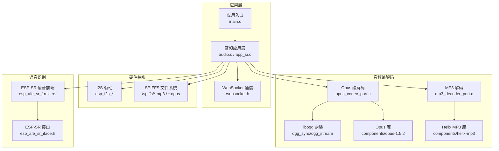
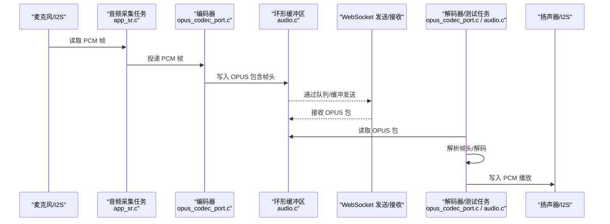
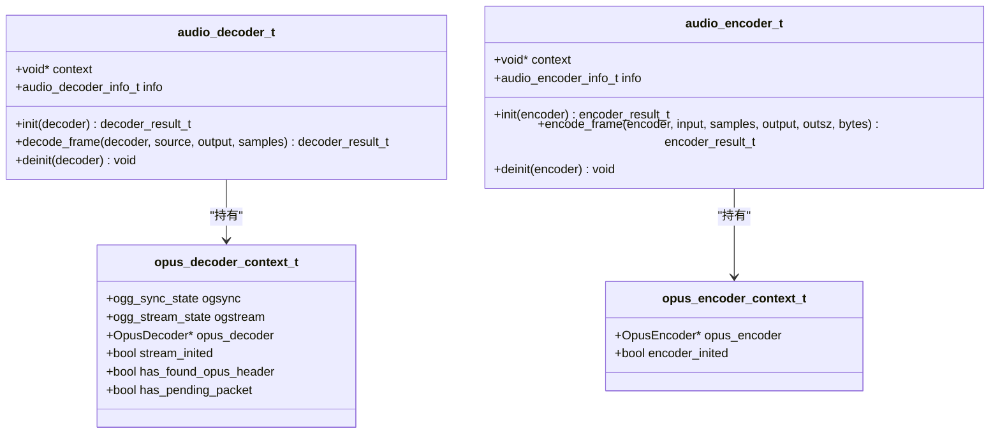
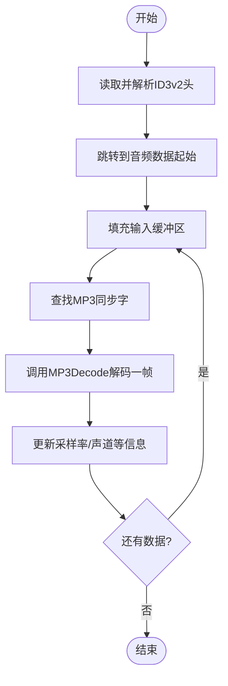
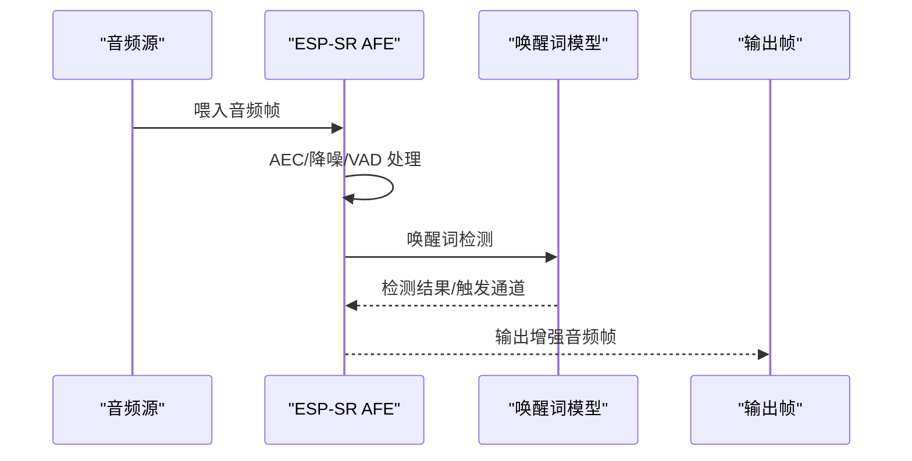
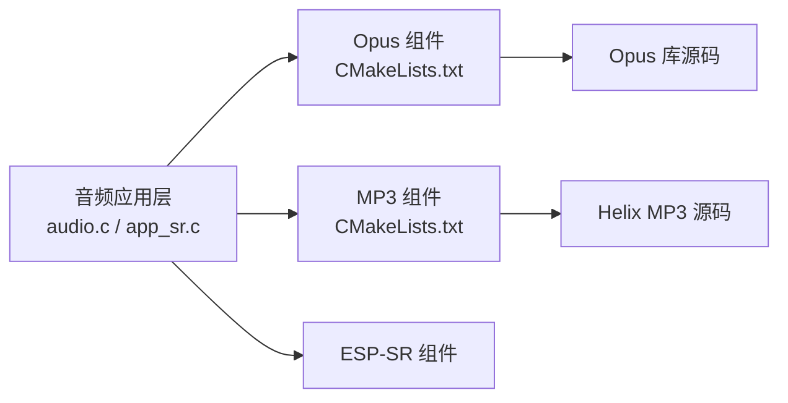

# 音频处理系统

<cite>
**本文引用的文件**
- [main/app/audio/audio.c](file://main/app/audio/audio.c)
- [main/app/audio/audio.h](file://main/app/audio/audio.h)
- [main/app/audio/audio_private.h](file://main/app/audio/audio_private.h)
- [main/app/audio/opus_codec_port.c](file://main/app/audio/opus_codec_port.c)
- [main/app/audio/mp3_decoder_port.c](file://main/app/audio/mp3_decoder_port.c)
- [main/app/audio/app_sr.c](file://main/app/audio/app_sr.c)
- [main/app/audio/app_sr.h](file://main/app/audio/app_sr.h)
- [components/esp-sr/include/esp32/esp_afe_sr_iface.h](file://components/esp-sr/include/esp32/esp_afe_sr_iface.h)
- [components/esp-sr/src/esp_afe_sr_1mic.ref](file://components/esp-sr/src/esp_afe_sr_1mic.ref)
- [components/helix-mp3/CMakeLists.txt](file://components/helix-mp3/CMakeLists.txt)
- [components/opus-1.5.2/CMakeLists.txt](file://components/opus-1.5.2/CMakeLists.txt)
- [build/config/sdkconfig.h](file://build/config/sdkconfig.h)
</cite>

## 目录
1. [引言](#引言)
2. [项目结构](#项目结构)
3. [核心组件](#核心组件)
4. [架构总览](#架构总览)
5. [详细组件分析](#详细组件分析)
6. [依赖关系分析](#依赖关系分析)
7. [性能考虑](#性能考虑)
8. [故障排除指南](#故障排除指南)
9. [结论](#结论)
10. [附录](#附录)

## 引言
本文件面向“音频处理系统”的综合技术文档，围绕基于 ESP32 的嵌入式音频流水线展开，覆盖从音频采集、编码、传输、解码到播放的完整链路；重点对比 Opus 与 MP3 两种编解码方案的实现细节、性能特征与适用场景；说明 ESP-SR 语音识别引擎的集成方式与关键配置；并总结音频缓冲区管理、实时性能优化与内存使用策略，提供质量调优与故障排除建议。

## 项目结构
该工程采用模块化组织，音频相关代码集中在 main/app/audio 下，第三方编解码库以组件形式引入，ESP-SR 作为语音前端与识别能力提供者。

图示来源
- [main/app/audio/audio.c:1-925](file://main/app/audio/audio.c#L1-L925)
- [main/app/audio/opus_codec_port.c:1-410](file://main/app/audio/opus_codec_port.c#L1-L410)
- [main/app/audio/mp3_decoder_port.c:1-216](file://main/app/audio/mp3_decoder_port.c#L1-L216)
- [components/esp-sr/src/esp_afe_sr_1mic.ref:1-563](file://components/esp-sr/src/esp_afe_sr_1mic.ref#L1-L563)
- [components/opus-1.5.2/CMakeLists.txt:1-231](file://components/opus-1.5.2/CMakeLists.txt#L1-L231)
- [components/helix-mp3/CMakeLists.txt:1-31](file://components/helix-mp3/CMakeLists.txt#L1-L31)

章节来源
- [main/app/audio/audio.c:1-925](file://main/app/audio/audio.c#L1-L925)
- [main/app/audio/audio.h:1-22](file://main/app/audio/audio.h#L1-L22)
- [main/app/audio/audio_private.h:1-125](file://main/app/audio/audio_private.h#L1-L125)
- [main/app/audio/opus_codec_port.c:1-410](file://main/app/audio/opus_codec_port.c#L1-L410)
- [main/app/audio/mp3_decoder_port.c:1-216](file://main/app/audio/mp3_decoder_port.c#L1-L216)
- [main/app/audio/app_sr.c:1-99](file://main/app/audio/app_sr.c#L1-L99)
- [components/esp-sr/include/esp32/esp_afe_sr_iface.h:1-238](file://components/esp-sr/include/esp32/esp_afe_sr_iface.h#L1-L238)
- [components/esp-sr/src/esp_afe_sr_1mic.ref:1-563](file://components/esp-sr/src/esp_afe_sr_1mic.ref#L1-L563)
- [components/helix-mp3/CMakeLists.txt:1-31](file://components/helix-mp3/CMakeLists.txt#L1-L31)
- [components/opus-1.5.2/CMakeLists.txt:1-231](file://components/opus-1.5.2/CMakeLists.txt#L1-L231)

## 核心组件
- 音频采集与播放
  - I2S 读取 PCM 帧，经队列送入编码器；解码器从文件或缓冲区读取，PCM 写回 I2S 播放。
- 编解码实现
  - Opus：基于 Ogg 封装与 Opus 库，支持 VOIP 应用模式，帧长 60ms，采样率与声道在配置中定义。
  - MP3：基于 Helix MP3 库，处理 ID3v2 头，同步字查找与帧解码。
- 语音识别前端（ESP-SR）
  - 提供 AFE（音频前端）能力，包含 AEC、噪声抑制、VAD、唤醒词检测等模块，支持多模型与通道选择。
- 传输与缓冲
  - WebSocket 接收端将数据写入环形缓冲区，编码器将 OPUS 包写入公共缓冲区，解码测试任务从队列读取并解码播放。

章节来源
- [main/app/audio/audio.c:1-925](file://main/app/audio/audio.c#L1-L925)
- [main/app/audio/opus_codec_port.c:1-410](file://main/app/audio/opus_codec_port.c#L1-L410)
- [main/app/audio/mp3_decoder_port.c:1-216](file://main/app/audio/mp3_decoder_port.c#L1-L216)
- [main/app/audio/app_sr.c:1-99](file://main/app/audio/app_sr.c#L1-L99)
- [components/esp-sr/src/esp_afe_sr_1mic.ref:1-563](file://components/esp-sr/src/esp_afe_sr_1mic.ref#L1-L563)

## 架构总览
下图展示从麦克风采集到播放与识别的整体流程，以及编解码与传输的关键节点。

图示来源
- [main/app/audio/app_sr.c:1-99](file://main/app/audio/app_sr.c#L1-L99)
- [main/app/audio/opus_codec_port.c:1-410](file://main/app/audio/opus_codec_port.c#L1-L410)
- [main/app/audio/audio.c:1-925](file://main/app/audio/audio.c#L1-L925)

## 详细组件分析

### 音频采集与播放（I2S）
- 采集任务以固定帧大小（每帧字节数由采样率、通道数与帧时长计算）从 I2S 读取 PCM，必要时入队给编码器。
- 播放路径支持从文件与缓冲区两种数据源，解码器抽象接口统一了 MP3 与 Opus 的解码流程。
- I2S 写入失败时进行日志记录与短暂停顿，保证稳定性。

章节来源
- [main/app/audio/app_sr.c:1-99](file://main/app/audio/app_sr.c#L1-L99)
- [main/app/audio/audio.c:1-925](file://main/app/audio/audio.c#L1-L925)

### Opus 编解码实现
- 解码流程
  - 使用 libogg 的 ogg_sync/ogg_stream 管线化读取页面与包，识别 OpusHead/OpusTags 头，随后创建 OpusDecoder 并逐包解码。
  - 支持从文件与内存缓冲区读取，缓冲区读取通过自定义回调适配。
- 编码流程
  - 以 VOIP 应用模式创建 OpusEncoder，设置比特率与复杂度；每帧 60ms，采样率与通道在配置中定义。
  - 输出封装帧头（标识、包序号、OPUS 数据长度），写入公共缓冲区供传输。
- 关键参数
  - 采样率、通道数、帧样本数、比特率、复杂度等均来自构建配置。

图示来源
- [main/app/audio/audio_private.h:1-125](file://main/app/audio/audio_private.h#L1-L125)
- [main/app/audio/opus_codec_port.c:1-410](file://main/app/audio/opus_codec_port.c#L1-L410)

章节来源
- [main/app/audio/opus_codec_port.c:1-410](file://main/app/audio/opus_codec_port.c#L1-L410)
- [build/config/sdkconfig.h:940-949](file://build/config/sdkconfig.h#L940-L949)

### MP3 解码实现
- 通过 Helix MP3 库实现，先扫描并跳过 ID3v2 头，再定位同步字，逐帧解码。
- 输入缓冲区强制分配在内部 RAM，避免 PSRAM 访问带来的时序不确定性。
- 帧信息（采样率、声道数）在解码过程中更新至解码器信息结构体。

图示来源
- [main/app/audio/mp3_decoder_port.c:1-216](file://main/app/audio/mp3_decoder_port.c#L1-L216)

章节来源
- [main/app/audio/mp3_decoder_port.c:1-216](file://main/app/audio/mp3_decoder_port.c#L1-L216)
- [components/helix-mp3/CMakeLists.txt:1-31](file://components/helix-mp3/CMakeLists.txt#L1-L31)

### 语音识别前端（ESP-SR）
- 提供 AFE（音频前端）能力，包含 AEC、噪声抑制、VAD、唤醒词检测等模块，支持多模型与通道选择。
- 通过接口结构体暴露创建、喂入、抓取、使能/禁用等功能，便于在音频流水线中集成。
- 任务内核亲和与内存分配策略可根据目标芯片选择 PSRAM 或内部 RAM。

图示来源
- [components/esp-sr/src/esp_afe_sr_1mic.ref:1-563](file://components/esp-sr/src/esp_afe_sr_1mic.ref#L1-L563)
- [components/esp-sr/include/esp32/esp_afe_sr_iface.h:1-238](file://components/esp-sr/include/esp32/esp_afe_sr_iface.h#L1-L238)

章节来源
- [components/esp-sr/src/esp_afe_sr_1mic.ref:1-563](file://components/esp-sr/src/esp_afe_sr_1mic.ref#L1-L563)
- [components/esp-sr/include/esp32/esp_afe_sr_iface.h:1-238](file://components/esp-sr/include/esp32/esp_afe_sr_iface.h#L1-L238)

### 传输与缓冲管理
- 环形缓冲区
  - 编码侧：公共缓冲区存放 OPUS 包，带帧头（标识、序号、长度），写满丢弃策略保护实时性。
  - 接收侧：WebSocket 数据写入环形缓冲区，解码任务从缓冲区读取并解码播放。
- 互斥量与队列
  - 编码/解码缓冲区访问加锁；编码帧通过 FreeRTOS 队列投递到编码任务；解码测试任务从队列读取包长并解码播放。
- 事件驱动
  - 通过事件标志控制解码任务的启动/停止与 EOF 处理。

章节来源
- [main/app/audio/audio.c:1-925](file://main/app/audio/audio.c#L1-L925)

## 依赖关系分析
- 组件编译
  - Opus 组件按配置启用编码/解码源文件与编译选项，固定点与裁剪分支可按需求开启。
  - MP3 组件通过 CMake 汇总源文件并注册为组件。
- 运行时依赖
  - 音频应用层依赖 I2S、SPIFFS、WebSocket、FreeRTOS 队列/信号量。
  - ESP-SR 通过接口结构体与任务协作，提供语音增强与唤醒能力。

图示来源
- [components/opus-1.5.2/CMakeLists.txt:1-231](file://components/opus-1.5.2/CMakeLists.txt#L1-L231)
- [components/helix-mp3/CMakeLists.txt:1-31](file://components/helix-mp3/CMakeLists.txt#L1-L31)
- [main/app/audio/audio.c:1-925](file://main/app/audio/audio.c#L1-L925)

章节来源
- [components/opus-1.5.2/CMakeLists.txt:1-231](file://components/opus-1.5.2/CMakeLists.txt#L1-L231)
- [components/helix-mp3/CMakeLists.txt:1-31](file://components/helix-mp3/CMakeLists.txt#L1-L31)

## 性能考虑
- 实时性保障
  - 编码帧长固定（60ms），队列深度与缓冲区大小需与采样率/通道匹配，避免阻塞与丢帧。
  - 解码测试任务与解码任务在 I2S 写入处做失败日志与短延时，防止长时间阻塞。
- 内存策略
  - Opus 解/编码上下文与 libogg 状态分配在 SPIRAM；MP3 输入缓冲强制在内部 RAM。
  - WebSocket 接收缓冲区与公共编码缓冲区采用环形设计，降低碎片化风险。
- 编解码参数
  - Opus：VOIP 应用模式、固定比特率与复杂度，兼顾延迟与音质；帧样本数与采样率来自配置。
  - MP3：ID3v2 跳过与同步字查找减少无效数据处理；输出缓冲区预留最大帧字节数。

章节来源
- [main/app/audio/opus_codec_port.c:1-410](file://main/app/audio/opus_codec_port.c#L1-L410)
- [main/app/audio/mp3_decoder_port.c:1-216](file://main/app/audio/mp3_decoder_port.c#L1-L216)
- [main/app/audio/audio.c:1-925](file://main/app/audio/audio.c#L1-L925)
- [build/config/sdkconfig.h:940-949](file://build/config/sdkconfig.h#L940-L949)

## 故障排除指南
- I2S 写入失败
  - 现象：日志提示 I2S 写入失败，播放中断。
  - 排查：确认 I2S 配置、时钟分频与引脚映射；检查队列是否溢出导致丢帧。
- 解码异常
  - Opus：检查 Ogg 页面/包解析流程，确认 OpusHead/OpusTags 是否正确识别；验证采样率与声道范围。
  - MP3：确认 ID3v2 头跳过逻辑与同步字查找是否成功；检查输入缓冲区大小与剩余数据。
- 编码缓冲区溢出
  - 现象：编码侧丢弃当前帧，日志提示缓冲区不足。
  - 排查：增大公共缓冲区容量或缩短编码间隔；检查传输速率与解码任务处理能力。
- ESP-SR 功能异常
  - 现象：唤醒词检测不灵敏或通道选择错误。
  - 排查：确认 AFE 模块使能状态、唤醒词模型配置与通道数；检查 AGC/增益设置。

章节来源
- [main/app/audio/audio.c:1-925](file://main/app/audio/audio.c#L1-L925)
- [main/app/audio/opus_codec_port.c:1-410](file://main/app/audio/opus_codec_port.c#L1-L410)
- [main/app/audio/mp3_decoder_port.c:1-216](file://main/app/audio/mp3_decoder_port.c#L1-L216)
- [components/esp-sr/src/esp_afe_sr_1mic.ref:1-563](file://components/esp-sr/src/esp_afe_sr_1mic.ref#L1-L563)

## 结论
本音频处理系统以模块化设计实现从采集、编码、传输到解码播放的完整链路，Opus 在低延迟与语音质量上具备优势，MP3 则提供广泛的兼容性。ESP-SR 语音前端为系统提供了强大的语音增强与唤醒能力。通过合理的缓冲区管理、内存分配与参数配置，可在资源受限的嵌入式平台上实现稳定高效的音频处理。

## 附录

### 音频编解码方案对比与适用场景
- Opus
  - 特点：低延迟、自适应比特率、强健的丢包容忍、VOIP 优化。
  - 适用：实时语音通话、远端播放、低功耗场景。
- MP3
  - 特点：成熟生态、广泛兼容、压缩比高。
  - 适用：离线音频播放、历史音频文件播放、兼容性优先场景。

章节来源
- [main/app/audio/opus_codec_port.c:1-410](file://main/app/audio/opus_codec_port.c#L1-L410)
- [main/app/audio/mp3_decoder_port.c:1-216](file://main/app/audio/mp3_decoder_port.c#L1-L216)

### ESP-SR 集成要点与配置参数
- 关键接口
  - 创建/销毁、喂入/抓取、功能使能/禁用、打印管线等。
- 典型配置
  - AEC/NS/VAD/WakeNet 模块开关与参数；唤醒词模型索引与阈值；AGC 模式与增益。
- 任务与内存
  - 任务亲和与核心绑定；PSRAM/内部 RAM 分配策略；环形缓冲区大小。

章节来源
- [components/esp-sr/include/esp32/esp_afe_sr_iface.h:1-238](file://components/esp-sr/include/esp32/esp_afe_sr_iface.h#L1-L238)
- [components/esp-sr/src/esp_afe_sr_1mic.ref:1-563](file://components/esp-sr/src/esp_afe_sr_1mic.ref#L1-L563)