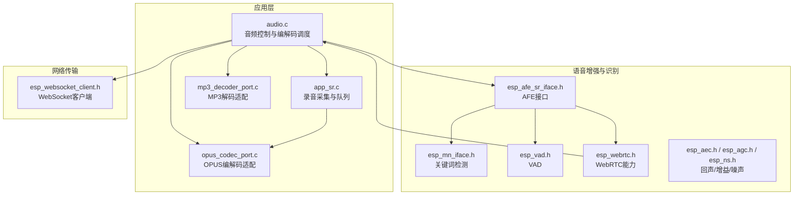
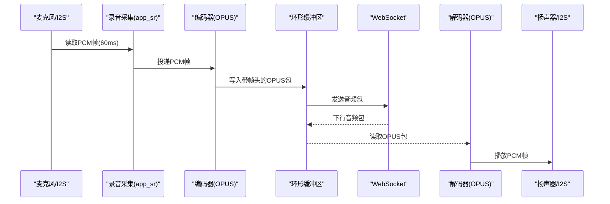
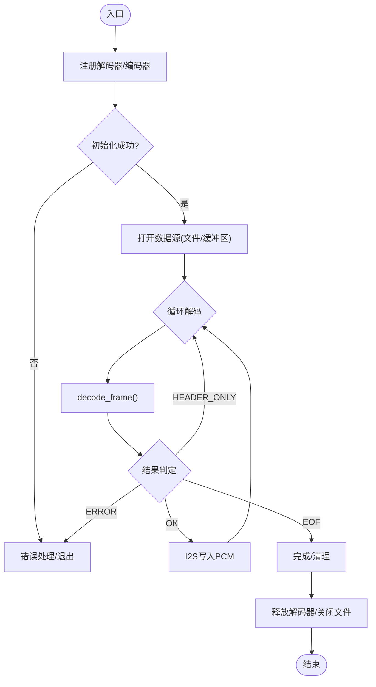
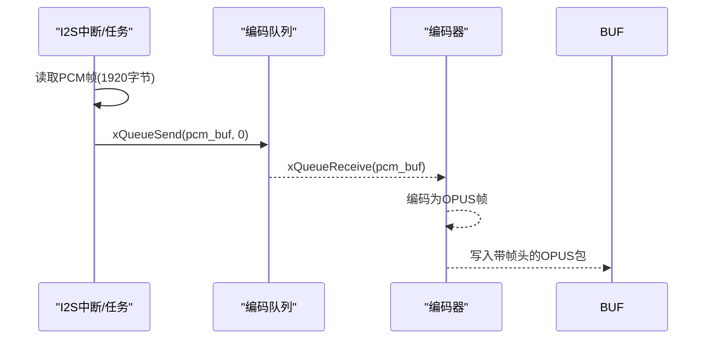
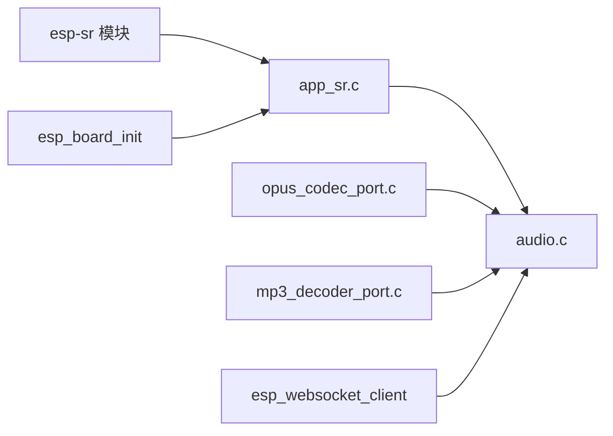

# 音频路由控制

<cite>
**本文引用的文件**
- [main/app/audio/audio.c](file://main/app/audio/audio.c)
- [main/app/audio/audio.h](file://main/app/audio/audio.h)
- [main/app/audio/audio_private.h](file://main/app/audio/audio_private.h)
- [main/app/audio/app_sr.c](file://main/app/audio/app_sr.c)
- [main/app/audio/app_sr.h](file://main/app/audio/app_sr.h)
- [main/app/audio/opus_codec_port.c](file://main/app/audio/opus_codec_port.c)
- [main/app/audio/mp3_decoder_port.c](file://main/app/audio/mp3_decoder_port.c)
- [components/esp-sr/esp32s3/include/esp_afe_sr_iface.h](file://components/esp-sr/esp32s3/include/esp_afe_sr_iface.h)
- [components/esp-sr/esp32s3/include/esp_afe_sr_models.h](file://components/esp-sr/esp32s3/include/esp_afe_sr_models.h)
- [components/esp-sr/esp32s3/include/esp_mn_iface.h](file://components/esp-sr/esp32s3/include/esp_mn_iface.h)
- [components/esp-sr/esp32s3/include/esp_mn_models.h](file://components/esp-sr/esp32s3/include/esp_mn_models.h)
- [components/esp-sr/esp32s3/include/esp_vad.h](file://components/esp-sr/esp32s3/include/esp_vad.h)
- [components/esp-sr/esp32s3/include/esp_vadn_iface.h](file://components/esp-sr/esp32s3/include/esp_vadn_iface.h)
- [components/esp-sr/esp32s3/include/esp_vadn_models.h](file://components/esp-sr/esp32s3/include/esp_vadn_models.h)
- [components/esp-sr/esp32s3/include/esp_webrtc.h](file://components/esp-sr/esp32s3/include/esp_webrtc.h)
- [components/esp-sr/esp32s3/include/esp_aec.h](file://components/esp-sr/esp32s3/include/esp_aec.h)
- [components/esp-sr/esp32s3/include/esp_agc.h](file://components/esp-sr/esp32s3/include/esp_agc.h)
- [components/esp-sr/esp32s3/include/esp_ns.h](file://components/esp-sr/esp32s3/include/esp_ns.h)
- [components/esp-sr/esp32s3/include/esp_nsn_iface.h](file://components/esp-sr/esp32s3/include/esp_nsn_iface.h)
- [components/esp-sr/esp32s3/include/esp_nsn_models.h](file://components/esp-sr/esp32s3/include/esp_nsn_models.h)
- [components/esp-sr/esp32s3/include/esp_mfcc_iface.h](file://components/esp-sr/esp32s3/include/esp_mfcc_iface.h)
- [components/esp-sr/esp32s3/include/esp_mfcc_models.h](file://components/esp-sr/esp32s3/include/esp_mfcc_models.h)
- [components/esp-sr/esp32s3/include/esp_doa.h](file://components/esp-sr/esp32s3/include/esp_doa.h)
- [components/esp-sr/esp32s3/include/esp_mase.h](file://components/esp-sr/esp32s3/include/esp_mase.h)
- [components/esp-sr/esp32s3/include/esp_speech_features.h](file://components/esp-sr/esp32s3/include/esp_speech_features.h)
- [components/esp-sr/esp32s3/include/esp_sr_webrtc.h](file://components/esp-sr/esp32s3/include/esp_sr_webrtc.h)
- [components/esp-sr/esp32s3/include/esp_wn_iface.h](file://components/esp-sr/esp32s3/include/esp_wn_iface.h)
- [components/esp-sr/esp32s3/include/esp_wn_models.h](file://components/esp-sr/esp32s3/include/esp_wn_models.h)
- [components/esp-sr/esp32s3/include/esp_afe_config.h](file://components/esp-sr/esp32s3/include/esp_afe_config.h)
- [components/esp-sr/esp32s3/include/esp_afe_doa.h](file://components/esp-sr/esp32s3/include/esp_afe_doa.h)
- [components/esp-sr/esp32s3/include/esp_afe_aec.h](file://components/esp-sr/esp32s3/include/esp_afe_aec.h)
- [components/esp-sr/esp32s3/include/esp_board_init.h](file://components/esp-sr/esp32s3/include/esp_board_init.h)
- [components/esp-websocket-client/esp_websocket_client.h](file://components/esp-websocket-client/esp_websocket_client.h)
- [components/esp-websocket-client/esp_websocket_client.c](file://components/esp-websocket-client/esp_websocket_client.c)
</cite>

## 目录
1. [引言](#引言)
2. [项目结构](#项目结构)
3. [核心组件](#核心组件)
4. [架构总览](#架构总览)
5. [详细组件分析](#详细组件分析)
6. [依赖关系分析](#依赖关系分析)
7. [性能考虑](#性能考虑)
8. [故障排查指南](#故障排查指南)
9. [结论](#结论)
10. [附录](#附录)

## 引言
本技术文档围绕音频路由控制展开，系统性阐述音频数据在设备内的流向与控制机制，覆盖输入源选择、输出路径配置、路由切换逻辑、录音/编码/传输/解码/播放的时序控制、状态管理、设备切换与优先级策略、中断与资源抢占/恢复机制，以及最佳实践与性能优化建议。文档以仓库中的音频应用层为核心，结合语音识别与WebRTC/AEC/AGC/噪声抑制等模块，形成完整的音频处理链路。

## 项目结构
音频相关代码主要位于以下位置：
- 应用层音频控制与编解码：main/app/audio/
- 语音识别与前端算法：components/esp-sr/esp32s3/include/
- WebRTC与网络传输：components/esp-websocket-client/

图示来源
- [main/app/audio/audio.c:1-925](file://main/app/audio/audio.c#L1-L925)
- [main/app/audio/app_sr.c:1-99](file://main/app/audio/app_sr.c#L1-L99)
- [main/app/audio/opus_codec_port.c](file://main/app/audio/opus_codec_port.c)
- [main/app/audio/mp3_decoder_port.c](file://main/app/audio/mp3_decoder_port.c)
- [components/esp-sr/esp32s3/include/esp_afe_sr_iface.h](file://components/esp-sr/esp32s3/include/esp_afe_sr_iface.h)
- [components/esp-sr/esp32s3/include/esp_mn_iface.h](file://components/esp-sr/esp32s3/include/esp_mn_iface.h)
- [components/esp-sr/esp32s3/include/esp_vad.h](file://components/esp-sr/esp32s3/include/esp_vad.h)
- [components/esp-sr/esp32s3/include/esp_webrtc.h](file://components/esp-sr/esp32s3/include/esp_webrtc.h)
- [components/esp-sr/esp32s3/include/esp_aec.h](file://components/esp-sr/esp32s3/include/esp_aec.h)
- [components/esp-sr/esp32s3/include/esp_agc.h](file://components/esp-sr/esp32s3/include/esp_agc.h)
- [components/esp-sr/esp32s3/include/esp_ns.h](file://components/esp-sr/esp32s3/include/esp_ns.h)
- [components/esp-websocket-client/esp_websocket_client.h](file://components/esp-websocket-client/esp_websocket_client.h)

章节来源
- [main/app/audio/audio.c:1-925](file://main/app/audio/audio.c#L1-L925)
- [main/app/audio/app_sr.c:1-99](file://main/app/audio/app_sr.c#L1-L99)

## 核心组件
- 音频控制与编解码调度：负责注册/初始化/销毁编解码器、I2S播放、OPUS帧头封装、环形缓冲区读写、WebSocket接收与转发、事件状态机驱动。
- 录音采集与队列：I2S读取PCM帧，按60ms一帧入队，供编码器消费；支持API触发录音与停止。
- OPUS编解码适配：提供编码器接口实现，配合帧头封装与序列号管理。
- MP3解码适配：提供解码器接口实现，支持SPIFFS文件播放。
- 语音增强与识别：AFE接口、VAD、关键词检测、WebRTC、AEC/AGC/NS等模块，参与录音前置处理与远场语音增强。
- 网络传输：WebSocket客户端，承载音频数据的上行/下行传输。

章节来源
- [main/app/audio/audio.h:1-22](file://main/app/audio/audio.h#L1-L22)
- [main/app/audio/audio_private.h:1-125](file://main/app/audio/audio_private.h#L1-L125)
- [main/app/audio/app_sr.h:1-53](file://main/app/audio/app_sr.h#L1-L53)

## 架构总览
音频处理链路分为“本地播放链”和“网络传输链”，二者共享统一的编解码器接口与I2S硬件抽象。

图示来源
- [main/app/audio/audio.c:399-550](file://main/app/audio/audio.c#L399-L550)
- [main/app/audio/app_sr.c:22-54](file://main/app/audio/app_sr.c#L22-L54)
- [main/app/audio/opus_codec_port.c](file://main/app/audio/opus_codec_port.c)

## 详细组件分析

### 组件A：音频控制与编解码调度（audio.c）
职责与特性
- 编解码器注册与生命周期管理：动态分配解码器/编码器实例，调用注册函数填充虚表，初始化/反初始化。
- I2S播放：将解码后的PCM写入I2S，支持MP3与Ogg Opus两种格式。
- OPUS帧头协议：固定6字节帧头（标识、包序号、OPUS数据长度），便于接收端解析与对齐。
- 环形缓冲区：保护性读写，互斥量保证并发安全；支持从公共缓冲区批量读取OPUS数据。
- WebSocket集成：接收下行音频数据写入环形缓冲区，解码后播放；同时支持从环形缓冲区读取数据打包发送。
- 事件状态机：START/PLAYING/END三态驱动解码器初始化与释放，保障资源正确回收。

关键流程与时序
- 文件播放流程：注册解码器 -> 初始化 -> 打开文件 -> 循环解码 -> I2S写入 -> EOF/错误处理。
- 测试解码流程：创建OPUS解码器 -> 从队列取包 -> 解析帧头 -> OPUS解码 -> I2S播放。
- 事件驱动解码流程：START触发解码器初始化，PLAYING持续解码，END且缓冲区清空后释放解码器。

图示来源
- [main/app/audio/audio.c:112-205](file://main/app/audio/audio.c#L112-L205)
- [main/app/audio/audio.c:211-308](file://main/app/audio/audio.c#L211-L308)
- [main/app/audio/audio.c:621-697](file://main/app/audio/audio.c#L621-L697)

章节来源
- [main/app/audio/audio.c:60-205](file://main/app/audio/audio.c#L60-L205)
- [main/app/audio/audio.c:211-308](file://main/app/audio/audio.c#L211-L308)
- [main/app/audio/audio.c:316-354](file://main/app/audio/audio.c#L316-L354)
- [main/app/audio/audio.c:399-550](file://main/app/audio/audio.c#L399-L550)
- [main/app/audio/audio.c:621-697](file://main/app/audio/audio.c#L621-L697)

### 组件B：录音采集与队列（app_sr.c）
职责与特性
- I2S读取任务：周期性读取PCM帧（60ms @16kHz 单声道），按帧大小1920字节组织。
- 队列管理：创建容量为10的队列，投递PCM帧至编码器；队列满时丢帧告警。
- API触发录音：通过布尔标志控制录音启停，支持外部状态机联动。

图示来源
- [main/app/audio/app_sr.c:22-54](file://main/app/audio/app_sr.c#L22-L54)
- [main/app/audio/app_sr.h:18-22](file://main/app/audio/app_sr.h#L18-L22)

章节来源
- [main/app/audio/app_sr.c:18-99](file://main/app/audio/app_sr.c#L18-L99)
- [main/app/audio/app_sr.h:18-22](file://main/app/audio/app_sr.h#L18-L22)

### 组件C：OPUS编解码适配（opus_codec_port.c）
职责与特性
- 编码器接口实现：填充audio_encoder结构体，提供init/encode_frame/deinit。
- 帧头封装：在输出缓冲区前6字节写入固定标识、包序号、OPUS数据长度。
- 序列号管理：全局16位包序号递增，范围0~65535循环。

章节来源
- [main/app/audio/audio.c:699-809](file://main/app/audio/audio.c#L699-L809)
- [main/app/audio/audio.c:782-791](file://main/app/audio/audio.c#L782-L791)

### 组件D：MP3解码适配（mp3_decoder_port.c）
职责与特性
- 解码器接口实现：填充audio_decoder结构体，提供init/decode_frame/deinit。
- SPIFFS文件播放：支持从SPIFFS读取MP3文件并逐帧解码后I2S播放。

章节来源
- [main/app/audio/audio.c:112-205](file://main/app/audio/audio.c#L112-L205)

### 组件E：语音增强与识别（esp-sr）
职责与特性
- AFE接口：统一的音频前端配置与模型加载。
- 关键词检测/语音活动检测：VAD、多模型关键词检测。
- WebRTC能力：回声消除、噪声抑制、自动增益、波束成形与DOA估计。
- 与录音链路协同：在I2S读取PCM之前或同时进行预处理，提升远场语音质量。

章节来源
- [components/esp-sr/esp32s3/include/esp_afe_sr_iface.h](file://components/esp-sr/esp32s3/include/esp_afe_sr_iface.h)
- [components/esp-sr/esp32s3/include/esp_mn_iface.h](file://components/esp-sr/esp32s3/include/esp_mn_iface.h)
- [components/esp-sr/esp32s3/include/esp_vad.h](file://components/esp-sr/esp32s3/include/esp_vad.h)
- [components/esp-sr/esp32s3/include/esp_webrtc.h](file://components/esp-sr/esp32s3/include/esp_webrtc.h)
- [components/esp-sr/esp32s3/include/esp_aec.h](file://components/esp-sr/esp32s3/include/esp_aec.h)
- [components/esp-sr/esp32s3/include/esp_agc.h](file://components/esp-sr/esp32s3/include/esp_agc.h)
- [components/esp-sr/esp32s3/include/esp_ns.h](file://components/esp-sr/esp32s3/include/esp_ns.h)
- [components/esp-sr/esp32s3/include/esp_doa.h](file://components/esp-sr/esp32s3/include/esp_doa.h)

### 组件F：网络传输（esp_websocket_client）
职责与特性
- 上行：将编码后的OPUS包通过WebSocket发送至服务端。
- 下行：接收服务端下发的音频包，写入环形缓冲区，驱动解码播放。
- 与音频控制耦合：提供ws_send_queue与ws_recv_data_handler等接口。

章节来源
- [components/esp-websocket-client/esp_websocket_client.h](file://components/esp-websocket-client/esp_websocket_client.h)
- [components/esp-websocket-client/esp_websocket_client.c](file://components/esp-websocket-client/esp_websocket_client.c)
- [main/app/audio/audio.c:553-575](file://main/app/audio/audio.c#L553-L575)
- [main/app/audio/audio.c:436-449](file://main/app/audio/audio.c#L436-L449)

## 依赖关系分析
- audio.c 依赖 app_sr.c 提供PCM数据；依赖 opus_codec_port.c/mp3_decoder_port.c 提供编解码器实现；依赖 esp_websocket_client 进行网络传输。
- app_sr.c 依赖 I2S驱动与FreeRTOS队列；依赖 esp_board_init 完成硬件初始化。
- 语音增强模块（esp-sr）与音频控制模块通过数据流与配置接口耦合。

图示来源
- [main/app/audio/app_sr.c:1-99](file://main/app/audio/app_sr.c#L1-L99)
- [main/app/audio/audio.c:1-925](file://main/app/audio/audio.c#L1-L925)
- [components/esp-websocket-client/esp_websocket_client.h](file://components/esp-websocket-client/esp_websocket_client.h)
- [components/esp-sr/esp32s3/include/esp_board_init.h](file://components/esp-sr/esp32s3/include/esp_board_init.h)

章节来源
- [main/app/audio/audio.c:1-925](file://main/app/audio/audio.c#L1-L925)
- [main/app/audio/app_sr.c:1-99](file://main/app/audio/app_sr.c#L1-L99)

## 性能考虑
- 帧长与时钟匹配：采用60ms帧长（960样本，16kHz）与I2S采样率一致，降低抖动与失真风险。
- 队列深度与丢帧策略：编码队列容量为10，满载时丢帧，避免阻塞I2S读取任务。
- 缓冲区保护：环形缓冲区配合互斥量，防止竞态；写入前检查剩余空间，必要时丢弃当前帧。
- 任务亲和与优先级：录音任务固定在特定核心，降低中断与上下文切换开销。
- I2S写入批量化：按样本数一次性写入，减少系统调用次数。
- WebRTC/AEC/AGC/NS：在录音阶段进行预处理，降低后续编码与传输压力。

## 故障排查指南
常见问题与定位要点
- I2S读取失败：检查I2S配置、引脚连接与任务优先级；关注返回值与日志。
- 队列满导致丢帧：增大队列容量或优化编码速率；观察“队列满”告警日志。
- 解码异常：确认帧头标识与长度字段；检查OPUS解码器初始化与错误码。
- 缓冲区越界：核对写入位置与剩余空间；检查互斥量获取/释放时机。
- WebSocket断连：检查连接状态回调与重连策略；确认下行数据写入缓冲区的原子性。
- 设备切换/中断：关注I2S/ADC/DAC电源域与时钟域变化；在事件回调中释放/重建编解码器实例。

章节来源
- [main/app/audio/audio.c:39-50](file://main/app/audio/audio.c#L39-L50)
- [main/app/audio/audio.c:436-449](file://main/app/audio/audio.c#L436-L449)
- [main/app/audio/audio.c:511-515](file://main/app/audio/audio.c#L511-L515)
- [main/app/audio/app_sr.c:47-49](file://main/app/audio/app_sr.c#L47-L49)

## 结论
该音频路由控制系统通过清晰的模块划分与统一的编解码器接口，实现了从录音、编码、传输到解码、播放的全链路闭环。事件状态机与环形缓冲区设计确保了资源的有序管理与高可靠性。结合语音增强与WebRTC能力，系统在远场语音场景下具备良好的鲁棒性与可扩展性。

## 附录

### 音频状态机与事件
- START：触发解码器初始化，准备接收数据。
- PLAYING：持续解码并播放。
- END：停止接收，待缓冲区清空后释放解码器。

章节来源
- [main/app/audio/audio.c:60-67](file://main/app/audio/audio.c#L60-L67)
- [main/app/audio/audio.c:651-685](file://main/app/audio/audio.c#L651-L685)

### 帧头协议（OPUS）
- 固定6字节帧头：标识、包序号、OPUS数据长度。
- 包序号：16位递增，范围0~65535。
- OPUS数据长度：大端序记录，不超过预留最大长度。

章节来源
- [main/app/audio/audio.c:29-31](file://main/app/audio/audio.c#L29-L31)
- [main/app/audio/audio.c:782-791](file://main/app/audio/audio.c#L782-L791)

### 最佳实践与建议
- 输入源选择：优先使用硬件AEC/AGC/NS，降低编码负载与网络带宽。
- 输出路径配置：I2S参数与编码帧长保持一致，避免额外转换。
- 路由切换：切换时先停止录音/播放，再释放/重建编解码器实例。
- 优先级策略：录音任务高于解码任务，确保实时性；解码任务高于网络发送。
- 中断处理：I2S中断内仅做最小化工作，复杂处理放入任务；网络回调中避免长时间阻塞。
- 资源抢占与恢复：在电源域/时钟域切换时，先停止所有音频任务，再重新初始化I2S与编解码器。