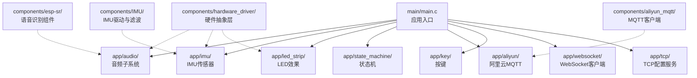
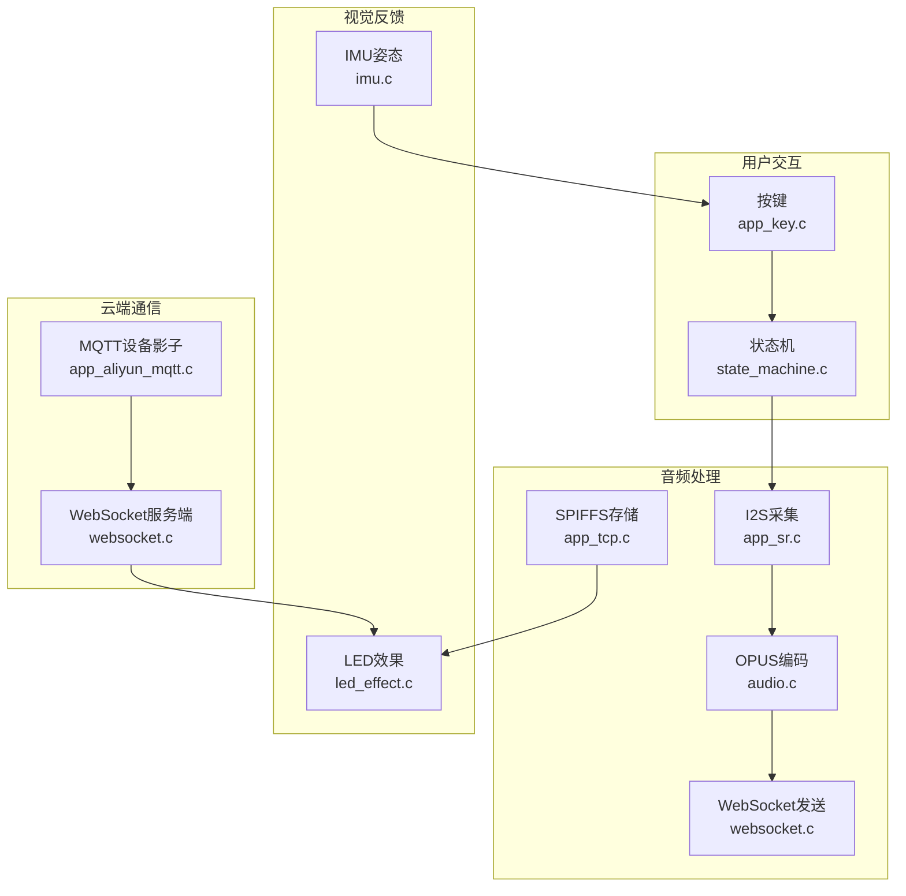
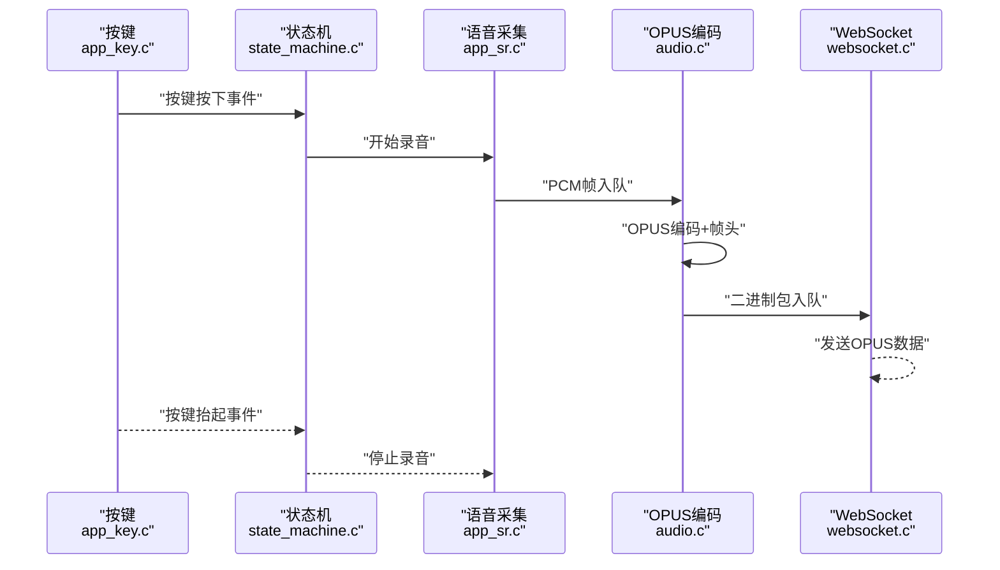
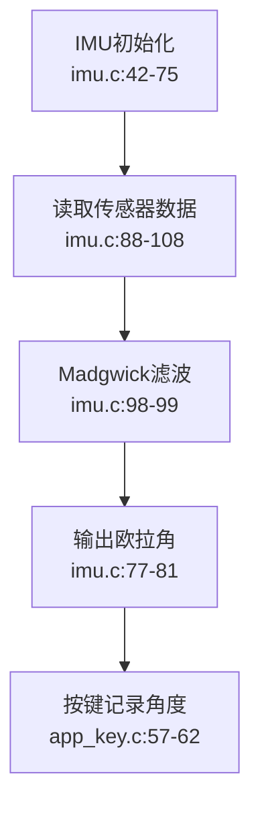
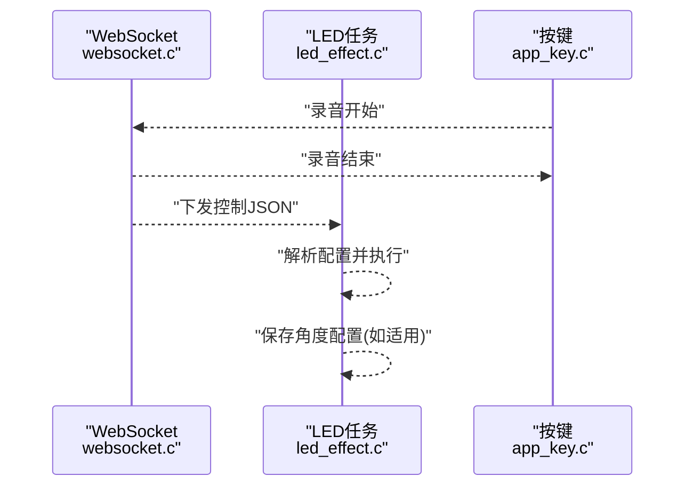
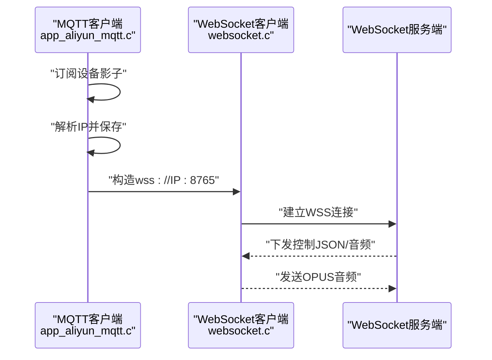
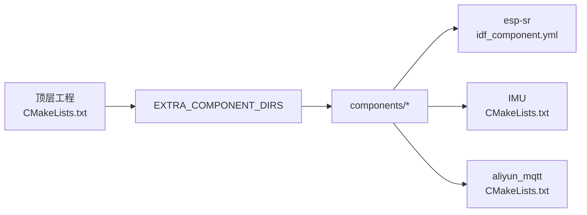

# 项目概述

<cite>
**本文档引用的文件**
- [main.c](file://main/main.c)
- [CMakeLists.txt](file://CMakeLists.txt)
- [idf_component.yml](file://components/esp-sr/idf_component.yml)
- [CMakeLists.txt](file://components/IMU/CMakeLists.txt)
- [CMakeLists.txt](file://components/aliyun_mqtt/CMakeLists.txt)
- [audio.c](file://main/app/audio/audio.c)
- [imu.c](file://main/app/imu/imu.c)
- [led_effect.c](file://main/app/led_strip/led_effect.c)
- [state_machine.c](file://main/app/state_machine/state_machine.c)
- [app_aliyun_mqtt.c](file://main/app/aliyun/app_aliyun_mqtt.c)
- [app_sr.c](file://main/app/audio/app_sr.c)
- [app_key.c](file://main/app/key/app_key.c)
- [websocket.c](file://main/app/websocket/websocket.c)
- [app_tcp.c](file://main/app/tcp/app_tcp.c)
- [bsp_board.h](file://components/hardware_driver/boards/include/bsp_board.h)
</cite>

## 目录
1. [简介](#简介)
2. [项目结构](#项目结构)
3. [核心组件](#核心组件)
4. [架构总览](#架构总览)
5. [详细组件分析](#详细组件分析)
6. [依赖关系分析](#依赖关系分析)
7. [性能考虑](#性能考虑)
8. [故障排除指南](#故障排除指南)
9. [结论](#结论)

## 简介
Lightsaber ESP32 是一个基于 ESP32-S3 的智能音频交互设备，集成了语音识别、IMU 传感器、LED 控制、网络通信等多功能模块。该项目旨在打造一个多模态交互体验，通过按键触发录音，将音频数据经由 WebSocket 传输至云端进行处理，并根据云端返回的指令控制 LED 效果与音频播放；同时通过 MQTT 与云端设备影子联动，动态获取 WebSocket 服务器地址并建立安全连接。

项目主要特性包括：
- 智能音频交互：I2S 音频采集、OPUS 编解码、音频队列与缓冲区管理
- 多模态用户界面：按键触发、IMU 角度记录、LED 效果控制
- 云端通信能力：MQTT 设备影子订阅、WebSocket 安全连接、TCP 本地配置
- 实时状态管理：状态机驱动录音生命周期、事件队列与任务间协作

## 项目结构
项目采用 ESP-IDF 工程组织方式，核心应用位于 main 目录，第三方组件分布在 components 目录，包含音频、IMU、MQTT、硬件抽象层等模块。顶层 CMakeLists.txt 指定额外组件目录，便于统一编译。

**图表来源**
- [main.c:33-60](file://main/main.c#L33-L60)
- [CMakeLists.txt:5-9](file://CMakeLists.txt#L5-L9)

**章节来源**
- [main.c:18-49](file://main/main.c#L18-L49)
- [CMakeLists.txt:1-10](file://CMakeLists.txt#L1-L10)

## 核心组件
- 应用入口与初始化：负责 NVS、网络、GPIO、板级初始化、各子系统启动与系统资源监控
- 音频子系统：I2S 采集、OPUS 编码、音频播放、WebSocket 二进制发送、SPIFFS 音频存储
- IMU 子系统：I2C 初始化、传感器驱动、Madgwick 欧拉角解算
- LED 子系统：JSON 配置解析、多种 LED 效果、任务调度与暂停控制
- 状态机：按键事件驱动录音开始/结束，与 WebSocket 交互
- 云端通信：MQTT 订阅设备影子获取 WebSocket 地址，建立 WSS 连接
- 硬件抽象层：I2S 引脚定义、采样率、SPIFFS 挂载

**章节来源**
- [main.c:33-60](file://main/main.c#L33-L60)
- [audio.c:1-120](file://main/app/audio/audio.c#L1-L120)
- [imu.c:42-75](file://main/app/imu/imu.c#L42-L75)
- [led_effect.c:436-441](file://main/app/led_strip/led_effect.c#L436-L441)
- [state_machine.c:24-35](file://main/app/state_machine/state_machine.c#L24-L35)
- [app_aliyun_mqtt.c:189-193](file://main/app/aliyun/app_aliyun_mqtt.c#L189-L193)
- [bsp_board.h:9-22](file://components/hardware_driver/boards/include/bsp_board.h#L9-L22)

## 架构总览
系统以 FreeRTOS 为基础，采用任务-队列模型实现模块解耦。按键触发状态机，状态机协调语音识别与 WebSocket 事件；音频子系统通过 I2S 采集 PCM，经 OPUS 编码后放入队列并通过 WebSocket 发送；LED 子系统接收云端下发的 JSON 配置，解析并执行对应效果；IMU 提供姿态数据用于按键触发时的角度记录；MQTT 用于获取 WebSocket 服务器地址，完成动态连接。

**图表来源**
- [app_key.c:72-104](file://main/app/key/app_key.c#L72-L104)
- [state_machine.c:83-115](file://main/app/state_machine/state_machine.c#L83-L115)
- [app_sr.c:22-54](file://main/app/audio/app_sr.c#L22-L54)
- [audio.c:699-796](file://main/app/audio/audio.c#L699-L796)
- [websocket.c:505-555](file://main/app/websocket/websocket.c#L505-L555)
- [imu.c:83-110](file://main/app/imu/imu.c#L83-L110)
- [led_effect.c:397-434](file://main/app/led_strip/led_effect.c#L397-L434)
- [app_aliyun_mqtt.c:134-147](file://main/app/aliyun/app_aliyun_mqtt.c#L134-L147)
- [app_tcp.c:354-359](file://main/app/tcp/app_tcp.c#L354-L359)

## 详细组件分析

### 音频子系统（I2S + OPUS + WebSocket）
- I2S 读取任务持续从麦克风采集 PCM 数据，按帧大小入队
- OPUS 编码器将 PCM 帧编码为二进制包，附加帧头（标识、序号、长度）
- 音频发送任务从队列取包，经 WebSocket 二进制发送
- 音频播放：支持 MP3 与 Ogg Opus 文件播放，I2S 输出
- SPIFFS：保存云端下发的音频片段，支持本地回放

**图表来源**
- [app_key.c:56-66](file://main/app/key/app_key.c#L56-L66)
- [state_machine.c:83-115](file://main/app/state_machine/state_machine.c#L83-L115)
- [app_sr.c:76-94](file://main/app/audio/app_sr.c#L76-L94)
- [audio.c:699-796](file://main/app/audio/audio.c#L699-L796)
- [websocket.c:458-502](file://main/app/websocket/websocket.c#L458-L502)

**章节来源**
- [app_sr.c:22-99](file://main/app/audio/app_sr.c#L22-L99)
- [audio.c:699-796](file://main/app/audio/audio.c#L699-L796)
- [websocket.c:458-502](file://main/app/websocket/websocket.c#L458-L502)

### IMU 姿态解算与按键联动
- I2C 初始化与传感器驱动加载
- 读取加速度/角速度数据，使用 Madgwick 算法计算欧拉角
- 按键按下时记录当前姿态角，用于后续云端配置绑定

**图表来源**
- [imu.c:42-110](file://main/app/imu/imu.c#L42-L110)
- [app_key.c:56-66](file://main/app/key/app_key.c#L56-L66)

**章节来源**
- [imu.c:42-110](file://main/app/imu/imu.c#L42-L110)
- [app_key.c:56-66](file://main/app/key/app_key.c#L56-L66)

### LED 效果与云端配置
- JSON 配置解析，支持多种效果类型与样式
- 任务循环读取配置，按需重启效果，支持暂停与恢复
- 云端下发控制 JSON 时，若为按键触发的录音返回，保存至角度配置表；否则直接更新 LED

**图表来源**
- [websocket.c:217-237](file://main/app/websocket/websocket.c#L217-L237)
- [led_effect.c:69-81](file://main/app/led_strip/led_effect.c#L69-L81)
- [app_key.c:56-66](file://main/app/key/app_key.c#L56-L66)

**章节来源**
- [led_effect.c:69-81](file://main/app/led_strip/led_effect.c#L69-L81)
- [websocket.c:217-237](file://main/app/websocket/websocket.c#L217-L237)

### 云端通信（MQTT + WebSocket）
- MQTT 订阅设备影子，解析 JSON 获取服务器 IP
- 动态构造 WSS 地址并启动 WebSocket 客户端
- WebSocket 事件处理：文本命令解析、二进制音频数据接收、状态回调

**图表来源**
- [app_aliyun_mqtt.c:134-147](file://main/app/aliyun/app_aliyun_mqtt.c#L134-L147)
- [websocket.c:505-555](file://main/app/websocket/websocket.c#L505-L555)

**章节来源**
- [app_aliyun_mqtt.c:189-193](file://main/app/aliyun/app_aliyun_mqtt.c#L189-L193)
- [websocket.c:505-555](file://main/app/websocket/websocket.c#L505-L555)

### 硬件抽象层与音频引脚
- 定义 INMP441 麦克风与 MAX98357A 驱动的 I2S 引脚
- 提供 I2S 读写接口与 SPIFFS 挂载封装

**章节来源**
- [bsp_board.h:9-22](file://components/hardware_driver/boards/include/bsp_board.h#L9-L22)

## 依赖关系分析
- 组件编译：顶层 CMakeLists 指定 EXTRA_COMPONENT_DIRS，引入示例组件与 components 目录
- 语音识别：esp-sr 作为独立组件，依赖 ESP-IDF 与 esp-dsp、dl_fft
- IMU：根据 Kconfig 选择 MPU6050 或 ICM20948 驱动，集成核心滤波算法
- MQTT：aliyun_mqtt 组件依赖 driver 与 mqtt

**图表来源**
- [CMakeLists.txt:5-9](file://CMakeLists.txt#L5-L9)
- [idf_component.yml:1-13](file://components/esp-sr/idf_component.yml#L1-L13)
- [CMakeLists.txt:1-28](file://components/IMU/CMakeLists.txt#L1-L28)
- [CMakeLists.txt:1-9](file://components/aliyun_mqtt/CMakeLists.txt#L1-L9)

**章节来源**
- [CMakeLists.txt:1-10](file://CMakeLists.txt#L1-L10)
- [idf_component.yml:1-13](file://components/esp-sr/idf_component.yml#L1-L13)
- [CMakeLists.txt:1-28](file://components/IMU/CMakeLists.txt#L1-L28)
- [CMakeLists.txt:1-9](file://components/aliyun_mqtt/CMakeLists.txt#L1-L9)

## 性能考虑
- 音频处理：采用队列与环形缓冲区，避免阻塞；OPUS 编码帧大小与 I2S 采样率匹配，降低延迟
- 任务亲核：音频与 WebSocket 发送任务固定在核心 1，减少中断影响
- 内存管理：优先使用 SPIRAM 分配音频缓冲区，降低主内存压力
- 重连策略：WebSocket 断线后指数退避重连，避免频繁尝试
- IMU 采样：滤波频率与采样周期匹配，保证姿态稳定性

## 故障排除指南
- WebSocket 无法连接
  - 检查 MQTT 是否成功获取服务器 IP 并构造正确的 WSS 地址
  - 确认证书配置与网络连通性
- 音频无声或卡顿
  - 核查 I2S 引脚配置与采样率一致性
  - 检查队列是否溢出或编码器初始化失败
- LED 不响应
  - 确认 WebSocket 已正确下发控制 JSON
  - 检查 JSON 格式与字段完整性
- IMU 读数异常
  - 确认 I2C 引脚与上拉电阻配置
  - 检查传感器初始化返回值与滤波参数

**章节来源**
- [websocket.c:144-159](file://main/app/websocket/websocket.c#L144-L159)
- [audio.c:718-731](file://main/app/audio/audio.c#L718-L731)
- [led_effect.c:69-81](file://main/app/led_strip/led_effect.c#L69-L81)
- [imu.c:44-75](file://main/app/imu/imu.c#L44-L75)

## 结论
Lightsaber ESP32 项目通过模块化设计与任务-队列架构，实现了从音频采集、云端交互到视觉反馈的完整链路。其核心优势在于：
- 多模态融合：按键、IMU、LED、音频、网络协同工作
- 实时性保障：队列与 DMA 配合，降低端到端延迟
- 可扩展性：组件化结构便于替换与升级（如更换 IMU、音频编解码器）

建议在后续迭代中进一步完善日志分级、错误码标准化与配置热更新机制，以提升系统稳定性与可维护性。